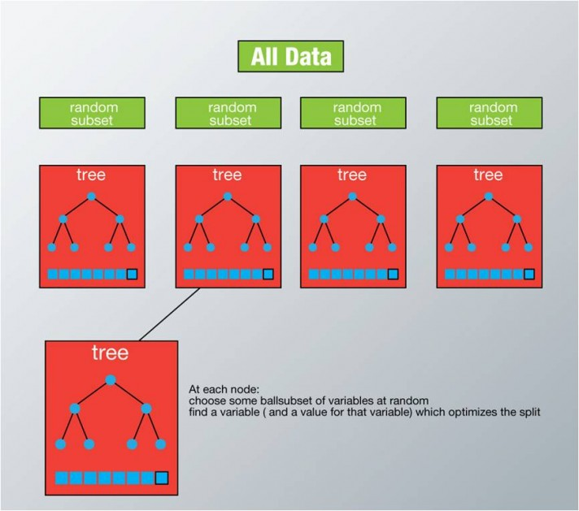

title: 随机森林入门
date: 2017-05-22
tags: [随机森林]
---
随机森林是一种多功能的机器学习算法，能够执行回归和分类的任务。同时，它也是一种数据降维手段，用于处理缺失值、异常值以及其他数据探索中的重要步骤，并取得了不错的成效。另外，它还担任了集成学习中的重要方法，在将几个低效模型整合为一个高效模型时大显身手。

<!--more-->
在随机森林中，我们将生成很多的决策树，并不像在CART模型里一样只生成唯一的树。当在基于某些属性对一个新的对象进行分类判别时，随机森林中的每一棵树都会给出自己的分类选择，并由此进行“投票”，森林整体的输出结果将会是票数最多的分类选项；而在回归问题中，随机森林的输出将会是所有决策树输出的平均值。

## 随机森林在Python和R中的实现
随机森林在R packages和Python scikit-learn中的实现是当下非常流行的，下列是在R和Python中载入随机森林模型的具体代码：
```python
#Import Library
fromsklearn.ensemble import RandomForestClassifier #use RandomForestRegressor for regression problem
#Assumed you have, X (predictor) and Y (target) for training data set and x_test(predictor) of test_dataset
# Create Random Forest object
model = RandomForestClassifier(n_estimators=1000)
# Train the model using the training sets and check score
model.fit(X, y)
#Predict Output
predicted = model.predict(x_test)
```

```r
library(randomForest)
x <- cbind(x_train,y_train)
#Fitting model
fit <- randomForest(Species ~ ., x, ntree=500)
summary(fit)
#Predict Output
predicted = predict(fit, x_test)
```

## 随机森林算法是如何工作的？
在随机森林中，每一个决策树“种植”和“生长”的规则如下所示：

- 假设我们设定训练集中的样本个数为N，然后通过有重置的重复多次抽样来获得这N个样本，这样的抽样结果将作为我们生成决策树的训练集；
- 如果有M个输入变量，每个节点都将随机选择m(m<M)个特定的变量，然后运用这m个变量来确定最佳的分裂点。在决策树的生成过程中，m的值是保持不变的；
- 每棵决策树都最大可能地进行生长而不进行剪枝；
- 通过对所有的决策树进行加总来预测新的数据（在分类时采用多数投票，在回归时采用平均）。



## 随机森林的优点与缺点
**优点：**

- 正如上文所述，随机森林算法能解决分类与回归两种类型的问题，并在这两个方面都有相当好的估计表现；
- 随机森林对于高维数据集的处理能力令人兴奋，它可以处理成千上万的输入变量，并确定最重要的变量，因此被认为是一个不错的降维方法；
- 此外，该模型能够输出变量的重要性程度，这是一个非常便利的功能；
- 在对缺失数据进行估计时，随机森林是一个十分有效的方法。就算存在大量的数据缺失，随机森林也能较好地保持精确性；
- 当存在分类不平衡的情况时，随机森林能够提供平衡数据集误差的有效方法；
- 模型的上述性能可以被扩展运用到未标记的数据集中，用于引导无监督聚类、数据透视和异常检测；
- 随机森林算法中包含了对输入数据的重复自抽样过程，即所谓的bootstrap抽样。这样一来，数据集中大约三分之一将没有用于模型的训练而是用于测试，这样的数据被称为out of bag samples，通过这些样本估计的误差被称为out of bag error。研究表明，这种out of bag方法的与测试集规模同训练集一致的估计方法有着相同的精确程度，因此在随机森林中我们无需再对测试集进行另外的设置；

**缺点：**

- 随机森林在解决回归问题时并没有像它在分类中表现的那么好，这是因为它并不能给出一个连续型的输出。当进行回归时，随机森林不能够作出超越训练集数据范围的预测，这可能导致在对某些还有特定噪声的数据进行建模时出现过度拟合；
- 对于许多统计建模者来说，随机森林给人的感觉像是一个黑盒子——你几乎无法控制模型内部的运行，只能在不同的参数和随机种子之间进行尝试；

## 调整随机森林模型中的参数
到目前为止，我们已经对整个随机森林模型进行了基本的了解，与此同时，对于模型中各种参数的调整与修改也十分重要，下列为python scikit-learn中随机森林模型的语法：
```python
classsklearn.ensemble.RandomForestClassifier(n_estimators=10,
    criterion='gini',
    max_depth=None,
    min_samples_split=2,
    min_samples_leaf=1,
    min_weight_fraction_leaf=0.0,
    max_features='auto',
    max_leaf_nodes=None,
    bootstrap=True,
    oob_score=False,
    n_jobs=1,
    random_state=None,
    verbose=0,
    warm_start=False,
    class_weight=None)
```

## 参考资料：
- [随机森林入门攻略（内含R、Python代码）](http://www.36dsj.com/archives/32820)
- [A Complete Tutorial on Tree Based Modeling from Scratch](https://www.analyticsvidhya.com/blog/2016/04/complete-tutorial-tree-based-modeling-scratch-in-python/)