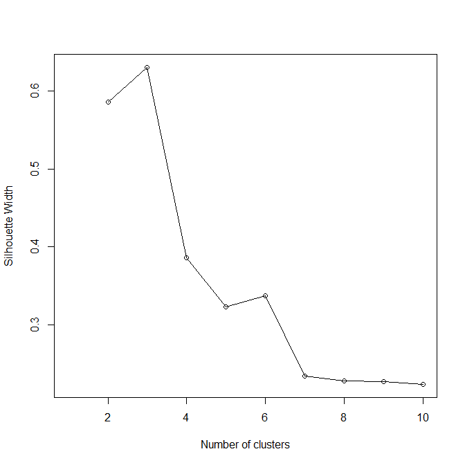
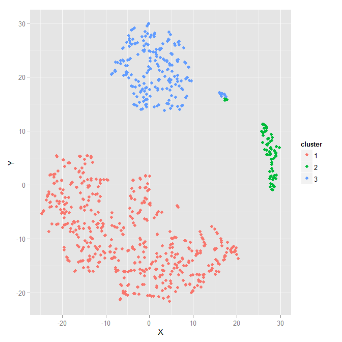

title: 混合型数据聚类
date: 2016-09-14
tags: [R,聚类]
---
利用聚类分析，我们可以很容易地看清数据集中样本的分布情况。以往介绍聚类分析的文章通常只介绍如何处理连续型变量，这些文字并没有过多地介绍如何处理混合型数据（如同时包含连续型变量、名义型变量和顺序型变量的数据）。本文将利用Gower距离、PAM（partitioning around medoids）算法和轮廓系数来介绍如何对混合型数据做聚类分析。[原文链接](https://dpmartin42.github.io/blogposts/r/cluster-mixed-types)

<!--more-->
## 说明
为了介绍方便，本文直接使用`ISLR`包中的`College`数据集。该数据集包含了自1995年以来美国大学的777条数据，其中主要有以下几个变量：

- 录取率：连续型变量
- 总学费：连续型变量
- 新生数量：连续型变量
- 公立或私立院校：分类型变量
- 是否为高水平院校：分类型变量

>是否为高水平院校，即所有新生中毕业于排名前10%高中的新生数量占比是否大于50%。

## 准备
安装并加载相关的R包：
```R
install.packages(c("dplyr", "ISLR", "cluster", "Rtsne", "ggplot2"))
library(dplyr)
library(ISLR)
library(cluster)
library(Rtsne)
library(ggplot2)
set.seed(1609) #设置随机种子，使得本文结果具有可重现性
```

先浏览`College`结构：
```
> str(College)
'data.frame':   777 obs. of  18 variables:
 $ Private    : Factor w/ 2 levels "No","Yes": 2 2 2 2 2 2 2 2 2 2 ...
 $ Apps       : num  1660 2186 1428 417 193 ...
 $ Accept     : num  1232 1924 1097 349 146 ...
 $ Enroll     : num  721 512 336 137 55 158 103 489 227 172 ...
 $ Top10perc  : num  23 16 22 60 16 38 17 37 30 21 ...
 $ Top25perc  : num  52 29 50 89 44 62 45 68 63 44 ...
 $ F.Undergrad: num  2885 2683 1036 510 249 ...
 $ P.Undergrad: num  537 1227 99 63 869 ...
 $ Outstate   : num  7440 12280 11250 12960 7560 ...
 $ Room.Board : num  3300 6450 3750 5450 4120 ...
 $ Books      : num  450 750 400 450 800 500 500 450 300 660 ...
 $ Personal   : num  2200 1500 1165 875 1500 ...
 $ PhD        : num  70 29 53 92 76 67 90 89 79 40 ...
 $ Terminal   : num  78 30 66 97 72 73 93 100 84 41 ...
 $ S.F.Ratio  : num  18.1 12.2 12.9 7.7 11.9 9.4 11.5 13.7 11.3 11.5 ...
 $ perc.alumni: num  12 16 30 37 2 11 26 37 23 15 ...
 $ Expend     : num  7041 10527 8735 19016 10922 ...
 $ Grad.Rate  : num  60 56 54 59 15 55 63 73 80 52 ...
```

构建聚类模型之前，我们需要做一些数据清洗工作：

1. 录取率等于录取人数除以总申请人数
2. 判断某个学校是否为高水平院校

```R
college_clean <- College %>%
    mutate(name = row.names(College), accept_rate = Accept/Apps, isElite = cut(Top10perc, breaks = c(0, 50, 100), labels = c("Not Elite", "Elite"), include.lowest = TRUE)) %>%
    mutate(isElite = factor(isElite)) %>%
    select(name, accept_rate, Outstate, Enroll, Grad.Rate, Private, isElite)

glimpse(college_clean)
```

## 距离计算
聚类分析的第一步是定义样本之间距离的度量方法，最常用的距离度量方法是欧式距离。然而欧氏距离只适用于连续型变量，所以本文将采用Gower距离。Gower距离的定义非常简单。首先每个类型的变量都有特殊的距离度量方法，而且该方法会将变量标准化到`[0,1]`之间。接下来，利用加权线性组合的方法来计算最终的距离矩阵。不同类型变量的计算方法如下所示：

- 连续型变量：利用归一化的曼哈顿距离
- 顺序型变量：首先将变量按顺序排列，然后利用经过特殊调整的曼哈顿距离
- 名义型变量：首先将包含k个类别的变量转换成k个0/1变量，然后利用Dice系数做进一步的计算

>优点：通俗易懂且计算方便。缺点：非常容易受无标准化的连续型变量异常值影响，所以数据转换过程必不可少；该方法需要耗费较大的内存。

利用`daisy`函数，我们只需要一行代码就可以计算出Gower距离。需要注意的是，由于新生入学人数是右偏变量，我们需要对其做对数转换。`daisy`函数内置了对数转换的功能，你可以调用帮助文档来获取更多的参数说明：
```R
gower_dist <- daisy(college_clean[, -1], metric = "gower", type = list(logratio = 3))
summary(gower_dist)
## 301476 dissimilarities, summarized :
##      Min.   1st Qu.    Median      Mean   3rd Qu.      Max. 
## 0.0018601 0.1034400 0.2358700 0.2314500 0.3271400 0.7773500 
## Metric :  mixed ;  Types = I, I, I, I, N, N 
## Number of objects : 777
```

此外，我们可以通过观察最相似和最不相似的样本来判断该度量方法的合理性。本案例中，圣托马斯大学和约翰卡罗尔大学最相似，而俄克拉荷马科技和艺术大学和哈佛大学差异最大：
```R
gower_mat <- as.matrix(gower_dist)
# Output most similar pair
college_clean[which(gower_mat == min(gower_mat[gower_mat != min(gower_mat)]), arr.ind = TRUE)[1, ], ]
##                            name accept_rate Outstate Enroll Grad.Rate Private   isElite
## 682 University of St. Thomas MN   0.8784638    11712    828        89     Yes Not Elite
## 284     John Carroll University   0.8711276    11700    820        89     Yes Not Elite
# Output most dissimilar pair
college_clean[which(gower_mat == max(gower_mat[gower_mat != max(gower_mat)]), arr.ind = TRUE)[1, ], ]
##                                        name accept_rate Outstate Enroll Grad.Rate Private   isElite
## 673 University of Sci. and Arts of Oklahoma   0.9824561     3687    208        43      No Not Elite
## 251                      Harvard University   0.1561486    18485   1606       100     Yes     Elite
```

## 聚类算法
现在我们已经计算好样本间的距离矩阵，接下来需要选择一个合适的聚类算法，本文采用PAM（partioniong around medoids）算法来构建模型。PAM算法的主要步骤：

1. 随机选择k个数据点，并将其设为簇中心点
2. 遍历所有样本点，并将样本点归入最近的簇中
3. 对每个簇而言，找出与簇内其他点距离之和最小的点，并将其设为新的簇中心点
4. 重复第2步，直到收敛

>该算法和K-means算法非常相似。事实上，除了中心点的计算方法不同外，其他步骤都完全一致。优点：简单易懂且不易受异常值所影响。缺点：算法时间复杂度为O(n2)。

## 聚类簇数
我们将利用轮廓系数来确定最佳的聚类个数，轮廓系数是一个用于衡量聚类离散度的内部指标，该指标的取值范围是`[-1,1]`，其数值越大越好。通过比较不同聚类个数下轮廓系数的大小，我们可以看出当聚类个数为3时，聚类效果最好：
```R
# Calculate silhouette width for many k using PAM
sil_width <- c(NA)
for(i in 2:10){
    pam_fit <- pam(gower_dist, diss = TRUE, k = i)
    sil_width[i] <- pam_fit$silinfo$avg.width
}
# Plot sihouette width (higher is better)
plot(1:10, sil_width, xlab = "Number of clusters", ylab = "Silhouette Width")
lines(1:10, sil_width)
```



## 结果解释
聚类完毕后，我们可以调用`summary`函数来查看每个簇的汇总信息。从这些汇总信息中我们可以看出：簇1主要是中等学费且学生规模较小的私立非顶尖院校，簇2主要是高收费、低录取率且高毕业率的私立顶尖院校，而簇3则是低学费、低毕业率且学生规模较大的公立非顶尖院校。
```R
pam_fit <- pam(gower_dist, diss = TRUE, k = 3)
pam_results <- college_clean %>%
    dplyr::select(-name) %>%
    mutate(cluster = pam_fit$clustering) %>%
    group_by(cluster) %>%
    do(the_summary = summary(.))

pam_results$the_summary
## [[1]]
##   accept_rate        Outstate         Enroll         Grad.Rate      Private        isElite       cluster 
##  Min.   :0.3283   Min.   : 2340   Min.   :  35.0   Min.   : 15.00   No :  0   Not Elite:500   Min.   :1  
##  1st Qu.:0.7225   1st Qu.: 8842   1st Qu.: 194.8   1st Qu.: 56.00   Yes:500   Elite    :  0   1st Qu.:1  
##  Median :0.8004   Median :10905   Median : 308.0   Median : 67.50                             Median :1  
##  Mean   :0.7820   Mean   :11200   Mean   : 418.6   Mean   : 66.97                             Mean   :1  
##  3rd Qu.:0.8581   3rd Qu.:13240   3rd Qu.: 484.8   3rd Qu.: 78.25                             3rd Qu.:1  
##  Max.   :1.0000   Max.   :21700   Max.   :4615.0   Max.   :118.00                             Max.   :1  
## [[2]]
##   accept_rate        Outstate         Enroll         Grad.Rate      Private       isElite      cluster 
##  Min.   :0.1545   Min.   : 5224   Min.   : 137.0   Min.   : 54.00   No : 4   Not Elite: 0   Min.   :2  
##  1st Qu.:0.4135   1st Qu.:13850   1st Qu.: 391.0   1st Qu.: 77.00   Yes:65   Elite    :69   1st Qu.:2  
##  Median :0.5329   Median :17238   Median : 601.0   Median : 89.00                           Median :2  
##  Mean   :0.5392   Mean   :16225   Mean   : 882.5   Mean   : 84.78                           Mean   :2  
##  3rd Qu.:0.6988   3rd Qu.:18590   3rd Qu.:1191.0   3rd Qu.: 94.00                           3rd Qu.:2  
##  Max.   :0.9605   Max.   :20100   Max.   :4893.0   Max.   :100.00                           Max.   :2  
## [[3]]
##   accept_rate        Outstate         Enroll       Grad.Rate      Private        isElite       cluster 
##  Min.   :0.3746   Min.   : 2580   Min.   : 153   Min.   : 10.00   No :208   Not Elite:199   Min.   :3  
##  1st Qu.:0.6423   1st Qu.: 5295   1st Qu.: 694   1st Qu.: 46.00   Yes:  0   Elite    :  9   1st Qu.:3  
##  Median :0.7458   Median : 6598   Median :1302   Median : 54.50                             Median :3  
##  Mean   :0.7315   Mean   : 6698   Mean   :1615   Mean   : 55.42                             Mean   :3  
##  3rd Qu.:0.8368   3rd Qu.: 7748   3rd Qu.:2184   3rd Qu.: 65.00                             3rd Qu.:3  
##  Max.   :1.0000   Max.   :15516   Max.   :6392   Max.   :100.00                             Max.   :3  
```

PAM算法的另一个优点是各个簇的中心点是实际的样本点。从聚类结果中我们可以看出，圣弗朗西斯大学是簇1的中心点，巴朗德学院是簇2的中心点，而密歇根州州立大学河谷大学是簇3的中心点。
```
> college_clean[pam_fit$medoids, ]
                             name accept_rate Outstate Enroll Grad.Rate Private   isElite
492         Saint Francis College   0.7877629    10880    284        69     Yes Not Elite
38                Barnard College   0.5616987    17926    531        91     Yes     Elite
234 Grand Valley State University   0.7525653     6108   1561        57      No Not Elite
```

## 可视化
`t-SNE`是一种降维方法，它可以在保留聚类结构的前提下，将多维信息压缩到二维或三维空间中。借助`t-SNE`我们可以将PAM算法的聚类结果绘制出来，有趣的是私立顶尖院校和公立非顶尖院校这两个簇中间存在一个小聚类簇。
```R
tsne_obj <- Rtsne(gower_mat)
tsne_data <- tsne_obj$Y %>%
    data.frame() %>%
    setNames(c("X", "Y")) %>%
    mutate(cluster = factor(pam_fit$clustering), name = college_clean$name)

ggplot(aes(x = X, y = Y), data = tsne_data) + geom_point(aes(color = cluster))
```



进一步探究可以发现，这一小簇主要包含一些竞争力较强的公立院校，比如弗吉尼亚大学和加州大学伯克利分校。虽然无法通过轮廓系数指标来证明多分一类是合理的，但是这13所院校的确显著不同于其他三个簇的院校。
```R
tsne_data %>%
    filter(X > 15 & X < 25, Y > -15 & Y < -10) %>%
    left_join(college_clean, by = "name") %>%
    collect %>%
    .[["name"]]
##  [1] "Bard College"                 "Bennington College"           "Boston University"            "Brandeis University"          "Bucknell University"          "Colgate University"           "Connecticut College"
##  [8] "Fairfield University"         "George Washington University" "Gettysburg College"           "Hamilton College"             "Kenyon College"               "Lafayette College"            "Lehigh University"
## [15] "Marietta College"             "Mount Holyoke College"        "Oberlin College"              "Pitzer College"               "Providence College"           "Rollins College"              "Skidmore College"
## [22] "St. Lawrence University"      "Trinity College CT"           "Tulane University"            "Union College NY"             "University of Richmond"       "Villanova University"         "Whitman College"
```
