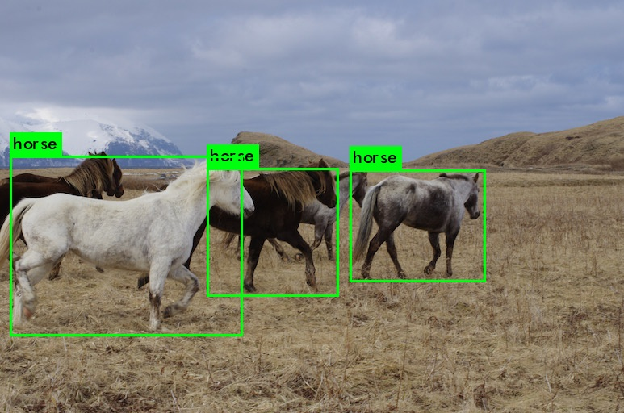
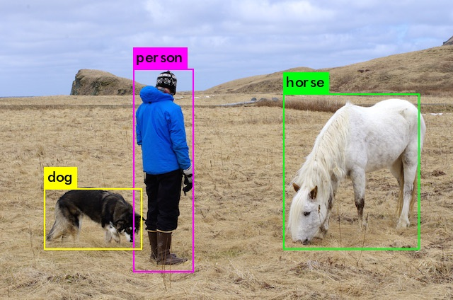

title: YOLO Usage and Training
date: 2017-07-26
tags: [YOLO,ObjectDetect]
---
YOLO是一个最先进的实时检测系统,在Titan X处理图像在`40-90`FPS,在`VOC_2007`有78.6%的mAP,在`COCO`的`test-dev`有48.1%的mAP.

<!--more-->
## YOLOv2 Look
YOLOv2好评如何先不管,体验一把再说,参考[Detection Using A Pre-Trained Model](https://pjreddie.com/darknet/yolo/):
```
git clone https://github.com/pjreddie/darknet.git
cd darknet/
vim Makefile
## GPU=1
## CUDNN=0
## OPENCV=0
## OPENMP=0
## DEBUG=0
make
```

你需要下载预训练的权重文件,在[这里](https://pjreddie.com/media/files/yolo.weights),约258MB.或运行:
```
wget https://pjreddie.com/media/files/yolo.weights
```

运行检测器`./darknet detect cfg/yolo.cfg yolo.weights data/horses.jpg`:
```
data/horses.jpg: Predicted in 0.316726 seconds.
horse: 46%
horse: 59%
horse: 91%
```



运行检测器`./darknet detect cfg/yolo.cfg yolo.weights data/person.jpg`:
```
data/person.jpg: Predicted in 0.147991 seconds.
person: 86%
horse: 82%
dog: 86%
```



`detect`命令是一种简写,它相当于`./darknet detector test cfg/coco.data cfg/yolo.cfg yolo.weights data/person.jpg`.

### Changing The Detection Threshold
默认情况下,YOLO只显示信心不小于0.25的检测对象.你可以通过`-thresh <val>`修改.例如,显示所有检测对象,可以将阈值设置为0:
```
./darknet detect cfg/yolo.cfg yolo.weights data/dog.jpg -thresh 0
```

### Tiny YOLO
Tiny YOLO是牺牲部分精确度的快速版本,使用VOC数据训练:
```
wget https://pjreddie.com/media/files/tiny-yolo-voc.weights
./darknet detector test cfg/voc.data cfg/tiny-yolo-voc.cfg tiny-yolo-voc.weights data/dog.jpg
```

它不完美,但是肯定快.在GPU上,每秒200帧.

### Real-Time Detection on a Webcam
它可以以摄像头作为输入,运行此演示你需要编译有CUDA和OpenCV,执行命令:
```
./darknet detector demo cfg/coco.data cfg/yolo.cfg yolo.weights
```

YOLO将显示当前帧和预测类以及边框.你需要一个摄像头连接到计算机,OpenCV可以连接到它,否则无法工作.如果你有多个摄像头连接,要选择使用哪一个,通过`-c <num>`挑选,默认值是0.你也可以在视频文件上运行它:
```
./darknet detector demo cfg/coco.data cfg/yolo.cfg yolo.weights <video file>
```

## Training YOLO on VOC
我们可以从头训练YOLO,不同的超参数,或数据集.

### Get The Pascal VOC Data
训练YOLO你需要从2007到2012的VOC数据.可以在[这里](https://pjreddie.com/projects/pascal-voc-dataset-mirror/)找到.创建一个目录来存储它,并从该目录运行:
```
cd /data1/hejian_lab/yolo/data_voc
curl -O https://pjreddie.com/media/files/VOCtrainval_11-May-2012.tar
curl -O https://pjreddie.com/media/files/VOCtrainval_06-Nov-2007.tar
curl -O https://pjreddie.com/media/files/VOCtest_06-Nov-2007.tar
tar xf VOCtrainval_11-May-2012.tar
tar xf VOCtrainval_06-Nov-2007.tar
tar xf VOCtest_06-Nov-2007.tar
```

这时,所有VOC训练数据都在子目录`VOCdevkit/`了:
```
hejian@xlab:/data1/hejian_lab/yolo/data_voc$ ll
VOCdevkit/
VOCtest_06-Nov-2007.tar
VOCtrainval_06-Nov-2007.tar
VOCtrainval_11-May-2012.tar
```

### Generate Labels for VOC
现在我们需要生成标签文件,供YOLO使用.每个图像一个`.txt`,每行一个真实对象,如:
```
<object-class> <x> <y> <width> <height>
```

运行`scripts/voc_label.py`脚本,生成这些文件.或者下载:
```
curl -O https://pjreddie.com/media/files/voc_label.py
python voc_label.py
```

几分钟后,这个脚本将生成所有必需的文件.主要是它产生大量的标签文件`VOCdevkit/VOC2007/labels/`和`VOCdevkit/VOC2012/labels/`.现在你的目录:
```
hejian@xlab:/data1/hejian_lab/yolo/data_voc$ ll
2007_test.txt
2007_train.txt
2007_val.txt
2012_train.txt
2012_val.txt
VOCdevkit/
voc_label.py
VOCtest_06-Nov-2007.tar
VOCtrainval_06-Nov-2007.tar
VOCtrainval_11-May-2012.tar
```

YOLO需要一个文本文件,记录所有你想训练的图片.在这个例子中,使用除了测试集`2007_test`之外的所有东西进行训练,这样我们就可以测试我们的模型了.运行:
```
cat 2007_train.txt 2007_val.txt 2012_*.txt > train.txt
```

### Modify Cfg for Pascal Data
现在去你的YOLO目录.我们必须改变`cfg/voc.data`配置文件指向你的数据:
```
classes= 20
train = /home/pjreddie/data/voc/train.txt
valid = /home/pjreddie/data/voc/2007_test.txt
names = data/voc.names
backup = backup
```

修改为:
```
classes= 20
train = /data1/hejian_lab/yolo/data_voc/train.txt
valid = /data1/hejian_lab/yolo/data_voc/2007_test.txt
names = data/voc.names
backup = backup
```

- classes,训练的类别数
- train,训练集的txt
- valid,验证集的txt
- names,训练的目标名称
- backup,weights存储位置

### Download Pretrained Convolutional Weights
采用预训练的Imagenet卷积权重.可以在[这里](https://pjreddie.com/media/files/darknet19_448.conv.23)下载卷积层的权重:
```
curl -O https://pjreddie.com/media/files/darknet19_448.conv.23
```

### Train The Model
现在可以训练了,执行命令:
```
./darknet detector train cfg/voc.data cfg/yolo-voc.cfg darknet19_448.conv.23
```

## Training YOLO on COCO
在[COCO](http://mscoco.org/dataset/#overview)数据集上训练.

### Get The COCO Data
训练需要的数据和标签,脚本`scripts/get_coco_dataset.sh`可以为你做到:
```
cd /data1/hejian_lab/yolo/data_coco
cp /data1/hejian_lab/yolo/darknet/scripts/get_coco_dataset.sh .
bash get_coco_dataset.sh
```

### Modify cfg for COCO
现在去YOLO目录,修改`cfg/coco.data`配置文件指向你的数据:
```
classes= 80
train = /home/pjreddie/data/coco/trainvalno5k.txt
valid = data/coco_val_5k.list
names = data/coco.names
backup = /home/pjreddie/backup/
eval=coco
```

修改为:
```
classes= 80
train = /data1/hejian_lab/yolo/data_coco/coco/trainvalno5k.txt
valid = /data1/hejian_lab/yolo/data_coco/coco/5k.txt
names = data/coco.names
backup = backup
```

还需要修改模型配置文件`cfg/yolo.cfg`,使用`Training`代替`Testing`:
```
[net]
# Testing
batch=1
subdivisions=1
# Training
# batch=64
# subdivisions=8
```

修改为:
```
[net]
# Testing
# batch=1
# subdivisions=1
# Training
batch=64
subdivisions=8
```

### Train The Model
现在可以训练了,执行命令:
```
./darknet detector train cfg/coco.data cfg/yolo.cfg darknet19_448.conv.23
```

如果你使用多个GPU:
```
./darknet detector train cfg/coco.data cfg/yolo.cfg darknet19_448.conv.23 -gpus 0,1,2,3
```

如果您想停止并重新启动,从检查点开始训练:
```
./darknet detector train cfg/coco.data cfg/yolo.cfg backup/yolo.backup -gpus 0,1,2,3
```

## 参考资料:
- [YOLO: Real-Time Object Detection](https://pjreddie.com/darknet/yolo/)
