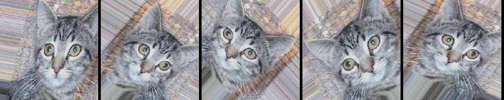

title: 面向小数据集构建图像分类模型
date: 2017-07-14
tags: [Keras,图像分类]
---
在本文中,我们将提供一些面向小数据集(几百张到几千张图片)构造高效,实用的图像分类器的方法.本文将探讨如下几种方法:

- 从图片中直接训练一个小网络(作为基准方法)
- 利用预训练网络的bottleneck(瓶颈)特征
- fine-tuning(微调)预训练网络的高层

<!--more-->
本文需要使用的Keras模块有:

- fit_generator:用于从Python生成器中训练网络
- ImageDataGenerator:用于实时数据提升
- 层参数冻结和模型fine-tuning(微调)


```python
import keras, tensorflow, numpy, PIL, cv2
print(keras.__version__, tensorflow.__version__, numpy.__version__, PIL.__version__, cv2.__version__, sep="\t\t")
```

    Using TensorFlow backend.


    2.0.6       1.2.1       1.13.1      3.4.2       3.1.0


## 数据源
这份数据集来源于[Kaggle](https://www.kaggle.com/c/dogs-vs-cats/data),原数据集有12500只猫和12500只狗.数据集按照下面的形式存放:
```
dogs-vs-cats/
    train/
        cat.0.jpg
        cat.1.jpg
        ...
        dog.0.jpg
        dog.1.jpg
        ...
```

图片的数量非常少,这对于图像分类来说是个大麻烦.但现实是,很多真实世界图片获取是很困难的,我们能得到的样本数目确实很有限(比如医学图像,每张正样本都意味着一个承受痛苦的病人).对数据科学家而言,我们应该有能够榨取少量数据的全部价值的能力,而不是简单的伸手要更多的数据.

### 数据概览
查看train目录结构,并统计文件数量:


```python
image_path = '/data1/hejian_lab/_temp/dogs-vs-cats/'

from glob import glob

paths = glob(image_path + 'train/*.jpg')  # get all jpg files
print('train files: %d' % len(paths))
```

    train files: 25000


获取文件夹大小:


```python
image_path = '/data1/hejian_lab/_temp/dogs-vs-cats/'

import os
from os.path import join, getsize

size = 0
for dirpath, dirnames, filenames in os.walk(image_path + 'train/'):
    size += sum([getsize(join(dirpath,filename)) for filename in filenames])

print('size is: %.1fMB' % (size/1024/1024))
```

    size is: 545.4MB


每类图像的数量:


```python
image_path = '/data1/hejian_lab/_temp/dogs-vs-cats/'

from glob import glob

my_dict = {}
for file_path in glob(image_path + 'train/*.jpg'):
    class_name = file_path.split('/')[-1].split('.')[-3]
    my_dict[class_name] = my_dict.get(class_name, 0) + 1

print(my_dict)
```

    {'dog': 12500, 'cat': 12500}


## 针对小数据集的深度学习
我经常听到的一种说法是,深度学习只有在你拥有海量数据时才有意义.虽然这种说法并不是完全不对,但却具有较强的误导性.当然,深度学习强调从数据中自动学习特征的能力,没有足够的训练样本,这几乎是不可能的.尤其是当输入的数据维度很高(如图片)时.然而,卷积神经网络作为深度学习的支柱,被设计为针对“感知”问题最好的模型之一(如图像分类问题),即使只有很少的数据,网络也能把特征学的不错.针对小数据集的神经网络依然能够得到合理的结果,并不需要任何手工的特征工程.

另一方面,深度学习模型天然就具有可重用的特性:比方说,你可以把一个在大规模数据上训练好的图像分类或语音识别的模型重用在另一个很不一样的问题上,而只需要做有限的一点改动.尤其在计算机视觉领域,许多预训练的模型现在都被公开下载,并被重用在其他问题上以提升在小数据集上的性能.

## 数据预处理与数据提升
为了尽量利用我们有限的训练数据,我们将通过一系列随机变换对数据进行提升,这样我们的模型将看不到任何两张完全相同的图片,这有利于我们抑制过拟合,使得模型的泛化能力更好.

在Keras中,这个步骤可以通过`keras.preprocessing.image.ImageGenerator`来实现,这个类使你可以:

- 在训练过程中,设置要施行的随机变换
- 通过`.flow(data, labels)`或`.flow_from_directory(directory)`方法实例化一个针对图像`batch`的生成器,这些生成器可以被用作keras模型相关方法的输入,如`fit_generator`,`evaluate_generator`和`predict_generator`

```
from keras.preprocessing.image import ImageDataGenerator

datagen = ImageDataGenerator(rotation_range=40,
                             width_shift_range=0.2,
                             height_shift_range=0.2,
                             rescale=1./255,
                             shear_range=0.2,
                             zoom_range=0.2,
                             horizontal_flip=True,
                             fill_mode='nearest',
                             data_format='channel_last')
```

上面显示的只是部分选项,请阅读[文档](http://keras-cn.readthedocs.io/en/latest/preprocessing/image/)的相关部分来查看全部可用的选项.我们来快速的浏览一下这些选项的含义:

- rotation_range:指定随机旋转图片的角度,取值`(0,180)`
- width_shift/height_shift:指定水平/垂直方向随机移动的程度,取值`(0,1)`
- rescale:在执行其他处理前乘到整个图像上,取值`(0,1)`
- shear_range:剪切变换的程度,参考[剪切变换](http://baike.baidu.com/item/剪切变换)
- zoom_range:用来进行随机的放大
- horizontal_flip:随机的对图片进行水平翻转,适用于水平翻转不影响图片语义时
- fill_mode:指定当需要进行像素填充时如何填充,如旋转,水平和竖直位移时
- data_format:"channel_last"应将数据组织为`(128,128,3)`,"channel_first"应将数据组织为`(3,128,128)`

下面我们使用这个工具来生成图片,并将它们保存在临时文件夹中,这样我们可以感觉一下数据提升究竟做了什么事.为了使图片能够展示出来,这里没有使用`rescaling`:


```python
image_path = '/data1/hejian_lab/_temp/dogs-vs-cats/'

from keras.preprocessing.image import ImageDataGenerator, array_to_img, img_to_array, load_img

datagen = ImageDataGenerator(rotation_range=40,
                             width_shift_range=0.2,
                             height_shift_range=0.2,
                             shear_range=0.2,
                             zoom_range=0.2,
                             horizontal_flip=True,
                             fill_mode='nearest')

from glob import glob
import random

img = load_img(random.choice(glob(image_path + 'train/*.jpg')))  # this is a PIL image
x = img_to_array(img)  # this is a Numpy array with shape (150, 150, 3)
x = x.reshape((1,) + x.shape)  # this is a Numpy array with shape (1, 150, 150, 3)

import os
import shutil

image_path_preview = image_path + 'preview/'
if os.path.exists(image_path_preview) and os.path.isdir(image_path_preview):
    shutil.rmtree(image_path_preview)
os.mkdir(image_path_preview)

# the .flow() command below generates batches of randomly transformed images
# and saves the results to the `preview/` directory
i = 0
for batch in datagen.flow(x, batch_size=1,
                          save_to_dir=image_path + 'preview/',
                          save_prefix='temp',
                          save_format='jpeg'):
    i += 1
    if i > 20:
        break  # otherwise the generator would loop indefinitely
```

图像拼接,横向:


```python
from PIL import Image

def image_merge_paths(filenames, nums=5, size=229):
    nums = min(len(filenames), nums)
    new_image = Image.new('RGB', (nums*size, size))
    pos_left = 0
    for i in range(nums):
        tmp_image = Image.open(filenames[i])
        tmp_size = size/max(tmp_image.size)
        tmp_size = [int(i*tmp_size) for i in tmp_image.size]
        new_image.paste(tmp_image.resize(tmp_size), (pos_left, 0, pos_left+tmp_size[0], tmp_size[1]))
        pos_left += size
    return new_image
```


```python
from glob import glob
import random

temp_files = random.sample(glob(image_path + 'preview/temp*.jpeg'), 5)
image_merge_paths(temp_files)
```





## 在小数据集上训练神经网络
40行代码达到80%的准确率.进行图像分类的正确工具是卷积网络,所以我们来试试用卷积神经网络搭建一个初级的模型.因为我们的样本数很少,所以我们应该对过拟合的问题多加注意.当一个模型从很少的样本中学习到不能推广到新数据的模式时,我们称为出现了过拟合的问题.过拟合发生时,模型试图使用不相关的特征来进行预测.例如,你有三张伐木工人的照片,有三张水手的照片.六张照片中只有一个伐木工人戴了帽子,如果你认为戴帽子是能将伐木工人与水手区别开的特征,那么此时你就是一个差劲的分类器.

数据提升是对抗过拟合问题的一个武器,但还不够,因为提升过的数据仍然是高度相关的.对抗过拟合的你应该主要关注的是模型的"熵容量",模型允许存储的信息量.能够存储更多信息的模型能够利用更多的特征取得更好的性能,但也有存储不相关特征的风险.另一方面,只能存储少量信息的模型会将存储的特征主要集中在真正相关的特征上,并有更好的泛化性能.

有很多不同的方法来调整模型的"熵容量",常见的一种选择是调整模型的参数数目,即模型的层数和每层的规模.另一种方法是对权重进行正则化约束,如L1或L2.这种约束会使模型的权重偏向较小的值.

在我们的模型里,我们使用了很小的卷积网络,只有很少的几层,每层的滤波器数目也不多.再加上数据提升和Dropout,就差不多了.Dropout通过防止一层看到两次完全一样的模式来防止过拟合,相当于也是一种数据提升的方法.(你可以说dropout和数据提升都在随机扰乱数据的相关性)

下面展示的代码是我们的第一个模型,一个很简单的3层卷积加上ReLU激活函数,再接max-pooling层.这个结构和Yann LeCun在1990年发布的图像分类器很相似(除了ReLU).全部代码在[这里](https://gist.github.com/fchollet/0830affa1f7f19fd47b06d4cf89ed44d):


```python
from keras.models import Sequential
from keras.layers import Conv2D, MaxPooling2D
from keras.layers import Activation, Dropout, Flatten, Dense

model = Sequential()
model.add(Conv2D(32, (3, 3), input_shape=(150, 150, 3)))
model.add(Activation('relu'))
model.add(MaxPooling2D(pool_size=(2, 2)))

model.add(Conv2D(32, (3, 3)))
model.add(Activation('relu'))
model.add(MaxPooling2D(pool_size=(2, 2)))

model.add(Conv2D(64, (3, 3)))
model.add(Activation('relu'))
model.add(MaxPooling2D(pool_size=(2, 2)))

# the model so far outputs 3D feature maps (height, width, features)
```

然后我们接了两个全连接网络,并以单个神经元和sigmoid激活结束模型.这种选择会产生二分类的结果,与这种配置相适应,我们使用binary_crossentropy作为损失函数:


```python
model.add(Flatten())  # this converts our 3D feature maps to 1D feature vectors
model.add(Dense(64))
model.add(Activation('relu'))
model.add(Dropout(0.5))
model.add(Dense(1))
model.add(Activation('sigmoid'))

model.compile(loss='binary_crossentropy',
              optimizer='rmsprop',
              metrics=['accuracy'])
```

我们按照以下思路准备训练集和测试集,从`dogs-vs-cats/train`中每个类抽取1000张用于训练,400张用于验证:


```python
image_path = '/data1/hejian_lab/_temp/dogs-vs-cats/'

import os
from glob import glob
import shutil
import random

random.seed(1234)

my_files = {}
for filename in glob(image_path + 'train/*.jpg'):
    class_name = filename.split('/')[-1].split('.')[-3]
    temp = my_files.get(class_name)
    if temp is None:
        my_files[class_name] = [filename]
    else:
        temp.append(filename)

# random.sample 1000 cat jpgs and 1000 dog jpgs for train
image_path_sub_train = image_path + 'sub_train/'
if os.path.exists(image_path_sub_train) and os.path.isdir(image_path_sub_train):
    shutil.rmtree(image_path_sub_train)

os.makedirs(image_path_sub_train)
for key in my_files.keys():
    os.makedirs(image_path_sub_train + key)

for key, val in my_files.items():
    to_path = image_path_sub_train + key
    for filename in random.sample(val, 1000):
        shutil.copy(filename, to_path)

# random.sample 400 cat jpgs and 400 dog jpgs for test
image_path_sub_test = image_path + 'sub_test/'
if os.path.exists(image_path_sub_test) and os.path.isdir(image_path_sub_test):
    shutil.rmtree(image_path_sub_test)

os.makedirs(image_path_sub_test)
for key in my_files.keys():
    os.makedirs(image_path_sub_test + key)

for key, val in my_files.items():
    to_path = image_path_sub_test + key
    for filename in random.sample(val, 400):
        shutil.copy(filename, to_path)
```

数据集按照下面形式存放,每个图像类对应一个文件夹:
```
sub_train/
    dog/
        dog001.jpg
        dog002.jpg
        ...
    cat/
        cat001.jpg
        cat002.jpg
        ...
```

使用`.flow_from_directory()`来从我们的jpgs图片中直接产生数据和标签:


```python
image_path = '/data1/hejian_lab/_temp/dogs-vs-cats/'

# this is the augmentation configuration we will use for training
train_datagen = ImageDataGenerator(rescale=1./255,
                                   shear_range=0.2,
                                   zoom_range=0.2,
                                   horizontal_flip=True)

# this is the augmentation configuration we will use for testing:
# only rescaling
test_datagen = ImageDataGenerator(rescale=1./255)

# this is a generator that will read pictures found in
# subfolers of 'data/train', and indefinitely generate
# batches of augmented image data
# class_mode: "categorical"返回2D的one-hot编码标签,"binary"返回1D的二值标签,"sparse"返回1D的整数标签
train_generator = train_datagen.flow_from_directory(
                image_path + 'sub_train',  # this is the target directory
                target_size=(150, 150),  # all images will be resized to 150x150
                batch_size=32,
                seed=1234,
                class_mode='binary')  # since we use binary_crossentropy loss, we need binary labels

# this is a similar generator, for test data
test_generator = test_datagen.flow_from_directory(
               image_path + 'sub_test',
               target_size=(150, 150),
               batch_size=32,
               seed=1234,
               class_mode='binary')
```

    Found 2000 images belonging to 2 classes.
    Found 800 images belonging to 2 classes.


然后我们可以用这个生成器来训练网络了,在GTX1060上每个epoch耗时90秒:


```python
import datetime

now = datetime.datetime.now()
model.fit_generator(train_generator,
                    steps_per_epoch=2000,
                    epochs=5,
                    validation_data=test_generator,
                    validation_steps=800,
                    workers=8)
model.save_weights(image_path + 'try_model_simple.h5')  # always save your weights after training or during training
print('time: %s' % (datetime.datetime.now() - now))
```

    Epoch 1/5
    2000/2000 [==============================] - 88s - loss: 0.4788 - acc: 0.7659 - val_loss: 0.4417 - val_acc: 0.8050
    Epoch 2/5
    2000/2000 [==============================] - 89s - loss: 0.3138 - acc: 0.8714 - val_loss: 0.4951 - val_acc: 0.8205
    Epoch 3/5
    2000/2000 [==============================] - 87s - loss: 0.2825 - acc: 0.8906 - val_loss: 0.7720 - val_acc: 0.7940
    Epoch 4/5
    2000/2000 [==============================] - 87s - loss: 0.3089 - acc: 0.8835 - val_loss: 0.8096 - val_acc: 0.8264
    Epoch 5/5
    2000/2000 [==============================] - 86s - loss: 0.3215 - acc: 0.8798 - val_loss: 0.6113 - val_acc: 0.8450
    time: 0:07:19.650121


这个模型在5个epoch后的准确率为75%~85%,别忘了我们只用了8%的数据,也没有花时间来做模型和超参数的优化.在Kaggle中,这个模型已经可以进前100名了(一共215队参与),估计剩下的115队都没有用深度学习.

注意这个准确率的变化可能会比较大,因为准确率本来就是一个变化较高的评估参数,而且我们只有800个样本用来测试.比较好的验证方法是使用K折交叉验证,但每轮验证中我们都要训练一个模型.

## 使用预训练网络的bottleneck特征
一分钟达到90%的正确率.一个稍微讲究一点的办法是,利用在大规模数据集上预训练好的网络.这样的网络在多数的计算机视觉问题上都能取得不错的特征,利用这样的特征可以让我们获得更高的准确率.

我们将使用vgg16网络,该网络在ImageNet数据集上进行训练,这个模型我们之前提到过了.因为ImageNet数据集包含多种"猫"类和多种"狗"类,这个模型已经能够学习与我们这个数据集相关的特征了.事实上,简单的记录原来网络的输出而不用bottleneck特征就已经足够把我们的问题解决的不错了.不过我们这里讲的方法对其他的类似问题有更好的推广性,包括在ImageNet中没有出现的类别的分类问题.

我们的方法是这样的,我们将利用网络的卷积层部分,把全连接以上的部分抛掉.然后在我们的训练集和测试集上跑一遍,将得到的输出(即“bottleneck feature”,网络在全连接之前的最后一层激活的feature map)记录在两个numpy array里.然后我们基于记录下来的特征训练一个全连接网络.

我们将这些特征保存为离线形式,而不是将我们的全连接模型直接加到网络上并冻结之前的层参数进行训练的原因是计算效率的考虑.运行VGG网络的代价是非常高昂的,尤其是在CPU上运行,所以我们只想运行一次.这也是我们不进行数据提升的原因.

全部代码在[这里](https://gist.github.com/fchollet/f35fbc80e066a49d65f1688a7e99f069),让我们看看如何记录bottleneck特征:


```python
image_path = '/data1/hejian_lab/_temp/dogs-vs-cats/'

import numpy as np
from keras.preprocessing.image import ImageDataGenerator
from keras.models import Sequential
from keras.layers import Dropout, Flatten, Dense
from keras import applications

datagen = ImageDataGenerator(rescale=1./255)

# build the VGG16 network
# include_top=True/False/ >> 是否保留顶层的3个全连接网络
# weights='imagenet'/None >> imagenet表示加载预训练权重,None表示随机初始化
# *建议手动下载`vgg16_weights_tf_dim_ordering_tf_kernels_notop.h5`并保存到`~/.keras/models/`
# *下载地址:https://github.com/fchollet/deep-learning-models/releases
model = applications.VGG16(include_top=False, weights='imagenet')

generator = datagen.flow_from_directory(
          image_path + 'sub_train',
          target_size=(150, 150),
          batch_size=16,
          class_mode=None,  # this means our generator will only yield batches of data, no labels
          shuffle=False)  # our data will be in order, so all first 1000 images will be cats, then 1000 dogs
# the predict_generator method returns the output of a model, given
# a generator that yields batches of numpy data
bottleneck_features_train = model.predict_generator(generator, 2000//16)
# save the output as a Numpy array
np.save(image_path + 'bottleneck_features_train.npy', bottleneck_features_train)

import datetime

now = datetime.datetime.now()
generator = datagen.flow_from_directory(
          image_path + 'sub_test',
          target_size=(150, 150),
          batch_size=16,
          class_mode=None,
          shuffle=False)
bottleneck_features_test = model.predict_generator(generator, 800//16)
np.save(image_path + 'bottleneck_features_test.npy', bottleneck_features_test)
print('time: %s' % (datetime.datetime.now() - now))
```

    Found 2000 images belonging to 2 classes.
    Found 800 images belonging to 2 classes.
    time: 0:00:03.901570


记录完毕后我们可以将数据载入,用于训练我们的全连接网络:


```python
image_path = '/data1/hejian_lab/_temp/dogs-vs-cats/'

train_data = np.load(image_path + 'bottleneck_features_train.npy')
# the features were saved in order, so recreating the labels is easy
train_labels = np.array([0] * 1000 + [1] * 1000)

test_data = np.load(image_path + 'bottleneck_features_test.npy')
test_labels = np.array([0] * 400 + [1] * 400)

model = Sequential()
model.add(Flatten(input_shape=train_data.shape[1:]))
model.add(Dense(256, activation='relu'))
model.add(Dropout(0.5))
model.add(Dense(1, activation='sigmoid'))

model.compile(optimizer='rmsprop',
              loss='binary_crossentropy',
              metrics=['accuracy'])

model.fit(train_data, train_labels,
          epochs=5, batch_size=32,
          validation_data=(test_data, test_labels))
model.save_weights(image_path + 'bottleneck_model_weights.h5')
```

    Train on 2000 samples, validate on 800 samples
    Epoch 1/5
    2000/2000 [==============================] - 0s - loss: 1.2217 - acc: 0.7260 - val_loss: 0.2889 - val_acc: 0.8850
    Epoch 2/5
    2000/2000 [==============================] - 0s - loss: 0.3643 - acc: 0.8415 - val_loss: 0.2610 - val_acc: 0.8725
    Epoch 3/5
    2000/2000 [==============================] - 0s - loss: 0.2993 - acc: 0.8745 - val_loss: 0.3279 - val_acc: 0.8450
    Epoch 4/5
    2000/2000 [==============================] - 0s - loss: 0.2634 - acc: 0.8815 - val_loss: 0.3059 - val_acc: 0.8525
    Epoch 5/5
    2000/2000 [==============================] - 0s - loss: 0.2352 - acc: 0.9005 - val_loss: 0.2204 - val_acc: 0.9100


因为特征的size很小,模型在CPU上跑的也会很快,大概1s一个epoch,最后我们的准确率是90%~92%,这么好的结果多半归功于预训练的vgg网络帮助我们提取特征.

## 在预训练的网络上fine-tune
为了进一步提高之前的结果,我们可以试着fine-tune网络的后面几层.Fine-tune以一个预训练好的网络为基础,在新的数据集上重新训练一小部分权重.在这个实验中,fine-tune分三个步骤:

- 搭建vgg16并载入权重
- 将之前定义的全连接网络加在模型的顶部,并载入权重
- 冻结vgg16网络的一部分参数

注意:

- 为了进行fine-tune,所有的层都应该以训练好的权重为初始值.例如,你不能将随机初始的全连接放在预训练的卷积层之上,这是因为由随机权重产生的大梯度将会破坏卷积层预训练的权重.在我们的情形中,这就是为什么我们首先训练顶层分类器,然后再基于它进行fine-tune的原因
- 我们选择只fine-tune最后的卷积块,而不是整个网络,这是为了防止过拟合.整个网络具有巨大的熵容量,因此具有很高的过拟合倾向.由底层卷积模块学习到的特征更加一般,更加不具有抽象性,因此我们要保持前两个卷积块(学习一般特征)不动,只fine-tune后面的卷积块(学习特别的特征)
- fine-tune应该在很低的学习率下进行,通常使用SGD优化而不是其他自适应学习率的优化算法,如RMSProp.这是为了保证更新的幅度保持在较低的程度,以免毁坏预训练的特征

全部代码在[这里](https://gist.github.com/fchollet/7eb39b44eb9e16e59632d25fb3119975),首先在初始化好的[vgg](https://gist.github.com/baraldilorenzo/07d7802847aaad0a35d3)网络上添加我们预训练好的模型:


```python
image_path = '/data1/hejian_lab/_temp/dogs-vs-cats/'

from keras import applications
from keras.preprocessing.image import ImageDataGenerator
from keras import optimizers
from keras.models import Model, Sequential
from keras.layers import Dropout, Flatten, Dense

# path to the model weights files.
top_model_weights_path = image_path + 'bottleneck_model_weights.h5'

# build the VGG16 network
base_model = applications.vgg16.VGG16(include_top=False, weights='imagenet', input_shape=(150,150,3))

# build a classifier model to put on top of the convolutional model
top_model = Sequential()
top_model.add(Flatten(input_shape=base_model.output_shape[1:]))
top_model.add(Dense(256, activation='relu'))
top_model.add(Dropout(0.5))
top_model.add(Dense(1, activation='sigmoid'))

# note that it is necessary to start with a fully-trained
# classifier, including the top classifier,
# in order to successfully do fine-tuning
top_model.load_weights(top_model_weights_path)

# add the model on top of the convolutional base
model = Model(inputs=base_model.input, outputs=top_model(base_model.output))
```

然后将最后一个卷积块前的卷积层参数冻结:


```python
# set the first 15 layers (up to the last conv block)
# to non-trainable (weights will not be updated)
for layer in model.layers[:15]:
    layer.trainable = False

# compile the model with a SGD/momentum optimizer
# and a very slow learning rate.
model.compile(loss='binary_crossentropy',
              optimizer=optimizers.SGD(lr=1e-4, momentum=0.9),
              metrics=['accuracy'])
```

然后以很低的学习率进行训练:


```python
# prepare data augmentation configuration
train_datagen = ImageDataGenerator(
              rescale=1./255,
              shear_range=0.2,
              zoom_range=0.2,
              horizontal_flip=True)

test_datagen = ImageDataGenerator(rescale=1./255)

train_generator = train_datagen.flow_from_directory(
                image_path + 'sub_train',
                target_size=(150, 150),
                batch_size=32,
                class_mode='binary')

test_generator = test_datagen.flow_from_directory(
               image_path + 'sub_test',
               target_size=(150, 150),
               batch_size=32,
               class_mode='binary')

import datetime

now = datetime.datetime.now()
# fine-tune the model
model.fit_generator(train_generator,
                    steps_per_epoch=2000,
                    epochs=3,
                    validation_data=test_generator,
                    validation_steps=800)
print('time: %s' % (datetime.datetime.now() - now))
```

    Found 2000 images belonging to 2 classes.
    Found 800 images belonging to 2 classes.
    Epoch 1/3
    2000/2000 [==============================] - 468s - loss: 0.1056 - acc: 0.9594 - val_loss: 0.1960 - val_acc: 0.9413
    Epoch 2/3
    2000/2000 [==============================] - 465s - loss: 0.0254 - acc: 0.9922 - val_loss: 0.1686 - val_acc: 0.9551
    Epoch 3/3
    2000/2000 [==============================] - 471s - loss: 0.0115 - acc: 0.9969 - val_loss: 0.2087 - val_acc: 0.9551
    time: 0:23:26.072293


在3个epoch之后该方法的准确率为95%,非常成功.通过下面的方法你可以达到99%以上的正确率:

- 更加强烈的数据提升
- 更加强烈的dropout
- 使用L1和L2正则项(也称为权重衰减)
- fine-tune更多的卷积块(配合更大的正则)

## 参考资料:
- [中文/面向小数据集构建图像分类模型](http://keras-cn.readthedocs.io/en/latest/blog/image_classification_using_very_little_data)
- [英文/Building powerful image classification models using very little data](https://blog.keras.io/building-powerful-image-classification-models-using-very-little-data.html)
