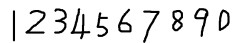
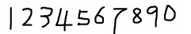
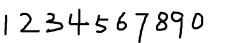
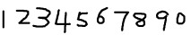
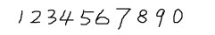
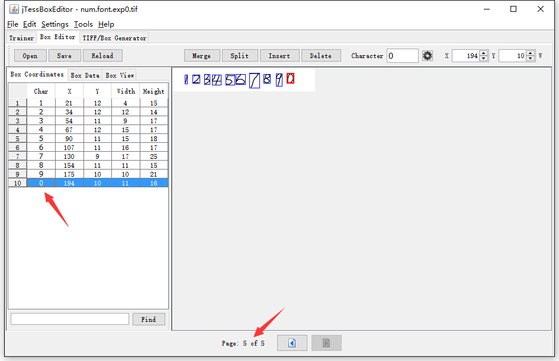
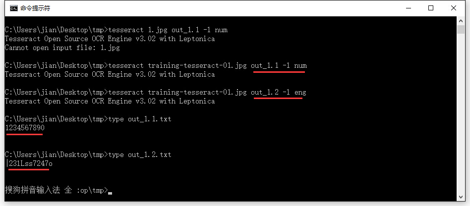

title: Training tesseract-ocr
date: 2016-03-15
tags: [OCR,Tesseract]
---
Tesseract是一个OCR引擎，在1985年到1995年由HP实验室开发，现在在Google。从3.0开始支持中文，这标志着现在有自由的中文OCR软件了。关于如何训练样本，官网有更详细的介绍[官方文档](https://github.com/tesseract-ocr/tesseract/wiki/TrainingTesseract)。这里通过一个简单的例子来介绍一下如何进行样本训练。

<!--more-->
## 下载jTessBoxEditor
这个工具是用来训练样本用的，由于该工具用Java开发的，需要安装Jre才能运行。[下载](https://sourceforge.net/projects/vietocr/files/jTessBoxEditor/)

## 准备样本图像
这里手工绘制了5张0-9的样本图像（当然越丰富越好），如下图所示：

## 合并样本图像
运行`jTessBoxEditor.jar`工具，点击菜单栏中`Tools -> Merge TIFF`。在弹出的对话框中选择样本图像（按Shift选择多张），合并成`num.font.exp0.tif`文件。

## 生成BoxFile文件
打开命令行，执行命令：

    tesseract num.font.exp0.tif num.font.exp0 batch.nochop makebox

BoxFile文件名有严格规范，不要随便去名字，命令格式为：

    tesseract [lang].[fontname].exp[num].tif [lang].[fontname].exp[num] batch.nochop makebox

其中lang为语言名称，fontname为字体名称，num为序号，可以随便定义。

## 文字识别校正
运行`jTessBoxEditor.jar`工具，打开`num.font.exp0.tif`文件（必须将生成的box和tif样本文件放在同一目录），如下图所示。可以看出有些字符识别的不正确，可以通过该工具手动校正。校正完成后保存即可。[每张样本图像都需要检查]()

编辑BoxFile，校正识别出来的字符。还可以修正Box大小、Box位置、合并Box、分割Box、插入Box、删除Box，比如单个字符被识别成了两个或者多个字符，则要将这些行进行合并。

## 字体特征文件
Tesseract3以上的版本在训练之前需要创建一个名称为font_properties的字体特征文件。font_properties不含有BOM头，文件内容格式如下：

    <fontname> <italic> <bold> <fixed> <serif> <fraktur>

其中fontname为字体名称，必须与`[lang].[fontname].exp[num].box`中的名称保持一致。italic、bold、fixed、serif、fraktur的取值为1或0，表示字体是否具有这些属性。

这里在样本图片所在目录下创建一个名称为font_properties的文件，用记事本打开，输入以下下内容：

    font 0 0 0 0 0

这里全取值为0，表示字体不是粗体、斜体等等。

## 生成语言文件
在样本图片所在目录下创建一个批处理文件，`x.bat`内容如下：

    echo "产生字符特征文件*.tr"
    tesseract num.font.exp0.tif num.font.exp0 nobatch box.train
    echo "产生字符集文件unicharset"
    unicharset_extractor num.font.exp0.box
    echo "聚集字符特征"
    mftraining -F font_properties -U unicharset -O num.unicharset num.font.exp0.tr
    echo "产生字符形状正常化特征文件"
    cntraining num.font.exp0.tr
    echo "更名相关文件"
    rename normproto num.normproto
    rename inttemp num.inttemp
    rename pffmtable num.pffmtable
    rename shapetable num.shapetable
    echo "合并训练文件"
    combine_tessdata num.

注：执行批处理文件`call x.bat`。可以重复以上步骤，最后使用`combine_tessdata`进行合并工作，生成更完善语言文件。

## 测试新语言库

    tesseract training-tesseract-01.jpg out_1.1 -l num
    tesseract training-tesseract-01.jpg out_1.2 -l eng

测试结果如下：（可以看到识别率提升比较明显！）

## 参考资料：
- [Tesseract-OCR样本训练](http://blog.csdn.net/firehood_/article/details/8433077)
- [Tesseract-OCR语言库训练步骤](http://blog.csdn.net/lingjiuhun/article/details/7886222)