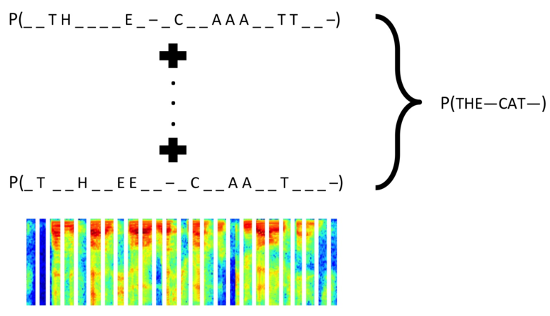

title: 不定长文字识别(验证码)
date: 2017-08-18
tags: [SceneText,Keras]
---
车牌的应用场景中,我们固定了长度为7位,并且基于这个预设计了卷积神经网络.但是在实际运用中,可能长度并不固定.此时如果长度过长,用这个架构也将会导致参数过多,占用过多显存.

<!--more-->
针对这种情况,Keras的案例中,提供了一种基于循环神经网络的方法,在[Keras Example](https://github.com/fchollet/keras/blob/master/examples/image_ocr.py)中有写到.具体而言,就是数据首先通过卷积神经网络部分扫描特征,然后通过循环神经网络部分,同时从左到右,从右到左扫描特征,最后基于扫描的结果,通过计算CTC损失函数,完成模型训练.

## 循环神经网络
使用循环神经网络,是因为循环神经网络有一个很重要的特点,就是相邻的节点之间可以相互影响.这里相邻节点,既可以是时间上的,前一秒数据和后一秒数据,也可以是位置关系上的,比如我们这里从左向右扫描,左边一列的扫描结果会影响右边一列的扫描结果.


## CTC损失函数
同时,对于循环神经网络的结果,由于长度不固定,可能会有空间上的[错配](#):



但由于这种错配实际上并没有什么严重的影响,如上图所示,`__TH____E`和`_T__H__EE`其实都是`THE`这个单词,因此这里这种错配在损失函数的优化环节中,是需要被忽略掉的.于是这里就使用了CTC优化函数.CTC可以在计算过程中,通过综合所有可能情况的排列组合,进而忽略相对的位置关系.Keras的`CTC loss`函数位于[ctc_batch_cost](https://github.com/fchollet/keras/blob/master/keras/backend/tensorflow_backend.py).

## 完整代码
首先下载[image_ocr.py](https://github.com/fchollet/keras/blob/master/examples/image_ocr.py)到当前目录:

    wget https://raw.githubusercontent.com/fchollet/keras/master/examples/image_ocr.py

导入相关函数,可能会提醒`No module xxx`,安装相应包即可:
```
from image_ocr import *
```

必要的参数:
```
import time

run_name = time.strftime('%m%d%H%M')
start_epoch = 0
stop_epoch  = 200
img_w = 128
img_h = 64
words_per_epoch = 16000
val_split = 0.2
val_words = int(words_per_epoch * val_split)


# Network parameters
conv_filters = 16
kernel_size = (3, 3)
pool_size = 2
time_dense_size = 32
rnn_size = 512
input_shape = (img_w, img_h, 1)
```

### 构造生成器
构建生成器,生成不固定长度的验证码:
```
import os
from keras.utils.data_utils import get_file

url = 'http://www.mythic-ai.com/datasets/wordlists.tgz'
tmp = os.path.dirname(get_file('wordlists.tgz', origin=url, untar=True))

img_gen = TextImageGenerator(monogram_file=os.path.join(tmp, 'wordlist_mono_clean.txt'),
                             bigram_file=os.path.join(tmp, 'wordlist_bi_clean.txt'),
                             minibatch_size=32,
                             img_w=img_w,
                             img_h=img_h,
                             downsample_factor=(pool_size ** 2),
                             val_split=words_per_epoch - val_words)
```

### 构造网络
```
from keras.layers import Input, Dense, Activation, Reshape, Lambda

from keras.layers import Input, Conv2D, MaxPooling2D
from keras.layers import Flatten, Dense, Dropout

input_data = Input(name='input', shape=input_shape, dtype='float32')
inner = Conv2D(conv_filters, kernel_size, padding='same', activation='relu', kernel_initializer='he_normal', name='conv1')(input_data)
inner = MaxPooling2D(pool_size=(pool_size, pool_size), name='pool1_max')(inner)
inner = Conv2D(conv_filters, kernel_size, padding='same', activation='relu', kernel_initializer='he_normal', name='conv2')(inner)
inner = MaxPooling2D(pool_size=(pool_size, pool_size), name='pool2_max')(inner)

conv_to_rnn_dims = (img_w // (pool_size ** 2), (img_h // (pool_size ** 2)) * conv_filters)
inner = Reshape(target_shape=conv_to_rnn_dims, name='reshape')(inner)

# cuts down input size going into RNN:
inner = Dense(time_dense_size, activation='relu', name='dense1')(inner)

# Two layers of bidirecitonal GRUs
# GRU seems to work as well, if not better than LSTM:
gru_1 = GRU(rnn_size, return_sequences=True, kernel_initializer='he_normal', name='gru1')(inner)
gru_1b = GRU(rnn_size, return_sequences=True, go_backwards=True, kernel_initializer='he_normal', name='gru1_b')(inner)
gru1_merged = add([gru_1, gru_1b])
gru_2 = GRU(rnn_size, return_sequences=True, kernel_initializer='he_normal', name='gru2')(gru1_merged)
gru_2b = GRU(rnn_size, return_sequences=True, go_backwards=True, kernel_initializer='he_normal', name='gru2_b')(gru1_merged)

# transforms RNN output to character activations:
inner = Dense(img_gen.get_output_size(), kernel_initializer='he_normal', name='dense2')(concatenate([gru_2, gru_2b]))
y_pred = Activation('softmax', name='softmax')(inner)

Model(inputs=input_data, outputs=y_pred).summary()
labels = Input(name='the_labels', shape=[img_gen.absolute_max_string_len], dtype='float32')
input_length = Input(name='input_length', shape=[1], dtype='int64')
label_length = Input(name='label_length', shape=[1], dtype='int64')
# Keras doesn't currently support loss funcs with extra parameters
# so CTC loss is implemented in a lambda layer

loss_out = Lambda(ctc_lambda_func, output_shape=(1,), name='ctc')([y_pred, labels, input_length, label_length])

# clipnorm seems to speeds up convergence
sgd = SGD(lr=0.02, decay=1e-6, momentum=0.9, nesterov=True, clipnorm=5)

model = Model(inputs=[input_data, labels, input_length, label_length], outputs=loss_out)

# the loss calc occurs elsewhere, so use a dummy lambda func for the loss
model.compile(loss={'ctc': lambda y_true, y_pred: y_pred}, optimizer=sgd)
if start_epoch > 0:
    weight_file = os.path.join(OUTPUT_DIR, os.path.join(run_name, 'weights%02d.h5' % (start_epoch - 1)))
    model.load_weights(weight_file)

# captures output of softmax so we can decode the output during visualization
test_func = K.function([input_data], [y_pred])

# 反馈函数，即运行固定次数后，执行反馈函数可保存模型，并且可视化当前训练的效果
viz_cb = VizCallback(run_name, test_func, img_gen.next_val())
```

## 训练网络
```
model.fit_generator(generator=img_gen.next_train(),
                    steps_per_epoch=(words_per_epoch - val_words),
                    epochs=stop_epoch,
                    validation_data=img_gen.next_val(),
                    validation_steps=val_words,
                    callbacks=[EarlyStopping(patience=10), viz_cb, img_gen],
                    initial_epoch=start_epoch)
```

完成一个Epoch后,输出文件夹`image_ocr`里,可以看到,一轮训练后模型效果:

``

## 参考资料:
- [使用腾讯云GPU学习深度学习系列之五:文字的识别与定位](https://www.qcloud.com/community/article/680286)