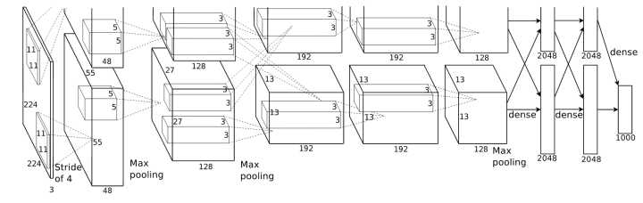
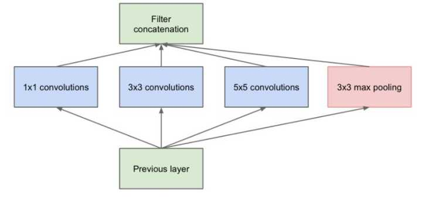
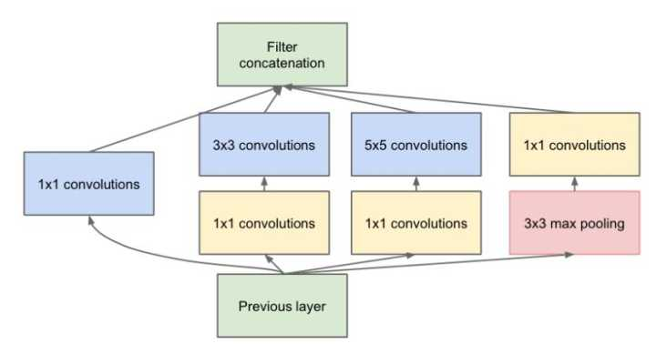
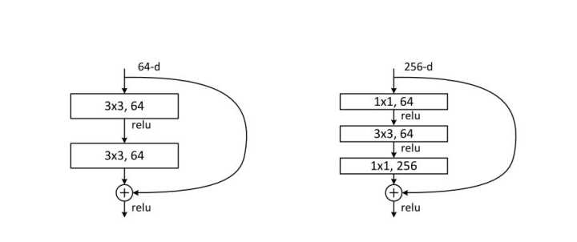
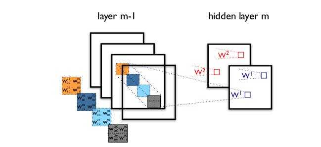
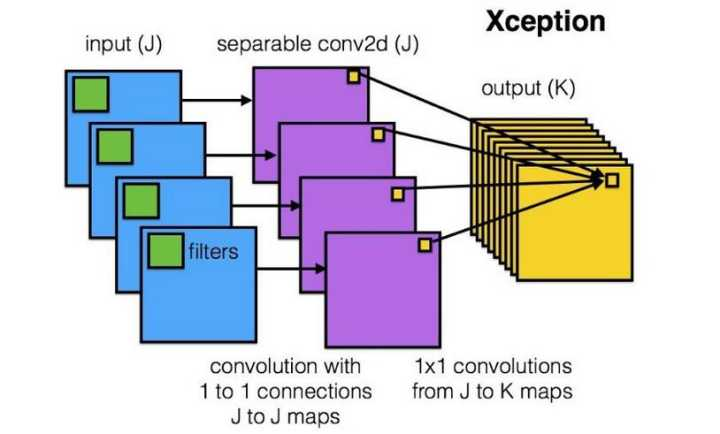
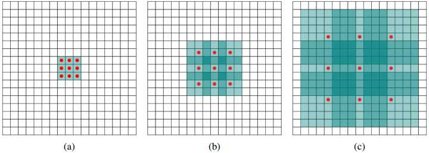
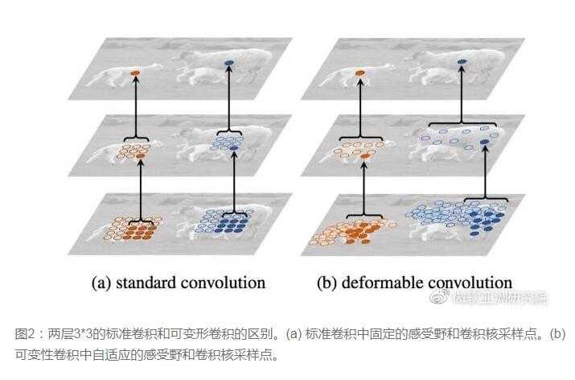

# CNN evolution wow top10
卷积神经网络中十大拍案叫绝的操作.CNN从2012年的AlexNet发展至今,科学家们发明出各种各样的CNN模型,一个比一个深,一个比一个准确,一个比一个轻量.我下面会对近几年一些具有变革性的工作进行简单盘点,从这些充满革新性的工作中探讨日后的CNN变革方向.

## 卷积只能在同一组进行吗?
Group convolution分组卷积,最早在AlexNet中出现,由于当时的硬件资源有限,训练AlexNet时卷积操作不能全部放在同一个GPU处理,因此作者把feature maps分给多个GPU分别进行处理,最后把多个GPU的结果进行融合.

## 卷积核一定越大越好?
AlexNet中用到了一些非常大的卷积核,比如`11×11`,`5×5`卷积核,之前人们的观念是,卷积核越大,receptive field(感受野)越大,看到的图片信息越多,因此获得的特征越好.虽说如此,但是大的卷积核会导致计算量的暴增,不利于模型深度的增加,计算性能也会降低.于是在VGG(最早使用),Inception网络中,利用2个`3×3`卷积核的组合比1个`5×5`卷积核的效果更佳,同时参数量(`3×3×2+1` VS `5×5×1+1`)被降低,因此后来`3×3`卷积核被广泛应用在各种模型中.

## 每层卷积只能用一种尺寸的卷积核?
传统的层叠式网络,基本上都是一个个卷积层的堆叠,每层只用一个尺寸的卷积核,例如VGG结构中使用了大量的`3×3`卷积层.事实上,同一层feature map可以分别使用多个不同尺寸的卷积核,以获得不同尺度的特征,再把这些特征结合起来,得到的特征往往比使用单一卷积核的要好,谷歌的GoogleNet,或者说Inception系列的网络,就使用了多个卷积核的结构:

最初版本的Inception结构.如上图所示,一个输入的feature map分别同时经过`1×1`,`3×3`,`5×5`的卷积核的处理,得出的特征再组合起来,获得更佳的特征.但这个结构会存在一个严重的问题:参数量比单个卷积核要多很多,如此庞大的计算量会使得模型效率低下.这就引出了一个新的结构.

## 怎样才能减少卷积层参数量?
发明GoogleNet的团队发现,如果仅仅引入多个尺寸的卷积核,会带来大量的额外的参数,受到Network In Network中`1×1`卷积核的启发,为了解决这个问题,他们往Inception结构中加入了一些`1×1`的卷积核,如图所示:

## 越深的网络就越难训练吗?

传统的卷积层层叠网络会遇到一个问题,当层数加深时,网络的表现越来越差,很大程度上的原因是因为当层数加深时,梯度消散得越来越严重,以至于反向传播很难训练到浅层的网络.为了解决这个问题,何凯明大神想出了一个残差网络,使得梯度更容易地流动到浅层的网络当中去.

## 卷积操作时必须同时考虑通道和区域吗?

标准的卷积过程可以看上图,一个`2×2`的卷积核在卷积时,对应图像区域中的所有通道均被同时考虑,问题在于,为什么一定要同时考虑图像区域和通道?我们为什么不能把通道和空间区域分开考虑?

Xception网络就是基于以上的问题发明而来.我们首先对每一个通道进行各自的卷积操作,有多少个通道就有多少个过滤器.得到新的通道feature maps之后,这时再对这批新的通道feature maps进行标准的`1×1`跨通道卷积操作.这种操作被称为depth-wise convolution.

这种操作是相当有效的,在imagenet 1000类分类任务中已经超过了InceptionV3的表现,而且也同时减少了大量的参数,我们来算一算,假设输入通道数为3,要求输出通道数为256,两种做法:

1. 直接接一个`3×3×256`的卷积核,参数量为`3×3×3×256 = 6,912`
2. DW操作,分两步完成,参数量为`3×3×3 + 3×1×1×256 = 795`,又把参数量降低到九分之一

## 分组卷积能否对通道进行随机分组?
在AlexNet的Group Convolution当中,特征的通道被平均分到不同组里面,最后再通过两个全连接层来融合特征,这样一来,就只能在最后时刻才融合不同组之间的特征,对模型的泛化性是相当不利的.为了解决这个问题,ShuffleNet在每一次层叠这种Group conv层前,都进行一次channel shuffle,shuffle过的通道被分配到不同组当中.进行完一次group conv之后,再一次channel shuffle,然后分到下一层组卷积当中,以此循环.

## 通道间的特征都是平等的吗?
无论是在Inception,DenseNet或者ShuffleNet里面,我们对所有通道产生的特征都是不分权重直接结合的,那为什么要认为所有通道的特征对模型的作用就是相等的呢?这是一个好问题,于是,ImageNet2017冠军SEnet就出来了.

SEnet结构:一组特征在上一层被输出,这时候分两条路线,第一条直接通过,第二条首先进行Squeeze操作(Global Average Pooling)把每个通道2维的特征压缩成一个1维,从而得到一个特征通道向量(每个数字代表对应通道的特征).然后进行Excitation操作,把这一列特征通道向量输入两个全连接层和sigmoid,建模出特征通道间的相关性,得到的输出其实就是每个通道对应的权重,把这些权重通过Scale乘法通道加权到原来的特征上(第一条路),这样就完成了特征通道的权重分配.

## 能否让固定大小的卷积核看到更大范围的区域?
标准的`3×3`卷积核只能看到对应区域`3×3`的大小,但是为了能让卷积核看到更大的范围,dilated conv使其成为了可能.dilated conv原论文中的结构如图所示:

上图(b)可以理解为卷积核大小依然是`3×3`,但是每个卷积点之间有1个空洞,也就是在绿色`7×7`区域里面,只有9个红色点位置作了卷积处理,其余点权重为0.这样即使卷积核大小不变,但它看到的区域变得更大了.(空洞卷积,dilated convolution)

## 卷积核形状一定是矩形吗?
传统的卷积核一般都是长方形或正方形,但MSRA提出了一个相当反直觉的见解,认为卷积核的形状可以是变化的,变形的卷积核能让它只看感兴趣的图像区域,这样识别出来的特征更佳.

图来自微软亚洲研究院公众号.要做到这个操作,可以直接在原来的过滤器前面再加一层过滤器,这层过滤器学习的是下一层卷积核的位置偏移量(offset),这样只是增加了一层过滤器,或者直接把原网络中的某一层过滤器当成学习offset的过滤器,这样实际增加的计算量是相当少的,但能实现可变形卷积核,识别特征的效果更好.

## 启发与思考
现在越来越多的CNN模型从巨型网络到轻量化网络一步步演变,模型准确率也越来越高.现在工业界追求的重点已经不是准确率的提升(因为都已经很高了),都聚焦于速度与准确率的trade off,都希望模型又快又准.因此从原来AlexNet,VGGnet,到体积小一点的Inception,Resnet系列,到目前能移植到移动端的mobilenet,ShuffleNet(体积能降低到0.5MB),我们可以看到这样一些趋势:

### 卷积核

- 大卷积核用多个小卷积核代替
- 单一尺寸卷积核用多尺寸卷积核代替
- 固定形状卷积核趋于使用可变形卷积核
- 使用1×1卷积核(bottleneck结构)

### 卷积层通道

- 标准卷积用depth-wise卷积代替
- 使用分组卷积
- 分组卷积前使用channel shuffle
- 通道加权计算

### 卷积层连接

- 使用skip connection,让模型更深
- densely connection,使每一层都融合上其它层的特征输出(DenseNet)