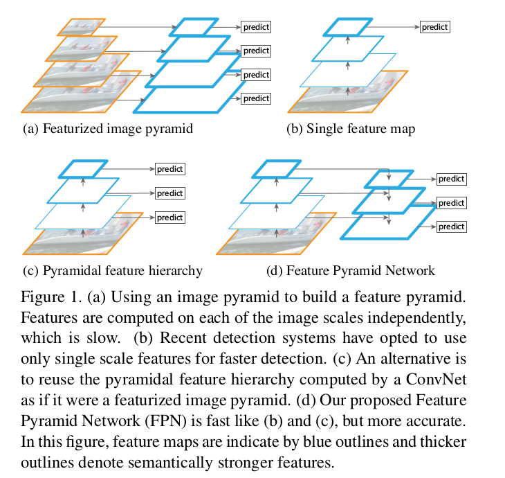
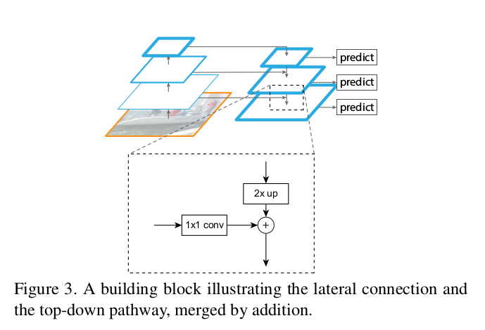
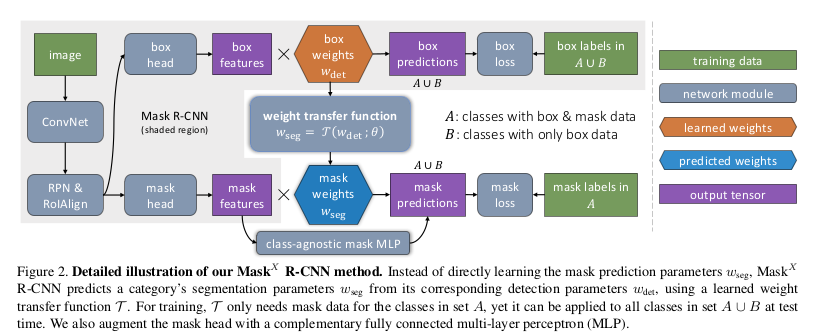

# FPN retinaNet maskRCNN maskXRCNN
从特征金字塔网络,Mask R-CNN到学习分割一切.这篇文章从基本构建模块创新到CNN,再到单一物体检测模块.然后转向实例分割中的创新,最后以弱半监督方式结束,以扩大实例分割.包括特征金字塔网络,RetinaNet,Mask R-CNN以及用于实例分割的弱半监督方法.[原文](https://skrish13.github.io/articles/2018-03/fair-cv-saga)

## 特征金字塔网络(Feature Pyramid Networks)
以著名的Feature Pyramid Networks(FPN)开始,这是在CVPR 2017发表的论文,作者Tsung-Yi Lin,何恺明等人.FPN的论文真的很棒.构建一个每个人都可以在各种任务,子主题和应用领域中建立的基准模型并不容易.在详细讨论之前,我们需要了解的一点是:FPN是ResNet或DenseNet等通用特征提取网络的附加组件.你可以从你喜欢的DL库中得到想要的预训练FPN模型,然后像其他预训练模型一样使用它们.

物体是以不同的的scale和size出现的.数据集无法捕获所有这些数据.因此,可以使用图像金字塔(图像的多种缩小比例),以使CNN更易处理.但这太慢了.所以人们只使用一个单个scale的预测,也可以从中间层进行预测.这跟前一种方法有点像,但这是在特征空间上进行的.例如,在几个ResNet块之后放一个Deconv,并获得分割输出(类似地,对于分类,可以是`1x1 Conv`和`GlobalPool`).很多这样的架构现在被用于辅助信息和辅助损失的另一个环境中.

FPN的作者找到了一种改进上述方法的聪明方法.不是仅仅具有横向连接,而是将自上而下的pathway也放在上面.这非常合理!他们使用一个简单的`MergeLayer(mode='addition')`来组合两者.这个想法的一个关键点是,较低层(比如初始的conv层)的特征语义信息比较少,不足以用来进行分类.但是更深层的特征可以用于理解.在这里,你还可以利用所有自上而下的pathway FMaps(特征地图)来理解它,就像最深的层一样.这是由于横向连接和自上而下的连接相结合形成的.

正如前面所说,这是一个基础网络,可以在任何任务上使用,包括目标检测,分割,姿态估计,人脸检测等等.论文发布后几个月的时间,已经得到100多个引用!论文的标题是`FPNs for Object Detection`,因此作者继续将FPN用作RPN(Region Proposal Network)和Faster-RCNN网络的baseline.

### 代码
- 官方Caffe2 - https://github.com/facebookresearch/Detectron/tree/master/configs/12_2017_baselines
- PyTorch - https://github.com/kuangliu/pytorch-fpn (just the network)
- MXNet - https://github.com/unsky/FPN-mxnet
- Tensorflow - https://github.com/yangxue0827/FPN_Tensorflow

## RetinaNet(密集对象检测的Focal Loss函数)
RetinaNet跟上面的FPN来自同一团队,第一作者都是Tsung-Yi Lin.这篇论文发表于ICCV 2017,并且获得当年的最佳学生论文.

这篇论文有两个关键想法:称为焦点损失(Focal Loss, FL)的损失函数和称为RetinaNet的single stage物体检测网络.该网络在COCO物体检测任务上表现非常出色,同时也击败了前面的FPN benchmark.

### Focal Loss
Focal Loss是很聪明的想法,而且很简单!如果你已经熟悉加权损失,这个与加权损失基本相同,但具有更聪明的权重,将更多的注意力集中在对困难的样本进行分类.公式如下:

$$
\begin{aligned}
CrossEntropyLoss(p_t) = - log(p_t) \\
FocalLoss = - (1-p_t)^\gamma log(p_t) \\
WeightedFocalLoss(p_t) = - \alpha_t (1-p_t)^\gamma log(p_t)
\end{aligned}
$$

其中`\gamma`是一个可以改变的超参数.`p_t`是分类器中样本的概率.如果`\gamma`比0大,会降低良好分类的样品的权重.`\alpha_t`是正常加权损失函数中类的权重.需要注意的是,这是分类损失,并与RetinaNet中物体检测任务的平滑L1损失相结合.

### RetinaNet
FAIR发布这个single stage的检测网络,很是令人惊讶.直到现在,在single stage的目标检测中,占据主导地位的仍是YOLOv2和SSD.但正如作者指出的那样,这两个网络都没有能够非常接近SOTA方法.RetinaNet做到了这一点,同时它是one stage而且快速的.作者认为,最好的结果是由于新的损失,而不是由于一个简单的网络(它后端是一个FPN).这个想法是,one stage探测器将在背景与正面阶层之间面临很多不平衡(而非positive classes内部的不平衡).他们认为,加权损失函数只是针对平衡,但FL则针对简单/困难的样本,同时也表明两者可以结合起来.

### 代码
- 官方Caffe2 - https://github.com/facebookresearch/Detectron/tree/master/configs/12_2017_baselines
- PyTorch - https://github.com/kuangliu/pytorch-retinanet
- Keras - https://github.com/fizyr/keras-retinanet
- MXNet - https://github.com/unsky/RetinaNet

## Mask R-CNN
它发布在ICCV 2017中.它用于对象实例分段.对于外行人来说,其基本上是对象检测,而不是边界框,这个任务是给出对象的精确分割图!简单来说,目标实例分割基本上就是对象检测,但不是使用边界框,它的任务是给出对象的精确分割图.

如果你知道Faster-RCNN,那么它非常简单,为分割添加另一个头(分支).所以基本上有3个分支,分别用于分类,边界框回归和分割.重点是使用简单和基本的网络设计来展示该方法的效率.他们没有任何花里胡哨的获得SOTA.

### 代码
- 官方Caffe2 - https://github.com/facebookresearch/Detectron/tree/master/configs/12_2017_baselines
- Keras - https://github.com/matterport/Mask_RCNN/
- PyTorch - https://github.com/soeaver/Pytorch_Mask_RCNN/
- MXNet - https://github.com/TuSimple/mx-maskrcnn

## 学习分割一切(Learning to Segment Everything)
文如其名,这篇论文是关于分割的.更具体的说,是关于实例分割的.计算机视觉中用于分割的标准数据集非常小,对现实世界的问题不足以有效.即便到了2018年,创建于2015年的COCO数据集仍然是最流行,最丰富的数据集,尽管它只有80个物体类别.

相比之下,对象识别和检测的数据集,例如[OpenImages](https://github.com/openimages),具有用于分类任务的6000个类别和用于检测的545个类别.话虽如此,斯坦福大学还有另一个名为Visual Genome的数据集,其中包含3000个物体类别!那么,为什么不使用这个数据集呢?因为每个类别中的图像数量太少,因此DNN在这个数据集上并不会真正起作用,所以即使它更丰富,人们也不会使用这个数据集.而且,这个数据集没有任何分割注释,只有3000个类别的对象检测的边界框(bounding boxes)标签可用.

回到`Learning to Segment Every Thing`这篇论文.实际上,边界框(bounding box)和分割注释(segmentation annotation)对于域来说并没有太大的区别,仅仅是后者比前者更精确.因此,因为Visual Genome数据集有3000个类,为什么不利用这个数据集来做实例分割呢?FAIR何恺明团队正是这样做的.这可以被称为弱监督(或半监督)学习,也就是说你没法完全监督你想要实现的任务.它还可以与半监督相关联,因为它们都使用`COCO + Visual Genome`数据集.这篇论文是迄今为止最酷的.

- 它是建立在Mask-RCNN之上的
- 同时在有mask标注和无mask标注的输入上训练
- 在mask和bbox mask之间添加一个weight transfer函数
- 当无mask标注的输入通过时,wseg预测将于马萨卡features相乘的权重
- 当有mask标注的输入通过时,不使用这个函数,代而使用一个简单的MLP
- 如下图所示.A是COCO数据集,B是VG.注意不同输入的两个不同路径

