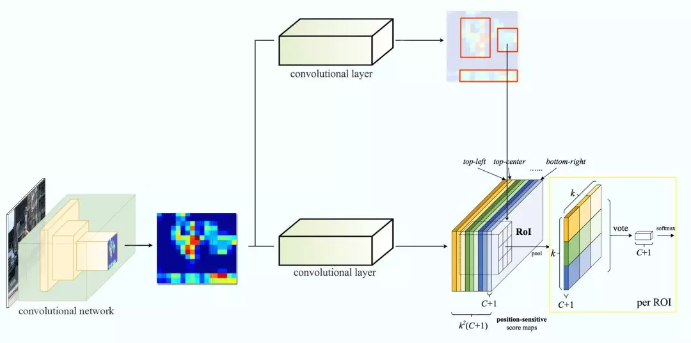

# RCNN to SSD
从RCNN到SSD,这应该是最全的一份目标检测算法盘点.[机器之心](https://www.jiqizhixin.com/articles/2018-04-27)

目标检测是很多计算机视觉任务的基础,不论我们需要实现图像与文字的交互还是需要识别精细类别,它都提供了可靠的信息.本文对目标检测进行了整体回顾,第一部分从RCNN开始介绍基于候选区域的目标检测器,包括Fast R-CNN,Faster R-CNN和FPN等;第二部分则重点讨论了包括YOLO,SSD和RetinaNet等在内的单次检测器,它们都是目前最为优秀的方法.

---

# 基于候选区域的目标检测器

## 滑动窗口检测器
自从AlexNet获得ILSVRC 2012挑战赛冠军后,用CNN进行分类成为主流.一种用于目标检测的暴力方法是从左到右,从上到下滑动窗口,利用分类识别目标.为了在不同观察距离处检测不同的目标类型,我们使用不同大小和宽高比的窗口.


我们根据滑动窗口从图像中剪切图像块.由于很多分类器只取固定大小的图像,因此这些图像块是经过变形转换的.但是,这不影响分类准确率,因为分类器可以处理变形后的图像.变形图像块被输入CNN分类器中,提取出4096个特征.之后,我们使用SVM分类器识别类别和该边界框的另一个线性回归器.


下面是伪代码.我们创建很多窗口来检测不同位置的不同目标.要提升性能,一个显而易见的办法就是减少窗口数量.
```python
for window in windows:
    patch = get_patch(image, window)
    results = detector(patch)
```

## 候选区域方法
我们不使用暴力方法,而是用候选区域方法(region proposal method)创建目标检测的感兴趣区域(ROI).在选择性搜索(selective search, SS)中,我们首先将每个像素作为一组.然后,计算每一组的纹理,并将两个最接近的组结合起来.但是为了避免单个区域吞噬其他区域,我们首先对较小的组进行分组.我们继续合并区域,直到所有区域都结合在一起.下图第一行展示了如何使区域增长,第二行中的蓝色矩形代表合并过程中所有可能的ROI.


## R-CNN
R-CNN利用候选区域方法创建了约2000个ROI.这些区域被转换为固定大小的图像,并分别馈送到卷积神经网络中.该网络架构后面会跟几个全连接层,以实现目标分类并提炼边界框.以下是R-CNN整个系统的流程图:


通过使用更少且更高质量的ROI,R-CNN要比滑动窗口方法更快速,更准确.
```python
ROIs = region_proposal(image)
for ROI in ROIs:
    patch = get_patch(image, ROI)
    results = detector(patch)
```

## 边界框回归器
候选区域方法有非常高的计算复杂度.为了加速这个过程,我们通常会使用计算量较少的候选区域选择方法构建ROI,并在后面使用线性回归器(使用全连接层)进一步提炼边界框.

## Fast R-CNN
R-CNN需要非常多的候选区域以提升准确度,但其实有很多区域是彼此重叠的,因此R-CNN的训练和推断速度非常慢.如果我们有2000个候选区域,且每一个都需要独立地馈送到CNN中,那么对于不同的ROI,我们需要重复提取2000次特征.

Fast R-CNN使用特征提取器(CNN)先提取整个图像的特征,而不是从头开始对每个图像块提取多次.然后,我们可以将创建候选区域的方法直接应用到提取到的特征图上.例如,Fast R-CNN选择了VGG16中的卷积层conv5来生成ROI,这些关注区域随后会结合对应的特征图以裁剪为特征图块,并用于目标检测任务中.我们使用ROI池化将特征图块转换为固定的大小,并馈送到全连接层进行分类和定位.因为Fast-RCNN不会重复提取特征,因此它能显著地减少处理时间.以下是Fast R-CNN的流程图:


在下面的伪代码中,计算量巨大的特征提取过程从For循环中移出来了,因此速度得到显著提升.Fast R-CNN的训练速度是R-CNN的10倍,推断速度是后者的150倍.
```python
feature_maps = process(image)
ROIs = region_proposal(feature_maps)
for ROI in ROIs:
    patch = roi_pooling(feature_maps, ROI)
    results = detector2(patch)
```

Fast R-CNN最重要的一点就是包含特征提取器,分类器和边界框回归器在内的整个网络能通过多任务损失函数进行端到端的训练,这种多任务损失即结合了分类损失和定位损失的方法,大大提升了模型准确度.

## ROI池化
因为Fast R-CNN使用全连接层,所以我们应用ROI池化将不同大小的ROI转换为固定大小.为简洁起见,我们先将`8×8`特征图转换为预定义的`2×2`大小.

- 左上角:特征图
- 右上角:将ROI(蓝色区域)与特征图重叠
- 左下角:将ROI拆分为目标维度.例如,对于`2×2`目标,我们将ROI分割为4个大小相似或相等的部分
- 右下角:找到每个部分的最大值,得到变换后的特征图


## Faster R-CNN
Fast R-CNN依赖于外部候选区域方法,如选择性搜索.但这些算法在CPU上运行且速度很慢.在测试中,Fast R-CNN需要2.3秒来进行预测,其中2秒用于生成2000个ROI.Faster R-CNN采用与Fast R-CNN相同的设计,只是它用内部深层网络代替了候选区域方法.新的候选区域网络(RPN)在生成ROI时效率更高,并且以每幅图像10毫秒的速度运行.


## 候选区域网络
候选区域网络(RPN)将第一个卷积网络的输出特征图作为输入.它在特征图上滑动一个`3×3`的卷积核,以使用卷积网络(如下所示的ZF网络)构建与类别无关的候选区域.其他深度网络(如VGG或ResNet)可用于更全面的特征提取,但这需要以速度为代价.ZF网络最后会输出256个值,它们将馈送到两个独立的全连接层,以预测边界框和两个objectness分数,这两个objectness分数度量了边界框是否包含目标.我们其实可以使用回归器计算单个objectness分数,但为简洁起见,Faster R-CNN使用只有两个类别的分类器:即带有目标的类别和不带有目标的类别.


对于特征图中的每一个位置,RPN会做k次预测.因此,RPN将输出4k个坐标和每个位置上2k个得分.下图展示了`8×8`的特征图,且有一个`3×3`的卷积核执行运算,它最后输出`8×8×3`个ROI(其中k=3).


此处有3种猜想,稍后我们将予以完善.由于只需要一个正确猜想,因此我们最初的猜想最好涵盖不同的形状和大小.因此,Faster R-CNN不会创建随机边界框.相反,它会预测一些与左上角名为`锚点`的参考框相关的偏移量.我们限制这些偏移量的值,因此我们的猜想仍然类似于锚点.


要对每个位置进行k个预测,我们需要以每个位置为中心的k个锚点.每个预测与特定锚点相关联,但不同位置共享相同形状的锚点.这些锚点是精心挑选的,因此它们是多样的,且覆盖具有不同比例和宽高比的现实目标.这使得我们可以以更好的猜想来指导初始训练,并允许每个预测专门用于特定的形状.该策略使早期训练更加稳定和简便.


---

# 基于区域的全卷积神经网络

## R-FCN
假设我们只有一个特征图用来检测右眼.那么我们可以使用它定位人脸吗?应该可以.因为右眼应该在人脸图像的左上角,所以我们可以利用这一点定位整个人脸.


如果我们还有其他用来检测左眼,鼻子或嘴巴的特征图,那么我们可以将检测结果结合起来,更好地定位人脸.

现在我们回顾一下所有问题.在Faster R-CNN中,检测器使用了多个全连接层进行预测.如果有2000个ROI,那么成本非常高:
```python
feature_maps = process(image)
ROIs = region_proposal(feature_maps)
for ROI in ROIs:
    patch = roi_pooling(feature_maps, ROI)
    class_scores, box = detector(patch)  # Expensive!
    class_probabilities = softmax(class_scores)
```

R-FCN通过减少每个ROI所需的工作量实现加速.上面基于区域的特征图与ROI是独立的,可以在每个ROI之外单独计算.剩下的工作就比较简单了,因此R-FCN的速度比Faster R-CNN快:
```python
feature_maps = process(image)
ROIs = region_proposal(feature_maps)
score_maps = compute_score_map(feature_maps)
for ROI in ROIs:
    V = region_roi_pool(score_maps, ROI)
    class_scores, box = average(V)  # Much simpler!
    class_probabilities = softmax(class_scores)
```

现在我们来看一下`5×5`的特征图M,内部包含一个蓝色方块.我们将方块平均分成`3×3`个区域.现在,我们在M中创建了一个新的特征图,来检测方块的左上角(TL).这个新的特征图如下图(右)所示.只有黄色的网格单元`[2,2]`处于激活状态.


我们将方块分成9个部分,由此创建了9个特征图,每个用来检测对应的目标区域.这些特征图叫作位置敏感得分图(position-sensitive score map),因为每个图检测目标的子区域(计算其得分).


下图中红色虚线矩形是建议的ROI.我们将其分割成`3×3`个区域,并询问每个区域包含目标对应部分的概率是多少.例如,左上角ROI区域包含左眼的概率.我们将结果存储成`3×3 vote`数组,如下图(右)所示.例如,`vote_array[0][0]`包含左上角区域是否包含目标对应部分的得分.


将得分图和ROI映射到vote数组的过程叫作位置敏感ROI池化(position-sensitive ROI-pool).该过程与前面讨论过的ROI池化非常接近.


在计算出位置敏感ROI池化的所有值后,类别得分是其所有元素得分的平均值.


## ROI池化
假如我们有C个类别要检测.我们将其扩展为`C+1`个类别,这样就为背景(非目标)增加了一个新的类别.每个类别有`3×3`个得分图,因此一共有`(C+1)×3×3`个得分图.使用每个类别的得分图可以预测出该类别的类别得分.然后我们对这些得分应用softmax函数,计算出每个类别的概率.在我们的案例中`k=3`:



---

# 单次目标检测器
这部分,我们将对单次目标检测器(包括SSD,YOLO,YOLOv2,YOLOv3)进行综述.我们将分析FPN以理解多尺度特征图如何提高准确率,特别是小目标的检测,其在单次检测器中的检测效果通常很差.然后我们将分析Focal loss和RetinaNet,看看它们是如何解决训练过程中的类别不平衡问题的.

## 单次检测器
Faster R-CNN中,在分类器之后有一个专用的候选区域网络.基于区域的检测器是很准确的,但需要付出代价.Faster R-CNN在PASCAL VOC 2007测试集上每秒处理7帧的图像(7FPS).和R-FCN类似,研究者通过减少每个ROI的工作量来精简流程.作为替代,我们是否需要一个分离的候选区域步骤?我们可以直接在一个步骤内得到边界框和类别吗?

让我们再看一下滑动窗口检测器.我们可以通过在特征图上滑动窗口来检测目标.对于不同的目标类型,我们使用不同的窗口类型.以前的滑动窗口方法的致命错误在于使用窗口作为最终的边界框,这就需要非常多的形状来覆盖大部分目标.更有效的方法是将窗口当做初始猜想,这样我们就得到了从当前滑动窗口同时预测类别和边界框的检测器.


这个概念和Faster R-CNN中的锚点很相似.然而,单次检测器会同时预测边界框和类别.例如,我们有一个`8×8`特征图,并在每个位置做出k个预测,即总共有`8×8×k`个预测结果.


在每个位置,我们有k个锚点(锚点是固定的初始边界框猜想),一个锚点对应一个特定位置.我们使用相同的 锚点形状仔细地选择锚点和每个位置.


在单次检测器中,卷积核还预测C个类别概率以执行分类(每个概率对应一个类别).因此我们应用一个`3×3×D×25`卷积核将特征图从`8×8×D`转换为`8×8×25`(C=20).


## SSD
SSD是使用VGG19网络作为特征提取器(和Faster R-CNN中使用的CNN一样)的单次检测器.我们在该网络之后添加自定义卷积层(蓝色),并使用卷积核(绿色)执行预测.


然而,卷积层降低了空间维度和分辨率.因此上述模型仅可以检测较大的目标.为了解决该问题,我们从多个特征图上执行独立的目标检测.


以下是特征图图示:


SSD使用卷积网络中较深的层来检测目标.如果我们按接近真实的比例重绘上图,我们会发现图像的空间分辨率已经被显著降低,且可能已无法定位在低分辨率中难以检测的小目标.如果出现了这样的问题,我们需要增加输入图像的分辨率.


## YOLO
YOLO在卷积层之后使用了DarkNet来做特征检测.


然而,它并没有使用多尺度特征图来做独立的检测.相反,它将特征图部分平滑化,并将其和另一个较低分辨率的特征图拼接.例如,YOLO将一个`28×28×512`的层重塑为`14×14×2048`,然后将它和`14×14×1024`的特征图拼接.之后,YOLO在新的`14×14×3072`层上应用卷积核进行预测.

YOLOv2做出了很多实现上的改进,将mAP值从第一次发布时的63.4提高到了78.6.YOLO9000可以检测9000种不同类别的目标.


以下是YOLO论文中不同检测器的mAP和FPS对比.YOLOv2可以处理不同分辨率的输入图像.低分辨率的图像可以得到更高的FPS,但mAP值更低.


## YOLOv3
YOLOv3使用了更加复杂的骨干网络来提取特征.DarkNet-53主要由`3×3`和`1×1`的卷积核以及类似ResNet中的跳过连接构成.相比ResNet-152,DarkNet有更低的BFLOP(十亿次浮点数运算),但能以2倍的速度得到相同的分类准确率.


YOLOv3还添加了特征金字塔,以更好地检测小目标.以下是不同检测器的准确率和速度的权衡.


## FPN
特征金字塔网络(FPN).检测不同尺度的目标很有挑战性,尤其是小目标的检测.特征金字塔网络(FPN)是一种旨在提高准确率和速度的特征提取器.它取代了检测器(如Faster R-CNN)中的特征提取器,并生成更高质量的特征图金字塔.


FPN由自下而上和自上而下路径组成.其中自下而上的路径是用于特征提取的常用卷积网络.空间分辨率自下而上地下降.当检测到更高层的结构,每层的语义值增加.


SSD通过多个特征图完成检测.但是,最底层不会被选择执行目标检测.它们的分辨率高但是语义值不够,导致速度显著下降而不能被使用.SSD只使用较上层执行目标检测,因此对于小的物体的检测性能较差.


FPN提供了一条自上而下的路径,从语义丰富的层构建高分辨率的层.


---

# 困难案例
对于如SSD和YOLO的大多数检测算法来说,我们做了比实际的目标数量要多得多的预测.所以错误的预测比正确的预测要更多.这产生了一个对训练不利的类别不平衡.训练更多的是在学习背景,而不是检测目标.但是,我们需要负采样来学习什么是较差的预测.所以,我们计算置信度损失来把训练样本分类.选取最好的那些来确保负样本和正样本的比例最多不超过`3:1`.这使训练更加快速和稳定.

## 推断过程中的非极大值抑制
检测器对于同一个目标会做出重复的检测.我们利用非极大值抑制来移除置信度低的重复检测.将预测按照置信度从高到低排列.如果任何预测和当前预测的类别相同并且两者IoU大于0.5,我们就把它从这个序列中剔除.

## Focal Loss (RetinaNet)
类别不平衡会损害性能.SSD在训练期间重新采样目标类和背景类的比率,这样它就不会被图像背景淹没.Focal loss(FL)采用另一种方法来减少训练良好的类的损失.因此,只要该模型能够很好地检测背景,就可以减少其损失并重新增强对目标类的训练.我们从交叉熵损失CE开始,并添加一个权重来降低高可信度类的CE.


例如,令`γ=0.5`,经良好分类的样本的Focal loss趋近于0.


这是基于FPN,ResNet以及利用Focal loss构建的RetianNet.

