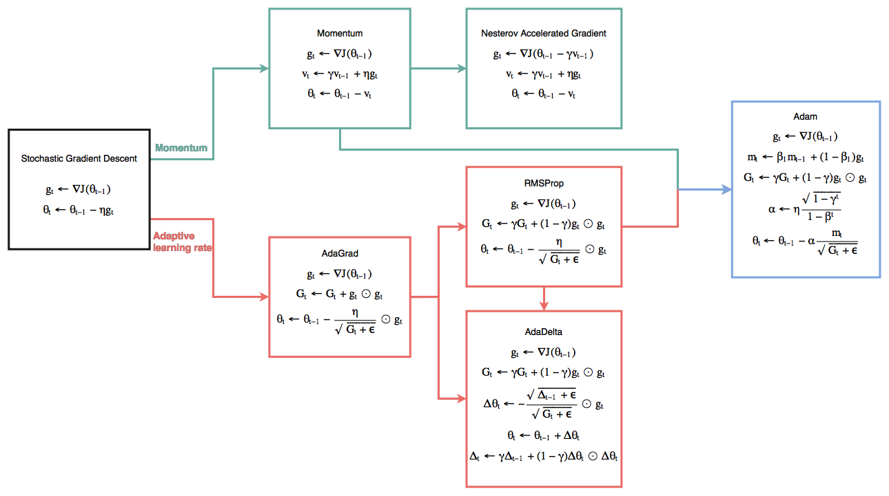

# SGD evolution
机器学习中,经常需要解决Empirical risk minimization(ERM)问题,这么晦涩的名字其实很简单,就是对于每个数据样本`i`定义一个损失`J_i(\theta})`,总的损失就是:

$$
\begin{aligned}
J(\theta) = \frac{1}{n} \sum_i^n J_i(\theta)
\end{aligned}
$$

然后要找到使`J(\theta)`最小的`\theta`.如SVM,Logistic regression甚至分类的CNN都是属于这个问题.这类模型通常需要使用迭代法求解(Linear regression有闭解,但考虑计算问题,一般也使用迭代法),其中梯度下降法(Gradient Descent)最常用:

$$
\begin{aligned}
g_t \gets \frac{1}{n} \sum_i^n \nabla J_i(\theta_{t-1}) \\
\theta_t \gets \theta_{t-1} - \eta g_t
\end{aligned}
$$

## SGD
遇到数据量大的时候,很难不使用随机梯度下降法(Stochastic gradient descent, SGD).SGD非常直观,就是随机拿一个或几个数据做个梯度下降,即:

$$
\begin{aligned}
g_t \gets \nabla J_i(\theta_{t-1}) \\
\theta_t \gets \theta_{t-1} - \eta g_t
\end{aligned}
$$

这个梯度`g_t`是对部分数据计算所得.`g_t`可以看作是对真实梯度的估计,至少期望上是没有偏差的,因此在应用于凸问题时可以收敛到最优解.但是SGD有很多需要解决的问题:

- 收敛速度跟学习速率`\eta`关系很大,大了容易震荡,小了收敛很慢.人为地在训练中调节是比较困难的,也难以适应数据的特征
- 学习速率`\eta`对所有的`\theta`的特征都是一样的.事实上,应该`\theta`中某些特征下降慢,有些快,没有考虑到稀疏性
- 容易陷入不太好局部最小或者鞍点.特别是在训练神经网络时,会更明显

为此大神们设计了很多改进的算法,包括Momentum,NAG,Adagrad,RMSProp,AdaDelta,Adam等.

## 改进SGD
改进的算法有点多,挑几个著名的,我把这几个算法之间的进化关系(也根据出现的时间顺序)画在了一张图中.针对上述问题,主要有两种改进:一是利用物理中动量的思想,保持总的下降方向减小震荡,也比较容易地跳出不太好的局部最小;二是自动调节学习速率`\eta`.

## Momentum
想象一个球从山上滚下来,刚开始速度为0,就会滚得磕磕碰碰(震荡).经过一段时间动量(Momentum)的累加,震荡就会减少,径直往山下滚.表示为数学公式就是:

$$
\begin{aligned}
g_t \gets \nabla J(\theta_{t-1}) \\
v_t \gets \gamma v_{t-1} + \eta g_t \\
\theta_t \gets \theta_{t-1} - v_t
\end{aligned}
$$

可以看到就是当前下降的方向要与之前下降的方向加权平均.这里的`\gamma`一般取0.9就行了.直观上可以减少震荡,能更快的收敛.

## NAG
NAG(Nesterov accelerated gradient)核心思想就是利用Momentum预测下一步的梯度,而不是使用当前的`\theta`:

$$
\begin{aligned}
g_t \gets \nabla J(\theta_{t-1} - \gamma v_{t-1}) \\
v_t \gets \gamma v_{t-1} + \eta g_t \\
\theta_t \gets \theta_{t-1} - v_t
\end{aligned}
$$

看出玄机没,在计算`g_t`的时候使用的不是`\theta_{t-1}`而是在`\theta_{t-1}`的基础上再前进`\gamma v_{t-1}`,相当于利用当前的Momentum对下一步将走到哪进行了预测.

## AdaGrad
接下来是关于学习速率的.通过算法让学习速率的选择更加容易,或者说是Adaptive Gradient.AdaGrad利用以前的梯度信息`\sum_{i=1}^t g_{i,j}^2`判断对应的特征`j`是否经常被更新.因此对稀疏的数据尤其适合.写成向量形式如下:

$$
\begin{aligned}
g_t \gets \nabla J(\theta_{t-1}) \\
G_t \gets G_t + g_t \odot g_t \\
\theta_t \gets \theta_{t-1} - \frac{\eta}{\sqrt{G_t + \epsilon}} \odot g_t
\end{aligned}
$$

`\epsilon`取个小量如`1e-8`.一般`\eta`取个0.01就不用管了.

>`G_t`是递增的,而且可能是比较快的递增,然后就会导致`\frac{\eta}{\sqrt{G_t + \epsilon}}`很小趋向于0,最后`\theta`就不会更新了.还有就是,最开始的梯度有必要对很久以后的更新产生影响吗?但AdaGrad的意义是非凡的,这里这样做的考虑可能是因为证明收敛更容易.为了更加实用,于是就有了下面站在巨人肩膀上的算法.

## RMSProp
这个算法是Hinton在课上提到的,甚至没有发表.RMSProp就是解决AdaGrad中学习速率趋向0的问题的:

$$
\begin{aligned}
g_t \gets \nabla J(\theta_{t-1}) \\
G_t \gets \gamma G_t + (1 - \gamma) g_t \odot g_t \\
\theta_t \gets \theta_{t-1} - \frac{\eta}{\sqrt{G_t + \epsilon}} \odot g_t
\end{aligned}
$$

对比上式,多了对累计的信息的一个指数衰减(`\gamma`取0.9),AdaGrad的问题就没了.相对AdaGrad,不存在学习速率趋向0的问题,这里的学习速率`\eta`就可以取小一点如0.001.

## AdaDelta
AdaDelta也可以解决AdaGrad的问题,虽然经常看成与RMSProp类似的,我感觉AdaDelta更高级点,因为它连初始的学习速率都不用设置,AdaDelta有时相对比较慢:

$$
\begin{aligned}
g_t \gets \nabla J(\theta_{t-1}) \\
G_t \gets \gamma G_t + (1 - \gamma) g_t \odot g_t \\
\Delta \theta_t \gets - \frac{\sqrt{\Delta_{t-1} + \epsilon}}{\sqrt{G_t + \epsilon}} \odot g_t \\
\theta_t \gets \theta_{t-1} + \Delta \theta_t \\
\Delta_t \gets \gamma \Delta_{t-1} + (1 - \gamma) \Delta \theta_t \odot \Delta \theta_t
\end{aligned}
$$

可以发现AdaDelta用`\sqrt{\Delta_{t-1} + \epsilon}`来估计学习速率.这里的`\gamma`可以取个0.95.直观来说,就是利用之前的步长们`\Delta \theta_t`估计下一步的步长,好像很有道理.更有道理的是SGD,Momentum或者AdaGrad更新时单位是不对的,或者说我们赋予了`\eta`一个单位.而AdaDelta就没有这个问题.

## Adam
Adam利用了AdaGrad和RMSProp在稀疏数据上的优点.对初始化的偏差的修正也让Adam表现的更好.为什么叫Adam呢?因为它是adaptive estimates of lower-order moments,对1阶moments(mean)和2阶moments(variance)进行自适应调整.为什么能对初始化的偏差进行修正(Initialization Bias Correction),可以看Adam论文.Adam的更新算是最复杂的了:

$$
\begin{aligned}
g_t \gets \nabla J(\theta_{t-1}) \\
m_t \gets \beta_1 m_{t-1} + (1 - \beta_1) g_t \\
G_t \gets \gamma G_t + (1 - \gamma) g_t \odot g_t \\
\alpha \gets \eta \frac{\sqrt{1 - \gamma^t}}{1 - \beta^t} \\
\theta_t \gets \theta_{t-1} - \alpha \frac{m_t}{\sqrt{G_t + \epsilon}}
\end{aligned}
$$

与论文中的有所不同,我已经写成高效的形式.`\beta_1`取个0.9(可能需要衰减),`\gamma`取个0.999,`\eta`取个0.001有时也要来个衰减,如`\eta_t = \frac{\eta}{\sqrt{t}}`.在复杂优化问题上,调参真的需要经验.但相对其他来说,Adam真的快很多,很多deep learning的优化问题都用Adam.除了Adam,作者还给出了Adamax这一变种,还有加了Nesterov的Adam,NAdam.

## 总结
虽然针对不同的任务,应该尝试不同的优化算法.我觉得实在不知道用什么就试试Adam.但是在训练过程中自己调整一下学习速率对于复杂优化目标是必要的,比如一个epoch乘以0.5啥的.这就得靠经验了.别以为最普通的SGD不行,还是会被很多人使用,因为谁都不知道训练复杂模型的过程中会发生什么,而SGD是最能保证收敛的.

## 参考资料:
- [SGD算法比较](https://blog.slinuxer.com/2016/09/sgd-comparison)