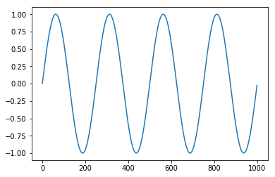

# FFT
https://www.jianshu.com/p/1a3db06e786d

## sig-noise
```python
import numpy as np
import matplotlib.pyplot as plt

period = 5
time_step = 0.02
time_vec = np.arange(0, 20, time_step)
noise = 0.5 * np.random.randn(time_vec.size)
sig = np.sin(2 * np.pi / period * time_vec) + noise
plt.plot(sig);
```


```python
plt.plot(sig-noise);
```



## fft
```python
sig_fft = np.fft.fft(sig)
sample_freq = np.fft.fftfreq(time_vec.size, time_step)
plt.plot(np.real(sig_fft));
```


```python
plt.plot(np.imag(sig_fft));
```


因为功率结果是对称的,仅仅需要使用谱的正值部分来找出频率.信号频率可以这样被找到:
```python
pidxs = np.where(sample_freq > 0)
freqs = sample_freq[pidxs]
power = np.abs(sig_fft)[pidxs]
freq = freqs[power.argmax()]
freq, 1/period
## (0.2, 0.2)
```

高频噪声将被从傅里叶变换信号中移除:
```python
sig_fft[np.abs(sample_freq) > freq] = 0
main_sig = np.fft.ifft(sig_fft)
plt.plot(np.real(main_sig));
```


## Code
```python
import numpy as np
import pandas as pd
import matplotlib.pyplot as plt

period = 5
time_step = 0.02
time_vec = np.arange(0, 20, time_step)

noise = 0.5 * np.random.randn(time_vec.size)
sig = np.sin(2 * np.pi / period * time_vec) + noise
plt.plot(sig);

sig_fft = np.fft.fft(sig)
sample_freq = np.fft.fftfreq(time_vec.size, time_step)

pidxs = np.where(sample_freq > 0)
freqs = sample_freq[pidxs]
power = np.abs(sig_fft)[pidxs]

freq = freqs[power>50]
sig_fft[pd.Series(np.abs(sample_freq)).apply(lambda x: x not in freq).tolist()] = 0

main_sig = np.fft.ifft(sig_fft)
plt.plot(np.real(main_sig));

print(freq)
## [0.2]
```

