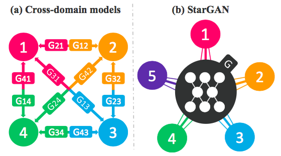
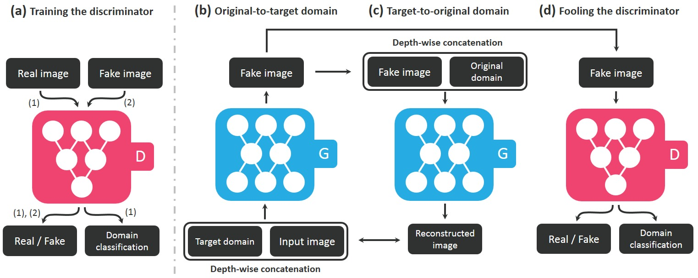
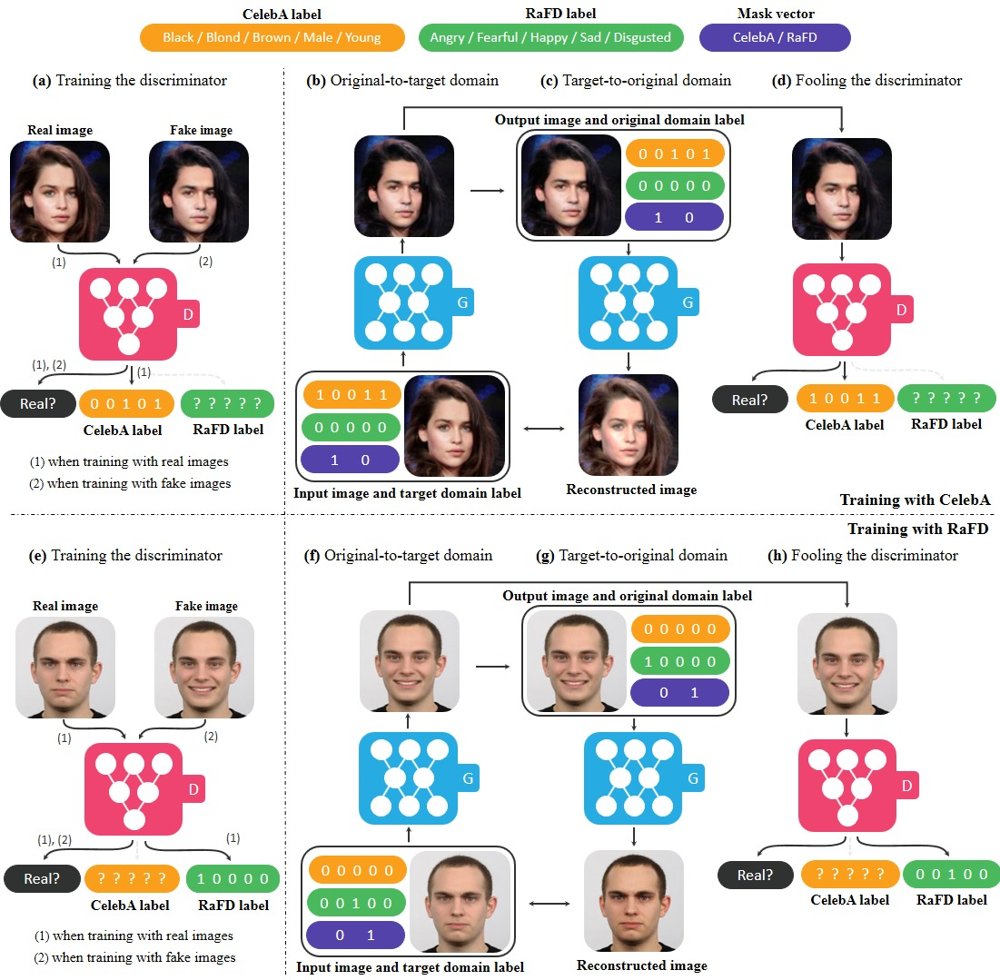

# StarGAN
Pix2Pix模型解决了Pair数据的图像翻译问题,CycleGAN解决了Unpaired数据的图像翻译问题.但无论是Pix2Pix还是CycleGAN,都是解决了一对一的问题,即一个领域到另一个领域的转换.当有很多领域要转换时,对于每一个领域转换,都需要重新训练一个模型去解决.这样的行为太低效了.本文所介绍的StarGAN就是将多领域转换用统一框架实现的算法,在同一种模型下,可以做多个图像翻译任务,比如更换头发颜色,更换表情,更换年龄等.[yunjey/StarGAN](https://github.com/yunjey/StarGAN)

如果只能训练一对一的图像翻译模型,会导致两个问题:

- 训练低效,每次训练耗时很大
- 训练效果有限,因为一个领域转换单独训练的话就不能利用其它领域的数据来增大泛化能力

为了解决多对多的图像翻译问题,StarGAN出现了.

## 模型框架
StarGAN,顾名思义,就是星形网络结构.在StarGAN中,生成网络G被实现成星形.如下图所示,左侧为普通的Pix2Pix模型要训练多对多模型时的做法,而右侧则是StarGAN的做法.可以看到,StarGAN仅仅需要一个G来学习所有领域对之间的转换.

## 网络结构
要想让G拥有学习多个领域转换的能力,需要对生成网络G和判别网络D做如下改动.

- 在G的输入中添加目标领域信息,即把图片翻译到哪个领域这个信息告诉生成模型
- D除了具有判断图片是否真实的功能外,还要有判断图片属于哪个类别的能力
- 除了上述两样以外,还需要保证图像翻译过程中图像内容要保存,只改变领域差异的那部分

## 目标函数
首先是GAN的通用函数,判断输出图像是否真实:

$$
\begin{aligned}
L_{adv} = \mathbb{E}_{x} [log D_{src}(x)] + \mathbb{E}_{x,c} [log (1 - D_{src} (G(x,c)))]
\end{aligned}
$$

其次是类别损失,该损失被分成两个:训练D的时候,使用真实图像在原始领域进行;训练G的时候,使用生成的图像在目标领域进行.

训练D的损失:

$$
\begin{aligned}
L^{r}_{cls} = \mathbb{E}_{x,c\prime} [-log D_{cls}(c\prime|x)]
\end{aligned}
$$

训练G的损失:

$$
\begin{aligned}
L^{f}_{cls} = \mathbb{E}_{x,c} [-log D_{cls}(c|G(x,c))]
\end{aligned}
$$

再次则是重建函数,重建函数与CycleGAN中的正向函数类似:

$$
\begin{aligned}
L_{rec} = \mathbb{E}_{x,c,c\prime} [ \lVert x - G(G(x,c),c\prime) \rVert_1 ]
\end{aligned}
$$

汇总后则是:

$$
\begin{aligned}
L_{D} = - L_{adv} + \lambda_{cls} L^{r}_{cls} \\
L_{G} = L_{adv} + \lambda_{cls} L^{f}_{cls} + \lambda_{rec} L_{rec}
\end{aligned}
$$

## 多数据集训练
在多数据集下训练StarGAN存在一个问题,那就是数据集之间的类别可能是不相交的,但内容可能是相交的.比如CelebA数据集合RaFD数据集,前者拥有很多肤色,年龄之类的类别.而后者拥有的是表情的类别.但前者的图像很多也是有表情的,这就导致前一类的图像在后一类的标记是不可知的.为了解决这个问题,在模型输入中加入了Mask,即如果来源于数据集B,那么将数据集A中的标记全部设为0.

## 参考资料:
- [StarGAN-多领域图像翻译](https://blog.csdn.net/stdcoutzyx/article/details/78829232)
- [StarGAN: Unified Generative Adversarial Networks for Multi-Domain Image-to-Image Translation](https://arxiv.org/abs/1711.09020v1)