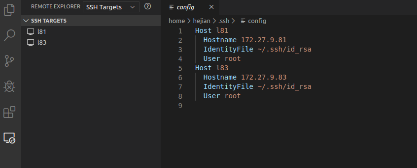

# VS Code

Pycharm的远程开发功能，同步服务器与本地的项目文件，使用远程解释器进行开发。但重量级的Pycharm每次远程同步、加载远程解释器都需要相当长的时间。如果我们想要随时切换公司、学校、家里的各个场景，Pycharm的同步、加载就成了一场噩梦。特别是当我们的Python环境安装了很多依赖包，项目生成了大量文件的时候更是这样。直到VS Code推出了Remote Development开发包，便完全解决了这个问题。让我可以在不同的场景快速切换，无需等待同步文件、环境。因为VS Code远程开发完全是运行在服务器上的，我们本地的VS Code只是一个前端界面，所以根本无需同步服务器上的文件、解释器依赖库就可以体验到与本地开发完全相同的体验。

## 安装VS Code
[官网](https://code.visualstudio.com/Download)提供了常见系统的二进制安装包，双击即可完成安装。

## 安装Python
`Ctrl+Shift+X`显示扩展试图，输入`Python`找到`Python and published by Microsoft`点击`Install`。然后，通过命令面板选择解释器，`Ctrl+Shift+P`输入`Python: Select Interpreter`，选择该命令。如果可用，还可以使用状态栏的`Select Python Environment`选项。（可能已经显示了选定的解释器）

## 安装Remote Development
安装完成后，VS Code左侧多出一个菜单栏，点击配置按钮配置远程服务器。



配置完成后，点击连接到远程的按钮。如果左下角显示了服务器名称，就说明连接成功了。连接成功后，可以在远程服务器上安装各种插件。这时，可能会提醒安装一些必要的插件。

## 子模块
方案1，通过软连接把子模块`module_base`变相添加到`PATH`：
```
ln -s module_base/pyhej pyhej
```

方案2，`site-packages`是第三方包和模块安装的目录，创建`*.pth`文件：
```
# anaconda3/lib/python3.7/site-packages/temp.pth
/data2/gits/vs_code/module_a
/data2/gits/vs_code/module_b
```

>每行包含一个单独的路径，将被添加到`sys.path`列表中。

## Settings
菜单`File > Preferences > Settings`打开设置。

### base
`editor.renderWhitespace`控制空白符的渲染方式，个人偏好是`selection`；`editor.wordWrap`控制如何换行，个人偏好是`on`，依据可视区域宽度。

### formatting
这里以Python为例。定位`python.formatting.provider`指定要使用的格式化程序，默认设置`autopep8`。自定义参数`python.formatting.autopep8Args`，每个参数都是数组中的单独项，比如`--max-line-length 120`，会添加两项`--max-line-length`和`120`。每次的手动格式化是很枯燥的，比较优雅的方式是在设置中勾选`Text Editor > Formatting > Format On Save`，这样每次保存的时候会自动执行格式化操作。

## 快捷键
- `Ctrl+Shift+~`：创建新的集成终端
- `Ctrl+Shift+P`：打开命令面板
- `Ctrl+Shift+X`：打开扩展试图

## 参考资料：
- [Getting Started with Python in VS Code](https://code.visualstudio.com/docs/python/python-tutorial)
- [Visual Studio Code Tips and Tricks](https://code.visualstudio.com/docs/getstarted/tips-and-tricks)