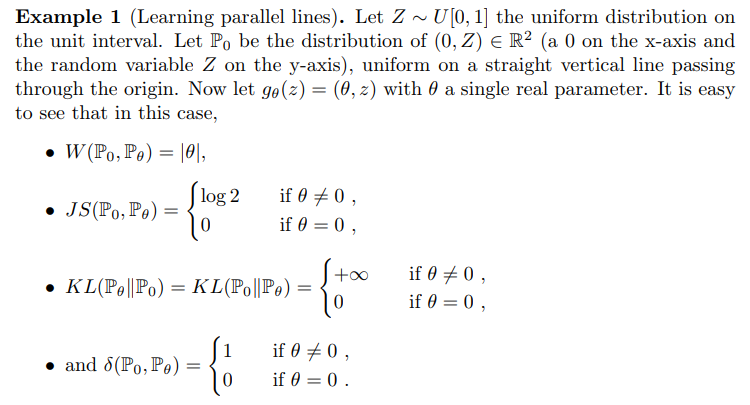
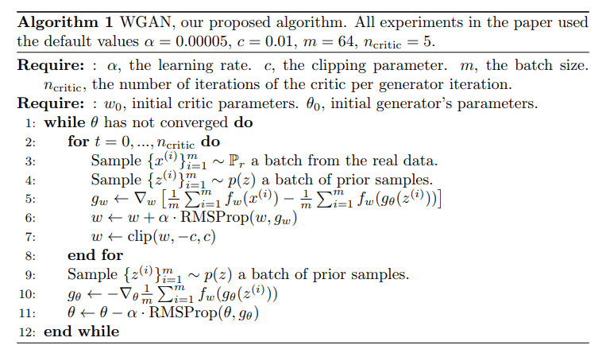
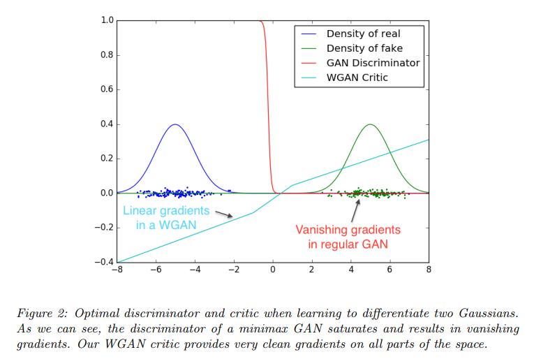

# https://arxiv.org/abs/1701.07875v3
Wasserstein GAN, and [Wasserstein GAN and the Kantorovich-Rubinstein Duality](https://vincentherrmann.github.io/blog/wasserstein/)

## Introduction
The problem this paper is concerned with is that of unsupervised learning. Mainly, what does it mean to learn a probability distribution? The classical answer to this is to learn a probability density. This is often done by defining a parametric family of densities `(P_{\theta})_{\theta \in R^d}` and finding the one that maximized the likelihood on our data: if we have real data examples `{x^{(i)}}_{i=1}^{m}`, we would solve the problem

$$
\begin{aligned}
\max_{\theta \in R^d} \frac{1}{m} \sum_{i=1}^{m} \log P_{\theta}(x^{(i)})
\end{aligned}
$$

本文所关注的问题是无监督学习。主要是，学习概率分布意味着什么？对此的经典答案是学习概率密度。这通常是通过定义一个参数族密度`(P_{\theta})_{\theta \in R^d}`并找到最大化我们数据可能性的那个：如果我们有真实的数据示例`{x^{(i)}}_{i=1}^{m}`，我们会解决问题

If the real data distribution `P_r` admits a density and `P_{\theta}` is the distribution of the parametrized density `P_{\theta}`, then, asymptotically, this amounts to minimizing the Kullback-Leibler divergence `KL(P_r|P_{\theta})`.

如果真实数据分布`P_r`允许密度并且`P_{\theta}`是参数化密度`P_{\theta}`的分布，则渐近地，这相当于最小化Kullback-Leibler散度`KL(P_r|P_{\theta})`。

For this to make sense, we need the model density `P_{\theta}` to exist. This is not the case in the rather common situation where we are dealing with distributions supported by low dimensional manifolds. It is then unlikely that the model manifold and the true distribution’s support have a non-negligible intersection (see [1]), and this means that the KL distance is not defined (or simply infinite).

为此，我们需要存在模型密度`P_{\theta}`。在我们处理低维流形支持的分布的相当普遍的情况下，情况并非如此。然后，模型流形和真实分布的支持不可能具有不可忽略的交集（参见[1]），这意味着KL距离未定义（或简单地无限）。

The typical remedy is to add a noise term to the model distribution. This is why virtually all generative models described in the classical machine learning literature include a noise component. In the simplest case, one assumes a Gaussian noise with relatively high bandwidth in order to cover all the examples. It is well known, for instance, that in the case of image generation models, this noise degrades the quality of the samples and makes them blurry. For example, we can see in the recent paper [23] that the optimal standard deviation of the noise added to the model when maximizing likelihood is around 0.1 to each pixel in a generated image, when the pixels were already normalized to be in the range [0, 1]. This is a very high amount of noise, so much that when papers report the samples of their models, they don’t add the noise term on which they report likelihood numbers. In other words, the added noise term is clearly incorrect for the problem, but is needed to make the maximum likelihood approach work.

典型的补救措施是在模型分布中添加噪声项。这就是为什么在经典机器学习文献中描述的几乎所有生成模型都包括噪声分量。在最简单的情况下，假设具有相对高带宽的高斯噪声以覆盖所有示例。例如，众所周知，在图像生成模型的情况下，这种噪声会降低样本的质量并使其模糊。例如，我们可以在最近的论文[23]中看到，当像素已被标准化为在范围`[0,1]`内时，当生成似然时最大似然性时添加到模型的噪声的最佳标准偏差约为每个像素的0.1。这是一个非常大量的噪音，当论文报告他们的模型样本时，他们不会添加他们报告似然数的噪音项。换句话说，增加的噪声项对于问题显然是不正确的，但需要使最大似然方法起作用。

Rather than estimating the density of `P_r` which may not exist, we can define a random variable `\mathcal{Z}` with a fixed distribution `p(z)` and pass it through a parametric function `g_{\theta} : \mathcal{Z} \to \mathcal{X}` (typically a neural network of some kind) that directly generates samples following a certain distribution `P_{\theta}`. By varying `\theta`, we can change this distribution and make it close to the real data distribution `P_r`. This is useful in two ways. First of all, unlike densities, this approach can represent distributions confined to a low dimensional manifold. Second, the ability to easily generate samples is often more useful than knowing the numerical value of the density (for example in image superresolution or semantic segmentation when considering the conditional distribution of the output image given the input image). In general, it is computationally difficult to generate samples given an arbitrary high dimensional density [16].

我们可以定义一个随机变量`\mathcal{Z}`而不是估计可能不存在的`P_r`的密度，而是通过参数函数`g_{\theta} ：\mathcal{Z} \to \mathcal{X}`（通常是某种类型的神经网络）来传递它，它按照特定的分布`P_{\theta}`直接生成样本。通过改变`\theta`，我们可以改变这种分布并使其接近真实的数据分布`P_r`。这在两个方面很有用。首先，与密度不同，这种方法可以表示局限于低维流形的分布。其次，容易生成样本的能力通常比知道密度的数值更有用（例如，在考虑给定输入图像的输出图像的条件分布时，在图像超分辨率或语义分割中）。通常，在给定任意高维密度的情况下生成样本在计算上是困难的[16]。

Variational Auto-Encoders (VAEs) [9] and Generative Adversarial Networks (GANs) [4] are well known examples of this approach. Because VAEs focus on the approximate likelihood of the examples, they share the limitation of the standard models and need to fiddle with additional noise terms. GANs offer much more flexibility in the definition of the objective function, including Jensen-Shannon [4], and all f-divergences [17] as well as some exotic combinations [6]. On the other hand, training GANs is well known for being delicate and unstable, for reasons theoretically investigated in [1].

变分自动编码器（VAE）[9]和生成性对抗网络（GAN）[4]是这种方法的众所周知的例子。由于VAE关注的是示例的近似可能性，因此它们共享标准模型的局限性，需要摆弄额外的噪声项。GAN在目标函数的定义方面提供了更大的灵活性，包括Jensen-Shannon [4]和所有f-divergences [17]以及一些奇异组合[6]。另一方面，由于[1]中理论上研究的原因，训练GAN以其微妙和不稳定而众所周知。

In this paper, we direct our attention on the various ways to measure how close the model distribution and the real distribution are, or equivalently, on the various ways to define a distance or divergence `\rho(P_{\theta}, P_r)`. The most fundamental difference between such distances is their impact on the convergence of sequences of probability distributions. A sequence of distributions `(P_t)_{t \in N}` converges if and only if there is a distribution `P_{\infty}` such that `\rho(P_t, P_{\infty})` tends to zero, something that depends on how exactly the distance `\rho` is defined. Informally, a distance `\rho` induces a weaker topology when it makes it easier for a sequence of distribution to converge. Section 2 clarifies how popular probability distances differ in that respect.

在本文中，我们将注意力集中在各种方法上，以衡量模型分布与实际分布的接近程度，或等效地，定义距离或分歧的各种方式`\rho(P_{\theta}, P_r)`。这些距离之间最根本的区别在于它们对概率分布序列的收敛性的影响。当且仅当存在分布`P_{\infty}`使得`\rho(P_t, P_{\infty})`趋于零时，分布序列`(P_t)_{t \in N}`收敛，这取决于距离`\rho`的确切定义。非正式地，距离`\rho`会导致较弱的拓扑结构，这使得分布序列更容易收敛。第2节阐明了受欢迎的概率距离在这方面的差异。

In order to optimize the parameter `\theta`, it is of course desirable to define our model distribution `P_{\theta}` in a manner that makes the mapping `\theta \to P_{\theta}` continuous. Continuity means that when a sequence of parameters `\theta_t` converges to `\theta`, the distributions `P_{\theta_t}` also converge to `P_{\theta}`. However, it is essential to remember that the notion of the convergence of the distributions `P_{\theta_t}` depends on the way we compute the distance between distributions. The weaker this distance, the easier it is to define a continuous mapping from `\theta` space to `P_{\theta}` space, since it’s easier for the distributions to converge. The main reason we care about the mapping `\theta \to P_{\theta}` to be continuous is as follows. If `\rho` is our notion of distance between two distributions, we would like to have a loss function `\theta \to \rho(P_{\theta}, P_r)` that is continuous, and this is equivalent to having the mapping `\theta \to P_{\theta}` be continuous when using the distance between distributions `\rho`.

为了优化参数`\theta`，当然希望以一种使映射`\theta \to P_{\theta}`连续的方式定义我们的模型分布`P_{\theta}`。连续性意味着当一系列参数`\theta_t`收敛于`\theta`时，分布`P_{\theta_t}`也会收敛到`P_{\theta}`。但是，必须记住，分布`P_{\theta_t}`的收敛概念取决于我们计算分布之间距离的方式。这个距离越弱，就越容易定义从`\theta`空间到`P_{\theta}`空间的连续映射，因为分布更容易收敛。我们关心将`\theta \to P_{\theta}`映射为连续的主要原因如下。如果`\rho`是我们两个分布之间的距离概念，我们希望有一个连续的损失函数`\theta \to \rho(P_{\theta}, P_r)`，这相当于拥有当使用分布`\rho`之间的距离时，将`\theta \to P_{\theta}`是连续的。

## Different Distances
We now introduce our notation. Let `\mathcal{X}` be a compact metric set (such as the space of images `[0, 1]^d`) and let `\sum` denote the set of all the Borel subsets of `\mathcal{X}`. Let `Prob(\mathcal{X})` denote the space of probability measures defined on `\mathcal{X}`. We can now define elementary distances and divergences between two distributions `P_r, P_g \in Prob(\mathcal{X})`:

我们现在介绍我们的符号。设`\mathcal{X}`是一个紧凑的度量集（例如图像的空间`[0,1]^d`），让`\sum`表示`\mathcal{X}`的所有Borel子集的集合。让`Prob(\mathcal{X})`表示在`\mathcal{X}`上定义的概率测量的空间。我们现在可以定义两个分布之间的基本距离和差异`P_r, P_g \in Prob(\mathcal{X})`：

- The Total Variation (TV) distance
$$
\begin{aligned}
\delta(P_r, P_g) = \sup_{A \in \sum} | P_r(A) - P_g(A) |
\end{aligned}
$$
- The Kullback-Leibler (KL) divergence
$$
\begin{aligned}
KL(P_r|P_g) = \int \log (\frac{P_r(x)}{P_g(x)}) P_r(x) \, d\mu(x)
\end{aligned}
$$
    where both `P_r` and `P_g` are assumed to be absolutely continuous, and therefore admit densities, with respect to a same measure `\mu` defined on `\mathcal{X}`. The KL divergence is famously assymetric and possibly infinite when there are points such that `P_g(x)=0` and `P_r(x)>0`.
    假设`P_r`和`P_g`都是绝对连续的，因此允许密度，相对于`\mathcal{X}`上定义的相同度量`\mu`。当存在诸如`P_g(x)=0`和`P_r(x)>0`的点时，KL分歧是着名的不对称的并且可能是无限的。
- The Jensen-Shannon (JS) divergence
$$
\begin{aligned}
JS(P_r,P_g) = KL(P_r|P_m) + KL(P_g|P_m)
\end{aligned}
$$
    where `P_m` is the mixture `(P_r+P_g)/2`. This divergence is symmetrical and always defined because we can choose `\mu=Pm`.
    其中`P_m`是混合`(P_r+P_g)/2`。这种分歧是对称的并且总是被定义，因为我们可以选择`\mu=Pm`。
- The Earth-Mover (EM) distance or Wasserstein-1
$$
\begin{aligned}
W(P_r,P_g) = \inf_{\gamma \in \Pi(P_r,P_g)} \mathit{E}_{(x,y) \sim \gamma} [ \| x-y \| ]
\end{aligned}
$$
    where `\Pi(P_r,P_g)` denotes the set of all joint distributions `\gamma(x,y)` whose marginals are respectively `P_r` and `P_g`. Intuitively, `\gamma(x,y)` indicates how much “mass” must be transported from `x` to `y` in order to transform the distributions `P_r` into the distribution `P_g`. The EM distance then is the “cost” of the optimal transport plan.
    其中`\Pi(P_r,P_g)`表示所有联合分布的集合`\gamma(x,y)`，其边缘分别为`P_r`和`P_g`。直观地，`\gamma(x,y)`表示必须将“质量”从`x`传输到`y`多少才能将分布`P_r`转换为分布`P_g`。然后，EM距离是最佳运输计划的“成本”。

The following example illustrates how apparently simple sequences of probability distributions converge under the EM distance but do not converge under the other distances and divergences defined above.

以下示例说明了概率分布的简单序列如何在EM距离下收敛但不会收敛于上面定义的其他距离和差异。[阅读论文,更多例子](https://arxiv.org/pdf/1701.07875v3.pdf)

## Wasserstein GAN

The fact that the EM distance is continuous and differentiable a.e. means that we can (and should) train the critic till optimality. The argument is simple, the more we train the critic, the more reliable gradient of the Wasserstein we get, which is actually useful by the fact that Wasserstein is differentiable almost everywhere. For the JS, as the discriminator gets better the gradients get more reliable but the true gradient is 0 since the JS is locally saturated and we get vanishing gradients, as can be seen in Figure 1 of this paper and Theorem 2.4 of [1]. In Figure 2 we show a proof of concept of this, where we train a GAN discriminator and a WGAN critic till optimality. The discriminator learns very quickly to distinguish between fake and real, and as expected provides no reliable gradient information. The critic, however, can’t saturate, and converges to a linear function that gives remarkably clean gradients everywhere. The fact that we constrain the weights limits the possible growth of the function to be at most linear in different parts of the space, forcing the optimal critic to have this behaviour.

EM距离连续且可微分的事实a.e。意味着我们可以（并且应该）训练批评者直到最优。论证很简单，我们训练批评者的次数越多，我们得到的Wasserstein的梯度就越可靠，这实际上是因为Wasserstein几乎无处不在。对于JS，随着鉴别器变得更好，梯度变得更可靠，但真正的梯度为0，因为JS局部饱和并且我们得到消失的梯度，如本文的图1和[1]的定理2.4所示。在图2中，我们展示了这一概念的证明，其中我们训练GAN鉴别器和WGAN评论家直到最优。鉴别器学得很快以区分假和真实，并且如预期的那样不提供可靠的梯度信息。然而，评论家不能饱和，并且收敛于线性函数，在任何地方都给出了非常干净的渐变。我们约束权重的事实限制了函数的可能增长在空间的不同部分中最多线性，迫使最优评论者具有这种行为。

Perhaps more importantly, the fact that we can train the critic till optimality makes it impossible to collapse modes when we do. This is due to the fact that mode collapse comes from the fact that the optimal generator for a fixed discriminator is a sum of deltas on the points the discriminator assigns the highest values, as observed by [4] and highlighted in [11].

也许更重要的是，我们可以训练评论家直到达到最优状态，这样我们就无法崩溃模式。这是因为模式崩溃来自这样一个事实，即固定鉴别器的最佳发生器是鉴别器分配最高值的点上的增量之和，如[4]所示并在[11]中强调。

In the following section we display the practical benefits of our new algorithm, and we provide an in-depth comparison of its behaviour and that of traditional GANs.

在下一节中，我们将展示新算法的实际优势，并对其行为与传统GAN的行为进行深入比较。

## Empirical Results
We run experiments on image generation using our Wasserstein-GAN algorithm and show that there are significant practical benefits to using it over the formulation used in standard GANs.

我们使用我们的Wasserstein-GAN算法进行图像生成实验，并表明使用它比标准GAN中使用的配方有显着的实际好处。

We claim two main benefits:

- a meaningful loss metric that correlates with the generator’s convergence and sample quality
- improved stability of the optimization process

我们声称有两个主要好处：

- 一个有意义的损失度量，与生成器的收敛和样本质量相关
- 提高了优化过程的稳定性

## Notes
本质上,JS散度给出了概率分布`P_r,P_g`之间的差异程度,亦即概率分布间的度量.我们可以用其他的度量来替换JS散度.Wasserstein距离就是一个好的选择,因为即便`P_r,P_g`的支撑集合(support)交集为零测度,它们之间的Wasserstein距离依然非零.这样,我们就得到了Wasserstein GAN的模式.Wasserstein距离的好处在于即便`P_r,P_g`两个分布之间没有重叠,Wasserstein距离依然能够度量它们的远近.你也许想要使用Wasserstein GAN,如果:

- 你正在寻找具有最高训练稳定性的最先进的GAN
- 你想要一个有信息量的可解释的损失函数

## Wasserstein距离
???