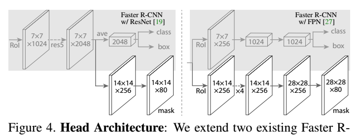

# https://arxiv.org/abs/1703.06870v3
Mask R-CNN

We present a conceptually simple, flexible, and general framework for object instance segmentation. Our approach efficiently detects objects in an image while simultaneously generating a high-quality segmentation mask for each instance. The method, called Mask R-CNN, extends Faster R-CNN by adding a branch for predicting an object mask in parallel with the existing branch for bounding box recognition. Mask R-CNN is simple to train and adds only a small overhead to Faster R-CNN, running at 5 fps. Moreover, Mask R-CNN is easy to generalize to other tasks, e.g., allowing us to estimate human poses in the same framework. We show top results in all three tracks of the COCO suite of challenges, including instance segmentation, boundingbox object detection, and person keypoint detection. Without bells and whistles, Mask R-CNN outperforms all existing, single-model entries on every task, including the COCO 2016 challenge winners. We hope our simple and effective approach will serve as a solid baseline and help ease future research in instance-level recognition. Code has been made available at: https://github.com/facebookresearch/Detectron.

我们提出了一个概念上简单，灵活，通用的对象实例分割框架。我们的方法有效地检测图像中的对象，同时为每个实例生成高质量的分割掩码。该方法称为Mask R-CNN，通过添加用于预测与现有分支并行的对象掩码的分支来扩展Faster R-CNN以用于边界框识别。Mask R-CNN易于训练，只需增加很少的开销到Faster R-CNN，运行速度为5fps。此外，Mask R-CNN很容易推广到其他任务，例如，允许我们在同一框架中估计人体姿势。我们在COCO挑战套件的所有三个轨道中展示了最佳结果，包括实例分割，边界框对象检测和人员关键点检测。没有花里胡哨，Mask R-CNN在每项任务中都优于所有现有的单一模型，包括COCO 2016挑战赛冠军。我们希望我们简单有效的方法将成为一个坚实的基线，并有助于简化未来在实例级认可方面的研究。代码已在以下网址获得：https://github.com/facebookresearch/Detectron。

## 1 Introduction
The vision community has rapidly improved object detection and semantic segmentation results over a short period of time. In large part, these advances have been driven by powerful baseline systems, such as the Fast/Faster RCNN [12, 36] and Fully Convolutional Network (FCN) [30] frameworks for object detection and semantic segmentation, respectively. These methods are conceptually intuitive and offer flexibility and robustness, together with fast training and inference time. Our goal in this work is to develop a comparably enabling framework for instance segmentation.

视觉社区在短时间内迅速改进了对象检测和语义分割结果。在很大程度上，这些进步是由强大的基线系统驱动的，例如Fast/Faster RCNN [12,36]和完全卷积网络（FCN）[30]框架分别用于对象检测和语义分割。这些方法在概念上是直观的，并提供灵活性和稳健性，以及快速的培训和推理时间。我们在这项工作中的目标是为实例细分开发一个可比较的支持框架。

Instance segmentation is challenging because it requires the correct detection of all objects in an image while also precisely segmenting each instance. It therefore combines elements from the classical computer vision tasks of object detection, where the goal is to classify individual objects and localize each using a bounding box, and semantic segmentation, where the goal is to classify each pixel into a fixed set of categories without differentiating object instances. Given this, one might expect a complex method is required to achieve good results. However, we show that a surprisingly simple, flexible, and fast system can surpass prior state-of-the-art instance segmentation results.

实例分割具有挑战性，因为它需要正确检测图像中的所有对象，同时还要精确地分割每个实例。因此，它结合了来自对象检测的经典计算机视觉任务的元素，其目标是对各个对象进行分类并使用边界框对每个对象进行定位，以及语义分割，其目标是将每个像素分类为固定的一组类别而不区分对象实例。鉴于此，人们可能期望需要一种复杂的方法来获得良好的结果。然而，我们表明，一个令人惊讶的简单，灵活和快速的系统可以超越先前的最新实例分割结果。

Our method, called Mask R-CNN, extends Faster R-CNN [36] by adding a branch for predicting segmentation masks on each Region of Interest (RoI), in parallel with the existing branch for classification and bounding box regression (Figure 1). The mask branch is a small FCN applied to each RoI, predicting a segmentation mask in a pixel-to-pixel manner. Mask R-CNN is simple to implement and train given the Faster R-CNN framework, which facilitates a wide range of flexible architecture designs. Additionally, the mask branch only adds a small computational overhead, enabling a fast system and rapid experimentation.

我们的方法称为Mask R-CNN，通过添加一个分支来预测每个感兴趣区域（RoI）上的分割掩码，与现有分支并行进行分类和边界框回归，扩展了Faster R-CNN [36]（图1）。掩模分支是应用于每个RoI的小FCN，以像素到像素方式预测分割掩模。Mask R-CNN易于实现和训练，因为它提供了Faster R-CNN框架，这有助于广泛的灵活架构设计。此外，掩码分支仅增加了小的计算开销，从而实现了快速系统和快速实验。

In principle Mask R-CNN is an intuitive extension of Faster R-CNN, yet constructing the mask branch properly is critical for good results. Most importantly, Faster RCNN was not designed for pixel-to-pixel alignment between network inputs and outputs. This is most evident in how RoIPool [18, 12], the de facto core operation for attending to instances, performs coarse spatial quantization for feature extraction. To fix the misalignment, we propose a simple, quantization-free layer, called RoIAlign, that faithfully preserves exact spatial locations. Despite being a seemingly minor change, RoIAlign has a large impact: it improves mask accuracy by relative 10% to 50%, showing bigger gains under stricter localization metrics. Second, we found it essential to decouple mask and class prediction: we predict a binary mask for each class independently, without competition among classes, and rely on the network’s RoI classification branch to predict the category. In contrast, FCNs usually perform per-pixel multi-class categorization, which couples segmentation and classification, and based on our experiments works poorly for instance segmentation.

原则上，Mask R-CNN是Faster R-CNN的直观扩展，但正确构建掩模分支对于获得良好结果至关重要。最重要的是，Faster RCNN不是为网络输入和输出之间的像素到像素对齐而设计的。这在RoIPool [18,12]（参与实例的事实上的核心操作）如何为特征提取执行粗略空间量化方面最为明显。为了解决这个错位，我们提出了一个简单的，无量化的层，称为RoIAlign，忠实地保留了精确的空间位置。尽管看似微小的变化，但RoIAlign的影响很大：它将掩模精度提高了10％到50％，在更严格的本地化指标下显示出更大的收益。其次，我们发现分离掩码和类预测是必不可少的：我们独立地预测每个类的二进制掩码，没有类之间的竞争，并依赖于网络的RoI分类分支来预测类别。相比之下，FCN通常执行逐像素多类别分类，其结合分割和分类，并且基于我们的实验，例如分割效果不佳。

Without bells and whistles, Mask R-CNN surpasses all previous state-of-the-art single-model results on the COCO instance segmentation task [28], including the heavilyengineered entries from the 2016 competition winner. As a by-product, our method also excels on the COCO object detection task. In ablation experiments, we evaluate multiple basic instantiations, which allows us to demonstrate its robustness and analyze the effects of core factors.

没有花里胡哨，Mask R-CNN在COCO实例分割任务[28]上超越了所有先前最先进的单一模型结果，包括来自2016年竞赛获胜者的重度工程条目。作为副产品，我们的方法也擅长COCO对象检测任务。在消融实验中，我们评估了多个基本实例，这使我们能够证明其稳健性并分析核心因素的影响。

Our models can run at about 200ms per frame on a GPU, and training on COCO takes one to two days on a single 8-GPU machine. We believe the fast train and test speeds, together with the framework’s flexibility and accuracy, will benefit and ease future research on instance segmentation.

我们的模型可以在GPU上以每帧大约200ms的速度运行，而COCO上的培训在单个8-GPU机器上需要一到两天。我们相信快速训练和测试速度以及框架的灵活性和准确性将有利于并简化未来对实例分割的研究。

Finally, we showcase the generality of our framework via the task of human pose estimation on the COCO keypoint dataset [28]. By viewing each keypoint as a one-hot binary mask, with minimal modification Mask R-CNN can be applied to detect instance-specific poses. Mask R-CNN surpasses the winner of the 2016 COCO keypoint competition, and at the same time runs at 5 fps. Mask R-CNN, therefore, can be seen more broadly as a flexible framework for instance-level recognition and can be readily extended to more complex tasks.

最后，我们通过COCO关键点数据集上的人体姿态估计任务展示了我们框架的一般性[28]。通过将每个关键点视为单热二进制掩码，通过最小的修改，可以应用掩码R-CNN来检测特定于实例的姿势。Mask R-CNN超越2016年COCO关键点竞赛的冠军，同时以5 fps的速度运行。因此，掩模R-CNN可以更广泛地被视为用于实例级识别的灵活框架，并且可以容易地扩展到更复杂的任务。

We have released code to facilitate future research.

我们已经发布了代码以促进未来的研究。

## 2 Related Work
R-CNN: The Region-based CNN (R-CNN) approach [13] to bounding-box object detection is to attend to a manageable number of candidate object regions [42, 20] and evaluate convolutional networks [25, 24] independently on each RoI. R-CNN was extended [18, 12] to allow attending to RoIs on feature maps using RoIPool, leading to fast speed and better accuracy. Faster R-CNN [36] advanced this stream by learning the attention mechanism with a Region Proposal Network (RPN). Faster R-CNN is flexible and robust to many follow-up improvements (e.g., [38, 27, 21]), and is the current leading framework in several benchmarks.

R-CNN：基于区域的CNN（R-CNN）方法[13]用于边界框对象检测是为了处理可管理数量的候选对象区域[42,20]并独立评估卷积网络[25,24]在每个RoI上。R-CNN被扩展[18,12]以允许使用RoIPool在特征地图上参与RoI，从而实现更快的速度和更高的准确性。Faster R-CNN[36]通过学习区域提议网络（RPN）的注意机制来推进这一流。Faster R-CNN对于许多后续改进（例如，[38,27,21]）是灵活且稳健的，并且是若干基准中的当前领先框架。

Instance Segmentation: Driven by the effectiveness of RCNN, many approaches to instance segmentation are based on segment proposals. Earlier methods [13, 15, 16, 9] resorted to bottom-up segments [42, 2]. DeepMask [33] and following works [34, 8] learn to propose segment candidates, which are then classified by Fast R-CNN. In these methods, segmentation precedes recognition, which is slow and less accurate. Likewise, Dai et al. [10] proposed a complex multiple-stage cascade that predicts segment proposals from bounding-box proposals, followed by classification. Instead, our method is based on parallel prediction of masks and class labels, which is simpler and more flexible.

实例分割：受RCNN有效性的驱动，许多实例分割方法都基于分段提案。早期的方法[13,15,16,9]采用自下而上的方法[42,2]。DeepMask[33]及其后的作品[34,8]学会提出片段候选，然后通过Fast R-CNN进行分类。在这些方法中，分割先于识别，这是缓慢且不太准确的。同样，戴等人。[10]提出了一个复杂的多阶段级联，它从边界框提议中预测分段提议，然后进行分类。相反，我们的方法基于掩模和类标签的并行预测，这更简单，更灵活。

Most recently, Li et al. [26] combined the segment proposal system in [8] and object detection system in [11] for “fully convolutional instance segmentation” (FCIS). The common idea in [8, 11, 26] is to predict a set of positionsensitive output channels fully convolutionally. These channels simultaneously address object classes, boxes, and masks, making the system fast. But FCIS exhibits systematic errors on overlapping instances and creates spurious edges (Figure 6), showing that it is challenged by the fundamental difficulties of segmenting instances.

最近，李等人。[26]将[8]中的分段建议系统和[11]中的目标检测系统结合起来，用于“完全卷积实例分割”（FCIS）。[8,11,26]中的常见想法是完全卷积预测一组位置敏感输出通道。这些通道同时处理对象类，框和掩码，使系统快速。但FCIS在重叠实例上表现出系统性错误并产生虚假边缘（图6），表明它受到分割实例的基本困难的挑战。

Another family of solutions [23, 4, 3, 29] to instance segmentation are driven by the success of semantic segmentation. Starting from per-pixel classification results (e.g., FCN outputs), these methods attempt to cut the pixels of the same category into different instances. In contrast to the segmentation-first strategy of these methods, Mask R-CNN is based on an instance-first strategy. We expect a deeper incorporation of both strategies will be studied in the future.

实例分割的另一系列解决方案[23,4,3,29]由语义分割的成功驱动。从每像素分类结果（例如，FCN输出）开始，这些方法试图将相同类别的像素切割成不同的实例。与这些方法的分段优先策略相比，Mask R-CNN基于实例优先策略。我们预计未来将研究两种策略的更深层次结合。

## 3 Mask R-CNN
Mask R-CNN is conceptually simple: Faster R-CNN has two outputs for each candidate object, a class label and a bounding-box offset; to this we add a third branch that outputs the object mask. Mask R-CNN is thus a natural and intuitive idea. But the additional mask output is distinct from the class and box outputs, requiring extraction of much finer spatial layout of an object. Next, we introduce the key elements of Mask R-CNN, including pixel-to-pixel alignment, which is the main missing piece of Fast/Faster R-CNN.

Mask R-CNN在概念上很简单：Faster R-CNN为每个候选对象提供两个输出，一个类标签和一个边界框偏移;为此，我们添加了第三个输出对象掩码的分支。因此，Mask R-CNN是一种自然而直观的想法。但是额外的掩码输出与类和框输出不同，需要提取对象的更精细的空间布局。接下来，我们介绍Mask R-CNN的关键元素，包括像素到像素的对齐，这是Fast/Faster R-CNN的主要缺失部分。

Faster R-CNN: We begin by briefly reviewing the Faster R-CNN detector [36]. Faster R-CNN consists of two stages. The first stage, called a Region Proposal Network (RPN), proposes candidate object bounding boxes. The second stage, which is in essence Fast R-CNN [12], extracts features using RoIPool from each candidate box and performs classification and bounding-box regression. The features used by both stages can be shared for faster inference. We refer readers to [21] for latest, comprehensive comparisons between Faster R-CNN and other frameworks.

Faster R-CNN：我们首先简要回顾一下Faster R-CNN探测器[36]。Faster R-CNN包括两个阶段。第一阶段称为区域提议网络（RPN），提出候选对象边界框。第二阶段，实质上是Fast R-CNN[12]，从每个候选框中使用RoIPool提取特征，并执行分类和边界框回归。可以共享两个阶段使用的功能，以便更快地推断。我们向读者推荐[21]，以便在Faster R-CNN和其他框架之间进行最新，全面的比较。

Mask R-CNN: Mask R-CNN adopts the same two-stage procedure, with an identical first stage (which is RPN). In the second stage, in parallel to predicting the class and box offset, Mask R-CNN also outputs a binary mask for each RoI. This is in contrast to most recent systems, where classification depends on mask predictions (e.g. [33, 10, 26]). Our approach follows the spirit of Fast R-CNN [12] that applies bounding-box classification and regression in parallel (which turned out to largely simplify the multi-stage pipeline of original R-CNN [13]).

Mask R-CNN：Mask R-CNN采用相同的两阶段过程，具有相同的第一阶段（即RPN）。在第二阶段，与预测类和盒偏移并行，Mask R-CNN还为每个RoI输出二进制掩码。这与最近的系统形成对比，其中分类取决于掩模预测（例如[33,10,26]）。我们的方法遵循Fast R-CNN[12]的精神，它并行应用边界框分类和回归（结果大大简化了原始R-CNN的多阶段流水线[13]）。

Formally, during training, we define a multi-task loss on each sampled RoI as `L = Lcls + Lbox + Lmask`. The classification loss `Lcls` and bounding-box loss `Lbox` are identical as those defined in [12]. The mask branch has a `Km^2`-dimensional output for each RoI, which encodes `K` binary masks of resolution `m × m`, one for each of the `K` classes. To this we apply a per-pixel sigmoid, and define `Lmask` as the average binary cross-entropy loss. For an RoI associated with ground-truth class `k`, `Lmask` is only defined on the `k-th` mask (other mask outputs do not contribute to the loss).

正式地，在训练期间，我们将每个采样的RoI上的多任务损失定义为`L = Lcls + Lbox + Lmask`。分类损失`Lcls`和边界框损失“Lbox”与[12]中定义的相同。掩码分支对于每个RoI具有`Km^2`维输出，其编码分辨率为`m×m`的`K`二元掩模，每类一个。为此，我们应用每像素`sigmoid`，并将`Lmask`定义为平均二元交叉熵损失。对于与`ground-truth`类`k`相关联的RoI，`Lmask`仅在第`k`个掩模上定义（其他掩模输出不会导致损失）。

Our definition of `Lmask` allows the network to generate masks for every class without competition among classes; we rely on the dedicated classification branch to predict the class label used to select the output mask. This decouples mask and class prediction. This is different from common practice when applying FCNs [30] to semantic segmentation, which typically uses a per-pixel softmax and a multinomial cross-entropy loss. In that case, masks across classes compete; in our case, with a per-pixel sigmoid and a binary loss, they do not. We show by experiments that this formulation is key for good instance segmentation results.

我们对`Lmask`的定义允许网络为每个类生成掩码而不会在类之间进行竞争;我们依靠专用的分类分支来预测用于选择输出掩码的类标签。这解耦了掩码和类预测。这与将FCN[30]应用于语义分割时的常规做法不同，后者通常使用每像素`softmax`和多项交叉熵损失。在这种情况下，各类的面具竞争;在我们的例子中，每像素`sigmoid`和二分类丢失，他们没有。我们通过实验表明，该公式是良好实例分割结果的关键。

Mask Representation: A mask encodes an input object’s spatial layout. Thus, unlike class labels or box offsets that are inevitably collapsed into short output vectors by fully-connected (fc) layers, extracting the spatial structure of masks can be addressed naturally by the pixel-to-pixel correspondence provided by convolutions.

掩码表示：掩码编码输入对象的空间布局。因此，与通过完全连接（fc）层不可避免地折叠成短输出矢量的类标签或盒偏移不同，提取掩模的空间结构可以通过由卷积提供的像素到像素的对应自然地解决。

Specifically, we predict an `m × m` mask from each RoI using an FCN [30]. This allows each layer in the mask branch to maintain the explicit `m × m` object spatial layout without collapsing it into a vector representation that lacks spatial dimensions. Unlike previous methods that resort to fc layers for mask prediction [33, 34, 10], our fully convolutional representation requires fewer parameters, and is more accurate as demonstrated by experiments.

具体来说，我们使用FCN预测每个RoI的`m×m`掩模[30]。这允许掩模分支中的每个层保持显式的`m×m`对象空间布局，而不将其折叠成缺少空间维度的矢量表示。与先前使用fc层进行掩模预测[33,34,10]的方法不同，我们的完全卷积表示需要更少的参数，并且通过实验证明更准确。

This pixel-to-pixel behavior requires our RoI features, which themselves are small feature maps, to be well aligned to faithfully preserve the explicit per-pixel spatial correspondence. This motivated us to develop the following RoIAlign layer that plays a key role in mask prediction.

这种像素到像素的行为要求我们的RoI特征（它们本身就是小特征映射）能够很好地对齐，以忠实地保持显式的每像素空间对应关系。这促使我们开发以下RoIAlign层，该层在掩模预测中起关键作用。

RoIAlign: RoIPool [12] is a standard operation for extracting a small feature map (e.g., `7×7`) from each RoI. RoIPool first quantizes a floating-number RoI to the discrete granularity of the feature map, this quantized RoI is then subdivided into spatial bins which are themselves quantized, and finally feature values covered by each bin are aggregated (usually by max pooling). Quantization is performed, e.g., on a continuous coordinate x by computing `[x/16]`, where 16 is a feature map stride and `[·]` is rounding; likewise, quantization is performed when dividing into bins (e.g., `7×7`). These quantizations introduce misalignments between the RoI and the extracted features. While this may not impact classification, which is robust to small translations, it has a large negative effect on predicting pixel-accurate masks.

RoIAlign：RoIPool[12]是用于从每个RoI提取小特征图（例如，`7×7`）的标准操作。RoIPool首先将浮点数RoI量化为特征映射的离散粒度，然后将该量化的RoI细分为自身量化的空间区间，最后聚合每个区间覆盖的特征值（通常通过最大池化）。例如，通过计算`[x/16]`在连续坐标`x`上执行量化，其中16是特征映射步长，并且`[·]`是舍入的;同样地，在分成区间时执行量化（例如，`7×7`）。这些量化引入了RoI和提取的特征之间的未对准。虽然这可能不会影响对小翻译具有鲁棒性的分类，但它对预测像素精确掩模有很大的负面影响。

To address this, we propose an RoIAlign layer that removes the harsh quantization of RoIPool, properly aligning the extracted features with the input. Our proposed change is simple: we avoid any quantization of the RoI boundaries or bins (i.e., we use `x/16` instead of `[x/16]`). We use bilinear interpolation [22] to compute the exact values of the input features at four regularly sampled locations in each RoI bin, and aggregate the result (using max or average), see Figure 3 for details. We note that the results are not sensitive to the exact sampling locations, or how many points are sampled, as long as no quantization is performed.

为了解决这个问题，我们提出了一个RoIAlign层来消除RoIPool的严格量化，正确地将提取的特征与输入对齐。我们提出的改变很简单：我们避免对RoI边界或区间进行任何量化（即，我们使用`x/16`而不是`[x/16]`）。我们使用双线性插值[22]来计算每个RoI仓中四个常规采样位置的输入要素的精确值，并汇总结果（使用最大值或平均值），详见图3。我们注意到，只要不执行量化，结果对精确采样位置或采样点数不敏感。

RoIAlign leads to large improvements as we show in §4.2. We also compare to the RoIWarp operation proposed in [10]. Unlike RoIAlign, RoIWarp overlooked the alignment issue and was implemented in [10] as quantizing RoI just like RoIPool. So even though RoIWarp also adopts bilinear resampling motivated by [22], it performs on par with RoIPool as shown by experiments (more details in Table 2c), demonstrating the crucial role of alignment.

正如我们在§4.2中所展示的那样，RoIAlign带来了巨大的改进。我们还与[10]中提出的RoIWarp操作进行了比较。与RoIAlign不同，RoIWarp忽略了对齐问题，并在[10]中实现为量化RoI，就像RoIPool一样。因此，尽管RoIWarp也采用[22]推动的双线性重采样，但它与RoIPool相当，如实验所示（表2c中的更多细节），证明了对齐的关键作用。

Network Architecture: To demonstrate the generality of our approach, we instantiate Mask R-CNN with multiple architectures. For clarity, we differentiate between: (i) the convolutional backbone architecture used for feature extraction over an entire image, and (ii) the network head for bounding-box recognition (classification and regression) and mask prediction that is applied separately to each RoI.

网络架构：为了演示我们方法的一般性，我们使用多种架构实例化Mask R-CNN。为清楚起见，我们区分：（i）用于整个图像上的特征提取的卷积骨干架构，以及（ii）用于边界框识别（分类和回归）的网络头和单独应用于每个RoI的掩模预测。

We denote the backbone architecture using the nomenclature network-depth-features. We evaluate ResNet [19] and ResNeXt [45] networks of depth 50 or 101 layers. The original implementation of Faster R-CNN with ResNets [19] extracted features from the final convolutional layer of the 4-th stage, which we call C4. This backbone with ResNet-50, for example, is denoted by ResNet-50-C4. This is a common choice used in [19, 10, 21, 39].

我们使用命名法网络深度特征来表示骨干架构。我们评估深度为50或101层的ResNet[19]和ResNeXt[45]网络。Faster R-CNN与ResNets[19]的实现从第4阶段的最终卷积层中提取了特征，我们称之为C4。例如，ResNet-50的这个主干由ResNet-50-C4表示。这是[19,10,21,39]中常用的选择。

We also explore another more effective backbone recently proposed by Lin et al. [27], called a Feature Pyramid Network (FPN). FPN uses a top-down architecture with lateral connections to build an in-network feature pyramid from a single-scale input. Faster R-CNN with an FPN backbone extracts RoI features from different levels of the feature pyramid according to their scale, but otherwise the rest of the approach is similar to vanilla ResNet. Using a ResNet-FPN backbone for feature extraction with Mask RCNN gives excellent gains in both accuracy and speed. For further details on FPN, we refer readers to [27].

我们还探索了Lin等人最近提出的另一个更有效的主干。[27]，称为特征金字塔网络（FPN）。FPN使用具有横向连接的自上而下架构，从单一尺度输入构建网内特征金字塔。具有FPN骨干的更快的R-CNN根据其规模从特征金字塔的不同级别提取RoI特征，但是其他方法类似于vanilla ResNet。使用ResNet-FPN骨干网通过Mask RCNN进行特征提取，可以在精度和速度方面获得极佳的提升。有关FPN的更多详细信息，请参阅[27]。

For the network head we closely follow architectures presented in previous work to which we add a fully convolutional mask prediction branch. Specifically, we extend the Faster R-CNN box heads from the ResNet [19] and FPN [27] papers. Details are shown in Figure 4. The head on the ResNet-C4 backbone includes the 5-th stage of ResNet (namely, the 9-layer `res5` [19]), which is computeintensive. For FPN, the backbone already includes res5 and thus allows for a more efficient head that uses fewer filters.

对于网络头，我们密切关注先前工作中提出的架构，我们在其中添加完全卷积掩模预测分支。具体来说，我们从ResNet[19]和FPN[27]论文中扩展了Faster R-CNN盒头。详细信息如图4所示.ResNet-C4骨干网的头部包括ResNet的第5阶段（即9层`res5`[19]），这是计算密集型的。对于FPN，主干网已经包含res5，因此允许使用更少过滤器的更高效的磁头。

We note that our mask branches have a straightforward structure. More complex designs have the potential to improve performance but are not the focus of this work.

我们注意到我们的掩模分支具有简单的结构。更复杂的设计有可能提高性能，但不是这项工作的重点。

We extend two existing Faster RCNN heads [19, 27]. Left/Right panels show the heads for the ResNet C4 and FPN backbones, from [19] and [27], respectively, to which a mask branch is added. Numbers denote spatial resolution and channels. Arrows denote either conv, deconv, or fc layers as can be inferred from context (conv preserves spatial dimension while deconv increases it). All convs are `3×3`, except the output conv which is `1×1`, deconvs are `2×2` with stride 2, and we use ReLU [31] in hidden layers. Left: `res5` denotes ResNet’s fifth stage, which for simplicity we altered so that the first conv operates on a `7×7` RoI with stride 1 (instead of `14×14` / stride 2 as in [19]). Right: `×4` denotes a stack of four consecutive convs.

我们扩展了两个现有的Faster RCNN头[19,27]。左/右面板分别显示ResNet C4和FPN骨干的头部，分别来自[19]和[27]，其中添加了遮罩分支。数字表示空间分辨率和通道。箭头表示conv，deconv或fc层，可以从上下文中推断出来（conv会保留空间维度，而deconv会增加它）。所有的转换都是`3×3`，除了输出转换为`1×1`，deconvs是`2×2`，步幅为2，我们在隐藏层中使用ReLU[31]。左：`res5`表示ResNet的第五阶段，为简单起见，我们进行了改动，以便第一个转换器以`7×7`RoI运行，步幅为1（而不是像[19]中那样的`14×14`/步幅2）。右：`×4`表示四个连续转换的堆栈。

## 3.1 Implementation Details
We set hyper-parameters following existing Fast/Faster R-CNN work [12, 36, 27]. Although these decisions were made for object detection in original papers [12, 36, 27], we found our instance segmentation system is robust to them.
