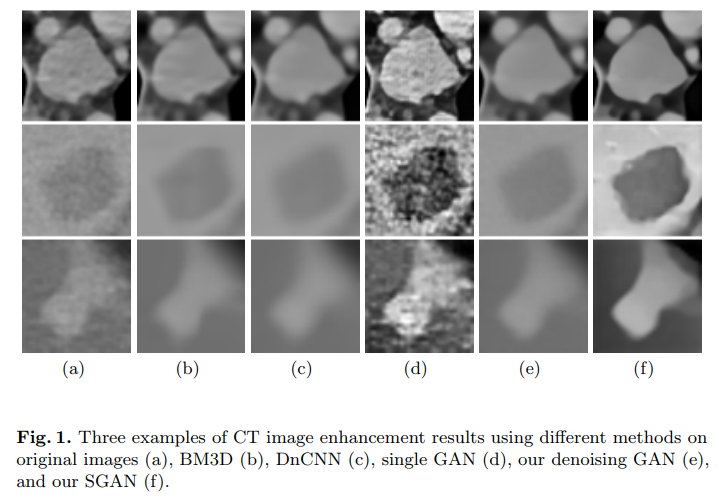
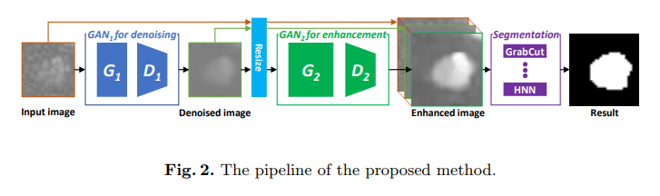
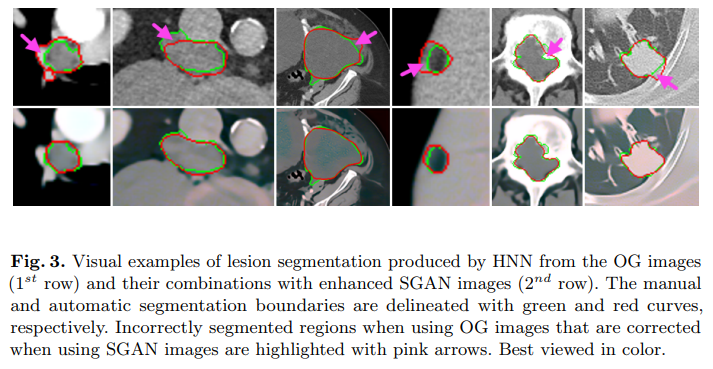
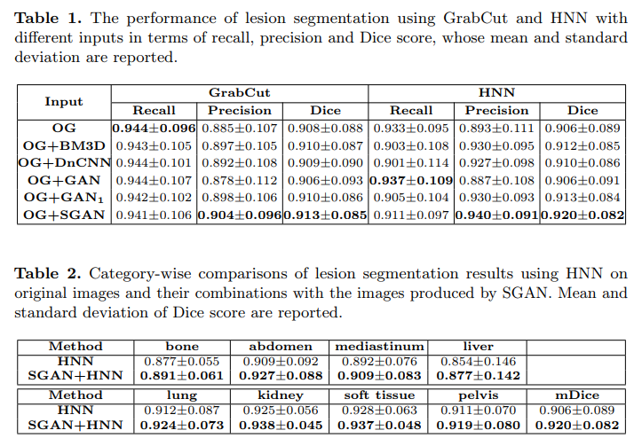

# https://arxiv.org/abs/1807.07144v1
CT Image Enhancement Using Stacked Generative Adversarial Networks and Transfer Learning for Lesion Segmentation Improvement

利用堆积生成对抗网络和转移学习的CT图像增强进行病变分割改善

## Abstract
Automated lesion segmentation from computed tomography (CT) is an important and challenging task in medical image analysis. While many advancements have been made, there is room for continued improvements. One hurdle is that CT images can exhibit high noise and low contrast, particularly in lower dosages. To address this, we focus on a preprocessing method for CT images that uses stacked generative adversarial networks (SGAN) approach. The first GAN reduces the noise in the CT image and the second GAN generates a higher resolution image with enhanced boundaries and high contrast. To make up for the absence of high quality CT images, we detail how to synthesize a large number of low- and high-quality natural images and use transfer learning with progressively larger amounts of CT images. We apply both the classic GrabCut method and the modern holistically nested network (HNN) to lesion segmentation, testing whether SGAN can yield improved lesion segmentation. Experimental results on the DeepLesion dataset demonstrate that the SGAN enhancements alone can push GrabCut performance over HNN trained on original images. We also demonstrate that HNN + SGAN performs best compared against four other enhancement methods, including when using only a single GAN.

计算机断层扫描（CT）的自动病变分割是医学图像分析中的一项重要且具有挑战性的任务。虽然取得了许多进展，但仍有继续改进的余地。一个障碍是CT图像可以表现出高噪声和低对比度，特别是在较低剂量下。为了解决这个问题，我们专注于使用堆叠生成对抗网络（SGAN）方法的CT图像预处理方法。第一个GAN降低CT图像中的噪声，第二个GAN生成具有增强边界和高对比度的更高分辨率图像。为了弥补高质量CT图像的缺失，我们详细介绍了如何合成大量低质量和高质量的自然图像，并使用逐渐增大的CT图像进行转移学习。我们将经典GrabCut方法和现代整体嵌套网络（HNN）应用于病变分割，测试SGAN是否可以产生改进的病变分割。DeepLesion数据集上的实验结果表明，单独的SGAN增强功能可以在原始图像上训练的HNN上推动GrabCut性能。我们还证明，与其他四种增强方法相比，HNN + SGAN的性能最佳，包括仅使用一个GAN时。

## Introduction
There are many useful and important applications in medical image analysis, e.g., measurement estimation [1], lung segmentation [2], lesion segmentation [3], etc. Accurate lesion segmentation from computed tomography (CT) scans plays a crucial role in computer aided diagnosis (CAD) tasks , e.g., quantitative disease progression, tumor growth evaluation after treatment, pathology detection and surgical assistance. Quantitative analysis of tumor extents could provide valuable information for treatment planning. Manual lesion segmentation is highly tedious and time consuming, motivating a number of works on automatic lesion segmentation [3–5]. However, as more and more elaborately designed segmentation methods are proposed, performance improvement may plateau. In particular, CT images are often noisy and suffer from low contrast due to radiation dosage limits, as shown in the first row of Fig. 1. The collection of datasets more massive than currently available may provide the means to overcome this, but this eventuality is not guaranteed, particularly given the labor involved in manually annotating training images. We take a different tack, and instead leverage the massive amounts of data already residing in hospital picture archiving and communication systems (PACS) to develop a method to enhance CT images in a way that benefits lesion segmentation.

在医学图像分析中有许多有用和重要的应用，例如，测量估计[1]，肺部分割[2]，病变分割[3]等。计算机断层扫描（CT）扫描的精确病变分割在计算机中起着至关重要的作用。辅助诊断（CAD）任务，例如，定量疾病进展，治疗后的肿瘤生长评估，病理学检测和手术辅助。肿瘤范围的定量分析可为治疗计划提供有价值的信息。手动病变分割是非常繁琐和耗时的，激发了许多关于自动病变分割的工作[3-5]。然而，随着越来越多精心设计的分割方法被提出，性能改进可能是稳定的。特别是，CT图像通常噪声很大，并且由于辐射剂量限制而具有低对比度，如图1的第一行所示。比现有数据集更大的数据集的集合可提供克服这一点的手段，但这种可能性不保证，特别是考虑到手动注释训练图像所涉及的劳动。我们采取不同的策略，而是利用已经存在于医院图片归档和通信系统（PACS）中的大量数据来开发一种方法，以有利于病变分割的方式增强CT图像。

Fig. 1 presents some examples of current efforts at image enhancement. As Fig. 1(b) demonstrates, classic denoising methods, such as BM3D [6], can preserve image details while introducing very few artifacts. With the recent explosive development of deep convolutional neural networks (CNNs), the field has developed many CNN based denoising methods. These include DnCNN [7], which is able to handle denoising with unknown noise levels. However, most of the CNN based methods, including DnCNN [7], use mean squared error (MSE) loss for model optimization, which can blur high-frequency details, e.g. edges. See Fig. 1(c) for an example. Moreover, denoising methods do not explicitly address resolution and contrast issues.

图1给出了目前图像增强工作的一些例子。如图1（b）所示，经典的去噪方法，如BM3D [6]，可以保留图像细节，同时引入非常少的伪像。随着最近深度卷积神经网络（CNN）的爆炸性发展，该领域已经开发出许多基于CNN的去噪方法。这些包括DnCNN [7]，它能够处理未知噪声水平的去噪。然而，大多数基于CNN的方法，包括DnCNN [7]，使用均方误差（MSE）损失进行模型优化，这可能模糊高频细节，例如：边缘。参见图1（c）的示例。此外，去噪方法没有明确解决分辨率和对比度问题。

To overcome these problems, this paper proposes a novel CT image enhancement method by designing a stacked generative adversarial network (SGAN) model. As such, this work builds off of classic GANs [8], and is partially inspired by work using GANs for super resolution on natural images [9]. Unlike many natural images, CT images are often noisy and suffer from low contrast. Directly enhancing such images may generate undesirable visual artifacts and edges that are harmful for lesion segmentation accuracy. It is challenging to train a single GAN to directly output enhanced images with high resolution and visual quality from the original CT images. See Fig. 1(d) for the results produced by single GAN. One way to address this is to reduce CT image noise before image enhancement. Therefore, our proposed SGAN operates in two GAN stages. As shown in Fig. 1(e), the first GAN reduces the noise from the original CT image. As depicted in Fig. 1(f), the second GAN generates higher resolution images with enhanced boundary and contrast. Based on the enhanced images, the popular segmentation methods of GrabCut and holistically nested networks (HNNs) are used for lesion segmentation. Experimental results on the large scale DeepLesion dataset [10] demonstrate the effectiveness of our SGAN approach. In particular, we demonstrate that when using SGAN-enhanced with GrabCut, we can produce better results than the much more powerful, yet expensive, HNN applied to the original images, confirming our intuition on the value of attending to image quality.

为了克服这些问题，本文提出了一种新的CT图像增强方法，通过设计堆叠生成对抗网络（SGAN）模型。因此，这项工作建立在经典的GAN之上[8]，并且部分受到使用GAN在自然图像上超分辨率的工作的启发[9]。与许多自然图像不同，CT图像通常是嘈杂的并且具有低对比度。直接增强这样的图像可能产生对病变分割准确性有害的不期望的视觉伪像和边缘。训练单个GAN直接从原始CT图像输出具有高分辨率和视觉质量的增强图像是具有挑战性的。关于单个GAN产生的结果，参见图1（d）。解决此问题的一种方法是在图像增强之前降低CT图像噪声。因此，我们提议的SGAN在两个GAN阶段运行。如图1（e）所示，第一GAN降低了原始CT图像的噪声。如图1（f）所示，第二GAN生成具有增强的边界和对比度的更高分辨率的图像。基于增强图像，GrabCut和整体嵌套网络（HNN）的流行分割方法用于病变分割。大规模DeepLesion数据集[10]的实验结果证明了我们的SGAN方法的有效性。特别是，我们证明了当使用GANCut增强SGAN时，我们可以产生比原始图像更强大，更昂贵的HNN更好的结果，证实了我们对照顾图像质量的价值的直觉。

## Methods
Instead of directly performing image enhancement, our SGAN method decomposes enhancement into two sub-tasks, i.e., image denoising followed by enhancement. After SGAN enhancement, either GrabCut or HNN is used for lesion segmentation. Figure 2 depicts the overall workflow of the proposed method. The details of each stage are described below.

我们的SGAN方法不是直接执行图像增强，而是将增强分解为两个子任务，即图像去噪，然后是增强。在SGAN增强之后，GrabCut或HNN用于病变分割。图2描绘了所提出方法的整体工作流程。每个阶段的细节描述如下。

### CT Image Enhancement
In [9], generative adversarial networks (GANs) [8] were successfully used for natural-image super resolution, producing high-quality images with more visual details and edges compared to their low-resolution counterparts. For lesion segmentation, if we can improve visual clarity and contrast, particularly at the borders of lesions, the segmentation performance and accuracy may subsequently be improved.

在[9]中，生成对抗网络（GAN）[8]成功地用于自然图像超分辨率，与低分辨率对应物相比，产生具有更多视觉细节和边缘的高质量图像。对于病变分割，如果我们可以改善视觉清晰度和对比度，特别是在病变的边界处，则可以随后改善分割性能和准确性。

Given a CT lesion image (as shown in Fig. 1(a)), we first generate a denoised version of the input image by employing our first GAN model (consisting of a generator G1 and a discriminator D1) that focuses on removing random image noise. The denoised image has the same size as the input image. Although the noise has been reduced in the generated image, as demonstrated in Fig. 1(e), lesions have blurry edges and the contrast between lesion and background regions is generally low. As well, a considerable number of lesions are quite small in size (< 10mm or less than 10 pixels according to their long axis diameters). Human observers typically apply zooming (via commercial clinical PACS workstations) for such lesions. This motivates the use of a second GAN to provide high-resolution enhancement. To solve this issue, our second GAN model, which also contains a generator G2 and a discriminator D2, is built upon the denoised image from the first GAN to produce an enhanced high resolution version (as illustrated in Fig. 1(f)). This enhanced high-resolution image provides both clear lesion boundaries and high contrast. Since the three resulting images, i.e. , the original, denoised, and enhanced variants, may have complementary information, we concatentate them together into a three-channel image that is fed into the next lesion segmentation stage.

给定CT病变图像（如图1（a）所示），我们首先使用我们的第一个GAN模型（由生成器G1和鉴别器D1组成）生成输入图像的去噪版本，该模型专注于去除随机图像噪声。去噪图像具有与输入图像相同的大小。尽管在生成的图像中噪声已经减小，如图1（e）所示，病变具有模糊的边缘，并且病变和背景区域之间的对比度通常较低。同样，相当多的病变尺寸非常小（根据它们的长轴直径<10mm或小于10个像素）。人类观察者通常对这种病变应用缩放（通过商业临床PACS工作站）。这促使使用第二GAN来提供高分辨率增强。为了解决这个问题，我们的第二个GAN模型也包含一个生成器G2和一个鉴别器D2，它建立在来自第一个GAN的去噪图像上，以产生增强的高分辨率版本（如图1（f）所示）。这种增强的高分辨率图像提供了清晰的病变边界和高对比度。由于三个得到的图像，即原始的，去噪的和增强的变体，可以具有互补信息，我们将它们一起连接成三通道图像，该三通道图像被馈送到下一个病变分割阶段。

SGAN Architecture We adapt similar architectures as [9] for the generators and discriminators, where the generator has 16 identical residual blocks and 2 sub-pixel convolutional layers [11], which are used to increase the resolution. Each block contains two convolutional layers with 64 3 × 3 kernels followed by batch-normalization [12] and ParametricReLU [13] layers. Because it is an easier subtask, a simpler architecture that contains just 9 identical residual blocks is designed for the denoising generator G1. As well, for a trained model, the method of [9] can only enlarge the input image by fixed amounts. However, in the DeepLesion dataset lesion sizes vary considerably, meaning they have to be enlarged with correspondingly different zooming factors. Therefore the sub-pixel layers are removed in the high-resolution generator G2. Both G1 and G2 are fully convolutional and can take input images of arbitrary size. For the discriminator design, D1 and D2, we use the same architecture as [9], which consists of 8 convolutional layers with 3 × 3 kernels, LeakyReLU activations (α = 0.2), and two densely connected layers followed by a final sigmoid layer. The stride settings and kernel numbers of the 8 convolutional layers are (1, 2, 1, 2, 1, 2, 1, 2) and (64, 64, 128, 128, 256, 256, 512, 512), respectively.

SGAN架构我们采用与[9]类似的架构来生成发生器和鉴别器，其中发生器具有16个相同的残余块和2个子像素卷积层[11]，用于提高分辨率。每个块包含两个卷积层，其中包含64个3×3内核，然后是批量标准化[12]和ParametricReLU [13]层。因为它是一个更容易的子任务，所以为去噪发生器G1设计了仅包含9个相同残余块的更简单的架构。同样，对于训练模型，[9]的方法只能以固定量放大输入图像。但是，在DeepLesion数据集中，病变大小差异很大，这意味着它们必须使用相应不同的缩放因子进行放大。因此，在高分辨率发生器G2中去除子像素层。G1和G2都是完全卷积的，可以输入任意大小的输入图像。对于鉴别器设计D1和D2，我们使用与[9]相同的架构，它由8个卷积层和3×3内核组成，LeakyReLU激活（α=0.2），两个密集连接层，后面是最终的S形层。8个卷积层的步幅设置和内核数分别是（1,2,1,2,1,2,1,2）和（64,64,128,128,256,256,512,512）。

Training Data Synthesization Normally super resolution models are trained with pairs of low- and high-resolution images. While this can be obtained easily in natural images (by down-sampling), physical CT images are imaged by medical scanners at roughly fixed in-plane resolutions of ∼ 1 mm per-pixel and CT imaging at ultra-high spatial resolutions does not exist. For the sake of SGAN training, we leverage transfer learning using a large-scale synthesized natural image dataset: DIV2K [14] where all images are converted into gray scale and down-sampled to produce training pairs. For the training of the denoising GAN, we randomly crop 32 × 32 sub-images from distinct training images of DIV2K. White Gaussian noise at different intensity variance levels σi ∈ (0, 50] are added to the cropped images to construct the paired model inputs. For training the image-enhancement GAN, the input images are cropped as 128 × 128 patches and we perform the following steps: 1) down-sample the cropped image with scale s ∈ [1, 4], 2) implement Gaussian spatial smoothing with σs ∈ (0, 3], 3) execute contrast compression with rates of κ ∈ [1, 3], and 4) conduct up-sampling with the scale s to generate images pairs. To fine-tune using CT images, we process 28, 000 training RECIST slices using the currently trained SGAN and select a subset of up to 1, 000 that demonstrate visual improvement. The selected CT images are subsequently added to the training for the next round of SGAN fine-tuning. This iterative process finishes when no more visual improvement can be observed.

训练数据合成通常，使用成对的低分辨率和高分辨率图像训练超分辨率模型。虽然这可以在自然图像中轻松获得（通过下采样），但物理CT图像由医学扫描仪以大约固定的每像素~1 mm的平面内分辨率成像，并且不存在超高空间分辨率的CT成像。为了SGAN培训，我们利用大规模合成自然图像数据集利用转移学习：DIV2K [14]，其中所有图像都被转换为灰度级并进行下采样以产生训练对。为了训练去噪GAN，我们从DIV2K的不同训练图像中随机裁剪32×32个子图像。将不同强度方差水平σi∈（0,50）处的白高斯噪声添加到裁剪图像以构建成对模型输入。为了训练图像增强GAN，输入图像被裁剪为128×128个补丁并且我们执行以下步骤：

- 1）采用尺度s∈[1,4]对裁剪后的图像进行下采样
- 2）实现高斯空间平滑，σs∈（0,3）
- 3）执行对比压缩，其速率为κ∈[1,3]
- 4）用比例s进行上采样以生成图像对。为了使用CT图像进行微调，我们使用当前训练的SGAN处理28,000个训练RECIST切片，并选择高达1,000的子集来证明视觉改善。随后将选定的CT图像添加到训练中以进行下一轮SGAN微调。当不再能观察到视觉改善时，该迭代过程结束

Model Optimization A proper loss function needs to be defined for model optimization, which is critical for the performance of our generators. The generators are trained not only to generate high quality images but also to fool the discriminators. Similar to [9], given an input image, x_i(i=0,1), this work defines a perceptual loss L_i_P(i=1,2) as the weighted sum of a image content loss L_i_C , a feature representation loss L_i_VGG and an adversarial loss L_i_A for G1 and G2 as

模型优化需要为模型优化定义适当的损失函数，这对于我们的生成器的性能至关重要。生成器不仅可以生成高质量的图像，还可以欺骗鉴别器。类似于[9]，给定输入图像x_i（i=0,1），该工作将感知损失L_i_P（i=1,2）定义为图像内容丢失L_i_C，特征表示丢失L_i_VGG，G1和G2的对抗性损失L_i_A，的加权和

$$
\begin{aligned}
L^i_P = L^i_{DIFF} + 10^{-5} L^i_{VGG} + 10^{-3} L^i_{A}
\end{aligned}
$$

where i denotes the SGAN stage. Here, L_i_DIFF and L_i_VGG are computed using the mean square error (MSE) loss function to measure the pixel-wise error and the element-wise error of feature maps between the generated image G_i(x_i) and its ground truth image y_i , respectively. We extract feature maps from five blocks of the VGGNet-16 model [15] pre-trained over ImageNet [16]. The adversarial loss L_i_A is defined using the standard GAN formulation for generators:

其中i表示SGAN阶段。这里，使用均方误差（MSE）损失函数来计算L_i_DIFF和L_i_VGG，以分别测量所生成的图像G_i（x_i）与其地面实况图像y_i之间的像素方向误差和特征图的元素方向误差。我们从ImageNet预训练的VGGNet-16模型[15]的五个块中提取特征图[16]。对战损失L_i_A是使用发电机的标准GAN公式定义的：

$$
\begin{aligned}
L^i_A (x_i) = - log (D_i(G_i(x_i)))
\end{aligned}
$$

The discriminators, on the other hand, are trained to distinguish between real images and enhanced ones, yi and Gi(xi), respectively,which can be accomplished by minimizing the following loss:

另一方面，鉴别器被训练为分别区分真实图像和增强图像，yi和Gi（xi），这可以通过最小化以下损失来实现：

$$
\begin{aligned}
L^i_D(x_i,y_i) = - log (D_i(y_i)) - log(1-D_i(G_i(x_i)))
\end{aligned}
$$

We use the Adam optimizer [17] with β1 = 0.5 and a learning rate of 10−4 for model optimization. The generator (G1 or G2) and discriminator (D1 or D2) are alternatively updated. We train first on the synthesized natural images and then fine-tune using the selected CT images.

我们使用Adam优化器[17]，其中β1=0.5，学习率为10-4，用于模型优化。可选地更新发生器（G1或G2）和鉴别器（D1或D2）。我们首先在合成的自然图像上进行训练，然后使用所选择的CT图像进行微调。

### Lesion Segmentation
Because they may contain complementary information, the denoised and enhanced outputs from the SGAN and the original lesion CT image are combined into a three-channel image for lesion segmentation. We investigate two popular segmentation approaches: GrabCut [18] and HNN [19]. The quality of GrabCut’s initialization will greatly affect the final segmentation result. For this reason, we construct a high quality trimap T using the RECIST diameter marks within the DeepLesion dataset [10]. This produces regions of probable background, probable foreground, background and foreground. Note that unlike the original trimap definition [18], we define four region types. With T, we can obtain the lesion segmentation using GrabCut. Since the DeepLesion dataset does not provide the ground truth lesion masks, the GrabCut segmentation results are used as supervision to train the HNN segmentation model until convergence.

因为它们可能包含补充信息，所以来自SGAN的去噪和增强输出和原始病变CT图像被组合成用于病变分割的三通道图像。我们研究了两种流行的分割方法：GrabCut [18]和HNN [19]。GrabCut初始化的质量将极大地影响最终的分割结果。因此，我们使用DeepLesion数据集[10]中的RECIST直径标记构建高质量的trimap T这产生了可能的背景，可能的前景，背景和前景的区域。请注意，与原始trimap定义[18]不同，我们定义了四种区域类型。使用T，我们可以使用GrabCut获得病变分割。由于DeepLesion数据集不提供地面实况损伤掩模，因此GrabCut分割结果用作监督以训练HNN分割模型直到收敛。

## Experimental Results and Analyses
The DeepLesion dataset [10] is composed of 32, 735 PACS CT lesion images annotated with RECIST long and short diameters. These are derived from 10, 594 studies of 4, 459 patients. All lesions have been categorized into the 8 subtypes of lung, mediastinum, liver, soft-tissue, abdomen, kidney, pelvis, and bone. For quantitative evaluation, we manually segment 1, 000 lesion images as a testing set, randomly selected from 500 patients. The rest serve as a training set. Based on the location of bookmarked diameters, CT region of interests (ROIs) are cropped at two times the extent of the lesion’s long diameters, so that sufficient visual context is preserved. Although we do not possess corresponding high quality images in the DeepLesion dataset, we can implicitly evaluate the performance of the proposed SGAN model for CT image enhancement by comparing the segmentation performance with or without enhanced images. Three criteria, i.e. Dice similarity coefficient (Dice), precision and recall scores, are used to evaluate the quantitative segmentation accuracy.

DeepLesion数据集[10]由带有RECIST长径和短径的32,735个PACS CT病变图像组成。这些来自4,559名患者的10,594项研究。所有病变分为肺，纵隔，肝，软组织，腹部，肾，骨盆和骨的8个亚型。对于定量评估，我们手动分割1,000个病变图像作为测试集，从500名患者中随机选择。其余的作为训练集。基于书签直径的位置，CT感兴趣区域（ROI）被裁剪为病变长径的两倍，从而保持足够的视觉上下文。虽然我们在DeepLesion数据集中没有相应的高质量图像，但我们可以通过比较具有或不具有增强图像的分割性能来隐含地评估所提出的用于CT图像增强的SGAN模型的性能。三个标准，即骰子相似系数（Dice），精确度和回忆分数，用于评估定量分割准确度。

Figure 3 shows several visual examples of lesion segmentation results using HNN on original images and their combinations with the images produced by SGAN. From Fig. 3, the segmentation results on the combined images are closer to the manual segmentations than the ones on only original images. This intuitively demonstrates that the enhanced images produced by the SGAN model is helpful for lesion segmentation.

图3显示了在原始图像上使用HNN的病变分割结果的几个视觉示例以及它们与SGAN产生的图像的组合。从图3可以看出，组合图像的分割结果比原始图像上的分割结果更接近手动分割。这直观地证明了SGAN模型产生的增强图像有助于病变分割。

For quantitative evaluation, we test both GrabCut and HNN applied on a variety of image options. Namely, we compare results when the original (OG) images are used, and also when those processed by BM3D [6], DnCNN [7]), a single GAN model (GAN) for enhancement, and the first denoising GAN model of SGAN (GAN1) are used. When enhancement is applied, we concatenate the result with OG images to create a multi-channel input for the segmentation method. From Table 1, we can see that 1) when using any of the enhanced images except the one produced by a single GAN, the Dice performance improves, supporting our intuition on the value of enhancing the CT images prior to segmentation. The possible reason of the worse results when using a single GAN is that it may enhance and introduce some artifacts. 2) Using GAN1 for image denoising produces better Dice scores than using BM3D and DnCNN, suggesting that the adversarial learning strategy is helpful for image denoising while keeping details important for segmentation. 3) Compared with GrabCut, HNN achieves a greater improvement in Dice scores when using the enhanced images, suggesting HNN is able to exploit the complementary information better than GrabCut. 4) Using SGAN for image enhancement produces the largest gain in Dice scores. This confirms that our approach on using a stacked architecture can provide a more effective enhancement than just a blind application of GANs. 5) Most remarkably, the Dice scores of GrabCut with SGAN is greater than just using HNN with OG images. Considering the simplicity of GrabCut, this indicates that focusing attention on improving data quality can sometimes yield larger gains than simply applying more powerful, but costly, segmentation methods. As a result, despite being somewhat neglected in the field, focusing attention on data enhancements can be an important means to push segmentation performance further.

对于定量评估，我们测试GrabCut和HNN应用于各种图像选项。也就是说，我们比较使用原始（OG）图像时的结果，以及当BM3D [6]，DnCNN [7]处理的那些，用于增强的单个GAN模型（GAN）和SGAN的第一个去噪GAN模型时的结果。（GAN1）被使用。当应用增强时，我们将结果与OG图像连接起来，为分割方法创建多通道输入。从表1中我们可以看出1）当使用任何增强图像时，除了单个GAN产生的图像之外，Dice性能得到改善，支持我们对分割前增强CT图像的价值的直觉。使用单个GAN时可能导致更糟糕结果的原因是它可能会增强并引入一些伪像。2）使用GAN1进行图像去噪比使用BM3D和DnCNN产生更好的Dice得分，这表明对抗性学习策略有助于图像去噪，同时保持细节对于分割很重要。3）与GrabCut相比，当使用增强图像时，HNN在Dice得分方面取得了更大的改进，这表明HNN能够比GrabCut更好地利用补充信息。4）使用SGAN进行图像增强可以获得最大的Dice得分增益。这证实了我们使用堆叠架构的方法可以提供比仅仅盲目应用GAN更有效的增强。5）最值得注意的是，使用SGAN的GrabCut的Dice得分大于仅使用带有OG图像的HNN。考虑到GrabCut的简单性，这表明将注意力集中在提高数据质量上有时可以产生比仅仅应用更强大但成本更高的分割方法更大的收益。结果，尽管在该领域有些被忽视，但是将注意力集中在数据增强上可以是进一步推动分割性能的重要手段。

Table 2 lists the Dice scores across lesion types when using HNN on OG and SGAN images. Notably, the segmentation performance over all categories is improved with SGAN images, with abdomen and liver exhibiting the largest improvement. These lesion categories may benefit the most due to their low contrast and blurred boundaries compared to the surrounding soft tissue.

表2列出了在OG和SGAN图像上使用HNN时病变类型的Dice得分。值得注意的是，使用SGAN图像改善了所有类别的分割性能，腹部和肝脏表现出最大的改善。这些病变类别可能受益最多，因为它们与周围软组织相比具有低对比度和模糊边界。

