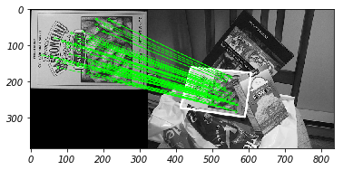
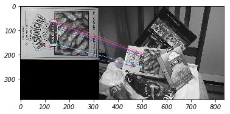

# Find Objects
[OpenCV-Python Tutorials: Feature Matching + Homography](https://docs.opencv.org/master/d1/de0/tutorial_py_feature_homography.html)

在这里,我们将混合来自`calib3d`模块的特征匹配和`findHomography`,以在复杂图像中查找已知对象.

相关推荐:

- [AKAZE local features matching](https://docs.opencv.org/master/db/d70/tutorial_akaze_matching.html): 使用AKAZE局部特征来检测和匹配两个图像上的关键点.我们将在给定的单应性矩阵的一对图像上找到关键点,匹配它们并计数.

## Code
我们在图像中找到SIFT特征,并应用比率测试来查找最佳匹配:
```python
MIN_MATCH_COUNT = 10
root = "/data2/gits/docs-2018/docs_md/python/opencv/"

import numpy as np
import cv2 as cv
import matplotlib.pyplot as plt
img1 = cv.imread(root+"Find_Objects.md.box.png", 0)          # queryImage
img2 = cv.imread(root+"Find_Objects.md.box_in_scene.png", 0) # trainImage

# Initiate SIFT detector
sift = cv.xfeatures2d.SIFT_create()
# find the keypoints and descriptors with SIFT
kp1, des1 = sift.detectAndCompute(img1, None)
kp2, des2 = sift.detectAndCompute(img2, None)
# FLANN parameters
FLANN_INDEX_KDTREE = 1
index_params = dict(algorithm=FLANN_INDEX_KDTREE, trees=5)
search_params = dict(checks=50)   # or pass empty dictionary
flann = cv.FlannBasedMatcher(index_params, search_params)
matches = flann.knnMatch(des1, des2, k=2)
# store all the good matches as per Lowe's ratio test.
good = []
for m,n in matches:
    if m.distance < 0.7*n.distance:
        good.append(m)
```

如果找到足够的匹配,我们会提取两个图像中匹配关键点的位置.他们通过寻找这种转变.一旦我们得到这个`3x3`转换矩阵,我们就用它来将`queryImage`的角点转换成`trainImage`中相应的点.然后我们绘制它:
```python
if len(good) > MIN_MATCH_COUNT:
    src_pts = np.float32([kp1[m.queryIdx].pt for m in good]).reshape(-1, 1, 2)
    dst_pts = np.float32([kp2[m.trainIdx].pt for m in good]).reshape(-1, 1, 2)
    M, mask = cv.findHomography(src_pts, dst_pts, cv.RANSAC, 5.0)
    matchesMask = mask.ravel().tolist()
    h, w = img1.shape
    pts = np.float32([[0,0],[0,h-1],[w-1,h-1],[w-1,0]]).reshape(-1, 1, 2)
    dst = cv.perspectiveTransform(pts, M)
    img2 = cv.polylines(img2, [np.int32(dst)], True, 255, 3, cv.LINE_AA)
    plt.imshow(img2, "gray"); plt.show();
else:
    print("Not enough matches are found - {}/{}".format(len(good), MIN_MATCH_COUNT))
    matchesMask = None
```

最后,我们绘制我们的内点(如果成功)或匹配关键点(如果失败):
```python
draw_params = dict(matchColor=(0,255,0),
                   singlePointColor=None,
                   matchesMask=matchesMask,
                   flags=2)
img3 = cv.drawMatches(img1, kp1, img2, kp2, good, None, **draw_params)
plt.imshow(img3, "gray"); plt.show();
```



## Feature Matching
我们将看到如何将一幅图像中的特征与其他图像匹配.我们将在OpenCV中使用`Brute-Force`匹配器和`FLANN`匹配器.[tutorial](https://docs.opencv.org/master/dc/dc3/tutorial_py_matcher.html)

### Brute-Force
蛮力匹配器很简单.它采用第一组中的一个特征的描述符并且使用一些距离计算与第二组中的所有其他特征匹配.返回最近的一个.

对于BF匹配器,首先我们必须使用`cv.BFMatcher()`创建`BFMatcher`对象.它需要两个可选参数.首先是`normType`.它指定要使用的距离测量.默认情况下,它是`cv.NORM_L2`.这对`SIFT`,`SURF`等有好处.对于像`ORB`,`BRIEF`,`BRISK`等基于二进制字符串的描述符,应该使用`cv.NORM_HAMMING`,它使用汉明距离作为度量.

第二个参数是布尔变量,`crossCheck`默认为`false`.如果为`true`,则匹配器仅返回具有值`(i,j)`的匹配,使得集合A中的第`i`个描述符具有集合B中的第`j`个描述符作为最佳匹配,反之亦然.也就是说,两组中的两个特征应该相互匹配.

一旦创建,两个重要的方法是`BFMatcher.match()`和`BFMatcher.knnMatch()`.第一种返回最佳匹配,第二种方法返回k个最佳匹配,其中k由用户指定.

就像我们使用`cv.drawKeypoints()`绘制关键点一样,`cv.drawMatches()`帮助我们绘制匹配.它将两幅图像水平叠放,并从第一幅图像绘制第二幅图像,显示最佳匹配.还有`cv.drawMatchesKnn()`可以绘制所有k个最佳匹配.

Using ORB descriptors to match features:
```python
root = "/data2/gits/docs-2018/docs_md/python/opencv/"

import numpy as np
import cv2 as cv
import matplotlib.pyplot as plt
img1 = cv.imread(root+"Find_Objects.md.box.png", 0)          # queryImage
img2 = cv.imread(root+"Find_Objects.md.box_in_scene.png", 0) # trainImage

# Initiate ORB detector
orb = cv.ORB_create()
# find the keypoints and descriptors with ORB
kp1, des1 = orb.detectAndCompute(img1, None)
kp2, des2 = orb.detectAndCompute(img2, None)

# create BFMatcher object
bf = cv.BFMatcher(cv.NORM_HAMMING, crossCheck=True)
# Match descriptors.
matches = bf.match(des1, des2)
# Sort them in the order of their distance.
matches = sorted(matches, key=lambda x: x.distance)
# Draw first 10 matches.
img3 = cv.drawMatches(img1, kp1, img2, kp2, matches[:10], None, flags=2)
plt.imshow(img3); plt.show();
```



`matches`是`DMatch`对象的列表,具有以下属性:

- DMatch.distance - 描述符之间的距离,越低越好
- DMatch.trainIdx - trainImage描述符中描述符的索引
- DMatch.queryIdx - queryImage描述符中描述符的索引
- DMatch.imgIdx - trainImage图像的索引

### FLANN
`FLANN`代表近似最近邻居的快速库.它包含一组经过优化的算法,用于大数据集中的快速最近邻搜索以及高维特征.对于大型数据集,它的工作速度比`BFMatcher`快.

对于基于FLANN的匹配器,我们需要传递两个字典来指定要使用的算法及其相关参数等.首先是`IndexParams`.第二个字典是`SearchParams`.它指定了索引中的树应递归遍历的次数.值越高,精度越高,但也需要更多时间.

```python
root = "/data2/gits/docs-2018/docs_md/python/opencv/"

import numpy as np
import cv2 as cv
import matplotlib.pyplot as plt
img1 = cv.imread(root+"Find_Objects.md.box.png", 0)          # queryImage
img2 = cv.imread(root+"Find_Objects.md.box_in_scene.png", 0) # trainImage

# Initiate SIFT detector
sift = cv.xfeatures2d.SIFT_create()
# find the keypoints and descriptors with SIFT
kp1, des1 = sift.detectAndCompute(img1, None)
kp2, des2 = sift.detectAndCompute(img2, None)
# FLANN parameters
FLANN_INDEX_KDTREE = 1
index_params = dict(algorithm=FLANN_INDEX_KDTREE, trees=5)
search_params = dict(checks=50)   # or pass empty dictionary
flann = cv.FlannBasedMatcher(index_params, search_params)
matches = flann.knnMatch(des1, des2, k=2)
# Need to draw only good matches, so create a mask
matchesMask = [[0, 0] for i in range(len(matches))]
# ratio test as per Lowe's paper
for i,(m,n) in enumerate(matches):
    if m.distance < 0.7*n.distance:
        matchesMask[i] = [1,0]
draw_params = dict(matchColor=(0,255,0),
                   singlePointColor=(255,0,0),
                   matchesMask=matchesMask,
                   flags=0)
img3 = cv.drawMatchesKnn(img1, kp1, img2, kp2, matches, None, **draw_params)
plt.imshow(img3); plt.show();
```
