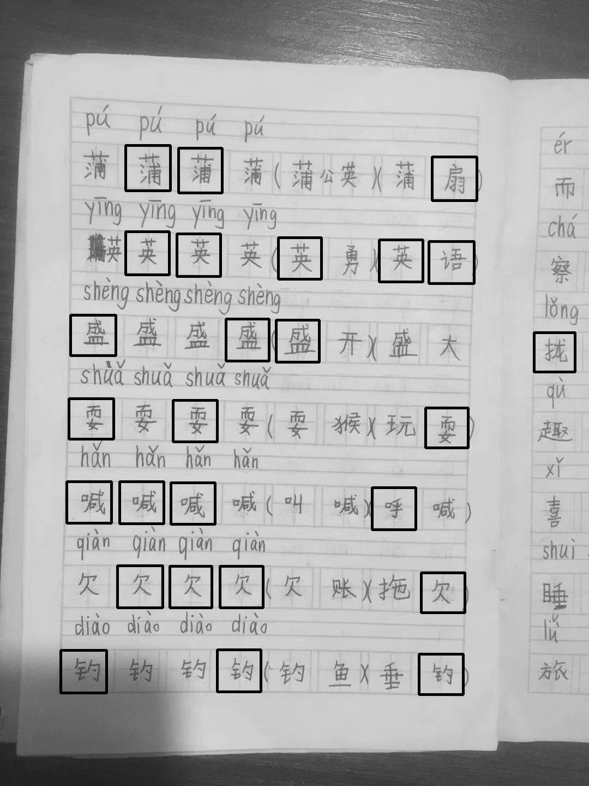
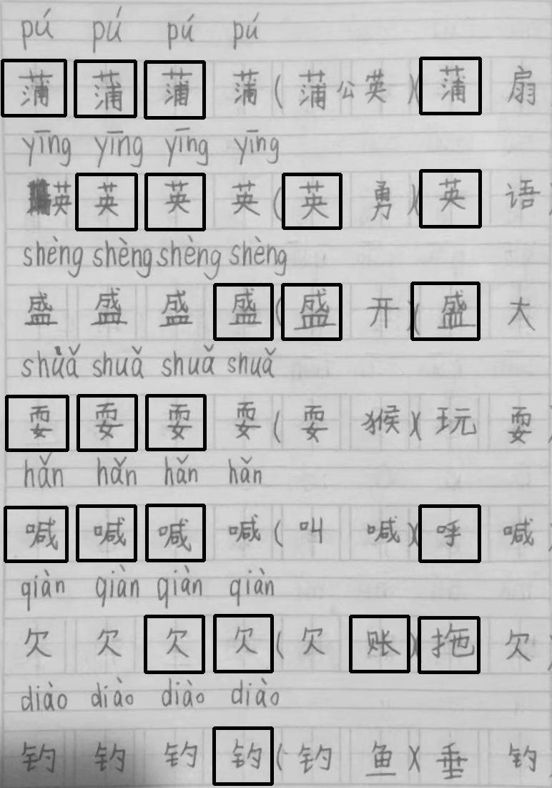

# Find font rect
方法是轮廓提取，然后对轮廓进行多边形逼近，最后利用多边形的面积和顶点等信息对轮廓进行筛选。其中最耗时间的地方仍然是阈值化的时候参数的调整。而且不具有通用性，换一幅图片参数可能得重新调整。这种方式效率比较低，但是目前暂时没适合的代替方案，只能先用这种方式。
```python
import cv2 as cv
from PIL import Image
from IPython.display import display

def display_rois(img, rois):
    img = img.copy()
    for x, y, w, h in rois:
        cv.rectangle(img, (x, y), (x + w, y + h), 0, 3)
    display(Image.fromarray(img, 'L'))
    return len(rois)
```

## 方案1
```python
def find_roi_base(img):
    img = cv.medianBlur(img, 3)
    th3 = cv.adaptiveThreshold(img, 255, cv.ADAPTIVE_THRESH_MEAN_C, cv.THRESH_BINARY_INV, 11, 2)
    contours = cv.findContours(th3, cv.RETR_LIST, cv.CHAIN_APPROX_SIMPLE)[0]

    rois = []
    max_roi_width = img.shape[1] / 8
    min_roi_width = img.shape[1] / 20
    for cnt in contours:
        epsilon = 0.1 * cv.arcLength(cnt, True)
        approx = cv.approxPolyDP(cnt, epsilon, True)
        if len(approx) == 4 and cv.isContourConvex(approx):
            x, y, w, h = cv.boundingRect(approx)
            if max_roi_width > w > min_roi_width and 1.2 > w / h > 0.8:
                    rois.append([x, y, w, h])
    return rois

img = cv.imread('images/20191116215427.jpg', 0)
rois = find_roi_base(img)
display_rois(img, rois)
```


## 方案2
```python
def find_roi_base_(img):
    img = cv.medianBlur(img, 3)
    th3 = cv.adaptiveThreshold(img, 255, cv.ADAPTIVE_THRESH_MEAN_C, cv.THRESH_BINARY_INV, 11, 2)
    contours = cv.findContours(th3, cv.RETR_EXTERNAL, cv.CHAIN_APPROX_SIMPLE)[0]

    roi_area = 0
    roi_shape = None
    pts1, pts2 = None, None
    min_width = img.shape[1] / 2
    for cnt in contours:
        epsilon = 0.1 * cv.arcLength(cnt, True)
        approx = cv.approxPolyDP(cnt, epsilon, True)
        if len(approx) == 4 and cv.isContourConvex(approx):
            x, y, w, h = cv.boundingRect(approx)
            if w > min_width and w * h > roi_area:
                roi_area = w * h
                roi_shape = (w, h)
                pts1 = approx.reshape((-1, 2)).astype('float32')
                pts2 = np.float32([[0, 0], [0, h], [w, h], [w, 0]])

    if pts1 is not None and pts2 is not None:
        M = cv.getPerspectiveTransform(pts1, pts2)
        img = cv.warpPerspective(img, M, roi_shape)
    th3 = cv.adaptiveThreshold(img, 255, cv.ADAPTIVE_THRESH_MEAN_C, cv.THRESH_BINARY_INV, 11, 2)
    contours = cv.findContours(th3, cv.RETR_LIST, cv.CHAIN_APPROX_SIMPLE)[0]

    rois = []
    max_roi_width = img.shape[1] / 8
    min_roi_width = img.shape[1] / 20
    for cnt in contours:
        epsilon = 0.1 * cv.arcLength(cnt, True)
        approx = cv.approxPolyDP(cnt, epsilon, True)
        if len(approx) == 4 and cv.isContourConvex(approx):
            x, y, w, h = cv.boundingRect(approx)
            if max_roi_width > w > min_roi_width and 1.2 > w / h > 0.8:
                    rois.append([x, y, w, h])
    return img, rois

img = cv.imread('images/20191116215427.jpg', 0)
img, rois = find_roi_base_(img)
display_rois(img, rois)
```


## 后记
虽然，方案2召回的文字框不如方案1，但个人还是推荐方案2。另，方案2的其他文字框其实比较容易召回，只需根据检测出的文字框推算出文字框的尺寸和间隔，然后在漏检区基于网格补充。

## 参考资料：
- [Image Thresholding](https://opencv-python-tutroals.readthedocs.io/en/latest/py_tutorials/py_imgproc/py_thresholding/py_thresholding.html)
- [Camera Calibration](https://opencv-python-tutroals.readthedocs.io/en/latest/py_tutorials/py_calib3d/py_calibration/py_calibration.html#calibration)
- [Contour Features](https://opencv-python-tutroals.readthedocs.io/en/latest/py_tutorials/py_imgproc/py_contours/py_contour_features/py_contour_features.html)