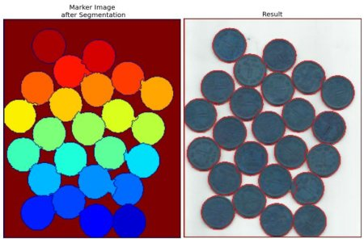

# Image segmentation with watershed
我们将学习使用分水岭算法使用基于标记的图像分割。

## 理论
任何灰度图像都可以看作是地形表面，其中高强度表示峰和丘陵，而低强度表示山谷。您开始用不同颜色的水（标签）填充每个孤立的山谷（局部最小值）。随着水的上升，取决于附近的峰值（梯度），来自不同山谷的水，明显具有不同的颜色将开始融合。为避免这种情况，您需要在水合并的位置建立障碍。你继续填补水和建筑障碍的工作，直到所有的山峰都在水下。然后，您创建的障碍为您提供分割结果。这是分水岭背后的“哲学”。您可以访问[CMM webpage on watershed](http://cmm.ensmp.fr/~beucher/wtshed.html)，以便在某些动画的帮助下了解它。

但是这种方法会因图像中的噪声或任何其他不规则性而给出过度调整结果。因此，OpenCV实施了一个基于标记的分水岭算法，您可以在其中指定要合并的所有谷点，哪些不合并。这是一种交互式图像分割。我们所做的是为我们知道的对象提供不同的标签。用一种颜色（或强度）标记我们确定为前景或对象的区域，用另一种颜色标记我们确定为背景或非对象的区域，最后标记我们不确定任何内容的区域，用`0`标记它。这是我们的标记。然后应用分水岭算法。然后我们的标记将使用我们给出的标签进行更新，对象的边界将具有`-1`的值。

## 代码
下面我们将看到一个如何使用距离变换和分水岭来分割相互接触的物体的示例。考虑下面的硬币图像，硬币互相接触。即使你达到阈值，它也会相互接触。


我们首先找到硬币的近似估计值。为此，我们二值化。
```python
from PIL import Image
from IPython.display import display

import cv2 as cv
import numpy as np
from matplotlib import pyplot as plt

img = cv.imread('coins.png')
gray = cv.cvtColor(img,cv.COLOR_BGR2GRAY)
ret, thresh = cv.threshold(gray, 0, 255, cv.THRESH_BINARY_INV+cv.THRESH_OTSU)

display(Image.fromarray(thresh, 'L'))
```


现在我们需要去除图像中的任何小白噪声。为此，我们可以使用形态开放。要移除对象中的任何小孔，我们可以使用形态学闭合。所以，现在我们确切地知道靠近物体中心的区域是前景，而远离物体的区域是背景。只有我们不确定的区域是硬币的边界区域。

所以我们需要提取我们确定它们是硬币的区域。侵蚀消除了边界像素。所以无论如何，我们可以肯定它是硬币。如果物体没有相互接触，这将起作用。但由于它们相互接触，另一个好的选择是找到距离变换并应用适当的阈值。接下来我们需要找到我们确定它们不是硬币的区域。为此，我们扩大了结果。膨胀将物体边界增加到背景。这样，我们可以确保结果中背景中的任何区域确实是背景，因为边界区域被移除。见下图。


剩下的区域是我们不知道的区域，无论是硬币还是背景。分水岭算法应该找到它。这些区域通常围绕前景和背景相遇的硬币边界（甚至两个不同的硬币相遇）。我们称之为边界。它可以从`sure_bg`区域中减去`sure_fg`区域获得。

```python
# noise removal
kernel = np.ones((3,3), np.uint8)
opening = cv.morphologyEx(thresh, cv.MORPH_OPEN, kernel, iterations=2)

# sure background area
sure_bg = cv.dilate(opening, kernel, iterations=3)

# Finding sure foreground area
dist_transform = cv.distanceTransform(opening, cv.DIST_L2, 5)
ret, sure_fg = cv.threshold(dist_transform, 0.7*dist_transform.max(), 255, 0)

# Finding unknown region
sure_fg = np.uint8(sure_fg)
unknown = cv.subtract(sure_bg, sure_fg)
```


>在阈值图像中，我们得到了一些我们确定硬币的硬币区域，现在它们已经分离。（在某些情况下，您可能只对前景分割感兴趣，而不是分离相互接触的物体。在这种情况下，您不需要使用距离变换，只需要侵蚀即可。侵蚀只是提取确定前景区域的另一种方法。）

现在我们确定哪个是硬币区域，哪个是背景和所有。所以我们创建标记（它是一个与原始图像大小相同的数组，但是使用`int32`数据类型）并标记其中的区域。我们确切知道的区域（无论是前景还是背景）都标有任何正整数，但不同的整数，我们不确定的区域只是保留为零。为此，我们使用`cv.connectedComponents()`。它用`0`标记图像的背景，然后其他对象用从`1`开始的整数标记。

但我们知道，如果背景标记为`0`，分水岭会将其视为未知区域。所以我们想用不同的整数来标记它。相反，我们将标记由未知定义的未知区域，为`0`。
```python
# Marker labelling
ret, markers = cv.connectedComponents(sure_fg)
# Add one to all labels so that sure background is not 0, but 1
markers = markers + 1
# Now, mark the region of unknown with zero
markers[unknown==255] = 0
# Display
plt.imshow(markers);
```


>深蓝色区域显示未知区域。确定的硬币用不同的值着色。与未知区域相比，确定背景的剩余区域以浅蓝色显示。

现在我们的标记准备好了。现在是最后一步的时候，应用分水岭。然后将修改标记图像。边界区域将标记为`-1`。
```python
markers = cv.watershed(img, markers)
img[markers==-1] = [255, 0, 0]
```



>对于某些硬币，它们触摸的区域被正确分割，而对于某些硬币则不然。

## 参考资料：
- [Image Segmentation with Watershed Algorithm](https://docs.opencv.org/master/d3/db4/tutorial_py_watershed.html)
- [图像分割与数学形态学](http://www.cmm.mines-paristech.fr/~beucher/wtshed.html)