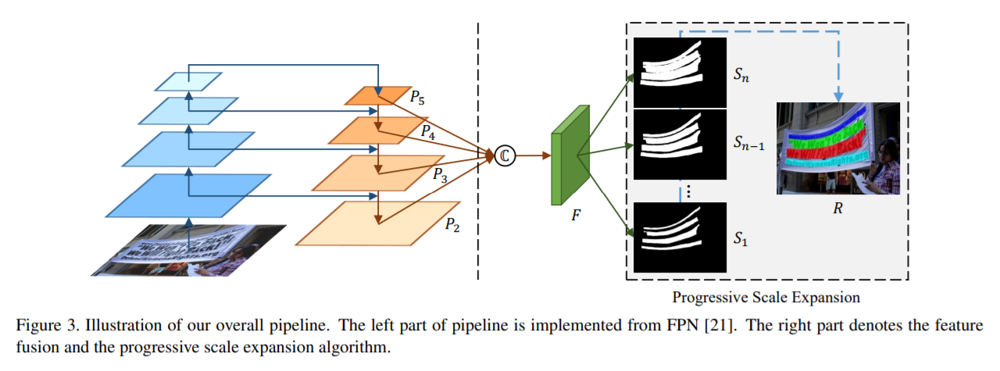
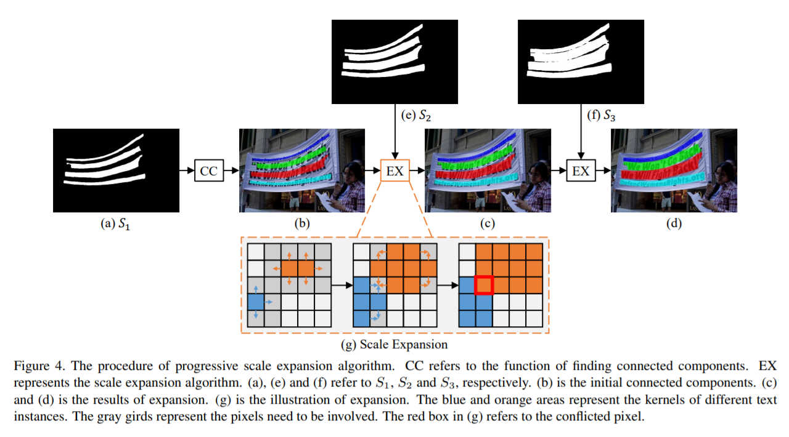
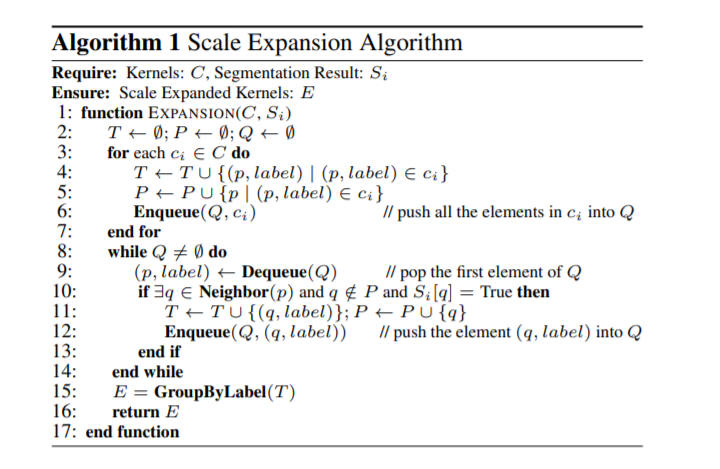
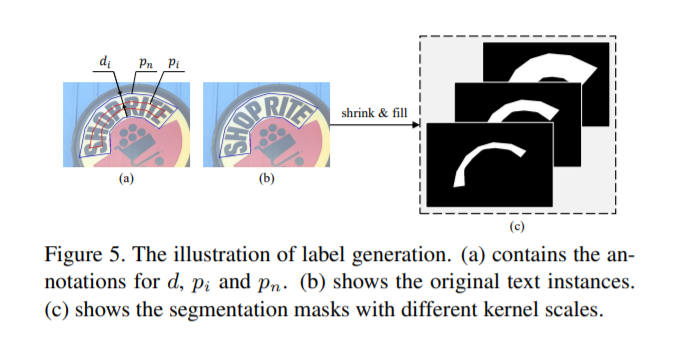

# PSENet
PSENet(渐进式尺度扩展网络)分好几个版本，最新的一个是19年的CVPR。

## 创新点
创新点大概就是预测多个分割结果，分别是`S_1,S_2,...,S_n`代表不同的等级面积的结果。S1最小，基本就是文本骨架，Sn最大，就是完整的文本实例。然后在后处理的过程中，先用最小的预测结果去区分文本，再逐步扩张成正常文本大小。

PSENet的基本框架是FPN，使用ResNet作为PSENet的主干。首先从主干获得四个256通道的特征图`p_2,p_3,p_4,p_5`，再将四组特征图通过函数`C`映射为1024通道的特征图`F`。

$$
F = C(p_2, p_3, p_4, p_5) = p_2 \| Up_{\times 2}(p_3) \| Up_{\times 4}(p_4) \| Up_{\times 8}(p_5)
$$

随后，`F`被送入`Conv(3,3)-BN-ReLU`层，并减少到256个通道。接下来，它通过n`Conv(1,1)-Up-Sigmoid`层，并生成n分割结果`S_1,S_2,...,S_n`。

## 扩展算法
基于分段的方法很难将彼此接近的文本实例分开。为了解决这个问题，我们提出了一种渐进的尺度扩展算法。`CC`是指查找连接的组件的函数。`EX`表示比例扩展算法。

首先，基于最小内核的映射S1作为初始发现，`(b)`中4个颜色不同的区域分别不同的连接组件。我们已经检测到所有文本实例的中心部分。然后，我们通过合并S2中的像素，然后在S3中逐步扩展检测到的内核。`(c)`和`(d)`分别显示了两个比例扩展的结果。最后，我们提取`(d)`中用不同颜色标记的连接组件，作为文本实例的最终预测。扩展算法伪代码：

## 标签生成
PSENet生成具有不同内核比例的分割结果。因此，它要求产生不同尺寸的`S_1,..,S_n`的labels。利用Vatti裁剪算法将原始多边形`p_n`收缩`d_i`像素，并获得收缩多边形`p_i`。

如果我们将比例比视为`r_i`，则`p_n`和`p_i`之间的边距`d_i`可以计算为：

$$
d_i = \frac{Area(p_n) \times (1 - r_i^2)}{Perimeter(p_n)}
$$

`Area()`是计算多边形区域的函数，`Perimeter()`是计算多边形周长的函数。`d_i`表示的是缩小后mask边缘与正常mask边缘的距离，缩放比例`r_i`可以由下面计算得出：

$$
r_i = 1 - \frac{(1 - m) \times (1 - n)}{n - 1}
$$

m是最小mask的比例，n在m到1之间的值，成线性增加。

## 参考资料：
- [Shape Robust Text Detection with Progressive Scale Expansion Network](https://arxiv.org/pdf/1903.12473.pdf)
- [github.com/whai362/PSENet](https://github.com/whai362/PSENet)
- [github.com/WenmuZhou/PSENet.pytorch](https://github.com/WenmuZhou/PSENet.pytorch)