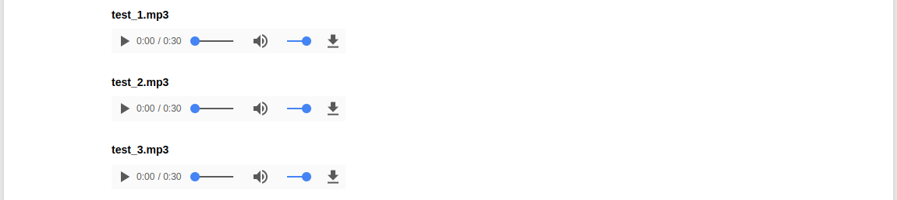
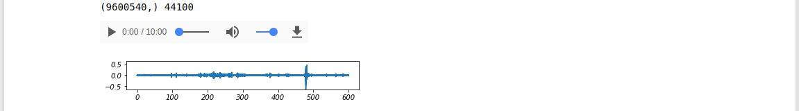

# Sound data
```python
root = '.'
mp3_list = !ls {root}/*.mp3

import os
from IPython.display import display, Audio, Image, HTML
for mp3 in mp3_list:
    display(HTML('<h4>{:s}</h4>'.format(os.path.basename(mp3))))
    display(Audio(mp3))
```



## display wave
```python
# pip install librosa
# Docs: http://librosa.github.io/librosa/core.html
import librosa
# load: 将音频文件加载为浮点时间序列
# to_mono: 强制音频信号降至单声道
# resample: 重采样
# get_duration: 持续时间
# zero_crossings: 找到信号的过零点
# ..
import numpy as np
import matplotlib.pyplot as plt
from IPython.display import display, Audio, Image, HTML
def display_wave(yy, sr=16000, figsize=None, ylim=None):
    if figsize is None: figsize=(6, 0.75)
    if ylim is None: ylim=[-0.65, 0.65]
    display(Audio(yy, rate=sr))
    plt.figure(figsize=figsize)
    plt.ylim(ylim)
    plt.plot(np.arange(len(yy), dtype=np.float32)/sr, yy)
    plt.show()

yy1, sr1 = librosa.load('test.mp3', sr=None, dtype=np.float32)
yy1      = librosa.resample(yy1, sr1, 16000)
print(yy1.shape, sr1)
display_wave(yy1, 16000)
```



## pydub
[pydub](https://github.com/jiaaro/pydub) install:
```
apt-get install ffmpeg
pip install pydub
```

examples:
```python
from pydub import AudioSegment

sound1 = AudioSegment.from_file('/path/to/sound1.wav', format='wav')
sound2 = AudioSegment.from_file('/path/to/sound2.wav', format='wav')
```

sound1 6 dB louder, then 3.5 dB quieter:
```python
louder = sound1 + 6
quieter = sound1 - 3.5
```

sound1, with sound2 appended:
```python
combined = sound1 + sound2

# sound1 repeated 3 times
repeated = sound1 * 3

# default 100 ms crossfade
combined = sound1.append(sound2)

# 5000 ms crossfade
combined_with_5_sec_crossfade = sound1.append(sound2, crossfade=5000)

# no crossfade
no_crossfade1 = sound1.append(sound2, crossfade=0)

# no crossfade
no_crossfade2 = sound1 + sound2
```

秒数:
```
combined.duration_seconds

assert combined.duration_seconds == (len(combined)/1000.0)
```

保存:
```python
with_style.export('with_style.mp3', format='mp3')
```

创建一个零持续时间的片段:
```python
from pydub import AudioSegment
empty = AudioSegment.empty()

len(empty) == 0
```

创建一个无声的音素片段,可用作占位符,间隔符或作为画布覆盖其他声音:
```python
from pydub import AudioSegment

ten_second_silence = AudioSegment.silent(duration=10000)
```

## speech-to-text

### 讯飞
- [语音转写](http://www.xfyun.cn/services/lfasr)
- [doc - 语音转写](http://www.xfyun.cn/doccenter/lfasr)
- [doc - 语音识别](http://www.xfyun.cn/doccenter/asr)

SDK开发文档,[java](http://www.xfyun.cn/doccenter/lfasr#go_sdk_doc_v2).

- 当对多个发音人同时采集音频时,建议对音频进行预先切分,每次识别的音频只含有一位发音人的语音.
- 音频的帧平均幅度值在`[5000,20000]`为最佳.不需要刻意录制更高幅度值的音频.
- 语音转写最大的特点为具有长时记忆功能,即时间越长的音频,其准确率会越高,建议使用大于1分钟.

### IBM
- https://www.ibm.com/watson/services/speech-to-text/

凭证在对应的项目页.`username`和`password`后续会用到:
```
{
  "speech_to_text": [
    {
      "name": "speech-to-text-gxixn-speech-to--1519869221293",
      "plan": "lite",
      "credentials": {
        "url": "https://stream.watsonplatform.net/speech-to-text/api",
        "username": "*********",
        "password": "*********"
      }
    }
  ]
}
```

- [开发者文档](https://console.bluemix.net/developer/watson/documentation)
- [入门教程](https://console.bluemix.net/docs/services/speech-to-text/getting-started.html#gettingStarted)

Languages and models:

- Mandarin Chinese <- zh-CN_BroadbandModel,zh-CN_NarrowbandModel

Python3:
```python
#pip install --upgrade watson-developer-cloud
import json
from watson_developer_cloud import SpeechToTextV1

speech_to_text = SpeechToTextV1(
    username='YOUR SERVICE USERNAME',
    password='YOUR SERVICE PASSWORD',
    x_watson_learning_opt_out=False
)

print(json.dumps(speech_to_text.models(), indent=2))

print(json.dumps(speech_to_text.get_model('zh-CN_BroadbandModel'), indent=2))

print(json.dumps(speech_to_text.recognize(open('Untitled_wave_10min.mp3', 'rb'), content_type='audio/mp3', model='zh-CN_BroadbandModel', timestamps=True, word_confidence=True), indent=2))
```
