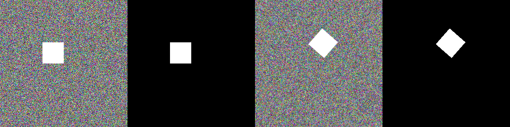

# Classification

* 该库可处理HWC格式的图像。
* 在大多数转换中，该库比其他库快。
* 基于numpy，OpenCV，imgaug挑选最好的。
* 支持图像，蒙版，关键点和边界框的转换。

[albumentations 0.4.5](https://pypi.org/project/albumentations/)

```
#!pip install -U albumentations
import albumentations as albu
from urllib.request import urlopen
from IPython.display import display
from PIL import Image
import numpy as np
import cv2 as cv

def download_image(url, mode):
    data = urlopen(url).read()
    data = np.frombuffer(data, np.uint8)
    image = cv.imdecode(data, mode)
    if mode == 1:
        return cv.cvtColor(image, cv.COLOR_BGR2RGB)
    return image

def norm_image(image):
    if image.max() == 1:
        image = image * 255
    if image.ndim == 2:
        image = np.stack((image, image, image), axis=2)
    return image

def show_image(*images):
    images = [norm_image(image) for image in images]
    if len(images) > 1:
        images = [np.concatenate(images[i*2:i*2+2], axis=1) for i in range(len(images) // 2)]
    display(Image.fromarray(np.concatenate(images, axis=0), 'RGB'))

def augment_and_show(aug, image):
    if aug is not None:
        image = aug(image=image)['image']
    show_image(image)
```

## Showcase
颜色增强：
```
light = albu.Compose([
    albu.RandomBrightnessContrast(p=1.0),
    albu.RandomGamma(p=1.0),
    albu.CLAHE(p=1.0),
], p=1.0)

medium = albu.Compose([
    albu.CLAHE(p=1.0),
    albu.HueSaturationValue(hue_shift_limit=20, sat_shift_limit=50, val_shift_limit=50, p=1.0),
], p=1.0)

strong = albu.Compose([
    albu.ChannelShuffle(p=1.0),
], p=1.0)

aug = light # or medium or strong
augmented = aug(image=image)
augmented['image']
```

## For Classification
```
image = download_image('https://flystarhe.github.io/docs-2020-plus/Albu/classification.md.t1.jpg', 1)
show_image(image)
```


水平翻转：
```
aug = albu.HorizontalFlip(p=1.0)
augment_and_show(aug, image)
```


随机应用平移，缩放和旋转：
```
aug = albu.ShiftScaleRotate(p=1.0)
augment_and_show(aug, image)
```


## 增强管道
```
def augment_flips_color(p=0.5):
    return albu.Compose([
        albu.CLAHE(),
        albu.RandomRotate90(),
        albu.Transpose(),
        albu.ShiftScaleRotate(shift_limit=0.0625, scale_limit=0.50, rotate_limit=45, p=0.75),
        albu.Blur(blur_limit=3),
        albu.OpticalDistortion(),
        albu.GridDistortion(),
        albu.HueSaturationValue()
    ], p=p)

aug = augment_flips_color(p=1.0)
augment_and_show(aug, image)
```


## 复杂的管道
```
def strong_aug(p=0.5):
    return albu.Compose([
        albu.RandomRotate90(),
        albu.Flip(),
        albu.Transpose(),
        albu.OneOf([
            albu.IAAAdditiveGaussianNoise(),
            albu.GaussNoise(),
        ], p=0.2),
        albu.OneOf([
            albu.MotionBlur(p=0.2),
            albu.MedianBlur(blur_limit=3, p=0.1),
            albu.Blur(blur_limit=3, p=0.1),
        ], p=0.2),
        albu.ShiftScaleRotate(shift_limit=0.0625, scale_limit=0.2, rotate_limit=45, p=0.2),
        albu.OneOf([
            albu.OpticalDistortion(p=0.3),
            albu.GridDistortion(p=0.1),
            albu.IAAPiecewiseAffine(p=0.3),
        ], p=0.2),
        albu.OneOf([
            albu.CLAHE(clip_limit=2),
            albu.IAASharpen(),
            albu.IAAEmboss(),
            albu.RandomBrightnessContrast(),
        ], p=0.3),
        albu.HueSaturationValue(p=0.3),
    ], p=p)

aug = strong_aug(p=1.0)
augment_and_show(aug, image)
```


## 更多的参数
```
image = np.random.randint(0, 256, (300, 300, 3), dtype=np.uint8)
mask = np.zeros((300, 300), dtype=np.uint8)
image[100:150, 100:150] = 255
mask[100:150, 100:150] = 1
whatever_data = "my name"

data = {"image": image, "mask": mask, "whatever_data": whatever_data, "additional": "hello"}
augmentation = albu.ShiftScaleRotate(p=1.0)
augmented = augmentation(**data)

show_image(image, mask, augmented['image'], augmented['mask'])

for key in augmented.keys():
    val = augmented[key]
    txt = '{}: {}'.format(key , type(val))
    if isinstance(val, np.ndarray):
        txt = txt + ' - {}'.format(val.shape)
    else:
        txt = txt + ' - {}'.format(val)
    print(txt)
## image: <class 'numpy.ndarray'> - (300, 300, 3)
## mask: <class 'numpy.ndarray'> - (300, 300)
## whatever_data: <class 'str'> - my name
## additional: <class 'str'> - hello
```


## 参考资料：
- [albumentations.augmentations](https://albumentations.readthedocs.io/en/latest/api/augmentations.html)