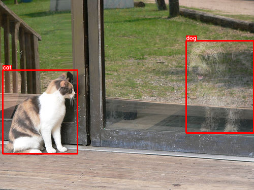
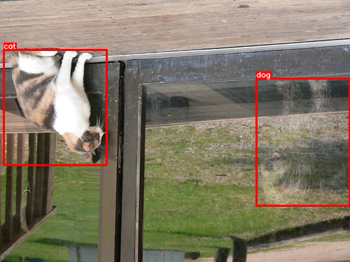
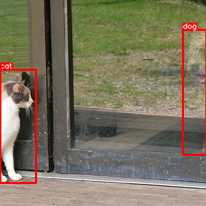
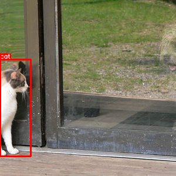
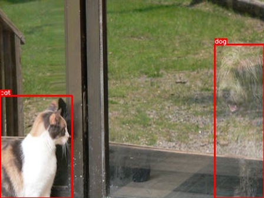

# Detection

* 该库可处理HWC格式的图像。
* 在大多数转换中，该库比其他库快。
* 基于numpy，OpenCV，imgaug挑选最好的。
* 支持图像，蒙版，关键点和边界框的转换。

[albumentations 0.4.5](https://pypi.org/project/albumentations/)

```
#!pip install -U albumentations
import albumentations as albu
from urllib.request import urlopen
from IPython.display import display
from PIL import Image
import numpy as np
import cv2 as cv

def download_image(url, mode):
    data = urlopen(url).read()
    data = np.frombuffer(data, np.uint8)
    image = cv.imdecode(data, mode)
    if mode == 1:
        return cv.cvtColor(image, cv.COLOR_BGR2RGB)
    return image

def norm_image(image):
    if image.max() == 1:
        image = image * 255
    if image.ndim == 2:
        image = np.stack((image, image, image), axis=2)
    return image

def show_image(*images):
    images = [norm_image(image) for image in images]
    if len(images) > 1:
        images = [np.concatenate(images[i*2:i*2+2], axis=1) for i in range(len(images) // 2)]
    display(Image.fromarray(np.concatenate(images, axis=0), 'RGB'))

BOX_COLOR = (255, 0, 0)
TEXT_COLOR = (255, 255, 255)

def visualize_bbox(img, bbox, class_id, class_idx_to_name, color=BOX_COLOR, thickness=2):
    x_min, y_min, w, h = bbox
    x_min, x_max, y_min, y_max = int(x_min), int(x_min + w), int(y_min), int(y_min + h)
    cv.rectangle(img, (x_min, y_min), (x_max, y_max), color=color, thickness=thickness)

    class_name = class_idx_to_name[class_id]
    ((text_width, text_height), _) = cv.getTextSize(class_name, cv.FONT_HERSHEY_SIMPLEX, 0.35, 1)
    cv.rectangle(img, (x_min, y_min - int(1.3 * text_height)), (x_min + text_width, y_min), BOX_COLOR, -1)
    cv.putText(img, class_name, (x_min, y_min - int(0.3 * text_height)), cv.FONT_HERSHEY_SIMPLEX, 0.35, TEXT_COLOR, lineType=cv.LINE_AA)
    return img

def visualize(annotations, category_id_to_name):
    img = annotations['image'].copy()
    for idx, bbox in enumerate(annotations['bboxes']):
        img = visualize_bbox(img, bbox, annotations['category_id'][idx], category_id_to_name)
    show_image(img)
```

## Showcase
```
bbox_params = albu.BboxParams(format='coco', min_area=1, min_visibility=0.5, label_fields=['category_id'])

light = albu.Compose([
    albu.HorizontalFlip(p=1.0),
    albu.RandomSizedCrop((800 - 100, 800 + 100), 600, 600),
    albu.GaussNoise(var_limit=(100, 150), p=1.0),
], bbox_params=bbox_params, p=1.0)

medium = albu.Compose([
    albu.HorizontalFlip(p=1.0),
    albu.RandomSizedCrop((800 - 100, 800 + 100), 600, 600),
    albu.MotionBlur(blur_limit=17, p=1.0),
], bbox_params=bbox_params, p=1.0)

strong = albu.Compose([
    albu.HorizontalFlip(p=1.0),
    albu.RandomSizedCrop((800 - 100, 800 + 100), 600, 600),
    albu.RGBShift(p=1.0),
    albu.Blur(blur_limit=11, p=1.0),
    albu.RandomBrightness(p=1.0),
    albu.CLAHE(p=1.0),
], bbox_params=bbox_params, p=1.0)

image = cv.imread('data_root/1/image.jpg', 1)
masks = Path('data_root/1/').glob('mask_*.png')
masks  = [cv.imread(str(mask), 0) for mask in masks]
bboxes = [cv.boundingRect(cv.findNonZero(mask)) for mask in masks]

label_image = np.zeros_like(masks[0])
for i, mask in enumerate(masks, 1):
    label_image[mask > 0] = i

label_ids = [0] * len(bboxes)

aug = light # or medium or strong
augmented = aug(image=image, mask=label_image, bboxes=bboxes, category_id=label_ids)
augmented['image'], augmented['mask'], augmented['bboxes'], augmented['category_id']
```

## For Detection
您必须使用`bbox_params`，可用格式为：

* `coco` - `[x_min, y_min, width, height]`，例如`[97, 12, 150, 200]`
* `pascal_voc` - `[x_min, y_min, x_max, y_max]`，例如`[97, 12, 247, 212]`

一些转换可能会剪切框，甚至删除它们。您有两个选项可以控制此行为：

* `min_area` - 默认0，仅图片外的框将被删除
* `min_visibility` - 默认0，仅图片外的框将被删除

```
def get_aug(aug, min_area=0., min_visibility=0.):
    return albu.Compose(aug, bbox_params=albu.BboxParams(format='coco', min_area=min_area, min_visibility=min_visibility, label_fields=['category_id']))

category_id_to_name = {17: 'cat', 18: 'dog'}
image = download_image('http://images.cocodataset.org/train2017/000000386298.jpg', 1)
annotations = {'image': image, 'bboxes': [[366.7, 80.84, 132.8, 181.84], [5.66, 138.95, 147.09, 164.88]], 'category_id': [18, 17]}

visualize(annotations, category_id_to_name)
```


垂直翻转：
```
aug = get_aug([albu.VerticalFlip(p=1.0)])
augmented = aug(**annotations)
visualize(augmented, category_id_to_name)
```


中心裁剪，使用默认过滤器：
```
aug = get_aug([albu.CenterCrop(p=1.0, height=300, width=300)])
augmented = aug(**annotations)
visualize(augmented, category_id_to_name)
```


中心裁剪，使用最小区域过滤：
```
aug = get_aug([albu.CenterCrop(p=1.0, height=300, width=300)], min_area=8000)
augmented = aug(**annotations)
visualize(augmented, category_id_to_name)
```


中心裁剪，使用可见度过滤：
```
aug = get_aug([albu.CenterCrop(p=1.0, height=300, width=300)], min_visibility=0.3)
augmented = aug(**annotations)
visualize(augmented, category_id_to_name)
```


中心裁剪，同时使用最小区域和可见度过滤：
```
aug = get_aug([albu.CenterCrop(p=1.0, height=300, width=300)], min_area=4000, min_visibility=0.2)
augmented = aug(**annotations)
visualize(augmented, category_id_to_name)
```


## Keep All
如果需要保留所有`bbox`。以下是不删除边界框的示例：(RandomSizedBBoxSafeCrop可以完成这项工作)

* 宽度，高度是随机裁剪后输出图像的大小。
* `erosion_rate`是用于显示您可以损失多少的设置，`0.2`表示可能会丢失所有边界框体积的20％。

```
aug = get_aug([albu.RandomSizedBBoxSafeCrop(width=448, height=336, erosion_rate=0.5)])
augmented = aug(**annotations)
visualize(augmented, category_id_to_name)
```


## 参考资料：
- [albumentations.augmentations](https://albumentations.readthedocs.io/en/latest/api/augmentations.html)