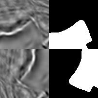

# Segmentation

* 该库可处理HWC格式的图像。
* 在大多数转换中，该库比其他库快。
* 基于numpy，OpenCV，imgaug挑选最好的。
* 支持图像，蒙版，关键点和边界框的转换。

[albumentations 0.4.5](https://pypi.org/project/albumentations/)

```
#!pip install -U albumentations
import albumentations as albu
from urllib.request import urlopen
from IPython.display import display
from PIL import Image
import numpy as np
import cv2 as cv

def download_image(url, mode):
    data = urlopen(url).read()
    data = np.frombuffer(data, np.uint8)
    image = cv.imdecode(data, mode)
    if mode == 1:
        return cv.cvtColor(image, cv.COLOR_BGR2RGB)
    return image

def norm_image(image):
    if image.max() == 1:
        image = image * 255
    if image.ndim == 2:
        image = np.stack((image, image, image), axis=2)
    return image

def show_image(*images):
    images = [norm_image(image) for image in images]
    if len(images) > 1:
        images = [np.concatenate(images[i*2:i*2+2], axis=1) for i in range(len(images) // 2)]
    display(Image.fromarray(np.concatenate(images, axis=0), 'RGB'))

image = download_image('https://github.com/albumentations-team/albumentations_examples/raw/master/notebooks/images/kaggle_salt/0fea4b5049_image.png', 1)
mask = download_image('https://github.com/albumentations-team/albumentations_examples/raw/master/notebooks/images/kaggle_salt/0fea4b5049.png', 0)

original_height, original_width = image.shape[:2]
print(image.shape, mask.shape)
## (101, 101, 3) (101, 101)
show_image(image, mask)
```


## Non destructive
```
aug = albu.HorizontalFlip(p=1.0)
augmented = aug(image=image, mask=mask)
show_image(image, mask, augmented['image'], augmented['mask'])
```


```
aug = albu.VerticalFlip(p=1.0)
augmented = aug(image=image, mask=mask)
show_image(image, mask, augmented['image'], augmented['mask'])
```


```
#Randomly rotates by 0, 90, 180, 270 degrees
aug = albu.RandomRotate90(p=1.0)
augmented = aug(image=image, mask=mask)
show_image(image, mask, augmented['image'], augmented['mask'])
```


```
#switch X and Y axis
aug = albu.Transpose(p=1.0)
augmented = aug(image=image, mask=mask)
show_image(image, mask, augmented['image'], augmented['mask'])
```


## Non-rigid transformations
在医学成像问题中，非刚性转换有助于增强数据。
```
aug = albu.ElasticTransform(p=1.0, alpha=120, sigma=120 * 0.05, alpha_affine=120 * 0.03)
augmented = aug(image=image, mask=mask)
show_image(image, mask, augmented['image'], augmented['mask'])
```


```
aug = albu.GridDistortion(p=1.0)
augmented = aug(image=image, mask=mask)
show_image(image, mask, augmented['image'], augmented['mask'])
```


```
aug = albu.OpticalDistortion(p=1.0, distort_limit=2, shift_limit=0.5)
augmented = aug(image=image, mask=mask)
show_image(image, mask, augmented['image'], augmented['mask'])
```


## RandomSizedCrop
可以将`RandomCrop`和`RandomScale`组合为一个转换。
```
aug = albu.RandomSizedCrop(p=1.0, min_max_height=(50, 101), height=original_height, width=original_width)
augmented = aug(image=image, mask=mask)
show_image(image, mask, augmented['image'], augmented['mask'])
```


## Combine transformations
```
aug = albu.Compose([
    albu.VerticalFlip(p=0.5),
    albu.RandomRotate90(p=0.5),
    albu.OneOf([
        albu.ElasticTransform(p=0.5, alpha=120, sigma=120 * 0.05, alpha_affine=120 * 0.03),
        albu.OpticalDistortion(p=1.0, distort_limit=2.0, shift_limit=0.5),
        albu.GridDistortion(p=0.5),
    ],
    p=0.8),
    albu.RandomBrightnessContrast(p=0.8),
    albu.RandomGamma(p=0.8),
])
augmented = aug(image=image, mask=mask)
show_image(image, mask, augmented['image'], augmented['mask'])
```


## 参考资料：
- [albumentations.augmentations](https://albumentations.readthedocs.io/en/latest/api/augmentations.html)