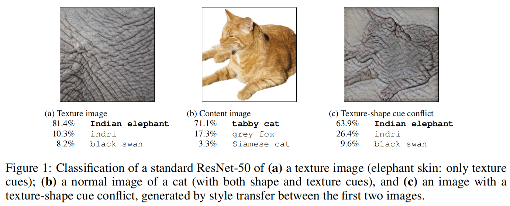
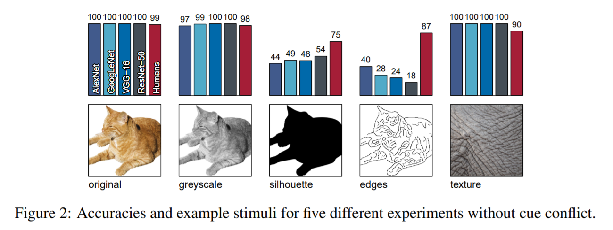

# Shape Bias
ImageNet训练的CNN偏向纹理，增加形状偏见可提高精度和鲁棒性。下图说明了核心思想：如果卷积神经网络看到一只猫有大象纹理，即使它的形状显然仍然是猫，它也认为这是一头大象。这种“纹理偏见”对于ImageNet训练的CNN来说是常见的，这与人们普遍认为CNN大多通过检测物体的形状来识别物体的看法相反。[paper](https://arxiv.org/abs/1811.12231)  [github](https://github.com/rgeirhos/texture-vs-shape)

>可能有两方面原因：一是，与所有分类网络最后都使用了`global avgpool`有关；二是，卷积神经网络仅通过局部的纹理就收集到了足够的信息来做出判断。

这不是简单的failure case，而是近两年研究者发现的卷积神经网络在ImageNet预训练后出现的对于颜色和纹理的偏好现象。这与人类不同，目前普遍认为，人类主要是通过形状来辨别物体的。对于上面这种形状和纹理有冲突的图像，卷积神经网络更倾向用颜色和纹理来进行预测，而非形状。局部纹理似乎确实提供了关于对象classes的充分信息，对象识别原则上能通过纹理识别来实现。

## 引言
卷积神经网络(CNN)如何在复杂的感知任务和语义分割上达到令人印象深刻的性能？一个被广泛接受的直觉是，CNN组合低级特征(例如边缘)到越来越复杂的形状(如车轮/车窗)，直到对象(如汽车)很容易被分类。网络获得了与每个类别相关的各种形状的复杂知识，高级单位似乎学习自然图像中形状的表示形式。这个概念也出现在其他解释中，CNN中间层识别物体的一部分，以及随后的层检测对象作为这些部件的组合。我们把这种解释称为形状假说。

众所周知，物体形状是人类物体识别最重要的线索，远比其他线索(例如大小/纹理)要大得多。

另一方面，一些相当脱节的发现指出对象纹理在CNN对象识别中的重要作用。CNN仍然可以很好地对纹理图像进行分类，即使全局的形状结构被完全摧毁。相反，标准CNN在识别对象形状保留但所有纹理线索缺失的对象草图方面表现不佳。两项研究表明，纹理等局部信息实际上可能足以“求解”ImageNet对象识别。综合起来，局部纹理似乎确实提供了关于对象classes的充分信息，ImageNet对象识别原则上能通过纹理识别来实现。根据这些发现，我们认为是时候考虑第二个解释了，我们称之为纹理假说。对象纹理比全局对象形状更重要，对于CNN对象识别。

## 心里实验
研究人员严格遵循心理学实验流程设定，进行了五项实验。在前四项实验中，研究者将16类共160张白色背景的自然图像做四种不同的变换，分别交给人类被试者和ImageNet上预训练的卷积神经网络做其中物体的识别。实验结果如下图：

改变偏见，并发现改变后的偏见带来的好处。 作者表示，如果在合适的数据集上进行训练，则可以克服标准CNN中的纹理偏见并将其更改为形状偏见。值得注意的是，具有较高形状偏差的网络固有地对许多不同的图像失真更健壮，并且在分类和对象识别任务上具有更高的性能。

## 参考资料：
- [谈一谈ImageNet预训练网络的形状偏见](https://zhuanlan.zhihu.com/p/111434695)
