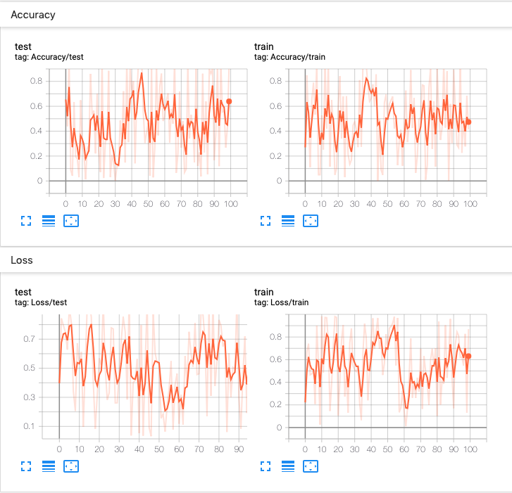

# TensorBoard
在继续之前，可以在[https://www.tensorflow.org/tensorboard/](https://www.tensorflow.org/tensorboard/)上找到有关TensorBoard的更多详细信息。安装TensorBoard后，这些实用程序使您可以将PyTorch模型和指标记录到目录中，以便在TensorBoard UI中进行可视化。`SummaryWriter`类是您用来记录数据以供TensorBoard使用和可视化的主要条目。例如：
```
import torch
import torchvision
from torch.utils.tensorboard import SummaryWriter
from torchvision import datasets, transforms

# output to ./runs/ directory by default
writer = SummaryWriter()

transform = transforms.Compose([transforms.ToTensor(), transforms.Normalize((0.5,), (0.5,))])
trainset = datasets.MNIST('mnist_train', train=True, download=True, transform=transform)
trainloader = torch.utils.data.DataLoader(trainset, batch_size=64, shuffle=True)
model = torchvision.models.resnet50(False)
# Have ResNet model take in grayscale rather than RGB
model.conv1 = torch.nn.Conv2d(1, 64, kernel_size=7, stride=2, padding=3, bias=False)
images, labels = next(iter(trainloader))

grid = torchvision.utils.make_grid(images)
writer.add_image('images', grid, 0)
writer.add_graph(model, images)
writer.close()
```

然后可以使用TensorBoard对其进行可视化，该TensorBoard应该可通过以下方式安装和运行：
```
pip install tensorboard
tensorboard --logdir=runs
```

一个实验可以记录很多信息。为了避免UI混乱和更好地将结果聚类，我们可以通过对图进行分层命名来对图进行分组。例如，`Loss/train`和`Loss/test`将被分组在一起，而`Accuracy/train`和`Accuracy/test`将在TensorBoard界面中分别分组。
```
from torch.utils.tensorboard import SummaryWriter
import numpy as np

writer = SummaryWriter()

for n_iter in range(100):
    writer.add_scalar('Loss/train', np.random.random(), n_iter)
    writer.add_scalar('Loss/test', np.random.random(), n_iter)
    writer.add_scalar('Accuracy/train', np.random.random(), n_iter)
    writer.add_scalar('Accuracy/test', np.random.random(), n_iter)
writer.close()
```

命令行执行`tensorboard --logdir=runs`，[https://localhost:6006](https://localhost:6006)应该显示以下内容。



## SummaryWriter
SummaryWriter类提供了高级API，可在给定目录中创建事件文件并向其添加摘要和事件。该类异步更新文件内容。这允许训练程序从训练循环中调用直接将数据添加到文件的方法，而不会减慢训练速度。

- `add_scalar(tag, scalar_value, global_step=None, walltime=None)`
- `add_scalars(main_tag, tag_scalar_dict, global_step=None, walltime=None)`
- `add_histogram(tag, values, global_step=None, bins='tensorflow', walltime=None, max_bins=None)`
- `add_image(tag, img_tensor, global_step=None, walltime=None, dataformats='CHW')`
- `add_images(tag, img_tensor, global_step=None, walltime=None, dataformats='NCHW')`
- `add_figure(tag, figure, global_step=None, close=True, walltime=None)`
- `add_graph(model, input_to_model=None, verbose=False)`
- `add_embedding(mat, metadata=None, label_img=None, global_step=None, tag='default', metadata_header=None)`
- `add_pr_curve(tag, labels, predictions, global_step=None, num_thresholds=127, weights=None, walltime=None)`

## 参考资料：
- [Docs: TORCH.UTILS.TENSORBOARD](https://pytorch.org/docs/stable/tensorboard.html)
- [VISUALIZING MODELS, DATA, AND TRAINING WITH TENSORBOARD](https://pytorch.org/tutorials/intermediate/tensorboard_tutorial.html)