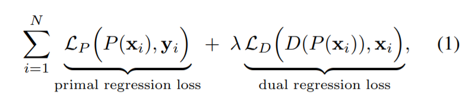
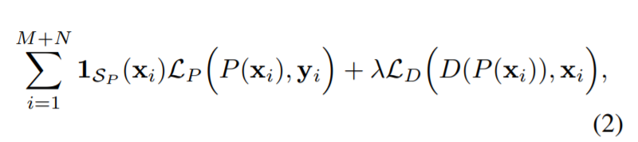
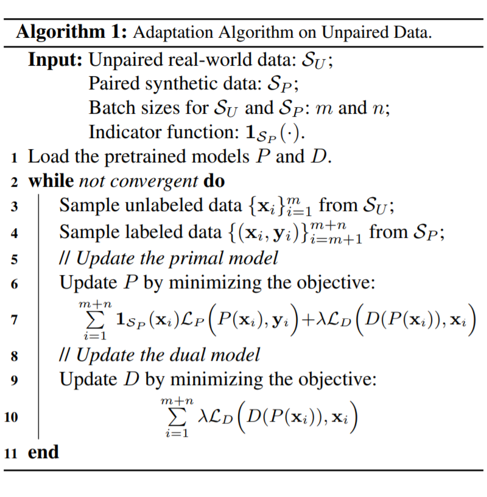

# Dual Regression Networks
目前大部分基于神经网络的单图像超分辨率(SISR)的传统做法是利用低分辨率图像(LR)和高分辨率图像(HR)对，学习一个非线性映射函数以实现LR到HR的映射。这种做法存在两个主要的问题：

* SISR属于ill-posed问题，这就意味LR到HR的映射存在多种可行解，导致训练到后期时无法确定一个可行解。
* 真实的LR和HR的图像对(pair)很难获取，目前大部分的data pair都是人工模拟的，这就意味模型学习到的退化核很难泛化到真实场景下，导致模型的泛化能力低下。

[Closed-loop Matters: Dual Regression Networks for Single Image Super-Resolution](https://arxiv.org/abs/2003.07018)  [GitHub](https://github.com/guoyongcs/DRN)

## 解决方案
为了解决上述问题，我们通过引入对LR数据的附加约束来减少可能函数的空间，提出了一种对偶回归方案。具体来说，除了从LR到HR图像的映射外，我们还学习了另外的对偶回归映射，用于估计下采样内核并重建LR图像，从而形成一个闭环以提供额外的监督。更关键的是，由于对偶回归过程不依赖于HR图像，因此我们可以直接从LR图像中学习。从这个意义上讲，我们可以轻松地将SR模型调整为适用于现实世界的数据。使用成对的训练数据和不成对的真实数据进行的大量实验证明了我们优于现有方法。

本文的解决方案通过对偶学习(Dual Learning)，建立了个由`LR->HR->LR`闭环对偶回归(Dual Regression)模型。

* 针对问题1

  `LR->HR`是个one to many的过程，那么同样的由`HR->LR`同样是个one to many的过程。通过本文中提出的闭环学习过程，从理论上理解可以通过两个过程之间的相互约束，形成近似one to one闭环。

* 针对问题2

  由于真实的data pair难以获取，在本文的Dual Regression Network(DRN)中，采用半监督的方式对网络进行训练。采用data pair的人工模拟对`LR->HR`训练的同时，利用真实的LR对`LR->HR->LR`的进行训练。这样可以通过真实的LR data unpair尽可能约束网络的退化核的学习过程，使得其具有一定的泛化性。

>论文还提到，当unpair data占整体数据(unpair + pair)的30%能网络性能达到最优！

## 什么是对偶学习？
Dual Learning是MSRA在NLP机器翻译中提出的一种新的机器学习范式，其最关键一点在于，给定一个原始任务模型，其对偶任务的模型可以给其提供反馈；同样的，给定一个对偶任务的模型，其原始任务的模型也可以给该对偶任务的模型提供反馈；从而这两个互为对偶的任务可以相互提供反馈，相互学习、相互提高。

## DRN的闭环模型如何定义？
训练损失函数为：

给定M个不成对的LR样本和N个成对的合成样本，目标函数为：

训练算法如图所示：

