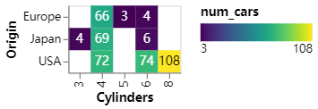
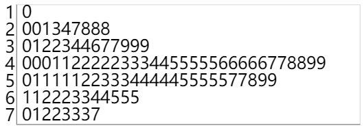

# Altair
Altair是基于Vega和Vega-Lite的用于Python的声明式统计可视化库。

Altair提供了强大而简洁的可视化语法，使您能够快速构建各种统计可视化。这是一个使用Altair API通过交互式散点图快速可视化数据集的示例：
```
import altair as alt

# load a simple dataset as a pandas DataFrame
from vega_datasets import data
cars = data.cars()

alt.Chart(cars).mark_point().encode(
    x='Horsepower',
    y='Miles_per_Gallon',
    color='Origin',
).interactive()
```

关键思想是您要声明数据列和可视编码通道（例如x轴，y轴，颜色等）之间的链接。其余的绘图详细信息将自动处理。在此声明性绘图思想的基础上，可以使用相对简洁的语法创建令人惊讶的范围，从简单到复杂的绘图和可视化。

## Installation
```
$ pip install altair vega_datasets
$ conda install -c conda-forge altair vega_datasets
```

## Text Over A Heatmap
```
import altair as alt
from vega_datasets import data

source = data.cars()

# Configure common options
base = alt.Chart(source).transform_aggregate(
    num_cars='count()',
    groupby=['Origin', 'Cylinders']
).encode(
    alt.X('Cylinders:O', scale=alt.Scale(paddingInner=0)),
    alt.Y('Origin:O', scale=alt.Scale(paddingInner=0)),
)

# Configure heatmap
heatmap = base.mark_rect().encode(
    color=alt.Color('num_cars:Q',
        scale=alt.Scale(scheme='viridis'),
        legend=alt.Legend(direction='horizontal')
    )
)

# Configure text
text = base.mark_text(baseline='middle').encode(
    text='num_cars:Q',
    color=alt.condition(
        alt.datum.num_cars > 100,
        alt.value('black'),
        alt.value('white')
    )
)

# Draw the chart
heatmap + text
```



## Stem And Leaf Plot
```
import altair as alt
import pandas as pd
import numpy as np
np.random.seed(42)

# Generating random data
source = pd.DataFrame({'samples': np.random.normal(50, 15, 100).astype(int).astype(str)})

# Splitting stem and leaf
source['stem'] = source['samples'].str[:-1]
source['leaf'] = source['samples'].str[-1]

source = source.sort_values(by=['stem', 'leaf'])

# Determining leaf position
source['position'] = source.groupby('stem').cumcount().add(1)

# Creating stem and leaf plot
alt.Chart(source).mark_text(
    align='left',
    baseline='middle',
    dx=-5
).encode(
    alt.X('position:Q', title='',
        axis=alt.Axis(ticks=False, labels=False, grid=False)
    ),
    alt.Y('stem:N', title='', axis=alt.Axis(tickSize=0)),
    text='leaf:N',
).configure_axis(
    labelFontSize=20
).configure_text(
    fontSize=20
)
```



## 参考资料：
- [Altair: Declarative Visualization in Python](https://altair-viz.github.io/index.html)