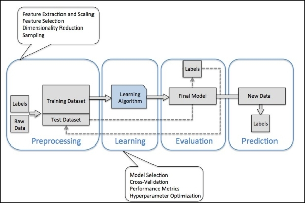

title: 机器学习之如何选择算法
date: 2017-05-22
tags: [机器学习,算法选择]
---
在我们深入之前，我们要明确我们了解了基础知识。具体来说，我们应该知道有三个主要的机器学习分类：监督学习（supervised learning）、无监督学习（unsupervised learning），以及强化学习（reinforcement learning）。

<!--more-->
## 怎么搭建机器学习模型？
概括地说，要搭建和使用一个机器学习模型，一般分为预处理、训练、评估和预测四个步骤。

### 预处理
`(Raw Data, Labels) => (Training Dataset, Test Dataset)`

- Feature Extraction
- Feature Selection
- Feature Scaling
- Dimensionality Reduction
- Sampling

### 训练
`(Training Dataset) => (Model)`

- Model Selection
- Cross-Validation
- Performance Metrics
- Hyperparameter Optimization

### 评估
`(Test Dataset, Model) => (Effect)`

### 预测
`(New Data, Model) => (Labels)`

## 可用的算法

### 分类（Classification）

#### 支持向量机（SVM）
通过尽可能宽的边缘方式发现分离类的边界。当二分式不能清晰的切分时，算法找到最好的边界。这个算法真正的亮点是强烈的数据特征，好像文本或者染色体组（>100特性）。在这些情况下，SVM比许多其他算法更快的切分二项，也更少地过度拟合，除了需要少量的内存。

#### 人工神经网络（Artificial neural networks）
是大脑启发学习算法，覆盖多项式分类、二项式分类，以及回归问题。它们带来了无限的多样性，包括感知和深度学习。它们花费很长时间进行训练，但是带来各种应用领域的先进性能。

#### 逻辑回归（Logistic regression）
虽然包含`回归`这个词，看上去有点令人费解，逻辑回归事实上是一个对于二项式和多项式分类来说强大的功能。它很快，且简单。事实是它使用了`S`形曲线代替直线让它对于切分数据进入组变得很自然。逻辑回归给出线性分类边界（linear class boundaries），所以当你使用它来确保一个线性近似的时候，类似于你生活中可以使用的一些东西。

#### 决策树和随机森林（Decision trees, random forests）
决策森林（回归、二项式，以及多项式），决策丛林（二项式、多项式），以及提高决策树（回归和二项式）所有被称为决策树，一种机器学习的基本概念。决策树的变种有很多，但是它们都做了相同的事情，使用相同的标签细分特征空间到各个区域。这些可以是一致类别或者恒定值的区域，依赖于是否你正在做分类或者回归。

### 回归（Regression）

#### 线性回归（Linear regression）
线性回归拟合直接（或者平台，或者超平面）数据集。这是一个工具，简单而快速，但是对于一些问题可能过于简单。

#### 贝叶斯线性回归（Bayesian linear regression）
它有非常可取的品质，避免了过度拟合。贝叶斯方式实现它通过对可能分布的答案作出一些假设。这种方式的其他副产品使它们有很少的参数。

#### 提高决策树回归
如上所述，提高决策树（回归或二项式）是基于决策树的，并通过细分大多数相同标签的特征空间到区域完成。提高决策树通过限制它们可以细分的次数和每一个区域的最小数据点数量避免过度拟合。算法构造一颗序列树，每一颗树学习补偿前树留下的错误。结果是非常准确的学习者，该算法倾向于使用大量内存。

### 聚类（Clustering）

#### 层次聚类（Hierarchical clustering）
层次聚类是一个层次结构的聚类，它有两种格式。聚集聚类（Agglomerative clustering）是一个“自下而上”的过程，其中每个观察从自己的聚类开始，随着其在层次中向上移动，成对的聚类会进行融合。分裂聚类（Divisive clustering）则是一种“自顶向下”的方式，所有的观察开始于一个聚类，并且会随着向下的层次移动而递归式地分裂。整体而言，这里进行的融合和分裂是以一种激进的方式确定。层次聚类的结果通常表示成树状图（dendrogram）形式。

#### K-均值聚类（K-means clustering）
目标是将n组观测值分为k个聚类，其中每个观测值都属于其接近的那个均值的聚类，这些均值被用作这些聚类的原型。这会将数据空间分割成Voronoidan单元。

### 异常检测（Anomaly detection）

#### K最近邻（K nearest neighbors）
用于分类和回归的非参数方法。在这两种情况下，输入都是由特征空间中k个最接近的训练样本组成的。在KNN分类中，输出是一个类成员。对象通过其k最近邻的多数投票来分类，其中对象被分配给k最近邻中最常见的类（k是一个正整数，通常较小）。在KNN回归中，输出为对象的属性值。该值为其k最近邻值的平均值。

#### 单类支持向量机（One-class SVM）
使用了非线性支持向量机的一个巧妙的扩展，单类支持向量机可以描绘一个严格概述整个数据集的边界。远在边界之外的任何新数据点都是足够非正常的，也是值得特别关注的。

## 适用的算法
对于给定的问题，通常会有一些候选算法可以适用。至于我们如何知道哪一个可以挑选？通常，这个问题的答案不是那么直截了当的，所以我们必须反复试验。

原型开发最好分两步完成。第一步，我们希望通过最小化特征工程快速而简单地完成几种算法的实现。在这个阶段，我们主要兴趣在粗略来看那个算法表现更好。这个步骤有点类似招聘：我们会尽可能地寻找可以缩减我们候选算法列表的理由。

一旦我们将列表缩减为几个候选算法，真正的原型开发开始了。理想地，我们想建立一个机器学习流程，使用一组经过精心挑选的评估标准比较每个算法在数据集上的表现。在这个阶段，我们只处理一小部分的算法，所以我们可以把注意力转到真正神奇的地方：特征工程。

## 特征工程
或许比选择算法更重要的是正确选择表示数据的特征。从上面的列表中选择合适的算法是相对简单直接的，然而特征工程却更像是一门艺术。

主要问题在于我们试图分类的数据在特征空间的描述极少。利如，用像素的灰度值来预测图片通常是不佳的选择；相反，我们需要找到能提高信噪比的数据变换。如果没有这些数据转换，我们的任务可能无法解决。利如，在方向梯度直方图（HOG）出现之前，复杂的视觉任务（像行人检测或面部检测）都是很难做到的。

虽然大多数特征的有效性需要靠实验来评估，但是了解常见的选取数据特征的方法是很有帮助的。这里有几个较好的方法：

1. 主成分分析（Principal component analysis, PCA）。一种线性降维方法，可以找出包含信息量较高的特征主成分，可以解释数据中的大多数方差。
2. 尺度不变特征变换（Scale-invariant feature transform, SIFT）。计算机视觉领域中的算法，用以检测和描述图片的局部特征。它有一个开源的替代方法：ORB（Oriented FAST and rotated BRIEF）。
3. 加速稳健特征（Speeded up robust features, SURF）。SIFT的更稳健版本。
4. 方向梯度直方图（Histogram of oriented gradients, HOG）。一种特征描述方法，在计算机视觉中用于计数一张图像中局部部分的梯度方向的发生。

当然，你也可以想出你自己的特征描述方法。如果你有几个候选方法，你可以使用封装好的方法进行智能的特征选择。前向搜索：

1. 最开始不选取任何特征；
2. 然后选择最相关的特征，将这个特征加入到已有特征；计算模型的交叉验证误差，重复选取其它所有候选特征；最后，选取能使你交叉验证误差最小特征，并放入已选择的特征之中；
3. 重复，直到达到期望数量的特征为止！

反向搜索：

1. 从所有特征开始；
2. 先移除最不相关的特征，然后计算模型的交叉验证误差；对其它所有候选特征，重复这一过程；最后，移除使交叉验证误差最大的候选特征；
3. 重复，直到达到期望数量的特征为止！

使用交叉验证的准则来移除和增加特征！

## 超参数优化（可选）
你可能想优化算法的超参数。例如，主成分分析中的主成分个数，k近邻算法的参数k，或者是神经网络中的层数和学习速率。最好的方法是使用交叉验证来选择。

一旦你运用了上述所有方法，你将有很好的机会创造出强大的机器学习系统。但是，你可能也猜到了，成败在于细节，你可能不得不反复实验，最后才能走向成功。

## 参考资料：
- [学习机器学习之如何根据需求选择一种算法](http://www.infoq.com/cn/news/2017/03/Learning-machine-Demand-selectio)
- [How to choose the right algorithm for your machine learning problem](http://www.askaswiss.com/2017/02/how-to-choose-right-algorithm-for-your-machine-learning-problem.html)