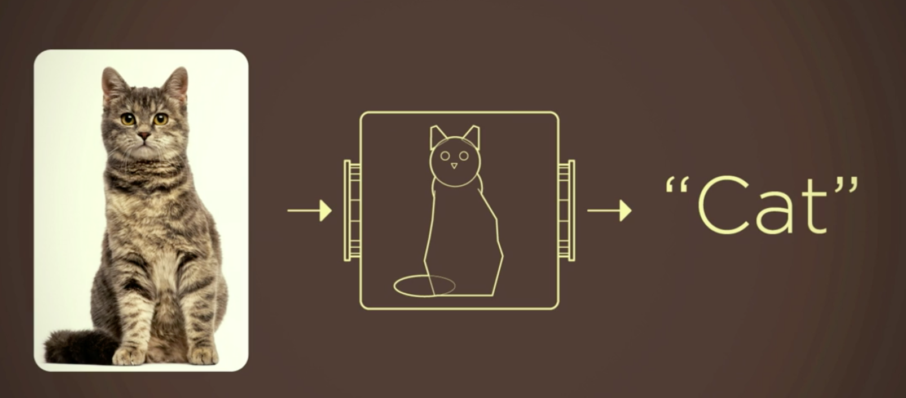
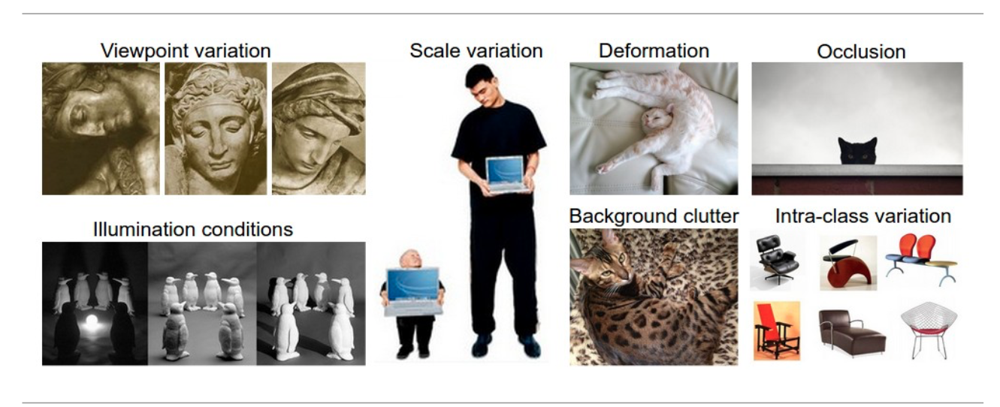
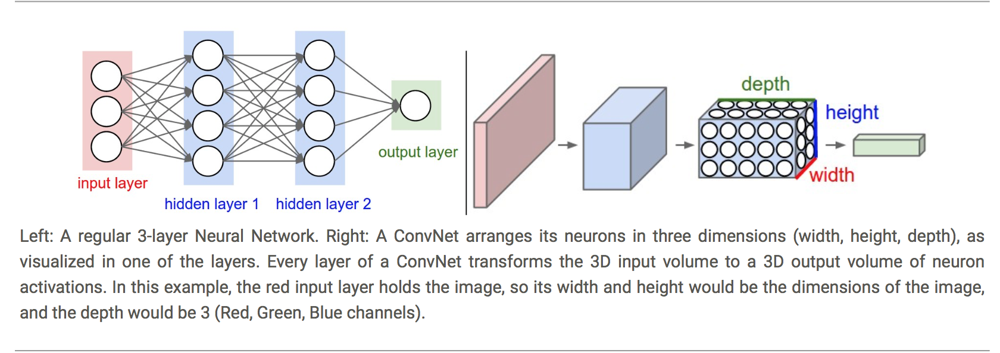
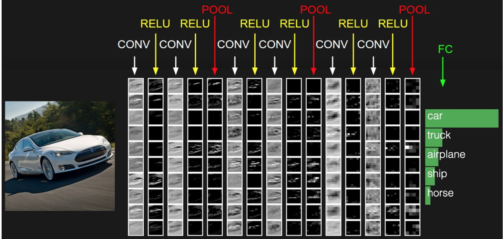
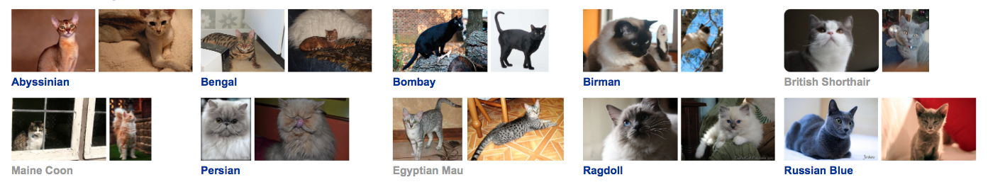
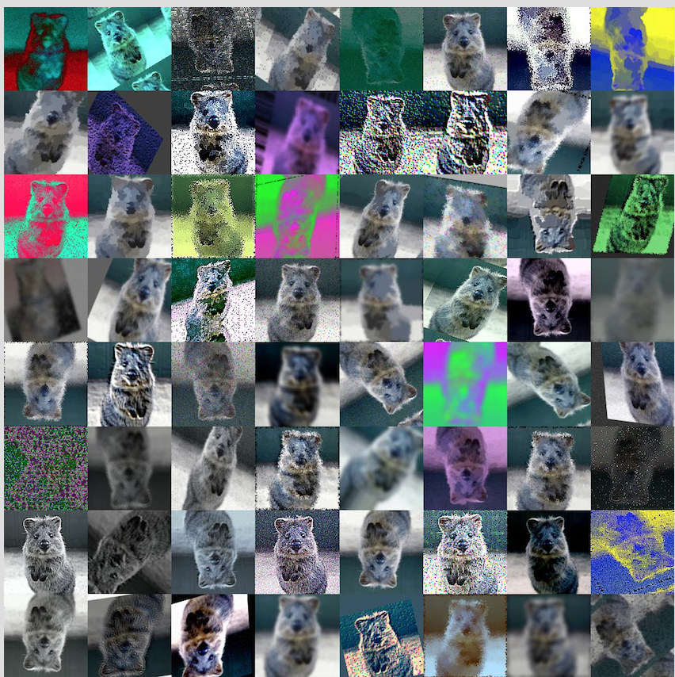
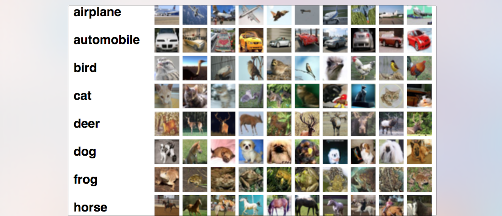
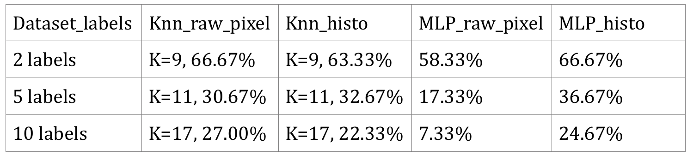
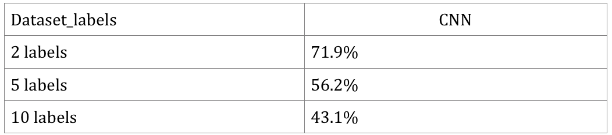
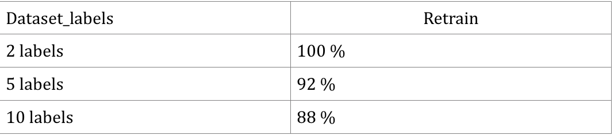

title: 机器学习之图像分类的3种方法
date: 2017-05-24
tags: [机器学习,图像分类]
---
图像分类方法简单的归纳为:

- 使用KNN，SVM和BP神经网络,我们在课堂上学到的算法;
- CNN,一种前馈神经网络,卷积神经网络包括卷积层和池层;
- 迁移学习,再次训练预先训练的深层神经网络的最后一层;

<!--more-->
## 动机

图像分类问题是从固定的一组分类中分配输入图像一个标签的任务。这是计算机视觉的核心问题之一，尽管它的简单性，有各种各样的实际应用。

### 传统方式
功能描述和检测：



但实际情况要复杂得多：



因此，我们将为每个类别提供许多示例，然后开发学习算法来审视这些例子，了解每个类的视觉外观，而不是试图直接在代码中指定每一个大家感兴趣的类别是什么样的。然而，图像分类问题是一个复杂的工作，总是用诸如卷积神经网络这样的深度学习模型来完成。我们知道，像KNN和SVM等许多算法通常在许多数据挖掘问题上表现很好。但似乎它们有时不是图像分类问题的最佳选择。因此，我们想比较我们在课堂中学到的算法与CNN和迁移学习的性能。

## 目标

1. 比较我们在课堂上学习的通常算法，通常在工业中用于图像分类问题的2种方法，即CNN和迁移学习。
2. 获得深度学习的经验。
3. 通过Google - TensorFlow探索机器学习框架。

## 算法和工具
我们在这个项目中使用的5种方法是KNN，SVM，BP神经网络，卷积神经网络和迁移学习。整个项目分为3种方法：

1. 使用KNN，SVM和BP神经网络，这是我们在课堂上学到的算法。有强大而且易于实施。我们主要使用sklearn来实现这些算法。
2. 传统的多层感知器（MLP）模型成功地用于图像识别，由于节点之间的完全连通性受到维度诅咒的影响，因此不能很好地扩展到更高分辨率的图像。所以在这一部分我们使用Google的TiffFlow的深度学习框架来构建一个CNN。
3. 再次训练由TensorFlow提供的预先训练的深层神经网络（称为Inception V3）的最后一层。初创版V3使用2012年的数据为ImageNet大型视觉识别挑战进行了培训。这是计算机视觉中的标准任务，其中模型尝试将整个图像分为1000个类别，如“斑马”，“达尔马提亚”和“洗碗机”。为了重新训练这个预先训练的网络，我们需要确保我们自己的数据集尚未被预先训练。

## 如何实现

### 第一种方法
预处理数据集，并应用sklearn的KNN，SVM和BP神经网络。

首先，我们使用openCV包定义了两种不同的预处理函数：第一种称为图像到特征向量，调整图像大小，然后将图像平坦化为行像素列表。第二个称为提取颜色直方图，使用`cv2.normalize`从HSV颜色间距中提取3D颜色直方图，然后平坦化结果。

然后，我们构造我们需要解析的几个参数。因为我们要测试这个部分的准确性，不仅对于整个数据集，还要测试具有不同数量标签的子数据集，我们将数据集构造为解析到我们的程序中的参数。并且我们还构造了用于KNN方法的邻居数作为解析参数。

之后，我们开始提取数据集中的每个图像特征并将其放入数组中。我们使用`cv2.imread`来读取每个图像，通过从图像名称中提取字符串来拆分标签。在我们的数据集中，我们使用相同的格式设置名称：`class label.image number.jpg`，因此我们可以轻松地提取每个图像的类标签。然后我们使用我们之前定义的2个函数来提取2种特征，并附加到数组rawImages和特征中，而我们之前提取的标签则附加到数组标签。

下一步是使用从`sklearn`包导入的函数`train_test_split`拆分数据集。具有后缀`RI,RL`的集合是rawImages和标签对的拆分结果，另一个是特征和标签对的拆分结果。我们使用85％的数据集作为训练集，15％作为测试集。

最后，我们应用KNN，SVM和BP神经网络功能来评估数据。对于`KNN`，我们使用`KNeighborsClassifier`，对于`SVM`，我们使用`SVC`，对于BP神经网络，我们使用`MLPClassifier`。

### 第二种方法
使用TensorFlow构建CNN。TensorFlow的目的是让您构建一个计算图（使用任何类似Python的语言），然后用C++执行图形操作，这比直接用Python执行要高得多。

TensorFlow还可以自动计算优化图形变量所需的梯度，以使模型更好地运行。这是因为图形是简单数学表达式的组合，因此可以使用导数的链式规则来计算整个图形的梯度。

TensorFlow图由以下部分组成：

- 用于将数据输入图表的占位符变量。
- 要进行优化的变量，以便使卷积网络运行得更好。
- 卷积网络的数学公式。
- 可用于指导变量优化的成本衡量标准。
- 一种更新变量的优化方法。

CNN架构由一堆不同的层组成，通过可微分函数将输入变量转换为输出变量：



所以在我们的实现中，第一层是保存图像，然后我们构建了3个具有2×2最大池和ReLU的卷积层。输入是一个四维张量，具有以下尺寸：

- 图像编号。
- 每个图像的Y轴。
- 每个图像的X轴。
- 每个图像的通道。

输出是另一个4-dim张量，具有以下尺寸：

- 图像号，与输入相同。
- 每个图像的Y轴。如果使用2×2池，则输入图像的高度和宽度除以2。
- 每个图像的X轴。同上。
- 由卷积滤波器产生的通道。

然后我们在网络末端构建了2个完全连接的层。输入是形状为2-dim的张量`[num_images, num_inputs]`。输出是形状为2-dim的张量`[num_images, num_outputs]`。然而，为了连接卷积层和完全连接层，我们需要一个平坦层，将4-dim张量减小到2-dim，可以用作完全连接层的输入。CNN的最后端始终是一个softmax层，它将来自全连接层的输出归一化，使得每个元素被限制在0和1之间，所有元素总和为1。



为了优化训练结果，我们需要一个成本衡量标准，并在每次迭代尽量减少。我们在这里使用的成本函数是交叉熵（从`tf.nn.oftmax_cross_entropy_with_logits()`调用），并对所有图像分类采用交叉熵的平均值。该优化方法是`tf.train.AdamOptimizer()`，是GD的高级形式。参数学习率可以调整。

### 第三种方法
重新训练物体识别模型有数百万个参数，可能需要几周才能完全训练。迁移学习是一种技术，可以通过为一组类别（如ImageNet）采用训练过的模型来快速完成大量的工作，并从现有权重训练新的类别。虽然它不如全面的训练运行，但对于许多应用来说，这是非常有效的，只需在笔记本电脑上运行三十分钟，而无需GPU。对于这部分实现，我们按照这里的说明：[链接](https://www.tensorflow.org/tutorials/image_retraining)。

首先，我们需要获得预先训练的模型，删除旧的顶层，并在我们拥有的数据集上训练一个新的模型。没有一个猫品种在原始的ImageNet类中，完整的网络被训练了。迁移学习的神奇之处在于，经过训练以区分某些对象的较低层可以重用于许多识别任务而无需任何更改。然后我们分析磁盘上的所有图像，并计算其中每个图像的瓶颈值。查看[bottleneck](https://www.tensorflow.org/tutorials/image_retraining)的详细信息。因为每个图像在训练过程中被重复使用多次，所以每个瓶颈都需要花费大量的时间，因此可以加快缓存这些瓶颈，从而不必重复计算。

该脚本将运行4000个训练步骤。每个步骤从训练集中随机选择十个图像，从缓存中发现其瓶颈，并将它们馈送到最后一层以获得预测。然后将这些预测与实际标签进行比较，以通过反向传播过程更新最终层的权重。

## 开始实验

### 数据集
牛津IIIT宠物[数据集](http://www.robots.ox.ac.uk/~vgg/data/pets/)，有25个品种的狗和12个品种的猫。每个品种有200张图像。我们在项目中只使用了10只猫品种。



我们在这里使用的类型是`['Sphynx'，'Siamese'，'Ragdoll'，'Persian'，'Maine-Coon'，'British-shorthair'，'Bombay'，'Birman'，'Bengal']`。所以我们在数据集中共有2000张图像。尺寸彼此不同。但是我们将它们调整为固定大小，如`64x64`或`128x128`。

### 预处理
在这个项目中，我们主要使用OpenCV进行图像数据的处理，像将图像读入数组，并重新形成我们需要的尺寸。改进图像训练结果的一个常见方法是以随机方式变形，裁剪或增亮训练输入。这具有扩展训练数据的有效大小的优点，这归功于相同图像的所有可能的变化，并且倾向于帮助网络学习应对在分类器的现实使用中将发生的所有失真。



[请参阅链接](https://github.com/aleju/imgaug)

## 评估

### 第一种方法
在程序中有很多参数可以调整：在`image_to_feature_vector`函数中，我们设置的尺寸是`128x128`，我们之前也尝试过像`8x8`,`64x64`,`256x256`这样的大小。我们发现图像尺寸越大，精度越好。但是，大图像大小也会增加执行时间和消耗的内存。所以我们终于决定了图像尺寸为128x128，因为它不是太大，但也可以保证精度。

在`extract_color_histogram`函数中，我们将每个通道的`bin`数设置为`32,32,32`。同上一个函数，我们尝试了`8,8,8`和`64,64,64`，并且更高的数字可以产生更高的结果作为更高的执行时间。所以我们认为`32,32,32`是适当的。

对于数据集，我们尝试了3种数据集。第一个是具有400个图像的子数据集，2个标签。第二个是具有1000个图像的子数据集，5个标签。最后一个是整个数据集与1997图像，10个标签。并且我们将不同的数据集解析为程序中的参数。

- 在`KNeighborsClassifier`中，我们只更改了邻居数，并将结果存储为每个数据集的最佳`K`。我们设置的所有其他参数为默认值。
- 在`MLPClassifier`中，我们设置了一个含有50个神经元的隐藏层。我们测试了多个隐藏层，但最终结果似乎没有明显变化。最大迭代时间为1000，容差为`1e-4`，以确保其收敛。并将L2惩罚参数α设置为默认值，随机状态为1，求解器为“sgd”，学习速率为0.1。
- 在`SVC`中，最大迭代时间为1000，类别权重为“平衡”。

我们的程序的运行时间不是很长，从2个标签数据集到10个标签数据集需要大约3到5分钟。

### 第二种方法
使用大型数据集的整体计算模型的梯度需要很长时间。因此，我们仅在优化器的每次迭代中使用少量图像。批量大小通常为32或64。数据集分为包含1600张图像的训练集，验证集包含400张图像，测试集包含300张图像。有很多参数可以调整：

- 首先是学习率。只要它足够小，可以收敛和足够大，不会使程序太慢，学习率很高。我们选择了`1e-4`。
- 第二个是我们向网络提供的图像的大小。我们尝试了`64*64和`128*128`，事实证明，更大的图像，我们可以获得更好的准确性。
- 然后是层和它们的形状。但实际上有太多的参数可以调整，所以找到最佳值是非常困难的工作。

据网上很多资源，我们了解到，参数选择为建设网络是非常依赖于经验。起初我们试图建立一个比较复杂的网络。参数如下所示：
```
# Convolutional Layer 1.
filter_size1 = 5 
num_filters1 = 64

# Convolutional Layer 2.
filter_size2 = 5
num_filters2 = 64

# Convolutional Layer 3.
filter_size3 = 5
num_filters3 = 128 

# Fully-connected layer 1.
fc1_size = 256

# Fully-connected layer 2.
fc1_size = 256
```

我们使用3个卷积层和2个完全连接的层，都是相对复杂的。结果是过拟合。经过一千次迭代，我们的程序获得100％的训练精度，但测试精度只有30％。起初我很困惑为什么我们过度配合，我试图随机调整参数，事情没有变好。几天后，我碰巧看到一篇文章，谈到中国研究人员进行的深入学习项目。[链接](https://medium.com/@blaisea/physiognomys-new-clothes-f2d4b59fdd6a)他们指出，他们进行的研究是有问题的。“一个技术问题是，少于2000个例子不足以训练和测试像AlexNet这样的CNN，而不过度拟合”。所以我意识到，首先我们的数据集实际上很小，其次，我们的网络太复杂了。然后我尝试减少内核的数量层和大小。我尝试了很多参数，这是我们使用的最终结构：
```
# Convolutional Layer 1.
filter_size1 = 5 
num_filters1 = 64

# Convolutional Layer 2.
filter_size2 = 3
num_filters2 = 64

# Fully-connected layer 1.
fc1_size = 128             # Number of neurons in fully-connected layer.

# Fully-connected layer 2.
fc2_size = 128             # Number of neurons in fully-connected layer.

# Number of color channels for the images: 1 channel for gray-scale.
num_channels = 3
```

我们只使用2个小形状的卷积层和2个完全连接的层。结果不是那么好，4000次迭代后仍然过拟合，但是测试结果比以前好10％。我们仍然在寻找一种处理方法，但是显而易见的原因是我们的数据集不足，我们没有足够的时间进行更多的改进。结果，5000次迭代后，我们大概达到43％的精度，运行时间超过半小时。

PS：实际上，由于这个结果，我们感到有些不安，甚至没有感觉到图像训练过程需要多长时间。所以我们发现了另一个标准的数据集称为[CIFAR-10](https://www.cs.toronto.edu/~kriz/cifar.html)。



`CIFAR-10`数据集由10个类别的60000张`32x32`彩色图像组成，每个类别有6000张图像。有50000个训练图像和10000个测试图像。我们使用上面构造的相同网络，经过10小时的训练，我们在测试集上有78％的准确性。

### 第三种方法
有很多参数可以调整：`training steps`默认是4000，如果我们可以得到一个合理的结果，我们可以尝试更多或尝试一个较小的。`--learning rate`控制更新到最后一层的训练过程中的大小。直观地说，如果这个更小，那么学习将需要更长时间，但最终可以帮助整体精度。`--train batch`控制在一个培训步骤中检查了多少图像，并且由于每批次应用学习速率，所以如果您有更大的批次以获得相同的整体效果，我们将需要减少它们。

因为是深度学习任务，运行时间通常很长，所以不希望经过数小时后才知道我们的模式实际上是糟糕的。所以我们经常报告验证准确性。这样我们也可以避免过度配合。分裂将80％的图像放入主要训练集中，保持10％作为训练期间的验证频繁运行，然后将最终10％的图像用作测试集，以预测现实世界的表现的分类器。

## 结果

### 第一种方法
因为SVM的结果非常差，甚至低于随机猜测，所以我们没有提供结果。



从结果我们可以看到：

- 在KNN中，原始像素精度和直方图精度相对相同。在5个标签子数据集中，直方图精度比原始像素高一点，但是在所有原始像素中，原始像素显示更好的结果。
- 在神经网络MLP分类器中，原始像素精度远低于直方图精度。对于整个数据集（10个标签），原始像素精度甚至低于随机猜测。
- 所有这两种sklearn方法都没有给出非常好的性能，在整个数据集（10个标签数据集）中识别正确类别的准确性只有约24％。这些结果表明，使用sklearn方法进行图像识别不够好。他们不能为许多类别的复杂图像提供良好的表现。但是，与随机猜测相比，他们确实做了一些改进，但还不够。

基于结果，我们发现为了提高准确性，必须采用一些深入学习的方法。

### 第二种方法


通常需要半小时的时间训练，但是由于结果过度，我们认为这个运行时间并不重要。我们可以看到：虽然CNN过拟合，但是我们仍然比方法1得到更好的结果。

### 第三种方法


整个训练进度不超过10分钟。我们取得了非常好的成绩。我们实际上可以看到深度学习和迁移学习的力量。

## 参考资料：
- [Image_Classification_with_5_methods](https://github.com/Fdevmsy/Image_Classification_with_5_methods)
