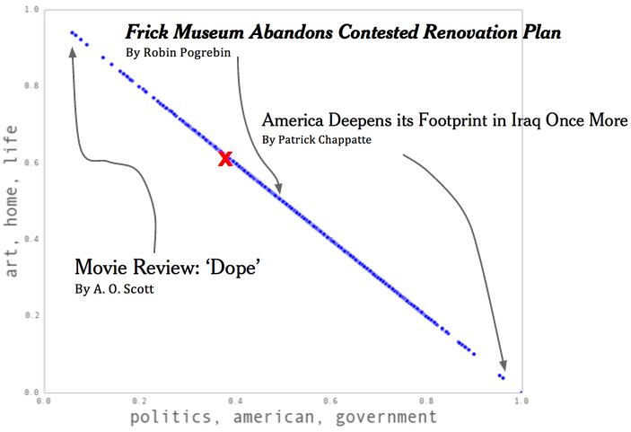
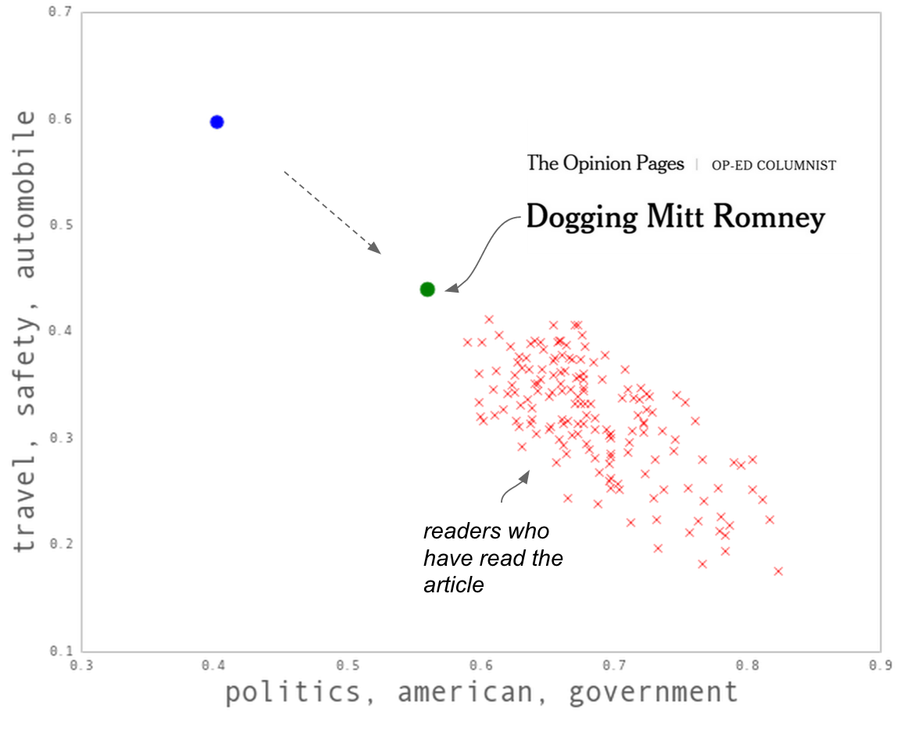
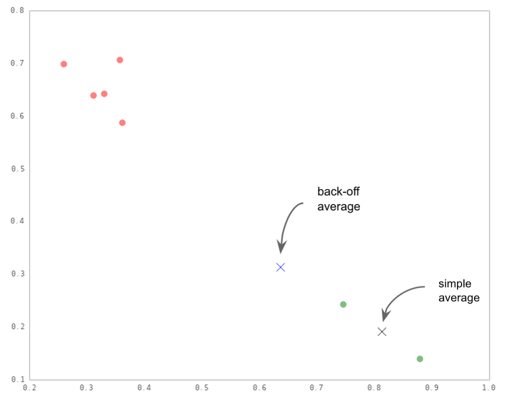

title: 纽约时报de推荐系统
date: 2015-10-27
tags: [Recommend]
---
本文将介绍最近《纽约时报》推荐算法的改造过程，目前该算法主要应用于《纽约时报》网站“Recommended for You”栏目。希望推荐系统能够使《纽约时报》不断变化，在恰当的时机为读者推送有意思的文章。推荐系统还能为我们提供文章如何选材和可能吸引哪些读者方面的建议。

<!--more-->
## 基于内容的过滤
新闻推荐必须要适用于新鲜的内容：许多读者还没有浏览过的突发新闻。因此，在发布时可用的文章数据就显得至关重要，这些数据包括：话题、作者、频道和每篇文章相关的关键字标签。

我们的第一个推荐系统就是根据这些关键词标签来做出推荐的。通过使用文章的标签和用户30天内的阅读历史，算法找出已经被阅读过的内容相似的文章。

该方法从一开始就具有很强的吸引力：如果一位读者阅读了10篇含有“Clinton”（克林顿）标签的文章，那么以后如果出现含有“Clinton”标签的文章他们很可能会喜欢。这种方法不仅适用于过去的内容，也同样适用于新内容，因为它依赖于内容发布时可用的数据。

然而，依赖于内容模型，有时可能产生意想不到的效果。因为算法是基于标签在语料库中的稀缺性来赋予权重的，少见的标签影响大。绝大多数情况下这种方法有效，但偶尔也会降低用户的体验。比如，有位读者指出，虽然她关注与同性相关的新闻，但她偶尔会在“婚礼”栏目中看到系统给她推荐与异性恋夫妇婚礼相关的报道。这就是因为“婚礼和订婚”这个低频标签曾经在一篇之前的文章中被读者点击，因此权重高于其他也许更符合这位读者兴趣的标签。

## 协同过滤
为了弥补前述方法的不足，我们测试了协同过滤方法。协同过滤基于有共同特征的读者所阅读的内容来过滤文章，“共同特征”是由阅读历史来决定的。

这种方法也颇有吸引力：如果一位读者的阅读偏好与另一位读者非常相似，那么这位读者读过的文章，另一位读者也可能感兴趣，反之亦然。

然而，这种方法在推荐最新发布的未阅读文章时并不奏效：与某个读者群相关的最新文章并没有被这个读者群中的任何一个读者阅读过。协同过滤可能也会在假设情况下以一种狭隘的视角聚集一些阅读模式。

## 现行做法
现在看来，结合两种技术可以取二者所长。我们建立了一种算法，灵感来源于“协同话题模型”（Collaborative Topic Modeling, CTM）技术，算法由四部分组成：

1. 基于内容建模；
2. 根据监测来自于读者的信号来调整模型；
3. 基于读者偏好建模；
4. 基于偏好和内容之间的共同特征来做出推荐。

算法建模的第一步是把每篇文章处理成与其相关的话题集合。可以把话题看成是一个没有被观察到的主题，比如“政治”或“环境”，这个主题影响了文章中我们能够观察到的文字。举个例子，如果一篇文章与环境相关，那么我们期望文章中出现类似“树”或“保护”这类单词。

我们基于每位读者的话题偏好来对他们建模。然后可根据文章话题与读者偏好话题的匹配程度来推送相关文章。

下面举个例子：假设所有上个月《纽约时报》发布的文章都可归属于两个话题，我们基于这个假设来运行算法。在这个条件下，算法会大致将这些话题识别为两类：“政治”和“艺术”。当算法发现这样一篇文章：《美国在伊拉克的足迹进一步深入》，这篇文章会被标记为100%的“政治”；当发现一篇影评，这篇文章会被标记为100%“艺术”。算法还可对文章混合标记，比如一篇与艺术政治相关的文章：《弗里克博物馆放弃遭受质疑的翻新方案》，被标记为50%的“政治”文章和50%的“艺术”文章。在“政治”–“艺术”空间图中，也许可以用这种方式来描述：

下一步，假设读者60%的时间里喜欢阅读“艺术”文章，在40%的时间里喜欢阅读“政治”文章。我们可以在图中用红色的x表示这位读者。最为神奇的一点是，他们在空间上接近于与自己兴趣一致的文章，即便他们还没有阅读过这些文章；我们给读者推荐的就是在空间上最接近于他们的文章。

还有一些需要进一步回答的问题。这个话题空间图能捕捉模棱两可的单词用法吗？还有，如何才能最好地观察读者偏好？毕竟，用户点击并不是最稳健的数据来源：我相信在有时你点击的内容并不是自己真正喜欢的，有时又错过了自己会感兴趣的内容。

## 再次改进
我们仔细测试了很多方案，建立的算法让能够更好的回答这些问题，并且提供了一个新的理解《纽约时报》的强大方法。算法由三部分组成：

1. 如何基于一篇文章的文本来建立该文章的模型；
2. 如何基于受众的阅读模式更新模型；
3. 如何基于阅读历史描述读者。

### 如何基于一篇文章的文本来建立该文章的模型
首先，算法会检查每篇文章的内容，然后应用“隐狄利克雷分布”（Latent Dirichlet Allocation, LDA）模型，这是一种内容建模算法。LDA模型可以学习每篇文章中的所有“话题”：这里“话题”的正式定义是基于词汇的分布。如果一个文档涉及某个权重值高的话题，那么文章中可观测到的文字就更加有可能是在某个话题下权重高的文字。

LDA模型是能够满足我们各种目标的快速、准确的方法，可以实现在线推理计算（或者当新文章发布后实时学习话题）。LDA模型趋向于更广泛的话题（比如“中东”、“电影”、“医疗保健”等），这使得我们可以从不同的角度来关联不同的片段。

LDA模型基于图形化模型，该模型可以很容易地进行扩展，整合新的假设和信息。在我们的案例中，扩展模型的方法不仅仅是对文章的文字进行建模，还会对阅读文章的具体读者进行建模，这点会在下节介绍。

### 如何基于受众的阅读模式更新模型
LDA模型将单词作为输入，但是单词经常是模棱两可的：语境、风格和声音都可以改变单词的意思。比如，如果盖尔·科林写了一篇包含“狗”、“车”和“屋顶”的文章，我们能据此看出来她这是在讽喻吗？能看出她不仅仅是在写一篇关于动物或关于汽车的文章吗？

事实上，纯粹的基于LDA模型的方法会赋予“旅行”这个标签更多的权重，并把盖尔·科林这篇文章放在下图中蓝点的位置：

然而，大部分阅读过这篇文章的读者还阅读了与希拉里·克林顿和特德·鲁兹相关的文章（在下图中用红色x标出的地方），所以我们希望算法能让这篇文章靠近图中绿色的区域，也就是接近“政治”话题。正如与CTM模型相关的论文中描述的那样，通过将偏移量（offset）添加到模型话题错误中，算法在内容建模基础上包含了阅读模式，从而创建了一种混合方法。

通过迭代调整偏移量，然后重新计算读者评分的方式，CTM模型算法是可行的。它会正常运行至几乎没有什么需要调整的情况。一个随机选择的读者样本（称之为“训练样本”）为我们提供了需要的信息。

我们测试过两种计算偏移量的方法：CTM模型和“协同泊松分解”（Collaborative Poisson Factorization, CPF）。在线进行A/B测试时，CTM模型表现得更好。

## 如何基于阅读历史描述读者
用于调整文章话题的方法同样可以计算读者偏好，但没法扩展到所有用户中。因此，需要一种计算读者偏好的快速方法，可以生成文章话题后使用。

有一种简单的方法，即计算所有阅读过的文章的话题的平均值：如果点击了一篇标记为40%“政治”话题和60%“艺术”的文章，并且点击了另一篇标记为60%“政治”话题和40%“艺术”的文章，那么你在下图的“政治”-“艺术”话题空间图中所处的坐标点就是`[.5,.5]`。

然后，这种方法假设读者的点击完全反映其偏好。万一读者点击的是一篇他们不喜欢的文章呢？抑或是他们错过了可能喜欢的文章呢？解决这个问题的一种方法就是稍微妥协一点，比如说你虽然了点击了一篇文章，但仅仅是“90%喜欢”这篇文章，而没有阅读的文章则是“10%喜欢”。这样就给分析误点击的文章或者错过的好文章留下了更多空间：

上图中，绿点表示读者已读过的文章，红点表示读者尚未阅读。黑色的x可能是读者的偏好，这是通过根据已经阅读过文章的平均值计算出来的，而蓝色的x则通过妥协方法计算出来。

妥协方法允许我们在处理噪音数据时更稳健。我们还注意到，这个方法还令推荐给读者的冷门信息减少了，读者被推荐了更多的与其偏好不太相同但又感到意外欣喜的内容。

## 参考资料：
- [《纽约时报》如何打造新一代推荐系统](http://www.dataguru.cn/article-7886-1.html)