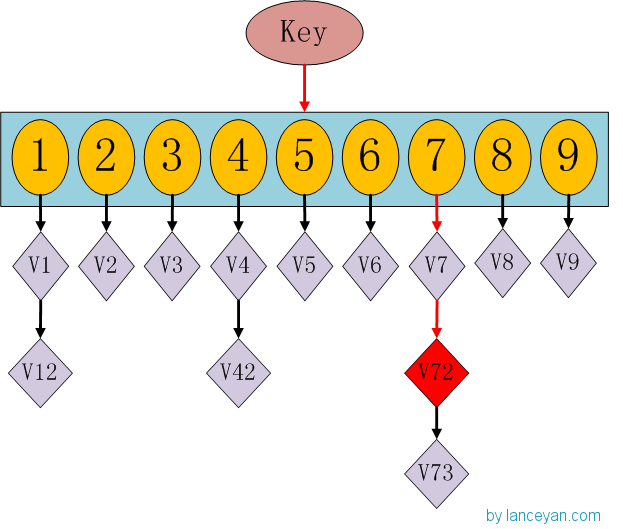
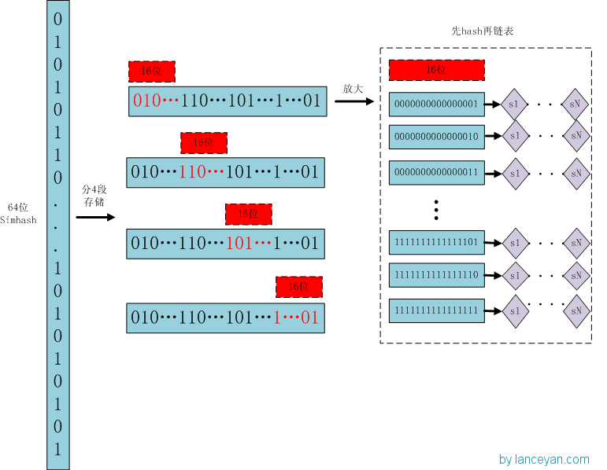

title: 海量文档相似度之Simhash
date: 2015-05-13
tags: [Simhash,BigData,Similarity]
---
Simhash是Google用来处理海量文本去重的算法，也是用来网页去重最常用的hash方法，本质上是局部敏感hash。Simhash为每个文档计算一个64位的指纹，然后只需要判断它们的指纹的距离是不是`<N(经验值取3)`，就可以判断两个文档是否相似。

<!--more-->
Simhash是由Charikar在2002年提出来的(同样受业界推崇的还有Broder提出的Shingling算法)，但Charikar的论文并没有给出具体的Simhash算法和证明。其实现过程如下图：

1. **分词**，把需要判断文本分词，去掉噪音词并为每个特征词加上权重，假设权重分为5个级别(1-5)。比如：“美国51区” => 分词为“美国(3) 51区(5)”。(括号内数字表示权重)
2. **hash**，通过hash算法把每个特征词变成hash值，比如“美国”的hash值为100101，“51区”的hash值为101011。就这样字符串变成了一串数字。
3. **加权**，按照权重加权数字串，比如“美国”的hash值为100101，加权为“+3-3-3+3-3+3”，“51区”的hash值为101011，加权为“+5-5+5-5+5+5”。(该位是1?+weight:-weight)
4. **合并**，然后对加权后的数字串对位累加，比如“美国”和“51区”对位累加，“+3+5 -3-5 -3+5 +3-5 -3+5 +3+5” => “+8 -8 +2 -2 +2 +8”。这里作为示例只计算了两个特征词，真实计算需对所有特征词。
5. **降维**，把计算出来的数字串变为01串。(该位大于1?1:0)最后输出为“101011”。
到此，如何从一个Doc到一个Simhash值的过程就说完了。这些麻烦的过程能较好的保证相似文本只有少部分01串变化了，而普通的hashcode去不能做到，这个就是局部敏感hash的魅力所在。

但是如何计算两个Simhash的相似度呢？难道是比较两个Simhash的01有多少个不同？对的，我们通过海明距离(Hamming distance)就可以计算出两个Simhash是否相似。

>注：Simhash用于比较大文本，比如500字以上效果都很好，距离小于3的基本都是相似的，误判率也比较低。但是如果我们处理的是最多也就140字的微博信息，效果就不那么理想了。

## 其他文本去重算法
**百度的去重算法**很简单，直接找出文章中最长的N句话，做一遍hash签名。(N一般取3)工程实现也简单，据说准确率和召回率都在80%以上。常见的还有余弦夹角算法、欧氏距离、Jaccard相似度、最长公共子串、编辑距离等，这些算法对于待比较文档数量不多时比较好用，对于海量数据应用场景就不现实了。

>假设业务需要1小时处理100w次，那么一次相似度计算最多只能消耗3.6ms。很多情况大家想到的就是升级、增加机器，但有些时候光是增加机器解决不了问题，何况就算增加机器也不是短时间能解决的，需要考虑分布式、预算等等。

## 比较5000w次怎么减少时间呢？
其实这也是一个查找过程，我们想想以前学过的查找算法：顺序查找、二分查找、索引查找、哈希查找。不过这个不是比较数值是否相同，而是比较海明距离，不过解决问题的过程大都是想通的。记得HashMap吗？我们要查找一个key值时，通过传入一个key就可以很快返回一个value，这个号称查找速度最快的数据结构是如何实现的呢？先看下HaspMap内部结构：

如果我们需要得到key对应的value，需要经过这些：计算key的HashCode，得到7的位置；发现7位置对应的value还有好几个，就通过链表查找，直到找到v72。其实通过这么分析，如果我们的HashCode设置的不够好，HashMap的效率也不见得高。借鉴这个算法，来设计我们的Simhash查找。通过顺序查找肯定是不行的，能否像HashMap一样先通过键值对的方式减少顺序比较的次数。看下图：

## 存储

1. 将64位的Simhash code拆分成4个16位的二进制码。(结合指纹距离经验取值3和抽屉原理，思考拆分成4个是偶然吗？)
2. 分别拿4个16位二进制码查找当前对应位置是否有元素。
3. 对应位置没有元素，直接追加到链表上，否则追加到链表的尾端。

## 查找

1. 将需要比较的Simhash code拆分成4个16位的二进制码。
2. 分别拿4个16位二进制码去查找Simhash集合对应位置是否有元素。
3. 如果有元素，则把链表拿出来顺序比较，找到海明距离小于指定值，整个过程完成。

## 原理
原来是5000w次顺序比较，现在是少了2的16次方比较，前面16位变成了hash查找。后面的顺序比较的个数是多少？`2^16=65536`，`5000w/65536=`763次，理论上最后链表比较的期望才763次！所以效率大大提高！不过，分为4个16位段的存储空间是单独Simhash存储空间的4倍。

## Simhash能否处理短文本？
换一种思路，Simhash可以作为局部敏感哈希第一次计算缩小整个比较的范围，等到我们只有比较700多次比较时，就算使用我们之前精准度高计算很慢的编辑距离也可以搞定。当然如果觉得慢了，也可以使用余弦夹角等效率稍微高点的相似度算法。

## 参考资料：
- [Simhash算法原理及实现](http://yanyiwu.com/work/2014/01/30/simhash-shi-xian-xiang-jie.html)
- [海量数据相似度计算之Simhash和海明距离](http://www.lanceyan.com/tech/arch/simhash_hamming_distance_similarity.html)
- [海量数据相似度计算之Simhash短文本查找](http://www.lanceyan.com/tech/arch/simhash_hamming_distance_similarity2-html.html)
- [Locality Sensitive Hash](http://grunt1223.iteye.com/blog/937600)