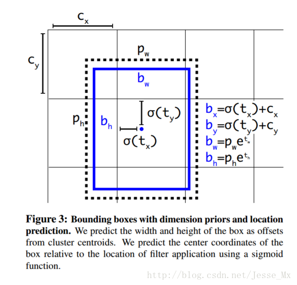
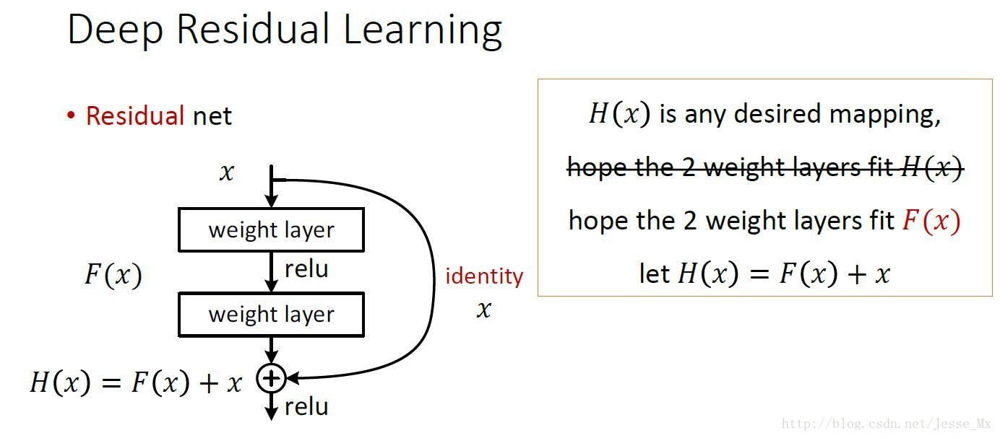
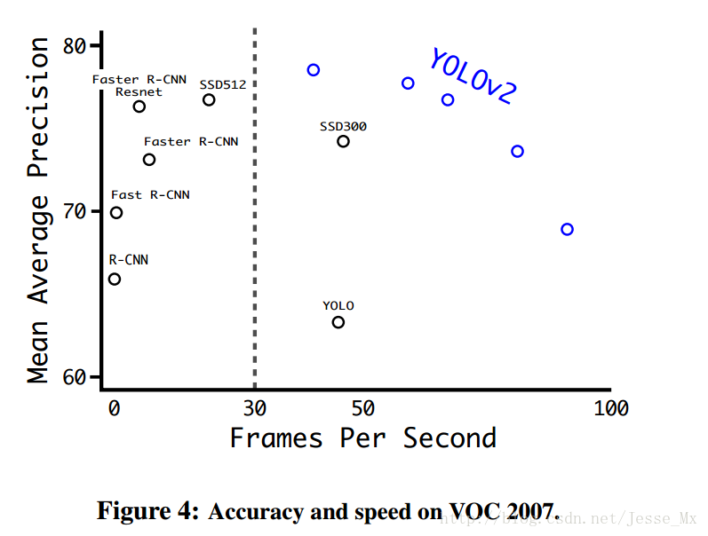
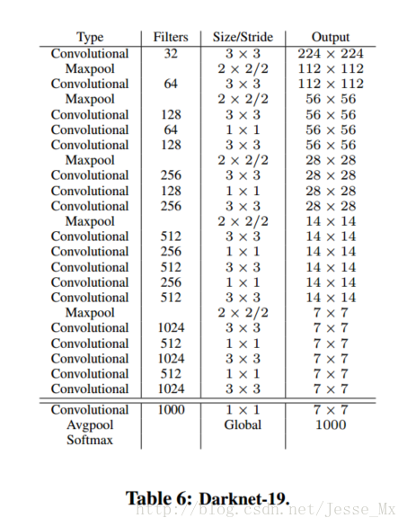

title: YOLOv2学习笔记
date: 2017-07-28
tags: [YOLO,YOLOv2]
---
YOLOv1使用了end-to-end的回归方法,没有region proposal步骤,直接回归便完成了位置和类别的判定.种种原因使得YOLOv1在目标定位上不那么精准,直接导致YOLO的检测精度并不是很高.YOLOv2对多目标检测框架进行了改进,在保持原有速度的优势之下,精度上得以提升.基本上可以与Faster R-CNN和SSD一战.

<!--more-->
## YOLOv2精度的改进
先来一个总览图,看看它到底用了多少技巧,以及这些技巧起了多少作用:

- Batch Normalization
- High Resolution Classifier
- Convolutional With Anchor Boxes
- Dimension Clusters
- Direct location prediction
- Fine-Grained Features
- Multi-Scale Training
- Further Experiments

### Batch Normalization
`CNN`在训练过程中网络每层输入的分布一直在改变,会使训练过程难度加大,但可以通过`normalize`每层的输入解决这个问题.新的YOLO网络在每一个卷积层后添加`batch normalization`,通过这一方法,`mAP`获得了2%的提升.`batch normalization`也有助于规范化模型,可以在舍弃`dropout`优化后依然不会过拟合.

### High Resolution Classifier
目前的目标检测方法中,基本上都会使用`ImageNet`预训练过的模型来提取特征,如果用的是`AlexNet`网络,那么输入图片会被resize到不足`256x256`,导致分辨率不够高,给检测带来困难.为此,新的YOLO网络把分辨率直接提升到了`448x448`,这也意味之原有的网络模型必须进行某种调整以适应新的分辨率输入.

对于YOLOv2,作者首先对分类网络,自定义的`darknet`,进行了`fine tune`,分辨率改成`448x448`,在`ImageNet`数据集上训练10轮,10 epochs,训练后的网络就可以适应高分辨率的输入了.然后,作者对检测网络部分,也就是后半部分,也进行`fine tune`.这样通过提升输入的分辨率,`mAP`获得了4%的提升.

### Convolutional With Anchor Boxes
之前的YOLO利用全连接层的数据完成边框的预测,导致丢失较多的空间信息,定位不准.作者在v2中借鉴了Faster R-CNN中的`anchor`思想.回顾一下,`anchor`是`RNP`网络中的一个关键步骤,说的是在卷积特征图上进行滑窗操作,每一个中心可以预测9种不同大小的建议框.看到YOLOv2的这一借鉴,我只能说SSD的作者是有先见之明的.

为了引入`anchor boxes`来预测`bounding boxes`,作者在网络中果断去掉了全连接层.剩下的具体怎么操作呢?首先,作者去掉了后面的一个池化层以确保输出的卷积特征图有更高的分辨率;然后,通过缩减网络,让图片输入分辨率为`416x416`,这一步的目的是为了让后面产生的卷积特征图宽高都为奇数,这样就可以产生一个`center cell`.作者观察到,大物体通常占据了图像的中间位置,就可以只用中心的一个`cell`来预测这些物体的位置,否则就要用中间的4个`cell`来进行预测,这个技巧可稍稍提升效率;最后,YOLOv2使用了卷积层降采样,factor为32,使得输入卷积网络的`416x416`图片最终得到`13x13`的卷积特征图,`416/32=13`.

加入了`anchor boxes`后,可以预料到的结果是召回率上升,准确率下降.我们来计算一下,假设每个`cell`预测9个建议框,那么总共会预测`13x13x9=`1521个`boxes`,而之前的网络仅仅预测`7x7x2=`98个`boxes`.具体数据为:没有`anchor boxes`,模型recall为81%,mAP为69.5%;加入`anchor boxes`,模型recall为88%,mAP为69.2%.这样看来,准确率只有小幅度的下降,而召回率则提升了7%,说明可以通过进一步的工作来加强准确率,的确有改进空间.

### Dimension Clusters
作者在使用`anchor`的时候遇到了两个问题,第一个是`anchor boxes`的宽高维度往往是精选的先验框,虽说在训练过程中网络也会学习调整boxes的宽高维度,最终得到准确的`bounding boxes`.但是,如果一开始就选择了更好的,更有代表性的先验`boxes`维度,那么网络就更容易学到准确的预测位置.

和以前的精选`boxes`维度不同,作者使用了`K-means`聚类方法类训练`bounding boxes`,可以自动找到更好的`boxes`宽高维度.传统的`K-means`聚类方法使用的是欧氏距离函数,也就意味着较大的`boxes`会比较小的`boxes`产生更多的error,聚类结果可能会偏离.为此,作者采用的评判标准是IOU得分,也就是`boxes`之间的交集除以并集,这样的话,error就和box的尺度无关了.平衡复杂度和IOU之后,最终得到k值为5,意味着作者选择了5种大小的box维度来进行定位预测.

### Direct location prediction
作者在使用`anchor boxes`时发现的第二个问题就是:模型不稳定,尤其是在早期迭代的时候.大部分的不稳定现象出现在预测box的`(x,y)`坐标上了.在区域建议网络中,预测`(x,y)`以及`t_x,t_y`使用的是如下公式:

\begin{align}
& x = (t_x \times w_a) + x_a \\
& y = (t_y \times h_a) + y_a
\end{align}

公式中,符号的含义:`x`是坐标预测值;`x_a`是`anchor`坐标,预设固定值;`t`变量是偏移量.

现在,神经网络在特征图`13x13`的每个`cell`上预测5个`bounding boxes`,聚类得出的值,同时每一个`bounding box`预测5个值,分别为`tx,ty,tw,th,to`,其中前四个是坐标`to`是置信度.如果这个`cell`距离图像左上角的边距为`(cx,cy)`以及该`cell`对应`box`的长和宽分别为`(pw,ph)`,那么预测值可以表示为:

\begin{align}
& b_x = \sigma (t_x) + c_x \\
& b_y = \sigma (t_y) + c_y \\
& b_w = P_w e^{t_w} \\
& b_h = p_h e^{t_h} \\
& Pr(object) * IOU(b,object) = \sigma (t_o)
\end{align}

### Fine-Grained Features
上述网络上的修改使YOLO最终在`13x13`的特征图上进行预测,虽然这足以胜任大尺度物体的检测,但是用上细粒度特征的话,这可能对小尺度的物体检测有帮助.Faser R-CNN和SSD都在不同层次的特征图上产生区域建议,获得了多尺度的适应性.这里使用了一种不同的方法,简单添加了一个转移层,这一层要把浅层特征图,分辨率为`26x26`,是底层分辨率4倍,连接到深层特征图.

这个转移层也就是把高低两种分辨率的特征图做了一次连结,连接方式是叠加特征到不同的通道而不是空间位置,类似于Resnet中的`identity mappings`.这个方法把`26x26x512`的特征图连接到了`13x13x2048`的特征图,这个特征图与原来的特征相连接.YOLO的检测器使用的就是经过扩张的特征图,它可以拥有更好的细粒度特征,使得模型的性能获得了1%的提升.

### Multi-Scale Training
原来的YOLO网络使用固定的`448x448`的图片作为输入,现在加入`anchor boxes`后,输入变成了`416x416`.目前的网络只用到了卷积层和池化层,那么就可以进行动态调整,意思是可检测任意大小图片.作者希望YOLOv2具有不同尺寸图片的鲁棒性,因此在训练的时候也考虑了这一点.

不同于固定输入网络的图片尺寸的方法,作者在几次迭代后就会微调网络.每经过10次训练,10 epoch,就会随机选择新的图片尺寸.这种机制使得网络可以更好地预测不同尺寸的图片,意味着同一个网络可以进行不同分辨率的检测任务.

在小尺寸图片检测中,YOLOv2成绩很好,输入为`228x228`的时候,达到90FPS,mAP几乎和Faster R-CNN的水准相同.使得其在低性能GPU,高帧率视频,多路视频场景中更加适用.在大尺寸图片检测中,YOLOv2达到了先进水平,VOC2007上`mAP`为78.6%,仍然高于平均水准:

## YOLOv2速度的改进
YOLO一向是速度和精度并重,作者为了改善检测速度,也作了一些相关工作.大多数检测网络有赖于`VGG-16`作为特征提取部分,`VGG-16`的确是一个强大而准确的分类网络,但是复杂度有些冗余.`224x224`的图片进行一次前向传播,其卷积层就需要多达306.9亿次浮点数运算.

YOLOv2使用的是基于Googlenet的定制网络,比`VGG-16`更快,一次前向传播仅需85.2亿次运算.可是它的精度要略低于`VGG-16`,单张`224x224`取前五个预测概率的对比成绩为88%和90%.

- Darknet-19
- Training for classification
- Training for detection

### Darknet-19
YOLOv2使用了一个新的分类网络作为特征提取部分,参考了前人的先进经验,比如类似于VGG,作者使用了较多的`3x3`卷积核,在每一次池化操作后把通道数翻倍.借鉴了`network in network`的思想,网络使用了全局平均池化,把`1x1`的卷积核置于`3x3`的卷积核之间,用来压缩特征.也用了`batch normalization`稳定模型训练.最终得出的基础模型就是`Darknet-19`.

其包含19个卷积层,5个最大值池化层.`Darknet-19`运算次数为55.8亿次,imagenet图片分类top-1准确率72.9%,top-5准确率91.2%.

### Training for classification
作者使用Darknet-19在标准1000类的ImageNet上训练了160次,用的随机梯度下降法,starting learning rate为0.1,polynomial rate decay为4,weight decay为0.0005,momentum为0.9.训练的时候仍然使用了很多常见的数据扩充方法,包括random crops,rotations,and hue,saturation,and exposure shifts.这些训练参数是基于darknet框架,和caffe不尽相同.

初始的`224x224`训练后,作者把分辨率上调到了`448x448`,然后又训练了10次,学习率调整到了0.001.高分辨率下训练的分类网络在top-1准确率76.5%,top-5准确率93.3%.

### Training for detection
分类网络训练完后,就该训练检测网络了,作者去掉了原网络最后一个卷积层,转而增加了三个`3x3x1024`的卷积层,可参考darknet中cfg文件,并且在每一个上述卷积层后面跟一个`1x1`的卷积层,输出维度是检测所需的数量.对于VOC数据集,预测5种boxes大小,每个box包含5个坐标值和20个类别,所以总共是`5x(5+20)=`125个输出维度.同时也添加了转移层,从最后那个`3x3x512`的卷积层连到倒数第二层,使模型有了细粒度特征.

作者的检测模型以0.001的初始学习率训练了160次,在60次和90次的时候,学习率减为原来的十分之一.其他的方面,weight decay为0.0005,momentum为0.9,依然使用了类似于Faster R-CNN和SSD的数据扩充`data augmentation`策略.

## YOLOv2分类的改进
这一部分,作者使用联合训练方法,结合词向量树(wordtree)等方法,使YOLOv2的检测种类扩充到了上千种,具体内容待续.

## 总结和展望
作者大概说的是,之前的技术改进对检测任务很有帮助,在以后的工作中,可能会涉足弱监督方法用于图像分割.监督学习对于标记数据的要求很高,未来要考虑弱标记的技术,这将会极大扩充数据集,提升训练量.

[阅读原文](http://blog.csdn.net/jesse_mx/article/details/53925356),推荐阅读[论文阅读：You Only Look Once: Unified, Real-Time Object Detection](http://blog.csdn.net/u010167269/article/details/52638771).