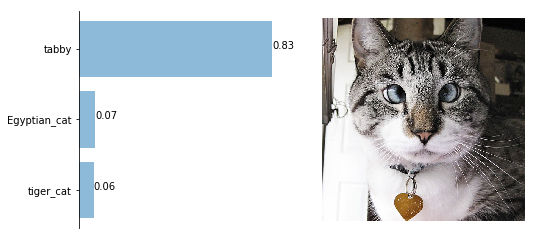

title: 使用ResNet进行图片预测
date: 2017-08-15
tags: [Keras,ResNet50]
---
在计算机视觉领域里,有3个最受欢迎且影响非常大的学术竞赛:`ImageNet ILSVRC`,大规模视觉识别挑战赛;`PASCAL VOC`,关于模式分析,统计建模和计算学习的研究;微软`COCO`图像识别大赛.教你用Keras和TensorFlow,实现对ImageNet数据集中日常物体的识别.

<!--more-->
## 你想识别什么?
看看ILSVRC竞赛中包含的物体对象.如果你要研究的物体对象是该列表1000个对象中的一个,运气真好,可以获得大量该类别图像数据!这个数据集包含的类别[imagenet_class_index](https://s3.amazonaws.com/deep-learning-models/image-models/imagenet_class_index.json).

如果你研究的物体对象不在该列表中,或者像医学图像分析中具有多种差异较大的背景,遇到这些情况该怎么办?可以借助迁移学习`transfer learning`和微调`fine-tuning`.

## ImageNet分类
我们接下来要载入ResNet50网络模型.首先,要加载`keras.applications.resnet50`模块,并使用在`ImageNet ILSVRC`比赛中已经训练好的权重.想了解ResNet50的原理,可以阅读论文[基于深度残差网络的图像识别](https://arxiv.org/pdf/1512.03385.pdf).
```
from keras.applications.resnet50 import ResNet50
model = ResNet50(weights='imagenet')
target_size = (224, 224)
```

建议手动下载[resnet50_weights_tf_dim_ordering_tf_kernels.h5](https://github.com/fchollet/deep-learning-models/releases/download/v0.2/resnet50_weights_tf_dim_ordering_tf_kernels.h5)并保存到`~/.keras/models`,接下来定义一个预测函数:
```
from keras.preprocessing import image
from keras.applications.resnet50 import preprocess_input, decode_predictions
import numpy as np

def predict(model, img, target_size, top_n=3):
    """Run model prediction on image
    Args:
        model: keras model
        img: PIL format image
        target_size: (width, height) tuple
        top_n: # of top predictions to return
    Returns:
        list of predicted labels and their probabilities
    """
    if img.size != target_size:
        img = img.resize(target_size)
    x = image.img_to_array(img)
    x = np.expand_dims(x, axis=0)
    x = preprocess_input(x)
    preds = model.predict(x)
    return decode_predictions(preds, top=top_n)[0]
```

在使用ResNet50网络结构时需要注意,输入大小`target_size`必须等于`(224,224)`.许多CNN网络结构具有固定的输入大小,ResNet50正是其中之一,作者将输入大小定为`(224,224)`.

- `image.img_to_array`:将PIL格式的图像转换为numpy数组
- `np.expand_dims`:将我们的`(3,224,224)`大小的图像转换为`(1,3,224,224)`.因为`model.predict`函数需要4维数组作为输入,这也就是说,我们可以一次性分类多个图像
- `preprocess_input`:使用训练数据集中的平均通道值对图像数据进行零值处理,即使得图像所有点的和为0.这是非常重要的步骤,如果跳过,将大大影响实际预测效果.这个步骤称为数据归一化
- `model.predict`:对我们的数据分批处理并返回预测值
- `decode_predictions`:采用与`model.predict`函数相同的编码标签,并从`ImageNet ILSVRC`集返回可读的标签
- `keras.applications`模块还提供4种结构:`ResNet50`,`InceptionV3`,`VGG16`,`VGG19`和`XCeption`,你可以用其中任何一种替换ResNet50.更多信息可以参考[Applications](http://keras-cn.readthedocs.io/en/latest/other/application/)

## 结果呈现
我们可以使用matplotlib函数库将预测结果做成柱状图,如下所示:
```
import matplotlib.pyplot as plt
from keras.preprocessing import image

def plot_preds(img, preds):
    """Displays image and the top-n predicted probabilities in a bar graph
    Args:
        img: PIL image
        preds: list of predicted labels and their probabilities
    """
    index = range(len(preds), 0, -1)
    datas = [pr[2] for pr in preds]
    names = [pr[1] for pr in preds]
    plt.figure(figsize=(8, 4))
    ax = plt.subplot(1, 2, 1)
    ax.barh(index, datas, alpha=0.5)
    for x, y in zip(datas, index):
        ax.text(x, y, '%.2f' % x)
    ax.set_xticks([])
    ax.set_yticks(index)
    ax.set_yticklabels(names)
    ax.spines['right'].set_visible(False)
    ax.spines['top'].set_visible(False)
    ax.spines['bottom'].set_visible(False)
    ax = plt.subplot(1, 2, 2)
    ax.imshow(img)
    ax.set_axis_off()
    plt.show()
```

## 主体部分
为了实现以下从网络中加载图片的功能:

    python classify.py --image wpxMwsR.jpg
    python classify.py --image_url http://i.imgur.com/wpxMwsR.jpg

我们将定义主函数如下:
```
import sys
import argparse
from PIL import Image
import requests
from io import BytesIO

if __name__=="__main__":
    a = argparse.ArgumentParser()
    a.add_argument("--image", help="path to image")
    a.add_argument("--image_url", help="url to image")
    args = a.parse_args()
    if args.image is None and args.image_url is None:
        a.print_help()
        sys.exit(1)
    if args.image is not None:
        img = Image.open(args.image)
        plot_preds(img, predict(model, img, target_size))
    if args.image_url is not None:
        response = requests.get(args.image_url)
        img = Image.open(BytesIO(response.content))
        plot_preds(img, predict(model, img, target_size))
```

完整程序和示例图像请查看[image_recognition](https://github.com/DeepLearningSandbox/DeepLearningSandbox).

## 简单测试
```
from PIL import Image
img = Image.open('cat.jpg')
plot_preds(img, predict(model, img, target_size))
```



## 参考资料:
- [实现ImageNet数据集日常对象的识别](https://zhuanlan.zhihu.com/p/26541005)
- [keras/applications/resnet50.py](https://github.com/fchollet/keras)