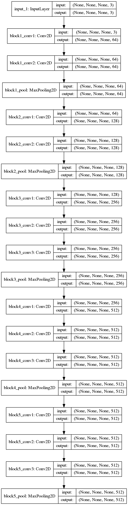
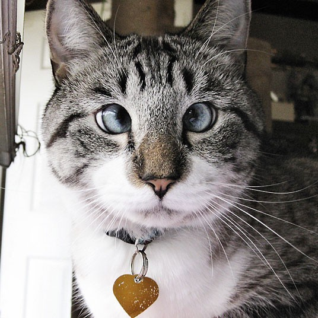

title: 使用VGG16进行图片预测
date: 2017-08-15
tags: [Keras,VGG16]
---
不管是VGG16本身的知名度,还是很多目标检测框架中都用它提取特征,VGG16都值得我们探索.该结构有13个卷积层,3个全连接层,共16层.

<!--more-->
## 展示VGG16模型结构
`keras.utils.vis_utils`模块提供了画出Keras模型的函数.需要依赖:
```
sudo apt-get install graphviz
pip install graphviz
pip install pydot
```

导入模型,画出模型结构图,并保存成图片:
```
from keras.applications.vgg16 import VGG16
model = VGG16(weights='imagenet', include_top=False)

from keras.utils import plot_model
plot_model(model, to_file='model.png', show_shapes=True, show_layer_names=True)
```



## 利用VGG16提取特征
```
from keras.applications.vgg16 import VGG16
from keras.preprocessing import image
from keras.applications.vgg16 import preprocess_input
import numpy as np

model = VGG16(weights='imagenet', include_top=False)

img_path = 'elephant.jpg'
img = image.load_img(img_path, target_size=(224, 224))
x = image.img_to_array(img)
x = np.expand_dims(x, axis=0)
x = preprocess_input(x)

features = model.predict(x)
```

`preprocess_input`使用训练数据集中的平均通道值对图像数据进行零值处理,即使得图像所有点的和为0.这是非常重要的步骤,如果跳过,将大大影响实际预测效果.算是比较简单的预处理.

## 自建VGG16模型网络
13个卷积层:
```
input_shape = (224, 224, 3)

from keras.layers import Input, Conv2D, MaxPooling2D

img_input = Input(shape=input_shape)

# Block 1
x = Conv2D(64, (3, 3), activation='relu', padding='same', name='block1_conv1')(img_input)
x = Conv2D(64, (3, 3), activation='relu', padding='same', name='block1_conv2')(x)
x = MaxPooling2D((2, 2), strides=(2, 2), name='block1_pool')(x)

# Block 2
x = Conv2D(128, (3, 3), activation='relu', padding='same', name='block2_conv1')(x)
x = Conv2D(128, (3, 3), activation='relu', padding='same', name='block2_conv2')(x)
x = MaxPooling2D((2, 2), strides=(2, 2), name='block2_pool')(x)

# Block 3
x = Conv2D(256, (3, 3), activation='relu', padding='same', name='block3_conv1')(x)
x = Conv2D(256, (3, 3), activation='relu', padding='same', name='block3_conv2')(x)
x = Conv2D(256, (3, 3), activation='relu', padding='same', name='block3_conv3')(x)
x = MaxPooling2D((2, 2), strides=(2, 2), name='block3_pool')(x)

# Block 4
x = Conv2D(512, (3, 3), activation='relu', padding='same', name='block4_conv1')(x)
x = Conv2D(512, (3, 3), activation='relu', padding='same', name='block4_conv2')(x)
x = Conv2D(512, (3, 3), activation='relu', padding='same', name='block4_conv3')(x)
x = MaxPooling2D((2, 2), strides=(2, 2), name='block4_pool')(x)

# Block 5
x = Conv2D(512, (3, 3), activation='relu', padding='same', name='block5_conv1')(x)
x = Conv2D(512, (3, 3), activation='relu', padding='same', name='block5_conv2')(x)
x = Conv2D(512, (3, 3), activation='relu', padding='same', name='block5_conv3')(x)
x = MaxPooling2D((2, 2), strides=(2, 2), name='block5_pool')(x)
```

3个全连接层,仅提取特征,可设置`include_top=False`:
```
include_top = True

from keras.layers import Flatten, Dense

if include_top:
    # Classification block
    x = Flatten(name='flatten')(x)
    x = Dense(4096, activation='relu', name='fc1')(x)
    x = Dense(4096, activation='relu', name='fc2')(x)
    x = Dense(1000, activation='softmax', name='predictions')(x)
```

创建模型:
```
from keras.models import Model
model = Model(img_input, x, name='vgg16')
```

加载网络权重:
```
if include_top:
    weights_path = '/home/hejian/.keras/models/vgg16_weights_tf_dim_ordering_tf_kernels.h5'
else:
    weights_path = '/home/hejian/.keras/models/vgg16_weights_tf_dim_ordering_tf_kernels_notop.h5'
model.load_weights(weights_path)
```

## 使用VGG16预测分类
首先写一个方法来加载并处理图片:
```
import cv2
import numpy as np

def load_image(imageurl):
    x = cv2.resize(cv2.imread(imageurl), input_shape[:-1]).astype(np.float16)
    # 'RGB'->'BGR'
    x = x[:, :, ::-1]
    # Zero-center by mean pixel
    x[:, :, 0] -= 103.939
    x[:, :, 1] -= 116.779
    x[:, :, 2] -= 123.68
    x = np.expand_dims(x, axis=0)
    return x
```

开始预测:
```
fpath = 'cat.jpg'
from IPython.display import Image
Image(fpath)
```



```
from keras.applications.vgg16 import decode_predictions
x = load_image(fpath)
preds = model.predict(x)
decode_predictions(preds, top=3)[0]
```

    [('n02123045', 'tabby', 0.49849007),
     ('n02124075', 'Egyptian_cat', 0.25323418),
     ('n02123159', 'tiger_cat', 0.099196211)]

分别是斑猫,埃及猫,虎猫.看起来效果还不错.`decode_predictions`依据[imagenet_class_index](https://s3.amazonaws.com/deep-learning-models/image-models/imagenet_class_index.json)自动分辨类别.

## 参考资料:
- [使用vgg16模型进行图片预测](http://blog.csdn.net/u013473520/article/details/50730620)
- [keras/applications/vgg16.py](https://github.com/fchollet/keras)