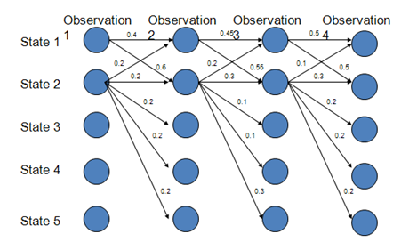

title: HMM MEMM CRF 区别 联系
date: 2016-07-13
tags: [NLP,HMM,MEMM,CRF]
---
隐马尔可夫模型(HMM)，最大熵马尔可夫模型(MEMM)以及条件随机场(CRF)是序列标注中最常用也是最基本的三个模型。HMM首先出现，MEMM其次，CRF最后。

<!--more-->
## 算法思想
HMM模型是对转移概率和表现概率直接建模，统计共现概率。MEMM模型是对转移概率和表现概率建立联合概率，统计时统计的是条件概率，但MEMM容易陷入局部最优，是因为MEMM只在局部做归一化。CRF模型中，统计了全局概率，在做归一化时，考虑了数据在全局的分布，这样就解决了MEMM中的标记偏置的问题。对于一个标注任务：
```
原句：我爱北京天安门
标注：s s b e b c e
```

**a. HMM**判断这个标注成立的概率为`P=P(s转移到s)*P('我'表现为s)*P(s转移到b)*P('爱'表现为s)*..*`。训练时，要统计状态转移概率矩阵和表现矩阵。
**b. MEMM**判断这个标注成立的概率为`P=P(s转移到s|'我'表现为s)*P('我'表现为s)*P(s转移到b|'爱'表现为s)*P('爱'表现为s)*..`。训练时，要统计条件状态转移概率矩阵和表现矩阵。
**c. CRF**判断这个标注成立的概率为`P=F(s转移到s,'我'表现为s)*..`，F为一个函数，是在全局范围统计归一化的概率而不是像MEMM在局部统计归一化的概率。

当前，最后出现的CRF在多项任务上达到了统治级的表现，所以如果重头搞应用的话，大家可以首选CRF。CRF有以下三个优点：

1. CRF没有HMM那样严格的独立性假设条件，因而可以容纳任意的上下文信息。
2. 由于CRF计算全局最优输出节点的条件概率，它克服了MEMM标记偏置的缺点。
3. CRF是在给定需要标记的观察序列的条件下，计算整个标记序列的联合概率分布，而不是在给定当前状态条件下，定义下一个状态的状态分布。

>凡事都有两面，正由于这些优点，CRF需要训练的参数更多，与MEMM和HMM相比，它存在训练代价大、复杂度高的缺点。

## 标记偏置
究竟什么是标记偏置问题呢？还是看个实际例子吧！



基于上图各边上的转移概率简单进行计算可得每条路径的概率如下：
```
路径1-1-1-1的概率:0.4*0.45*0.5=0.09
路径2-2-2-2的概率:0.2*0.3*0.3=0.018
路径1-2-1-2的概率:0.6*0.2*0.5=0.06
路径1-1-2-2的概率:0.4*0.55*0.3=0.066
```

由此，可知最优路径为`1-1-1-1`。然而，仔细观察可发现上图中`State 1`中每个结点都倾向于转移到`State 2`，这明显是和直觉不相符的。这就是所谓的标注偏置问题。实际上，造成这一问题的根本原因是每个节点分支数不同，由于MEMM的局部归一化特性，使得转出概率的分布不均衡，最终导致状态的转移存在不公平的情况。

怎么解决这种问题呢？先介绍一个最直观的最粗暴的解决方法，由于我们知道是因为概率分布不均导致的，可以简单把每个节点转出概率和为1的限制去掉，比如我们简单把图中`State 2`中每个结点出发的边的概率值`×10`，重新计算每条路径的概率如下：
```
路径1-1-1-1的概率:0.4*0.45*0.5=0.09
路径2-2-2-2的概率:2*3*3=18
路径1-2-1-2的概率:0.6*2*0.5=0.6
路径1-1-2-2的概率:0.4*0.55*3=0.66
```

由此可得最优路径是`2-2-2-2`，这就解决了MEMM的标记偏置问题。当然这个方法太粗暴了，CRF则是利用一种全局的优化思路来定向解决的。

## 概率图角度来看
下面从机器学习中的概率图角度来看三者的区别：


上图很好诠释了HMM模型中两个假设：一是输出观察值之间严格独立，二是状态的转移过程中当前状态只与前一状态有关(一阶马尔可夫模型)。


上图说明MEMM模型克服了观察值之间严格独立产生的问题，但是由于状态之间的假设理论，使得该模型存在标注偏置问题。


上图显示CRF模型解决了标注偏置问题，去除了HMM中两个不合理的假设。当然，模型相应得也变复杂了。

## 三个算法发展历程
HMM模型将标注任务抽象成马尔可夫链，一阶马尔可夫链式针对相邻标注的关系进行建模，其中每个标记对应一个概率函数。HMM是一种产生式模型，定义了联合概率分布`p(x,y)`，其中x和y分别表示观察序列和相对应的标注序列的随机变量。为了能够定义这种联合概率分布，产生式模型需要枚举出所有可能的观察序列，这在实际运算过程中很困难，所以我们可以将观察序列的元素看做是彼此孤立的个体，即假设每个元素彼此独立，任何时刻的观察结果只依赖于该时刻的状态。

HMM模型的这个假设前提在比较小的数据集（也不全是吧）上是合适的，但实际上在大量真实语料中观察序列更多的是以一种多重的交互特征形式表现的，观察元素之间广泛存在长程相关性。例如，在命名实体识别任务中，由于实体本身结构所具有的复杂性，利用简单的特征函数往往无法涵盖所有特性，这时HMM的假设前提使得它无法使用复杂特征(它无法使用多于一个标记的特征)，这时HMM的弊端就显现无疑了。突破这一瓶颈的方法就是引入最大熵模型(ME)。下面，我们简单介绍下这个模型，大家会发现ME和HMM具有天然的杂交优势。

我们知道最大熵模型可以使用任意的复杂相关特征，在性能上也超过了Bayes分类器。**最大熵模型的优点：**

1. 首先，最大熵统计模型获得的是所有满足约束条件的模型中信息熵极大的模型；
2. 其次，最大熵统计模型可以灵活地设置约束条件，通过约束条件的多少可以调节模型对未知数据的适应度和对已知数据的拟合程度；
3. 再次，它还能自然地解决了统计模型中参数平滑的问题。

**最大熵模型的不足：**

1. 首先，最大熵统计模型中二值化特征只是记录特征的出现是否，而文本分类需要知道特征的强度，因此，它在分类方法中不是最优的；
2. 其次，由于算法收敛的速度较慢，所以导致最大熵统计模型它的计算代价较大，时空开销大；
3. 再次，数据稀疏问题比较严重。最致命的是，作为一种分类器模型，最大熵对每个词都是单独进行分类的，标记之间的关系无法得到充分利用。然而，具有马尔可夫链的HMM模型可以建立标记之间的马尔可夫关联性，这是最大熵模型所没有的。

好了，现在是时候隆重介绍杂交后的最大熵马尔科夫模型(MEMM)。简单来说，MEMM把HMM模型和ME模型的优点集合成一个统一的产生式模型，这个模型允许状态转移概率依赖于序列中彼此之间非独立的特征上，从而将上下文信息引入到模型的学习和识别过程中，达到了提高识别的准召率的效果。有实验证明，MEMM在序列标注任务上表现的比HMM和无状态的最大熵模型要好得多。然而，如上面所述，MEMM并不完美，它存在明显的标记偏置问题。于是CMU的教授`John Lafferty`提出了更先进的CRF模型。

CRF模型具有以下特点：

1. CRF在给定了观察序列的情况下，对整个的序列的联合概率有一个统一的指数模型，它具备一个比较吸引人的特性就是其损失函数的凸面性；
2. CRF具有很强的推理能力，并且能够使用复杂、有重叠性和非独立的特征进行训练和推理，能够充分地利用上下文信息作为特征，还可以任意地添加其他外部特征，使得模型能够获取的信息非常丰富；
3. CRF解决了MEMM中的标记偏置问题，这也正是CRF与MEMM的本质区别所在。最大熵模型在每个状态都有一个概率模型，在每个状态转移时都要进行归一化。如果某个状态只有一个后续状态，那么该状态到后续状态的跳转概率即为1。这样，不管输入为任何内容，它都向该后续状态跳转。而CRF是在所有的状态上建立一个统一的概率模型，这样在进行归一化时，即使某个状态只有一个后续状态，它到该后续状态的跳转概率也不会为1。

## 参考资料：
- [HMM MEMM CRF区别 联系](http://www.52cs.org/?p=40)
- [条件随机场(CRF)](http://www.tanghuangwhu.com/archives/162)