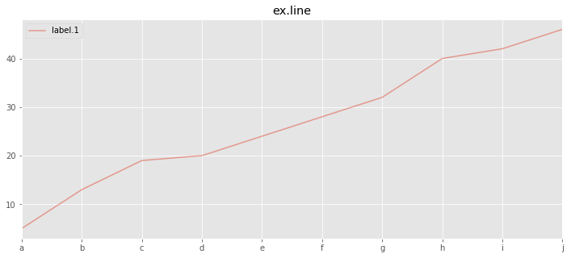
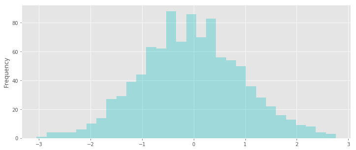
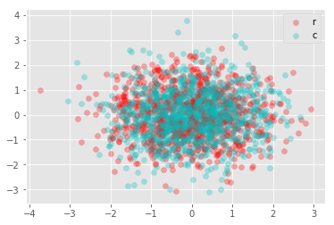

title: Matplotlib学习笔记
date: 2017-08-27
tags: [Python,Matplotlib]
---
Matplotlib是一个2D绘图库，可以跨平台生成各种硬拷贝格式和交互式环境的出版品质量图。Matplotlib可用于Python脚本，Python和IPython shell，Web应用程序服务器和各种图形用户界面工具包。

<!--more-->
## 中文问题
中文测试：
```python
import numpy as np
import matplotlib.pyplot as plt

np.random.seed(0)
my_x = np.arange(50)
my_y1 = np.random.randn(50).cumsum()
my_y2 = np.random.randn(50).cumsum()

plt.plot(my_x, my_y1, label='类别1')
plt.plot(my_x, my_y2, label='类别2')
plt.title("中文标题")
plt.legend(loc='best')
plt.show()
```

### Windows
查看`matplotlibrc`配置文件位置:
```python
import matplotlib
print(matplotlib.matplotlib_fname())
#site-packages/matplotlib/mpl-data/matplotlibrc
```

依据显示的路径,修改`matplotlibrc`配置文件:
```
line:196 => font.family         : DengXian
line:208 => font.sans-serif     : Dengxian
```

### Ubuntu
首先清空缓存`~/.cache/matplotlib`,拷贝`C:\Windows\Fonts`目录`等线`字体文件`Deng.ttf`到`matplotlib/mpl-data/fonts/ttf/`,并修改`matplotlibrc`配置文件：
```
line:196 => font.family         : DengXian
line:208 => font.sans-serif     : Dengxian
```

查看`matplotlibrc`配置文件位置：
```python
import matplotlib
print(matplotlib.matplotlib_fname())
#site-packages/matplotlib/mpl-data/matplotlibrc
```

## init
```
import numpy as np
import pandas as pd
import matplotlib.pyplot as plt
%pylab inline
```

可选的`style`：
```
plt.style.use('ggplot')
print(plt.style.available)
```

## plot
```
np.random.seed(0)
my_x = np.arange(50)
my_y = np.random.randn(50).cumsum()
plt.plot(my_x, my_y);
```


通过`color`、`linestyle`、`marker`设置颜色、标记、线型：
```
plt.plot(my_x, my_y, color='k', marker='o', linestyle='--');
```


`plot`还可以接受表示颜色和线型的字符串缩写：
```
plt.plot(my_x, my_y, 'ko--');
```


`drawstyle`设置非实际点的差值方式，默认按线性插值：
```
plt.plot(my_x, my_y, 'ko--', drawstyle='steps-post');
```


通过`plt.legend`添加图例：
```
plt.plot(my_x, my_y, 'ko--', label='steps-post')
plt.legend(loc='best');
```


一个比较完整的示例:
```
fig = plt.figure()

ax = fig.add_subplot(1, 1, 1)
ax.set_xticks([0,25,50,100])
ax.set_xticklabels(["000","025","050","100"])
ax.set_title("My matplotlib plot")
ax.set_xlabel("Stages")

np.random.seed(0)
ax.plot(np.random.randn(100).cumsum(), 'c')
ax.plot(np.random.randn(100).cumsum(), 'r', label='one')
ax.plot(np.random.randn(100).cumsum(), 'g--', label='two')
ax.plot(np.random.randn(100).cumsum(), 'b:', label='three')
ax.plot(np.random.randn(100).cumsum(), 'y.', label='_nolegend_')
ax.legend(loc='best');
```


```
fig, axes = plt.subplots(ncols=2, nrows=2)
ax1, ax2, ax3, ax4 = axes.ravel()

# scatter plot (Note: `plt.scatter` doesn't use default colors)
x, y = np.random.normal(size=(2, 200))
ax1.plot(x, y, 'o')

# sinusoidal lines with colors from default color cycle
x = np.linspace(0, 2*np.pi)
ax2.plot(x, np.sin(x), '-')
ax2.margins(0)

# bar graphs
x = np.arange(5)
y1, y2 = np.random.randint(1, 25, size=(2, 5))
width = 0.25
ax3.bar(x, y1, width)
ax3.bar(x + width, y2, width, color=list(plt.rcParams['axes.prop_cycle'])[2]['color'])
ax3.set_xticks(x + width)
ax3.set_xticklabels(['a', 'b', 'c', 'd', 'e'])

# circles with colors from default color cycle
for i, color in enumerate(plt.rcParams['axes.prop_cycle']):
    xy = np.random.normal(size=2)
    ax4.add_patch(plt.Circle(xy, radius=0.3, color=color['color']))
ax4.axis('equal')
ax4.margins(0)
```


## Save Image
利用`plt.savefig`可以将当前图表保存到文件，文件类型是通过文件扩展名推断出来的。发布图片时最常用到的两个重要选项是`dpi`和`bbox_inches`（可以剪除当前图表周围的空白部分）。要得到一张带有最小最小白边且分辨率为400dpi的png图片：

```
plt.savefig('fig_path.png', dpi=400, bbox_inches='tight');
```

## 线型图
`Series`对象的索引会传给`matplotlib`，并用以绘制`X`轴。可以通过`use_index=False`禁止该功能。`X`轴的刻度和界线可以通过`xticks`和`xlim`选项进行调节，`Y`轴类似。[更多参数](http://pandas.pydata.org/pandas-docs/stable/generated/pandas.Series.plot.html#pandas.Series.plot)

```
np.random.seed(0)
s = pd.Series(np.random.randint(1,9,(10,)).cumsum(), index=list('abcdefghij'))
d = pd.DataFrame(np.random.randint(1,9,(10,4)), columns=pd.Index(list('ABCD'),name="Genus"))

s.plot(kind='line', alpha=0.5, figsize=(12,5), title='ex.line', legend=True, label='label.1');
```



```
d.plot(kind='line', alpha=0.5, figsize=(12,5), title='ex.line', legend=True, subplots=False, sharey=True);
```


## 柱状图
在`plot`中设置`kind='bar'`（垂直柱状图）或`kind='barh'`（水平柱状图），这时`Series`和`DataFrame`的索引将会被用作刻度。

```
np.random.seed(0)
s = pd.Series(np.random.randint(1,9,(10,)).cumsum(), index=list('abcdefghij'))
d = pd.DataFrame(np.random.randint(1,9,(10,4)), columns=pd.Index(list('ABCD'),name="Genus"))

fig,axes = plt.subplots(1, 2)
ax1,ax2 = axes.ravel()
s.plot(ax=ax1, kind='bar', alpha=0.5, figsize=(16,5), title='ex.bar', legend=True, label='label.1');
s.plot(ax=ax2, kind='barh', alpha=0.5, figsize=(16,5), title='ex.barh', legend=True, label='label.1');
```


```
d.plot(kind='bar', stacked=False, alpha=0.5, figsize=(12,5), title='ex.bars');
```


## 直方图 & 密度图
```
np.random.seed(0)
s = pd.Series(np.random.randn(1000))
d = pd.DataFrame(np.random.randn(1000,4), columns=pd.Index(list('ABCD'),name="Genus"))

s.plot(kind='hist', bins=30, alpha=0.3, color='c', figsize=(12,5));
```



## 散布图
```
np.random.seed(0)
d = pd.DataFrame(np.random.randn(100,4), columns=pd.Index(list('ABCD'),name="Genus"))

fig,ax = plt.subplots()
ax.scatter(d['A'], d['B'], color='r', alpha=0.3, label='r')
ax.scatter(d['B'], d['C'], color='c', alpha=0.3, label='c')
ax.legend();
```



## 极坐标
```python
np.random.seed(1234)
N = 150
r = 2 * np.random.rand(N)
theta = 2 * np.pi * np.random.rand(N)
area = 200 * r**2
colors = theta

fig = plt.figure()
ax = fig.add_subplot(111, projection='polar')
c = ax.scatter(theta, r, c=colors, s=area, cmap='hsv', alpha=0.75)
```


```python
r = np.arange(0, 2, 0.01)
theta = 2 * np.pi * r

ax = plt.subplot(111, projection='polar')
ax.plot(theta, r)
ax.set_rmax(2)
ax.set_rticks([0.5, 1, 1.5, 2])  # Less radial ticks
ax.set_rlabel_position(-22.5)  # Move radial labels away from plotted line
ax.grid(True)

ax.set_title("A line plot on a polar axis", va='bottom')
plt.show()
```


## 统计
```python
np.random.seed(1234)
mu = 100  # mean of distribution
sigma = 15  # standard deviation of distribution
x = mu + sigma * np.random.randn(437)

num_bins = 50
fig, ax = plt.subplots()
# the histogram of the data
n, bins, patches = ax.hist(x, num_bins, normed=True)
# add a 'best fit' line
y = np.insert(n, 0, 0)
ax.plot(bins, y, '--')
ax.set_xlabel('Smarts')
ax.set_ylabel('Probability density')
ax.set_title(r'Histogram of IQ: $\mu=100$, $\sigma=15$')

# Tweak spacing to prevent clipping of ylabel
fig.tight_layout()
plt.show()
```


```python
import seaborn as sns
sns.distplot(x, rug=True, hist=True)
```

