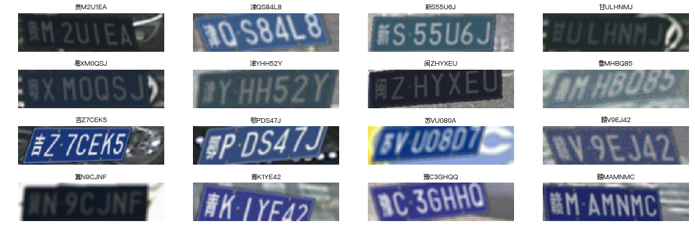

title: 定长文字识别(车牌)
date: 2017-08-17
tags: [SceneText,Keras]
---
典型的固定长度场景文字识别当属车牌识别.本文包括车牌生成,构造网络,训练网络,以及预测效果展示.

<!--more-->
## 车牌生成
这里有个[车牌生成器](http://git.oschina.net/flystarhe/pyhej/tree/master/genplate),参考[szad670401](https://github.com/szad670401/end-to-end-for-chinese-plate-recognition)实现.首先克隆`pyhej`到本地:

    git clone https://git.oschina.net/flystarhe/pyhej.git

现在我们基于这个生成器,再写一个生成器,用于深度神经网络的数据输入:
```
import numpy as np
from pyhej.genplate import genplate

G = genplate.GenPlate()
def gen(batch_size=32):
    while 1:
        plate_txts, plate_imgs = G.gen_batch(batch_size)
        x = np.asarray(plate_imgs, dtype=np.uint8)
        y = np.zeros((7, batch_size, len(genplate.chars)))
        for i, txt in enumerate(plate_txts):
            for idx, word in enumerate(list(txt)):
                y[idx, i, genplate.index[word]] = 1
        yield x, [yi for yi in y]
```

注意:OpenCV默认颜色通道为BGR,而PIL,matplotlib使用颜色通道为RGB,转换方法`img = img[:,:,::-1]`.

## 构造网络
因为是固定长度,那就可以用七个模型按照顺序识别,可以用`卷积层+七个全链接层`的架构来对应输入:
```
num_class = len(genplate.chars)
input_shape = (72, 272, 3)

from keras.layers import Input, Conv2D, MaxPooling2D
from keras.layers import Flatten, Dense, Dropout

img_input = Input(shape=input_shape)
x = img_input

# Block 1
x = Conv2D(32*1, (3, 3), activation='relu', name='block1_conv1')(x)
x = Conv2D(32*1, (3, 3), activation='relu', name='block1_conv2')(x)
x = MaxPooling2D((2, 2), strides=(2, 2), name='block1_pool')(x)

# Block 2
x = Conv2D(32*2, (3, 3), activation='relu', name='block2_conv1')(x)
x = Conv2D(32*2, (3, 3), activation='relu', name='block2_conv2')(x)
x = MaxPooling2D((2, 2), strides=(2, 2), name='block2_pool')(x)

# Block 3
x = Conv2D(32*4, (3, 3), activation='relu', name='block3_conv1')(x)
x = Conv2D(32*4, (3, 3), activation='relu', name='block3_conv2')(x)
x = MaxPooling2D((2, 2), strides=(2, 2), name='block3_pool')(x)

x = Flatten(name='flatten')(x)
x = Dropout(0.25)(x)
x = [Dense(num_class, activation='softmax', name='c%02d' % i)(x) for i in range(7)]
```

创建模型:
```
from keras.models import Model
from keras import optimizers

model = Model(img_input, x, name='plate_car')
model.compile(loss='categorical_crossentropy',
              optimizer=optimizers.Adam(lr=0.001),
              metrics=['accuracy'])
```

展示网络结构:
```
from IPython.display import SVG
from keras.utils.vis_utils import model_to_dot
SVG(model_to_dot(model).create(prog='dot', format='svg'))
```


## 训练网络
首先自定义回调函数`SaveBest`,实现在每个epoch后选择保存提升的模型:
```
import re
import numpy as np
from keras.callbacks import Callback
class SaveBest(Callback):
    def __init__(self, filepath, monitor='val_.*?acc', mode='max'):
        super(SaveBest, self).__init__()
        self.filepath = filepath
        self.monitor = monitor
        if mode == 'min':
            self.monitor_op = np.less
            self.best = np.Inf
        elif mode == 'max':
            self.monitor_op = np.greater
            self.best = -np.Inf

    def on_epoch_end(self, epoch, logs=None):
        tmps = []
        for key, val in logs.items():
            if re.match(self.monitor, key):
                tmps.append(val)
        current = sum(tmps)/len(tmps)
        if self.monitor_op(current, self.best):
            filepath = self.filepath.format(epoch=epoch, best=current, **logs)
            self.model.save(filepath, overwrite=True)
            self.best = current

import time
checkpointer = SaveBest(filepath='./temp/model_%s_{epoch:02d}_{best:.4f}.hdf5'%time.strftime('%m%d%H%M'))

model.fit_generator(gen(32),
                    steps_per_epoch=2000,
                    epochs=5,
                    callbacks=[checkpointer],
                    validation_data=gen(32),
                    validation_steps=1000)
```

可见五轮训练后,即便是位置靠后的几位车牌,也实现了`92%`的识别准确率.

## 预测效果
展示下模型预测效果:
```
plate_txts, plate_imgs = G.gen_batch(16)

preds = model.predict(np.asarray(plate_imgs, dtype=np.uint8))
preds = np.argmax(np.asarray(preds), 2).T
titles = list(map(lambda x: ''.join([genplate.chars[i] for i in x]), preds))

from matplotlib.font_manager import FontProperties
myfont = FontProperties(fname='/home/hejian/work_temp/fonts/PingFang.ttc')

import matplotlib.pyplot as plt
fig = plt.figure(figsize=(18, 6))
for i, img in enumerate(plate_imgs):
    ax = plt.subplot(4, 4, i+1)
    ax.imshow(img[:,:,::-1])
    ax.set_title(titles[i], fontproperties=myfont)
    ax.set_axis_off()
plt.show()
```



## 参考资料:
- [使用腾讯云GPU学习深度学习系列之五:文字的识别与定位](https://www.qcloud.com/community/article/680286)