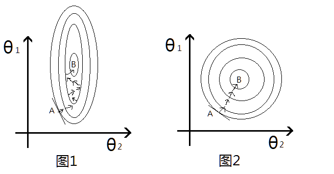
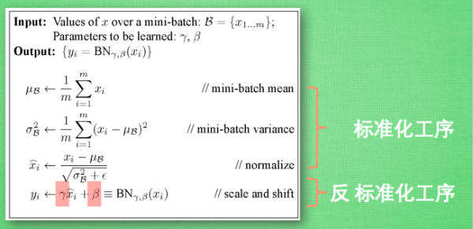

# Feature scaling and batch norm
Batch Normlization是2015年提出的一个加速神经网络训练的技巧,同时对performance也有一定的提高,现在基本已经广泛使用了.[阅读原文](http://shomy.top/2017/12/05/Feature-Scaling-Batch-Norm/)

## Feature Scaling
提起BN首先需要从Feature Scaling/Normalization(特征缩放/归一化)说起.在机器学习中,经常需要对特征做归一化,标准化,具体原因是什么呢?如果输入的特征的尺度差别很大,比如说`x_1`的取值位于`0-1`,`x_2`的尺度位于`1000-2000`,这个时候,就需要将特征scaling到同一个尺度,一般来说,特征缩放之后有两个好处.

- **提高学习器的性能**:特别是涉及到距离计算的,比如KNN,SVM等分类器,KMeans聚类等.这个很容易理解,在计算距离的时候,如果某一个特征取值范围很大,这样这一个特征对距离的计算就会占据主导作用,其它尺度小的特征起到的作用就会变小,而实际上这些特征的重要性可能是一样的.因此做了Feature Scaling将特征范围缩放到一个尺度的话,就可以避免这种情况.
- **加快梯度下降优化的收敛速度**:这里经常使用的是吴恩达老师的机器学习课程中预测房价的例子,假设有影响房价两个特征:
    - `x_1`:房间数目,一般取值比较小,`1-5`左右
    - `x_2`:房屋面积,一般取值比较大,`80-200`等

一般线性回归的关系函数如下:
$$
\begin{aligned}
s = \theta_1 x_1 + \theta_2 x_2 + b
\end{aligned}
$$

取平方误差的话,损失函数为:
$$
\begin{aligned}
LOSS = (s_{\theta}(x) - y)^2
\end{aligned}
$$

因为`x_2`的尺度比`x_1`大很多,因此即使两个参数`w_1`,`w_2`同样大小的变化,乘上`x`之后,对最后的结果`LOSS`影响差距也很不同,`w_2`明显要比`w_1`的作用要大,也就是说,θ2很小的变化就会导致`LOSS`较大变化,`LOSS`的等高线上就会呈现出椭圆的形状,如图:

图的横纵坐标表示两个特征,每一圈代表一个LOSS值,圈越大LOSS越大,最里面的B则是最优解的位置.然后考虑梯度更新的过程,上述的等高线即LOSS与θ1,θ2的函数关系,因此图中椭圆的切线方向就是梯度下降的方向.左图,从初始点A到最优点B需要经过很多次的无用的迭代,并不是每次向着最优的方向走,类似于之字形,这样收敛就会很慢了.右图,做了Feature Scaling,等高线近圆形,这样沿着切线的方向进行梯度更新就会一直沿着最优的方向走.

常用的Feature Scaling的方法有:

- **标准化**:所有特征量化到标准正态分布上
- **线性归一**:所有的数据转换到`[0,1]`(Min-Max Scaling)

此外,其实做Feature Scaling或多或少的跟原始数据都有一些差异,理论上比较好的方法是,不同的Feature设置不同的学习率,尺度大的特征的学习率应该小一点,尺度小的特征的学习率稍微大一些,但是在实际梯度下降中,特征很多,对每个特征设置不通的学习率不切实际,也很难实现,因此换一种思路,对特征做scale,这样也可以避免尺度不一带来的问题.

## Batch Normalization
我们知道神经网络有很多个Layer组成,每个layer的输入都是上一层layer的输出,那我们就有理由相信对每一层的输入的特征做Feature Scaling可能会起到不错的作用.

但是这里需要考虑一个问题,在做归一化的时候,会影响原来学到的特征,比如说在输入到sigmod激活函数之前,如果经过`Wx+b`之后的结果,分布在S型函数的两侧,也就是近乎平行坐标轴的那部分区域,这样原本经过激活函数之后就是0或1,但是经过归一化之后,结果数据都到了S型函数的中间部分.这样会有问题,归一化到了`[-1, 1]`那一部分区域,而对应的sigmod近乎是一条直线了,那这样就成了线性变换了,那神经网络的非线性变化就没有意义了.所以BN在做完归一化,具体来说是标准化之后,又做了一步特征转换的操作:
$$
\begin{aligned}
\hat{x} = \frac{x-\mu}{\sigma} \\
z = \gamma \hat{x} + \beta
\end{aligned}
$$

其中`γ,β`是两个参数,跟权重矩阵参数一样,也是需要训练更新的.`\hat{x}`则是标准化之后的值.可以看出,如果`γ=σ,β=μ`的时候,我们就会发现`x=z`了,这样就恢复到了原始的特征分布,其实可以这样理解,`γ,β`这两个参数其实就是来学习前面的Normalization到底有没有作用,如果没有作用那就做一些转换,抵消一部分Normalization带来的影响.这样完整的BN的步骤如下,需要注意的是,输入是一个Batch的数据,上述求得均值,方差均是对同一个Batch的数据计算得出的也就是说下图的m就是minbatch size:

需要注意的有两点:

- 理论上BN可以放到激活函数之前,也可以放在其之后,但是一般情况,BN层会放在激活函数之前,这个其实很容易理解,比如激活函数如果是sigmod或者tanh的话,本身的输出都已经在一定程度上有了归一化了,后面再加一个BN的话,意义不大
- `batch-size`大一些泛化能力更强.如果batch很小的话,计算均值和方差其实没有代表性

前面的都是在training阶段,在test的时候,情况不太一样.因为在测试的话,我们没有batch的输入,如何去计算`μ,γ`呢?一般都是从训练数据出发,比如使用所有数据的均值和方差,这种方法在数据集很大的时候,很难实现.因此可以退而求其次,在最后一个epoch的时候,保存每个batch的均值和方差,最后去平均.取最后一个epoch的原因也很简单,最后一个epoch参数的训练已经近乎最优了.