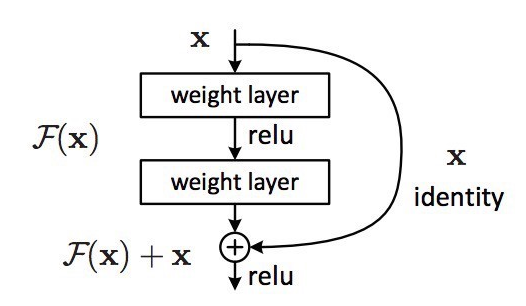
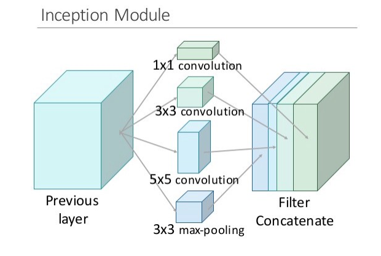
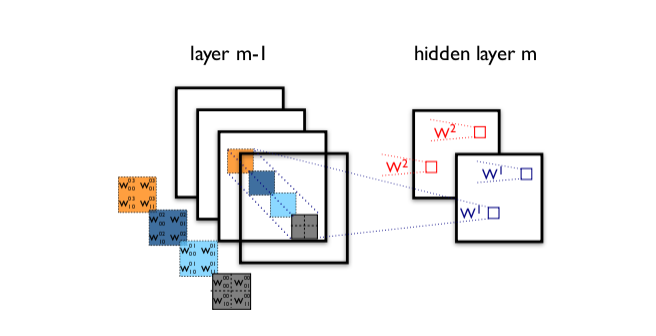
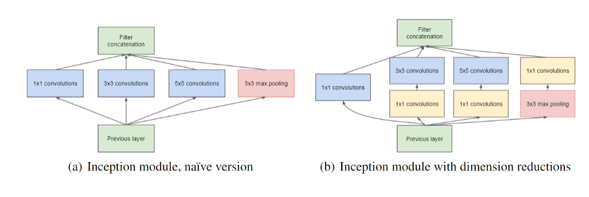
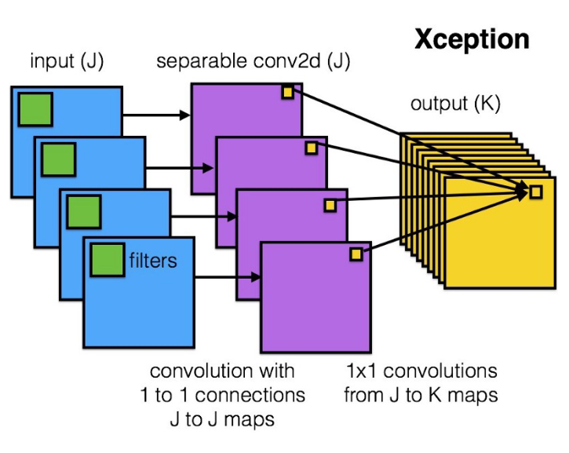

# ResNet Inception and Xception
过去几年来,计算机视觉领域中深度学习的诸多进展都可以归结到几种神经网络架构.除开其中的所有数学内容,代码和实现细节,我想探索一个简单的问题:这些模型的工作方式和原因是什么?目前,Keras已经将这6种预训练模型集成到了库中:

- VGG16
- VGG19
- ResNet50
- Inception v3
- Xception
- MobileNet

VGG网络以及从2012年以来的AlexNet都遵循现在的基本卷积网络的原型布局:一系列卷积层,最大池化层和激活层,最后还有一些全连接的分类层.MobileNet本质上是为移动应用优化后的Xception架构的流线型(streamline)版本.但剩下的三个却真正重新定义了我们看待神经网络的方式.

## ResNet
ResNet诞生于一个美丽而简单的观察:为什么非常深度的网络在增加更多层时会表现得更差?直觉上推测,更深度的网络不会比更浅度的同类型网络表现更差吧,至少在训练时间上是这样(当不存在过拟合的风险时).让我们进行一个思想实验,假设我们已经构建了一个`n`层网络,并且实现了一定准确度.那么一个`n+1`层网络至少也应该能够实现同样的准确度——只要简单复制前面`n`层,再在最后一层增加一层恒等映射就可以了.类似地,`n+2`,`n+3`和`n+4`层的网络都可以继续增加恒等映射,然后实现同样的准确度.但是在实际情况下,这些更深度的网络基本上都会表现得更差.

ResNet的作者将这些问题归结成了一个单一的假设:直接映射是难以学习的.而且他们提出了一种修正方法:不再学习从`x`到`H(x)`的基本映射关系,而是学习这两者之间的差异,也就是残差(residual).然后,为了计算`H(x)`,我们只需要将这个残差加到输入上即可.

假设残差为`F(x)=H(x)-x`,那么现在我们的网络不会直接学习`H(x)`了,而是学习`F(x)+x`.这就带来了你可能已经见过的著名ResNet模块:

ResNet的每一个模块(block)都由一系列层和一个捷径(shortcut)连接组成,这个捷径将该模块的输入和输出连接到了一起.然后在元素层面上执行加法(add)运算,如果输入和输出的大小不同,那就可以使用零填充或投射(通过`1×1`卷积)来得到匹配的大小.

回到我们的思想实验,这能大大简化我们对恒等层的构建.直觉上就能知道,比起从头开始学习一个恒等变换,学会使`F(x)`为`0`并使输出仍为`x`要容易得多.一般来说,ResNet会给层一个参考点`x`,以`x`为基础开始学习.

这一想法在实践中的效果好得让人吃惊.在此之前,深度神经网络常常会有梯度消失问题的困扰,即来自误差函数的梯度信号会在反向传播回更早的层时指数级地下降.本质上讲,在误差信号反向回到更早的层时,它们会变得非常小以至于网络无法学习.但是,因为ResNet的梯度信号可以直接通过捷径连接回到更早的层,所以我们一下子就可以构建50层,101层,152层甚至1000层以上的网络了,而且它们的表现依然良好.

## Inception
如果ResNet是为了更深,那么Inception家族就是为了更宽.Inception的作者对训练更大型网络的计算效率尤其感兴趣.换句话说:我们怎样在不增加计算成本的前提下扩展神经网络?

Inception最早的论文关注的是一种用于深度网络的新型构建模块,现在这一模块被称为Inception module.究其核心,这种模块源自两种思想见解的交汇.

第一个见解与对层的操作有关.在传统的卷积网络中,每一层都会从之前的层提取信息,以便将输入数据转换成更有用的表征.但是,不同类型的层会提取不同种类的信息.`5×5`卷积核的输出中的信息就和`3×3`卷积核的输出不同,又不同于最大池化核的输出...在任意给定层,我们怎么知道什么样的变换能提供最有用的信息?

### 见解1,为什么不让模型选择?
Inception模块会并行计算同一输入映射上的多个不同变换,并将它们的结果都连接到单一一个输出.换句话说,对于每一个层,Inception都会执行`5×5`卷积变换,`3×3`卷积变换和最大池化.然后该模型的下一层会决定是否以及怎样使用各个信息.

这种模型架构的信息密度更大了,这就带来了一个突出的问题:计算成本大大增加.不仅大型(比如`5×5`)卷积过滤器的固有计算成本高,并排堆叠多个不同的过滤器更会极大增加每一层的特征映射的数量.而这种计算成本增长就成为了我们模型的致命瓶颈.

想一下,每额外增加一个过滤器,我们就必须对所有输入映射进行卷积运算以计算单个输出.如下图所示:从单个过滤器创建一个输出映射涉及到在之前一层的每个单个映射上执行计算.

假设这里有M个输入映射.增加一个过滤器就意味着要多卷积M次映射;增加N个过滤器就意味着要多卷积NM次映射.换句话说,正如作者指出的那样:过滤器数量的任何统一增长都会导致计算量的4倍增长.我们的朴素Inception模块只是将过滤器的数量增加了三四倍.但从计算成本上看,这简直就是一场大灾难.

### 见解2,使用`1×1`卷积来降维
为了解决上述计算瓶颈,Inception的作者使用了`1×1`卷积来过滤输出的深度.一个`1×1`卷积一次仅查看一个值,但在多个通道上,它可以提取空间信息并将其压缩到更低的维度.比如,使用20个`1×1`过滤器,一个大小为`64×64×100`(具有100个特征映射)的输入可以被压缩到`64×64×20`.通过减少输入映射的数量,Inception可以将不同的层变换并行地堆叠到一起,从而得到既深又宽(很多并行操作)的网络.

Inception很快就变成了一种具有决定性意义的模型架构.最新的版本Inception v4甚至将残差连接放进了每一个模组中,创造出了一种Inception-ResNet混合结构.但更重要的是,Inception展现了经过良好设计的网中有网架构的能力,让神经网络的表征能力又更上了一层楼.

## Xception
Xception表示extreme inception.和前面两种架构一样,它重塑了我们看待神经网络的方式,尤其是卷积网络.而且正如其名字表达的那样,它将Inception的原理推向了极致.

它的假设是:跨通道的相关性和空间相关性是完全可分离的,最好不要联合映射它们.

这是什么意思?在传统的卷积网络中,卷积层会同时寻找跨空间和跨深度的相关性.让我们再看一下标准的卷积层:

在上图中,过滤器同时考虑了一个空间维度(每个`2×2`的彩色方块)和一个跨通道或深度维度(4个方块的堆叠).在输入图像的输入层,这就相当于一个在所有3个RGB通道上查看一个`2×2`像素块的卷积过滤器.那问题来了:我们有什么理由去同时考虑图像区域和通道?

在Inception中,我们开始将两者稍微分开.我们使用`1×1`的卷积将原始输入投射到多个分开的更小的输入空间,而且对于其中的每个输入空间,我们都使用一种不同类型的过滤器来对这些数据的更小的3D模块执行变换.Xception更进一步,不再只是将输入数据分割成几个压缩的数据块,而是为每个输出通道单独映射空间相关性,然后再执行`1×1`的深度方面的卷积来获取跨通道的相关性.

其作者指出这本质上相当于一种已有的被称为深度方面可分的卷积(depthwise separable convolution)的运算,它包含一个深度方面的卷积(一个为每个通道单独执行的空间卷积),后面跟着一个逐点的卷积(一个跨通道的`1×1`卷积).我们可以将其看作是首先求跨一个2D空间的相关性,然后再求跨一个1D空间的相关性.可以看出,这种2D+1D映射学起来比全3D映射更加简单.

而且这种做法是有效的!在ImageNet数据集上,Xception的表现稍稍优于Inception v3,而且在一个有17000类的更大规模的图像分类数据集上的表现更是好得多.最重要的是,它的模型参数的数量和Inception一样多,说明它的计算效率也更高.Xception非常新(2017年4月才公开),但正如前面提到的那样,这个架构已经在通过MobileNet助力谷歌的移动视觉应用了.