# Improving the Realism of Synthetic Images
**提升合成图像的真实感** @[Apple机器学习期刊2017](https://machinelearning.apple.com/)

今天神经网络的大多数成功例子都受到监督训练。然而，为了实现高精度，训练集需要大，多样且准确地注释，这是昂贵的。标记大量数据的替代方法是使用来自模拟器的合成图像。这是便宜的，因为没有标签成本，但合成图像可能不够真实，导致在实际测试图像上的不良泛化。为了缩小这种性能差距，我们开发了一种方法来优化合成图像，使其看起来更逼真。我们表明，对这些精确图像的训练模型可以显着提高各种机器学习任务的准确性。

## 概观
在标准合成图像上训练机器学习模型是有问题的，因为图像可能不够逼真，导致模型仅学习合成图像中存在的细节并且不能在真实图像上很好地概括。在合成图像和真实图像之间弥合这种差距的一种方法是改进通常昂贵且困难的模拟器，并且即使最好的渲染算法仍然可能无法模拟真实图像中存在的所有细节。缺乏真实感可能会导致模型过度拟合合成图像中的“不切实际”细节。我们可以从数据中学习它们，而不是模拟模拟器中的所有细节吗？为此，我们开发了一种方法来优化合成图像，使其看起来更逼真。

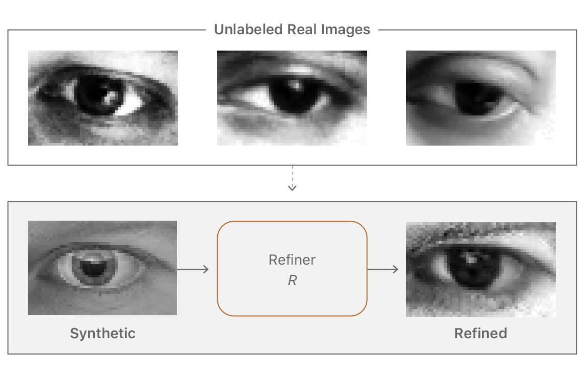

>任务是学习一个模型，该模型使用未标记的真实数据从模拟器中提高合成图像的真实感，同时保留注释信息。

“改善现实主义”的目标是使图像看起来尽可能逼真，以提高测试的准确性。这意味着我们希望保留用于训练机器学习模型的注释信息。例如，图中的凝视方向应该被保留，并且不会产生任何伪影，因为机器学习模型可以学会过度拟合它们。我们学习了一个深度神经网络，我们称之为“精炼网络”，它处理合成图像以改善它们的真实感。

要了解这样的精炼网络，我们需要一些真实的图像。一种选择是要求具有像素对应的真实和合成图像对，或具有注释的真实图像 - 例如在眼睛的情况下的凝视信息。这可以说是一个更容易解决的问题，但这些数据很难收集。为了创建按像素对应，我们需要渲染与给定真实图像相对应的合成图像，或捕获与渲染合成图像匹配的真实图像。我们是否可以在没有按像素对应的情况下学习这种映射，或者为真实图像添加任何标签？如果是这样，我们可以生成一堆合成图像，捕获真实的眼睛图像，并且根本不标记任何真实图像，学习这种映射 - 使该方法便宜且易于在实践中应用。

为了以无人监督的方式学习我们的精炼网络，我们利用辅助鉴别器网络将真实和精炼（或伪造）图像分为两类。精炼网络试图欺骗这个鉴别器网络，使其认为精确的图像是真实的。两个网络交替训练，当鉴别器无法区分真实图像和假图像时，训练停止。使用对抗性鉴别器网络的想法类似于GAN（生成性对抗网络）方法，该方法将随机向量映射到图像，使得生成的图像与实际图像无法区分。我们的目标是培养一个精炼网络 - 一个将合成图像映射到逼真图像的生成器。下图显示了该方法的概述。

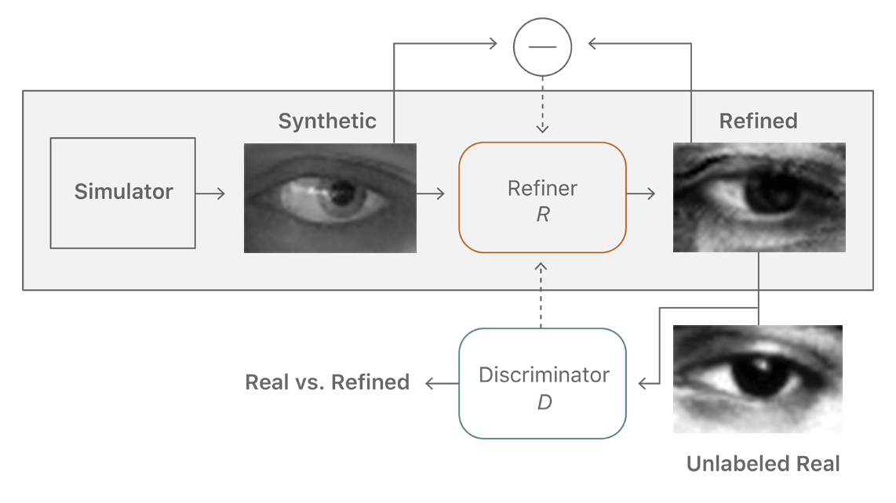

>我们的精炼神经网络R最小化了局部对抗性损失和“自我正规化”术语的组合。对抗性损失“愚弄”鉴别器网络D，它将图像分类为真实或精炼。自正则化项最小化合成图像和精细图像之间的图像差异。精炼网络和鉴别器网络交替更新。

## 我们如何保留注释？
除了生成逼真的图像之外，精炼网络还应保留模拟器的注释信息。例如，对于凝视估计，学习的变换不应改变凝视方向。这种限制是一种必不可少的因素，可以训练机器学习模型，该模型使用精确的图像和模拟器的注释。为了保留合成图像的注释，我们通过自正规化L1损失来补充对抗性损失，这会惩罚合成图像和精细图像之间的大变化。

## 我们如何防止伪影？
**进行局部变更**

精炼网络的另一个关键要求是它应该学习模拟真实的图像特征而不引入任何伪像。当我们训练单个强鉴别器网络时，精炼网络倾向于过度强调某些图像特征以欺骗当前的鉴别器网络，导致漂移和产生伪像。一个关键的观察是从精制图像中采样的任何局部块应该具有与真实图像块相似的统计数据。因此，我们可以定义一个鉴别器网络，而不是定义全局鉴别器网络，该网络分别对所有本地图像块进行分类。这种划分不仅限制了接收场，而且限制了鉴别器网络的容量，而且还为每个图像提供了许多样本，用于学习鉴别器网络。

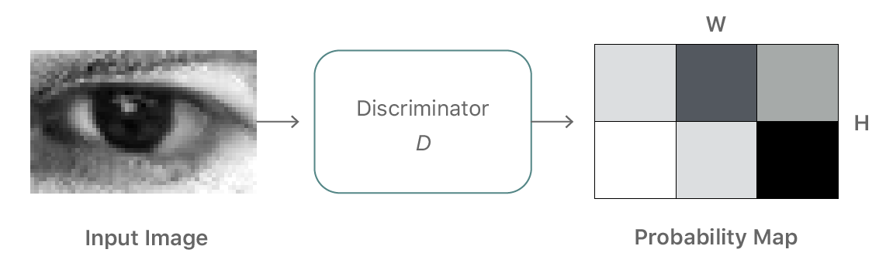

>局部对抗性损失的图示。鉴别器网络输出宽度高度概率图。对抗性损失函数是局部斑块上的交叉熵损失的总和。

## 利用生成器历史来改进判别器
生成器可以使用来自新分布的样本或目标（实际数据）分布来欺骗鉴别器。从一种新颖的分布中产生只会使鉴别者学会那种新的分布。生成器欺骗鉴别器的更有用的方法是通过从目标分布生成。

鉴于这两种演化方式，最简单的方法通常是产生一种新颖的输出，这是我们在训练电流生成器和鉴别器时所观察到的。图左侧显示了这种非生产性序列的简化图示。生成器和鉴别器分布分别以黄色和蓝色显示。

通过引入存储来自前几代（图右）的生成器样本的历史，鉴别器不太可能忘记它已经学习的空间部分。功能更强大的鉴别器可帮助生成器更快地向目标分布方向移动。插图是一种简化，忽略了显示分布是复杂的并且经常是断开的区域。然而，在实践中，简单的随机替换缓冲器从先前的生成器分布中捕获足够的多样性，以通过加强鉴别器来防止重复。我们的观点是，在整个训练过程中，改善器网络生成的任何精细图像实际上都是鉴别器的“假”图像。

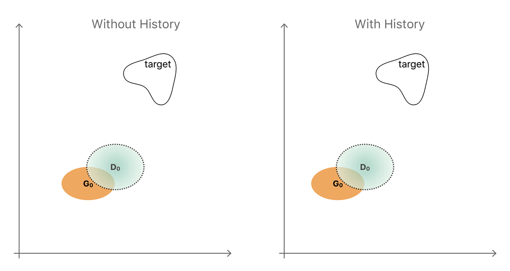

>使用图像历史来改进鉴别器的直觉的例证。

具有D历史记录的小批量图示。每个小批量包含来自生成器的当前迭代的图像，以及来自先前伪图像的缓冲区的图像。

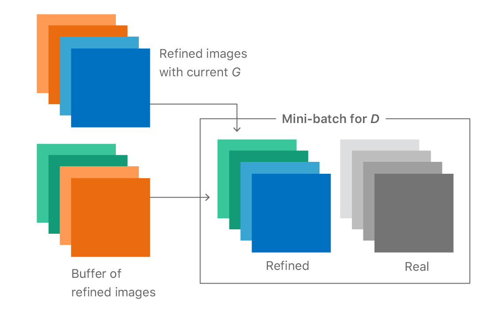

## 训练如何开展？
我们首先训练精炼网络只有自正规化损失，并在精炼网络开始产生输入合成图像的模糊版本后引入对抗性损失。图1显示了各个训练步骤中精炼网络的输出。在开始时，它会输出模糊的图像，随着训练的进行，图像变得越来越逼真。图2显示了不同训练迭代时的鉴别器和生成器损失。请注意，鉴别器损失在开始时很低 - 这意味着它可以很容易地区分真实和精炼之间的区别。慢慢地，鉴别器损失增加并且随着训练进展生成器损失减少，产生更多真实图像。

随着训练的进展，精炼网络的输出。从模糊图像开始，网络学习模拟真实图像中存在的细节：
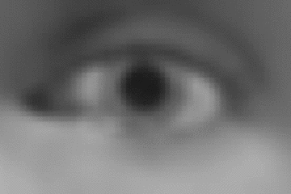

随着训练的进行，生成器和鉴别器的损失：
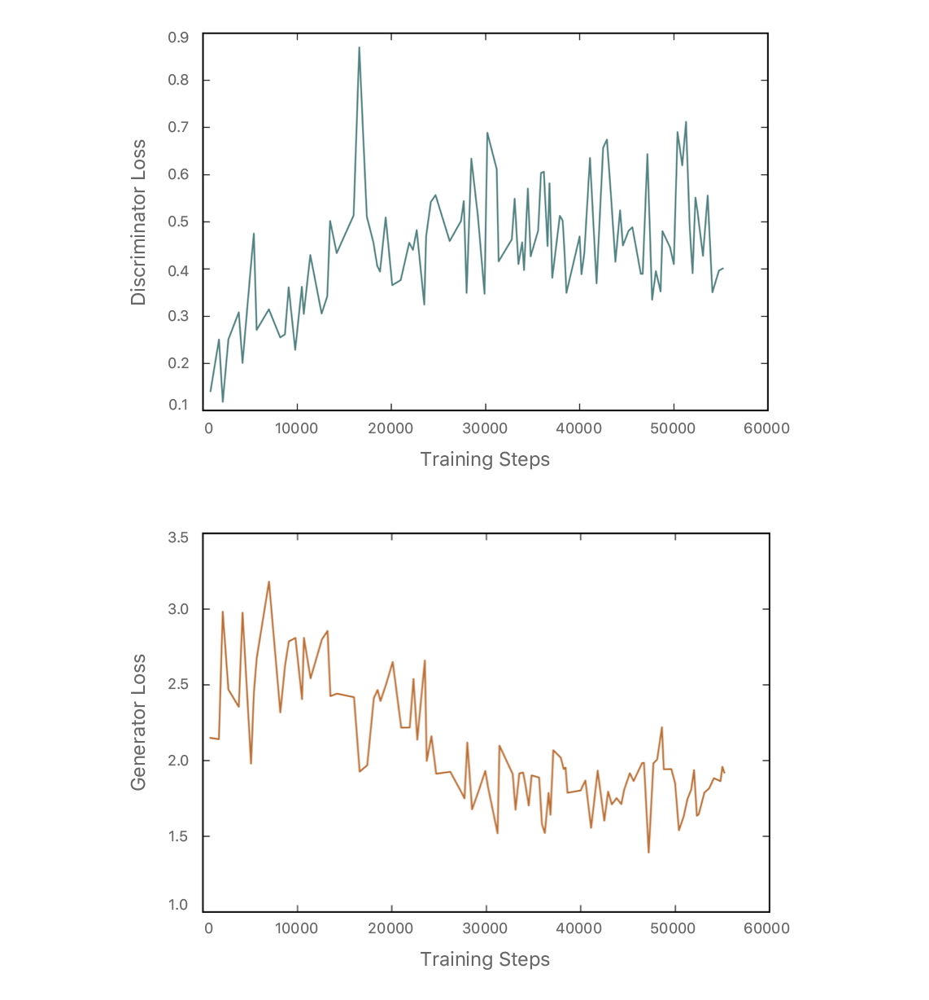

## 自正规化L1损失是否受到限制？
当合成图像和真实图像在分布中具有显着偏移时，像素方式的L1差异可能是限制性的。在这种情况下，我们可以使用替代特征变换替换身份映射，在特征空间上放置自定义因子。这些可以是手动调整的功能，也可以是学习功能，例如VGGnet的中间层。例如，对于彩色图像细化，RGB通道的平均值可以生成逼真的彩色图像，如图所示：

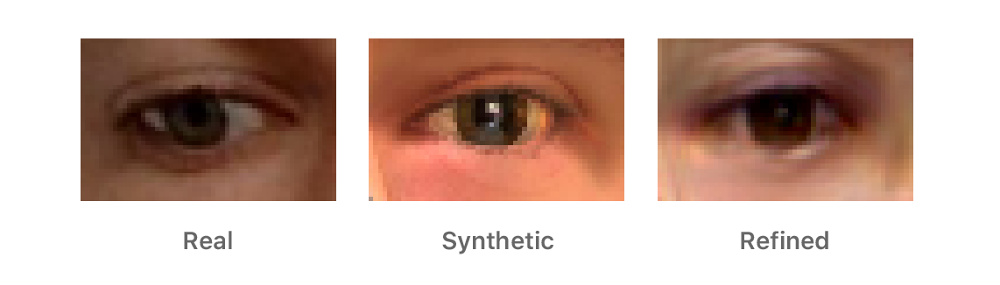

>特征空间中的自正规化损失示例。

## 标签是否被生成器改变了？
为了验证标签没有显着变化，我们手动在合成和精细图像上绘制椭圆，并计算它们的中心之间的差异。在图中，我们显示了50个这样的中心差异的散点图。合成和相应的精细图像的估计瞳孔中心之间的绝对差异非常小：`1.1 +/- 0.8px`（眼宽55px）。

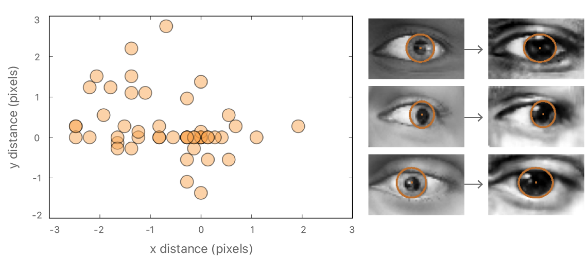

>合成图像和真实图像的瞳孔中心之间距离的散点图。

## 如何设置超参数？
**G的初始化**

首先，我们仅使用自正规化损失初始化G，以便它可以开始产生合成输入的模糊版本。通常需要`500-2000`步G（没有训练D）。

**每次训练迭代的G和D的不同步骤**

在每次训练迭代中，我们对生成器和鉴别器使用了不同数量的步骤。对于使用深度的手姿势估计，我们对于每个D步骤使用G步骤2步，并且对于眼睛注视估计实验，我们最终使用50步G对于每个D步骤。我们发现鉴别器与生成器相比会更快地收敛，部分原因是鉴别器中的批处理规范。因此，我们将#D步骤固定为1，并从较小的数字开始改变#G步骤，根据鉴别器丢失值逐渐增加它。

**学习率和停止标准**

我们发现保持学习率非常小（0.0001）并长时间训练是有帮助的。这种方法的作用可能是因为它使生成器或鉴别器不会发生突变，让其中一个甩开另一个。我们发现很难通过可视化训练损失来停止训练。相反，我们在训练过程中保存了训练图像，并在精确图像在视觉上与真实图像相似时停止训练。

## 定性结果
为了评估精确图像的视觉质量，我们设计了一个简单的用户研究，要求受试者将图像分类为真实或精细合成。受试者发现很难区分真实和精致的图像。在我们的聚合分析中，10名受试者在1000次试验中选择了517次正确的标签，这意味着他们无法可靠地区分真实图像和精制合成图像。相比之下，当对原始合成图像与真实图像进行测试时，我们显示每个受试者10个真实图像和10个合成图像，并且受试者在200个试验中正确地选择了162次。在图中，我们展示了一些合成和相应的合成图像。

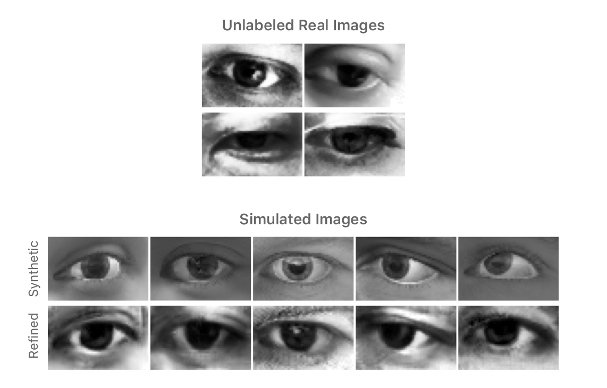

>使用所提出的方法的精细眼图像示例。

## 定量结果
图1显示了使用精炼数据进行的改进，与使用原始合成数据进行训练相比。从这个图中需要注意两点：（1）使用精细图像进行训练比使用原始合成图像进行训练更好;（2）使用更多合成数据可以进一步提高性能。在图2中，我们将注视估计误差与其他最先进的方法进行比较，并表明改善真实性显着有助于模型推广实际测试数据。

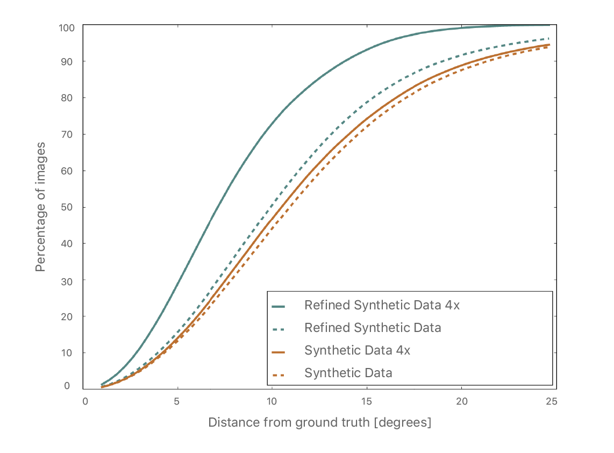

>使用合成和精细图像进行凝视估计的训练比较。评估真实的测试图像。

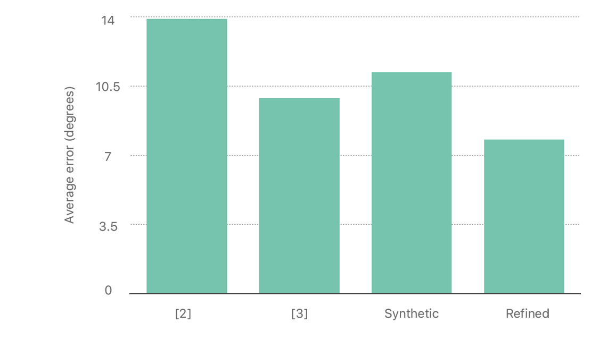

>MPIIGaze数据集上注视估计的不同方法的比较。前两种方法在参考文献[Appearance-based Gaze Estimation in the Wild](#)和[Learning an Appearance-based Gaze Estimator from One Million Synthesised Images](#)中描述。

## 相关工作
最近，人们对使用对抗性训练的领域适应感兴趣。图像到图像翻译[Image-to-Image Translation with Conditional Adversarial Networks](#)。描述了一种学习将图像从一个域更改为另一个域的方法，但它需要逐像素对应。不成对的图像到图像翻译论文[Unpaired Image-to-Image Translation using Cycle-Consistent Adversarial Networks](#)讨论了放宽像素对应的要求，并遵循我们使用生成器历史来改进鉴别器的策略。无监督的图像到图像转换网络[Unsupervised Image-to-Image Translation Networks](#)使用GAN和变分自动编码器的组合来学习源域和目标域之间的映射。[Towards Adversarial Retinal Image Synthesis](#)使用我们工作中的想法来学习生成眼底的图像。[Unrestricted Facial Geometry Reconstruction Using Image-to-Image Translation](#)使用类似的自正规化方法进行面部几何重建。[Unsupervised Holistic Image Generation from Key Local Patches](#)学习使用贴片上的鉴别器从关键局部贴片合成图像。有关我们在本文中描述的工作的更多详细信息，请参阅我们的CVPR论文“Learning from Simulated and Unsupervised Images through Adversarial Training” [Learning from Simulated and Unsupervised Images through Adversarial Training](#)。
