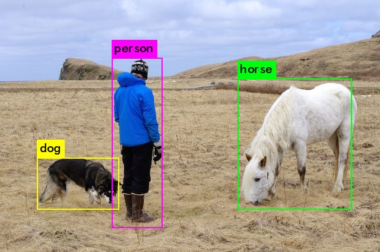
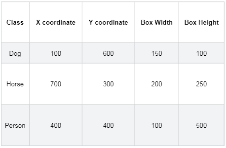
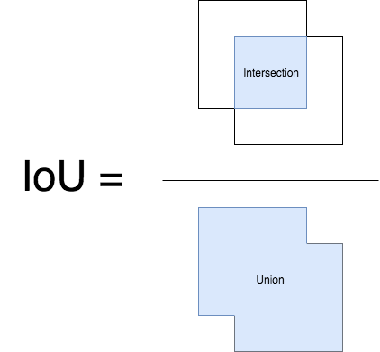
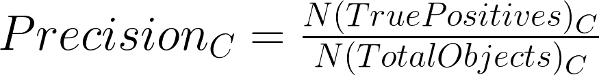

# Evaluation object detection
每个模型的好坏是通过评价它在某个数据集上的性能来判断的,这个数据集通常被叫做`验证/测试`数据集.这个性能由不同的统计量来度量,包括准确率(accuracy),精确率(precision),召回率(recall)等等.我们会根据某个特定的应用场景来选择相应的统计量.而对每个应用来说,找到一个可以客观地比较模型好坏的度量标准至关重要.在本文,我们将讨论目标检测问题中最常用的度量标准:

- 平均精度均值:`Mean Average Precision, mAP`

## 目标检测问题
对于目标检测问题,我的意思是,给定一张图片,找到图中的所有目标,确定他们的位置并对他们进行分类.目标检测模型通常是在给定的固定类别上进行训练的,因此模型在图中只能定位和分类这些已有的类别.此外,目标的位置通常是用边界框的形式来确定的.因此,目标检测包含了两个任务:

- 确定图片中目标的位置
- 以及对目标进行分类

## 评估模型检测模型

### 为什么选择`mAP`?
目标检测问题中,每张图片中可能会含有不同类别的不同目标.如前文所说,模型的分类和定位性能都需要被评估.因此,精确率,这个图像分类问题中使用的标准的评价度量,并不能直接用在这里.现在,是平均精度均值`mAP`发挥作用的时候了.我希望,读完本文之后你可以理解`mAP`的含义和意义.

### 参考标准(Ground Truth)
对于任何算法来说,度量的值总是把预测值和参考标准的信息进行比较之后计算得到的.我们知道训练,验证和测试数据集的参考标准信息.在目标检测问题中,参考标准的信息包括图像,图像中目标的类别,以及每个目标的真实边界框.

### 一个例子
我们给定了真实图片和其他解释性文字:

画在图片上的框和标签只是方便我们自己观看.我们在训练期间得到的是没有边界框和类别标签的图片.以及三组定义了参考标准的数字(让我们假设这张图片的分辨率是`1000x800`像素,表中所有坐标的单位都是像素,坐标值大小是估计的).

## 计算mAP
让我们假设原始图片和参考标准的解释性文字如上文所述.训练数据和验证数据的所有图像以相同的方法进行了标注.

训练好的模型会返回许多预测结果,但是这些预测结果中的大多数都会有非常低的置信度分数,因此我们只需考虑那些超过某个报告置信度分数的预测结果.

我们用模型对原始图像进行处理,下面是目标检测模型在置信度阈值化之后返回的结果:

我们可以说这些检测结果是正确的,但是我们怎么量化呢?

首先,我们需要知道每个检测结果的正确性.能够告诉我们一个给定的边界框的正确性的度量标准是`交并比(Intersection over Union, IoU)`.这是一个非常简单的可视量.对于那些很想深入了解`IoU`含义的读者,推荐阅读[Adrian Rosebrock的文章](https://www.pyimagesearch.com/2016/11/07/intersection-over-union-iou-for-object-detection/).

### IoU
交并比是预测边界框和参考边界框的交集和并集之间的比率.这个统计量也叫做`Jaccard`指数,是由Paul Jaccard在20世纪初首次提出的.

### 分辨正确检测结果和计算精确率
利用`IoU`,我们现在要分辨检测结果是否正确.最常用的阈值是`0.5`:如果`IoU > 0.5`,那么认为这是一个正确检测,否则认为这是一个错误检测.

现在我们为模型生成的每一个检测框计算其`IoU`值(置信度阈值化之后).利用该`IoU`值以及我们的`IoU`阈值`0.5`,我们为图片中的每一个类计算模型正确检测的数量`A(True Positives)`.

现在对于每一张图片,我们为图片中的每一个类计算模型检测的数量`B(Total Objects)`.现在我们可以用这条公式计算模型对`C类别`的精确率`:

对于一个给定的类别,让我们对验证集中的每张图片都计算它的精确率.假设我们的验证集中有100张图片,这样对于每个类别,我们会有100个精度率的值(每张图片一个值).让我们对这些100个值进行平均.这个平均值叫做该类的`AP(Average Precision)`:

现在,假设在我们整个数据集中有20个类别.对每一个类别,我们都会进行相同的操作:

- `计算IoU -> 精确率(Precision) -> 平均精度(Average Precision)`

所以我们会有20个不同的平均精度值.利用这些平均精度值,我们可以很轻松地判断我们的模型对任何给定的类别的性能.为了只用一个数字来表示一个模型的性能(一个度量解决所有问题),我们对所有类别的平均精度值计算其均值.这个新的值,就是我们的平均精度均值`mAP(Mean Average Precision)`!!!

所以,平均精度均值即数据集中所有类别的平均精度的均值.

## 概念说明
目标检测中衡量识别精度的指标是`mAP(mean average precision)`.在多个类别物体检测中,每一个类别都可以根据`recall`和`precision`绘制一条曲线,`AP`就是该曲线下的面积,`mAP`是多个类别`AP`的平均值,理论上最高`mAP`为1.0,也就是我们说的100分.

## 参考资料:
- [什么是mAP?比较目标检测模型性能的统计量](https://www.itcodemonkey.com/article/3909.html)