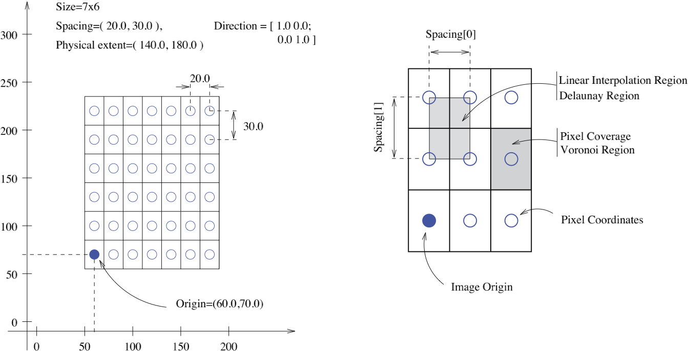

# SimpleITK IO
SimpleITK（源自ITK）作为图像处理和分析工具包的独特功能是将图像视为占据物理空间中有界区域的物理对象。另外，图像沿每个轴的像素之间可以具有不同的间隔，并且轴不一定是正交的。下图说明了这些概念。



SimpleITK和numpy索引访问顺序相反！

- SimpleITK: `image[x,y,z]`
- Numpy: `image_numpy_array[z,y,x]`

```python
import matplotlib.pyplot as plt
import matplotlib as mpl
mpl.rc("image", aspect="equal")
%matplotlib inline
import SimpleITK as sitk
import numpy as np
import os
```

## 概述
SimpleITK可以读取和写入存储在单个文件或一组文件（例如DICOM系列）中的图像。

以DICOM格式存储的图像具有与之关联的元数据字典，其中填充有DICOM标记。当DICOM系列作为单个图像读取时，元数据信息不可用，因为DICOM标记特定于每个文件。如果您需要元数据，您有三种选择：

1. 使用面向对象的接口的`ImageSeriesReader`类，将其配置为使用`MetaDataDictionaryArrayUpdateOn`方法加载标记，`LoadPrivateTagsOn`如果需要私有标记，则可能使用方法加载标记。一旦该系列被读取，你可以从系列读写器使用访问元数据`GetMetaDataKeys`，`HasMetaDataKey`以及`GetMetaData`。
2. 使用面向对象的接口的`ImageFileReader`，设置特定切片的文件名，并仅使用`ReadImageInformation`仅读取元数据但不读取批量像素信息的方法读取元数据。读取元数据后，您可以使用`GetMetaDataKeys`，`HasMetaDataKey`以及`GetMetaData`访问元数据。
3. 使用面向对象的接口的`ImageFileReader`，设置特定切片的文件名并读取它。或者使用`sitk.ReadImage`函数，读取特定文件。然后，您可以使用`GetMetaDataKeys`，`HasMetaDataKey`和`GetMetaData`，直接从`Image`访问元数据。

## META
```python
def meta_data_from_image(image, tag):
    """tag:
    "0010|0010": "Patient name: "
    "0008|0060": "Modality: "
    "0008|0021": "Series date: "
    "0008|0080": "Institution name: "
    """
    if image.HasMetaDataKey(tag):
        return True, image.GetMetaData(tag)
    return False, image.GetMetaDataKeys()


def meta_data_from_file(dicom_path, tag):
    """tag:
    "0010|0010": "Patient name: "
    "0008|0060": "Modality: "
    "0008|0021": "Series date: "
    "0008|0080": "Institution name: "
    """
    file_reader = sitk.ImageFileReader()
    file_reader.SetFileName(dicom_path)
    file_reader.ReadImageInformation()
    if file_reader.HasMetaDataKey(tag):
        return True, file_reader.GetMetaData(tag)
    return False, file_reader.GetMetaDataKeys()
```

## JPEG
下面，我们以JPEG格式读取图像，并将其写为PNG和BMP。文件格式是从文件扩展名中推断出来的。还设置了适当的像素类型，您可以覆盖它并强制选择的像素类型。
```python
img = sitk.ReadImage("SimpleITK.jpg")
print(img.GetPixelIDTypeAsString())
## vector of 8-bit unsigned integer

# write as PNG and BMP
sitk.WriteImage(img, os.path.join("tmps", "SimpleITK.png"))
sitk.WriteImage(img, os.path.join("tmps", "SimpleITK.bmp"))
```

以JPEG格式读取图像并根据用户选择投射像素类型。
```python
img = sitk.ReadImage("SimpleITK.jpg", sitk.sitkFloat64)
```

## DICOM
```python
def load_dcm(dcm_file):
    itk_img = sitk.ReadImage(dcm_file)
    origin = itk_img.GetOrigin()  # x,y,z
    spacing = itk_img.GetSpacing()  # x,y,z
    image = sitk.GetArrayFromImage(itk_img)  # z,y,x
    array = image.transpose(2, 1, 0)  # transfer to x,y,z
    return array, origin, spacing


def load_dcm2(dcm_file):
    file_reader = sitk.ImageFileReader()
    file_reader.SetFileName(dcm_file)
    itk_img = file_reader.Execute()

    origin = itk_img.GetOrigin()  # x,y,z
    spacing = itk_img.GetSpacing()  # x,y,z
    image = sitk.GetArrayFromImage(itk_img)  # z,y,x
    array = image.transpose(2, 1, 0)  # transfer to x,y,z
    return array, origin, spacing


def load_series(dcm_dir, series_id=0):
    reader = sitk.ImageSeriesReader()
    series_ids = reader.GetGDCMSeriesIDs(dcm_dir)
    if isinstance(series_id, int):
        series_id = series_ids[series_id]
    file_names = reader.GetGDCMSeriesFileNames(dcm_dir, series_id)

    itk_img = sitk.ReadImage(file_names)
    origin = itk_img.GetOrigin()  # x,y,z
    spacing = itk_img.GetSpacing()  # x,y,z
    image = sitk.GetArrayFromImage(itk_img)  # z,y,x
    array = image.transpose(2, 1, 0)  # transfer to x,y,z
    return array, origin, spacing


def load_series2(dcm_dir, series_id=0):
    reader = sitk.ImageSeriesReader()
    series_ids = reader.GetGDCMSeriesIDs(dcm_dir)
    if isinstance(series_id, int):
        series_id = series_ids[series_id]
    file_names = reader.GetGDCMSeriesFileNames(dcm_dir, series_id)

    reader.SetFileNames(file_names)
    itk_img = reader.Execute()

    origin = itk_img.GetOrigin()  # x,y,z
    spacing = itk_img.GetSpacing()  # x,y,z
    image = sitk.GetArrayFromImage(itk_img)  # z,y,x
    array = image.transpose(2, 1, 0)  # transfer to x,y,z
    return array, origin, spacing
```

阅读DICOM系列并将其写为单个mha文件：
```python
data_directory = os.path.dirname("data/CIRS057A_MR_CT_DICOM/readme.txt")
series_ID = "1.2.840.113619.2.290.3.3233817346.783.1399004564.515"

# Get the list of files belonging to a specific series ID.
reader = sitk.ImageSeriesReader()
# Use the functional interface to read the image series.
original_image = sitk.ReadImage(reader.GetGDCMSeriesFileNames(data_directory, series_ID))

# Write the image.
output_file_name_3D = os.path.join("tmps", "3DImage.mha")
sitk.WriteImage(original_image, output_file_name_3D)

# Read it back again.
written_image = sitk.ReadImage(output_file_name_3D)

# Check that the original and written image are the same.
statistics_image_filter = sitk.StatisticsImageFilter()
statistics_image_filter.Execute(original_image - written_image)

# Check that the original and written files are the same
print("Max, Min differences are : {0}, {1}".format(statistics_image_filter.GetMaximum(), statistics_image_filter.GetMinimum()))
## Max, Min differences are : 0.0, 0.0
```

将图像系列写为JPEG。`WriteImage`函数接收卷和图像名称列表，并根据`z`轴写入卷。对于可显示的结果，我们需要重新缩放图像强度（默认为`[0,255]`），因为JPEG格式需要转换为`UInt8`像素类型。
```python
file_names = [os.path.join("tmps", "slice{:03d}.jpg".format(i)) for i in range(written_image.GetSize()[2])]
sitk.WriteImage(sitk.Cast(sitk.RescaleIntensity(written_image), sitk.sitkUInt8), file_names)
```

从目录中选择特定的DICOM系列：
```python
data_directory = os.path.dirname("data/CIRS057A_MR_CT_DICOM/readme.txt")

reader = sitk.ImageSeriesReader()
series_IDs = reader.GetGDCMSeriesIDs(data_directory)
series_file_names = [reader.GetGDCMSeriesFileNames(data_directory, series) for series in series_IDs]

file_reader = sitk.ImageFileReader()
file_reader.SetFileName(series_file_names[0][0])
file_reader.ReadImageInformation()
tags_to_print = {"0010|0010": "Patient name:", 
                 "0008|0060": "Modality:",
                 "0008|0021": "Series date:",
                 "0008|0080": "Institution name:",
                 "0008|1050": "Performing physician\"s name:"}
for tag in tags_to_print:
    if file_reader.HasMetaDataKey(tag):
        print(tags_to_print[tag] + file_reader.GetMetaData(tag))

reader.SetFileNames(series_file_names[0])
image = reader.Execute()

z = int(image.GetDepth()/2)
plt.imshow(sitk.GetArrayViewFromImage(image)[z,:,:], cmap=plt.cm.Greys_r)
plt.axis("off");
```

### 重新采样
```python
nda = np.random.randint(-1000, 3000, (64,128,256))  # Numpy (z,y,x)
img = sitk.GetImageFromArray(nda)  # ITK (x,y,z)

old_image = img
old_size = old_image.GetSize()
old_spacing = old_image.GetSpacing()

new_spacing = [i for i in old_spacing]
new_spacing[0] /= 2
new_size = [int(round(a*b/c)) for a,b,c in zip(old_size,old_spacing,new_spacing)]

resampleSliceFilter = sitk.ResampleImageFilter()
new_image = resampleSliceFilter.Execute(old_image, new_size, sitk.Transform(), sitk.sitkNearestNeighbor, old_image.GetOrigin(), new_spacing, old_image.GetDirection(), 0, old_image.GetPixelID())
```

## MHD/MHA
```python
def load_mhd(mhd_file):
    itk_img = sitk.ReadImage(mhd_file)
    origin = itk_img.GetOrigin()  # x,y,z
    spacing = itk_img.GetSpacing()  # x,y,z
    image = sitk.GetArrayFromImage(itk_img)  # z,y,x
    array = image.transpose(2, 1, 0)  # transfer to x,y,z
    return array, origin, spacing
```

## SAVE
None.

## 参考资料：
- [SimpleITK Notebooks](http://insightsoftwareconsortium.github.io/SimpleITK-Notebooks/)