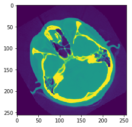
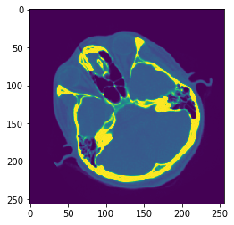

# SimpleITK image pythonic
语法糖是伟大的，它让你能更快地完成工作！SimpleITK已经应用了大量的语法糖来帮助更快地完成工作。
```python
import matplotlib.pyplot as plt
import matplotlib as mpl
mpl.rc("image", aspect="equal")
%matplotlib inline
import SimpleITK as sitk
# Download data to work on
%run update_path_to_download_script
from downloaddata import fetch_data as fdata
```

## 显示图像的便捷方法
```python
img = sitk.GaussianSource(size=[64,64])
plt.imshow(sitk.GetArrayViewFromImage(img));
```

或：
```
img = sitk.GaborSource(size=[64,64], frequency=0.03)
plt.imshow(sitk.GetArrayViewFromImage(img));
```

或：
```python
def myshow(img):
    nda = sitk.GetArrayViewFromImage(img)
    plt.imshow(nda)
myshow(img)
```

## Cropping
```python
myshow(img[16:48,:])
myshow(img[:,16:-16])
myshow(img[:32,:32])
```

## Flipping
```python
img_corner = img[:32,:32]
myshow(img_corner)
myshow(img_corner[::-1,:])
```

## 数学运算
大多数python数学运算符都被重载以调用SimpleITK过滤器，该过滤器基于每个像素执行相同的操作。它们可以在两个图像或图像和标量上操作。
```python
img = sitk.ReadImage("cthead1.png")
img = sitk.Cast(img, sitk.sitkFloat32)
myshow(img)
```



```python
timg = img**2
myshow(timg)
```



## 参考资料：
- [SimpleITK Notebooks](http://insightsoftwareconsortium.github.io/SimpleITK-Notebooks/)