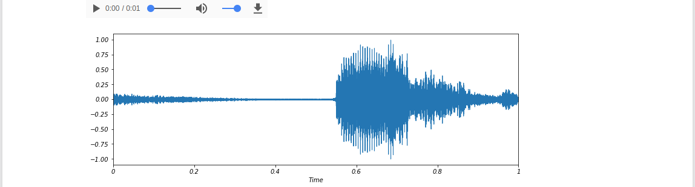
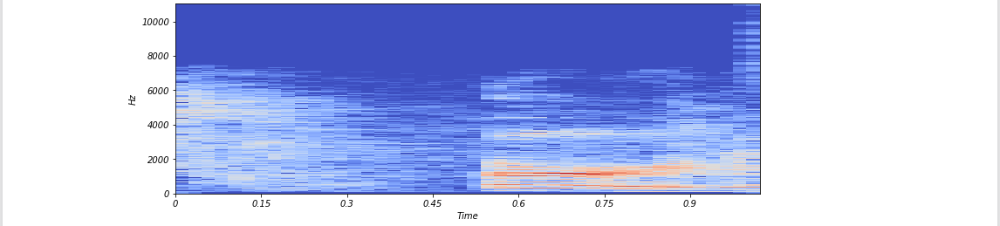
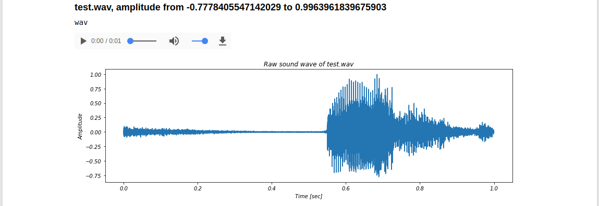
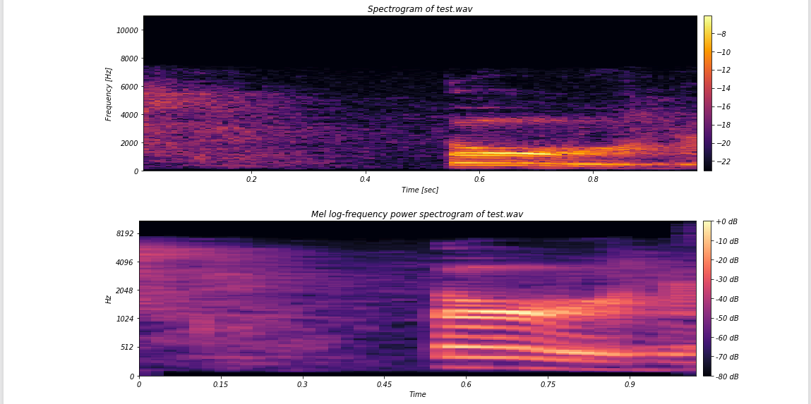
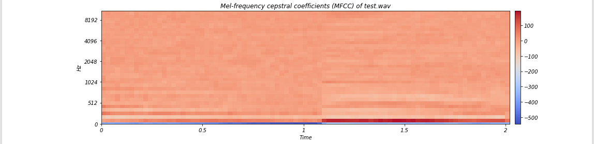

# Sound visualization
```bash
pip install -U librosa
```

## example 1
```python
import librosa
import librosa.display
import matplotlib.pyplot as plt
from IPython.display import display, Audio
filename = 'test.wav'
samples, sampleRate = librosa.load(filename)
display(Audio(filename))
plt.figure(figsize=(12, 4))
librosa.display.waveplot(samples, sr=sampleRate)
plt.show()
```



```python
X = librosa.stft(samples)
Xdb = librosa.amplitude_to_db(X)
plt.figure(figsize=(12, 4))
librosa.display.specshow(Xdb, sr=sampleRate, x_axis='time', y_axis='hz')
plt.show()
```



## example 2






```python
import pandas as pd
import librosa
from scipy.io import wavfile
from IPython.display import display, Audio
waves = [('test.wav', 'wav'),
         ('test.wav', 'wav')]
wavedf = pd.DataFrame(waves, columns=['filename', 'comments'])
for i in range(wavedf.shape[0]):
    filename = wavedf.loc[i, 'filename']
    #sampleRate, samples = wavfile.read(filename)
    samples, sampleRate = librosa.load(filename)
    printMarkdown('### {}, amplitude from {} to {}'.format(filename, min(samples), max(samples)))
    print(wavedf.loc[i, 'comments'])
    display(Audio(filename))
    sampleRate, samples, logSpectrogram, logMelSpectrogram, mfcc = showWavefile(filename)
```

## Format output with Markdown
```python
from IPython.display import display, Markdown, HTML, Audio, Image
def printMarkdown(string):
    display(Markdown(string))
```

### Plot Raw Wave File
```python
import numpy as np
import matplotlib.pyplot as plt
def plotRawWave(plotTitle, sampleRate, samples, figWidth=14, figHeight=4):
    plt.figure(figsize=(figWidth, figHeight))
    plt.plot(np.linspace(0, sampleRate, len(samples)), samples)
    plt.title('Raw sound wave of ' + plotTitle)
    plt.ylabel('Amplitude')
    plt.xlabel('Time [sec]')
    plt.show()
    return None
```

### Plot Spectrogram
```python
import numpy as np
from scipy import signal
import matplotlib.pyplot as plt
def computeLogSpectrogram(audio, sampleRate, windowSize=20, stepSize=10, epsilon=1e-10):
    nperseg = int(round(windowSize * sampleRate / 1000))
    noverlap = int(round(stepSize * sampleRate / 1000))
    freqs, times, spec = signal.spectrogram(audio,
                                            fs=sampleRate,
                                            window='hann',
                                            nperseg=nperseg,
                                            noverlap=noverlap,
                                            detrend=False)
    return freqs, times, np.log(spec.T.astype(np.float32) + epsilon)

def plotLogSpectrogram(plotTitle, freqs, times, spectrogram, figWidth=14, figHeight=4):
    fig = plt.figure(figsize=(figWidth, figHeight))
    plt.imshow(spectrogram.T, aspect='auto', origin='lower', cmap="inferno",
               extent=[times.min(), times.max(), freqs.min(), freqs.max()])
    plt.colorbar(pad=0.01)
    plt.title('Spectrogram of ' + plotTitle)
    plt.ylabel('Frequency [Hz]')
    plt.xlabel('Time [sec]')
    fig.tight_layout()
    plt.show()
    return None
```

### Plot Mel Spectrogram
```python
import numpy as np
import librosa
import librosa.display
import matplotlib.pyplot as plt
def computeLogMelSpectrogram(samples, sampleRate, nMels=128):
    melSpectrum = librosa.feature.melspectrogram(samples, sr=sampleRate, n_mels=nMels)
    # Convert to dB, which is a log scale. Use peak power as reference.
    logMelSpectrogram = librosa.power_to_db(melSpectrum, ref=np.max)
    return logMelSpectrogram

def plotLogMelSpectrogram(plotTitle, sampleRate, logMelSpectrum, figWidth=14, figHeight=4):
    fig = plt.figure(figsize=(figWidth, figHeight))
    librosa.display.specshow(logMelSpectrum, sr=sampleRate, x_axis='time', y_axis='mel')
    plt.title('Mel log-frequency power spectrogram of ' + plotTitle)
    plt.colorbar(pad=0.01, format='%+02.0f dB')
    plt.tight_layout()  
    plt.show()
    return None
```

### Plot MFCC
```python
import librosa
import librosa.display
import matplotlib.pyplot as plt
def computeMFCC(samples, sampleRate, nFFT=512, hopLength=256, nMFCC=40):
    mfcc = librosa.feature.mfcc(y=samples, sr=sampleRate, n_fft=nFFT, hop_length=hopLength, n_mfcc=nMFCC)
    # Let's add on the first and second deltas (what is this really doing?)
    #mfcc = librosa.feature.delta(mfcc, order=2)
    return mfcc

def plotMFCC(plotTitle, sampleRate, mfcc, figWidth=14, figHeight=4):
    fig = plt.figure(figsize=(figWidth, figHeight))
    librosa.display.specshow(mfcc, sr=sampleRate, x_axis='time', y_axis='mel')
    plt.colorbar(pad=0.01)
    plt.title('Mel-frequency cepstral coefficients (MFCC) of ' + plotTitle)
    plt.tight_layout()
    plt.show()
    return None
```

### Show Plots
```python
import librosa
from scipy.io import wavfile
def showWavefile(filename):
    #sampleRate, samples = wavfile.read(filename)
    samples, sampleRate = librosa.load(filename)
    plotRawWave(filename, sampleRate, samples)

    freqs, times, logSpectrogram = computeLogSpectrogram(samples, sampleRate)
    plotLogSpectrogram(filename, freqs, times, logSpectrogram)

    logMelSpectrogram = computeLogMelSpectrogram(samples, sampleRate)
    plotLogMelSpectrogram(filename, sampleRate, logMelSpectrogram)

    mfcc = computeMFCC(samples, sampleRate)
    plotMFCC(filename, sampleRate, mfcc)

    return sampleRate, samples, logSpectrogram, logMelSpectrogram, mfcc
```
