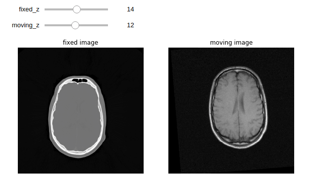
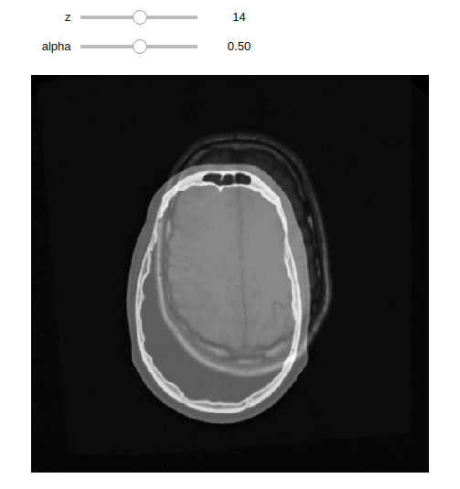

# Jupyter ipython

## markdown
```python
from IPython.display import display, Markdown
text = """# Title
## Q
some words..
"""
display(Markdown(text))
```

## image
```python
from IPython.display import display, Image
filename = "images/001.png"
display(Image(filename))
```

或：
```
from PIL import Image
from IPython.display import display
import cv2 as cv
bgr = cv.imread("origin.png")
rgb = cv.cvtColor(bgr, cv.COLOR_BGR2RGB)
display(Image.fromarray(rgb, "RGB"))
```

## audio
```python
import os
from IPython.display import display, Audio, HTML
filename = "sounds/001.mp3"
display(HTML("<h4>{:s}</h4>".format(os.path.basename(filename))))
display(Audio(filename))
```

## ipywidgets/interact
```
# pip install --upgrade pip
# pip install ipywidgets
# pip install SimpleITK
%matplotlib inline
import matplotlib.pyplot as plt
import SimpleITK as sitk
from ipywidgets import interact, fixed

fixed_image = sitk.ReadImage("training_001_ct.mha", sitk.sitkFloat32)  # zyx:(29, 512, 512)
moving_image = sitk.ReadImage("training_001_mr_T1.mha", sitk.sitkFloat32)  # zyx:(26, 256, 256)
moving_resampled = sitk.Resample(moving_image, fixed_image)  # (26, 256, 256) to (29, 512, 512)
```

示例1：
```
def display_images(fixed_z, moving_z, fixed_npa, moving_npa):
    plt.subplots(1, 2, figsize=(10, 8))

    plt.subplot(1, 2, 1)
    plt.imshow(fixed_npa[fixed_z, :, :], cmap=plt.cm.Greys_r);
    plt.title('fixed image')
    plt.axis('off')

    plt.subplot(1, 2, 2)
    plt.imshow(moving_npa[moving_z, :, :], cmap=plt.cm.Greys_r);
    plt.title('moving image')
    plt.axis('off')

    plt.show()


fixed_array = sitk.GetArrayFromImage(fixed_image)
moving_array = sitk.GetArrayFromImage(moving_image)
interact(display_images,
         fixed_z=(0, fixed_array.shape[0] - 1),
         moving_z=(0, moving_array.shape[0] - 1),
         fixed_npa=fixed(fixed_array), moving_npa=fixed(moving_array));
```



示例2：
```
def display_images_with_alpha(z, alpha, fixed, moving):
    array = (1.0 - alpha) * fixed[z, :, :] + alpha * moving[z, :, :]

    plt.subplots(figsize=(10, 8))
    plt.imshow(array, cmap=plt.cm.Greys_r);
    plt.axis('off')
    plt.show()


fixed_array = sitk.GetArrayFromImage(fixed_image)
moving_array = sitk.GetArrayFromImage(moving_resampled)
interact(display_images_with_alpha,
         z=(0, fixed_array.shape[0] - 1),
         alpha=(0.0, 1.0, 0.05),
         fixed=fixed(fixed_array),
         moving=fixed(moving_array));
```



## 参考资料:
- [IPython Documentation](http://ipython.readthedocs.io/en/stable/api/generated/IPython.display.html)